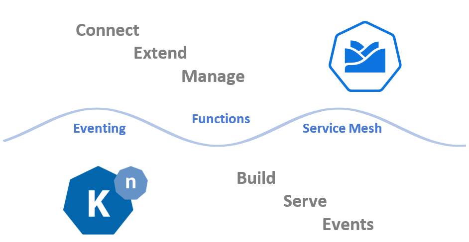

When Kyma was introduced to the public a few weeks ago at [Google Cloud Next ’18](https://cloud.withgoogle.com/next18/sf/), we talked about the strong partnership that we have with the Knative community. Kyma and Knative provide two complementary sets of building blocks, which together offer a powerful framework and a toolset to build cloud-native solutions on top of Kubernetes.

<!-- overview -->

If you look at the Kyma source code right now, you might wonder why you are not finding many references to Knative. The answer is quite simple. In the last month and a half, the entire Kyma team has been working on restructuring the repositories, making them ready to go open source and removing all internal references and tool dependencies. We've done all of that from a stable branch.  

In parallel to those major changes, we have a fork with Kyma and Knative integrated. It was used to build some first proof-of-concept cloud-native solutions using Knative and Kyma deployed together. The fork is also the basis for our stage demo shown during [the project launch](https://www.youtube.com/watch?v=NaaGPGKyXEc&amp;t=42m50s). This was our first approach at combining the projects. As both Kyma and Knative are really young and going through a number of changes, some of our design decisions have not been optimal in retrospect. 
 
During the coming weeks, our plan is to refactor the current Kyma codebase and modularize it. Several functional components can then be installed optionally, which will certainly improve the experience when developing locally using for example [Minikube](https://kubernetes.io/docs/tasks/tools/install-minikube/). 
 
As shared technologies such as [Istio](https://istio.io/) are concerned, we're going to provide needed configuration options so that Istio deployed with Knative will also support all Kyma's requirements. 
 
And finally, we are going to extract some components. For example, we'll extract Kyma eventing and fully integrate it with Knative eventing. We'll evaluate the possibility of contributing the Kyma eventing based on [NATS](https://nats.io/) streaming as a Knative compatible eventing implementation to the Knative project. Users of Knative and Kyma will than have the additional option of deciding which eventing implementation to use (e.g. as an alternative to the Knative provided Kafka based implementation). 
 
Stay tuned for more updates! Remember! Your ideas and proposals are highly welcome. Don't be shy!  