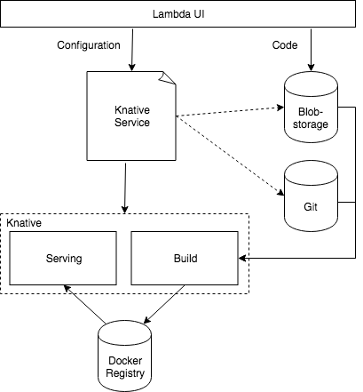

[Knative](https://github.com/Knative/) is an important new project in the cloud-native world that was announced as a "Kubernetes-based platform to build, deploy, and manage modern serverless workloads." It is an opinionated approach covering the best practices around three areas of developing cloud-native applications: building containers (and functions), serving (and dynamically scaling) workloads, and eventing. Knative is an open-source set of components and is being actively developed by Google in close partnership with Pivotal, IBM, Red Hat, and SAP.

<!-- overview -->

Similarly to Kubeless, Knative provides a set of building blocks to simplify the use of Kubernetes and Istio for managing and operating lambda functions. Kubeless takes some code, builds an image out of it, and starts it on Kubernetes. Knative is doing the same by following a more modular approach, allowing different components to be pluggable and adaptable to different deployment scenarios.

Because of this more flexible approach, we are planning to replace the current Kubeless-based Lambda Functions in Kyma with a Knative-based implementation. To provide the same commodity to which users are used with Kubeless, we have to do some extra work.

## Architecture

So far, the architecture is not shaped out fully. Many details have to be sorted out and defined. The idea is to use Knative as it is and try to bridge the existing gaps using custom components, other available open-source projects (e.g. [Riff](https://projectriff.io/)), or pushing enhancements to the Knative community. In the end, Knative should provide the same functionality as Kubeless is doing today.

The core of the architecture are the Knative `Serving` and `Build` components. As a Kyma-related component, a custom build template is required to provide the function interface available in Kubeless.

Besides the build template, a custom Docker registry is required to store the build artifacts, and a storage solution to store the function code. This could be either a Git repository or a blob storage like Minio or S3. In the end, customers should be able to decide if they like to keep the function code in their own Git repository or if they prefer to store it in a storage solution provided by Kyma.

## Implementation

As the implementation involves multiple components and will involve breaking changes, we will keep Kubeless till we are sure that the new version is working as expected. In the first step, Knative `Serving` and `Build` components will be integrated as optional Kyma modules. If this is working, other parts, such as the Docker registry, blob storage, and build template, will be enabled step by step. As the last step, a new (forked) lambda UI will be created and adjusted to the Knative needs. As soon as everything is working fine, Kubeless will fade out. Knative will be the new default component and Kubeless will be used as long as there are still any old deployments available. As soon as we are sure that nobody is using the old Kubeless-based implementation, we will remove it completely.
