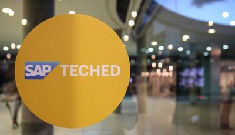

[SAP TechEd](https://events.sap.com/teched/en/home) is the premier SAP technology conference, which takes place every year on 3 continents and is an excellent source of news on the technical and platform offerings of SAP. In 2018 the conference venues are located in Las Vegas, Barcelona, and Bangalore.

<!-- overview -->

As the centerpiece of a number of implementation projects, and the cornerstone of the upcoming SAP Cloud Platform Extension Factory Lab Preview, Kyma must be represented by the best ambassadors on each of the three events. These people will represent the product, answer all questions and be the first point of contact for all the attendees interested in Kyma.

- For the [Las Vegas (02-05.Oct)](http://events.sap.com/teched-2018-usa/en/home) event the ambassadors include myself ([@evilyeti](https://twitter.com/evilyeti)), Gopi Kannappan ([@gopikannappan](https://twitter.com/gopikannappan)) and Hisar Balik. You can find us hanging around the SAP Cloud Platform booths and on the C/4HANA sessions we have on the agenda.

- [For the Barcelona (23-25.Oct)](http://events.sap.com/teched-2018-emea/en/home) event the ambassadors are Marco Dorn ([@mado0803](https://twitter.com/mado0803)), Stanimir Ivanov ([@s1vanov](https://twitter.com/s1vanov)) and Lukasz Szymik ([@lszymik](https://twitter.com/lszymik)) who will also be available either at the SAP Cloud Platform booths or at the C/4HANA sessions they'll run.

- Last but not least – for the [Bangalore (28-30.Nov)](http://events.sap.com/teched-2018-india/en/home) event we have Johannes Engelke ([@quablab](https://twitter.com/quablab)) and Sayan Hazra as the ambassadors. They'll make sure to spread the word about Kyma, and tell the attendees all about the extensibility of the product, and the Serverless functions.

We're super excited to see the Kyma story grow and more ideas come onboard. Feel free to meet all of the ambassadors and talk about Kyma and software extensibility, or any ideas you might have around these topics. The conversation might get you some cool merch as we might have some stickers to share with our lovely guests. Don't be shy! See you there!
