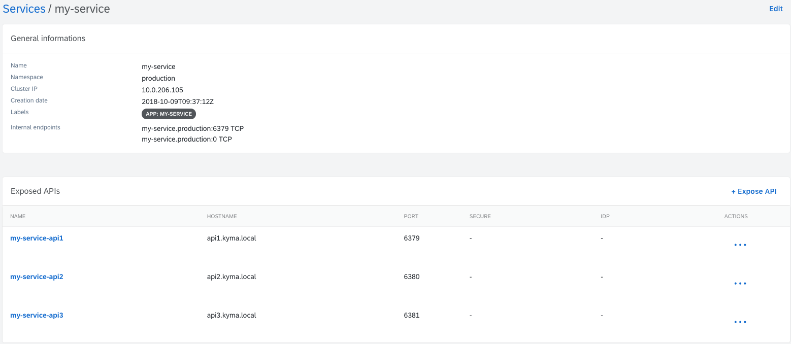
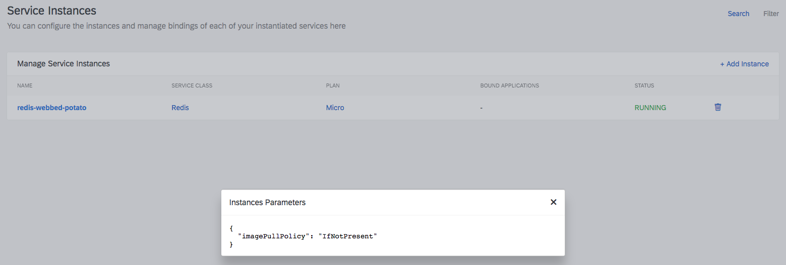
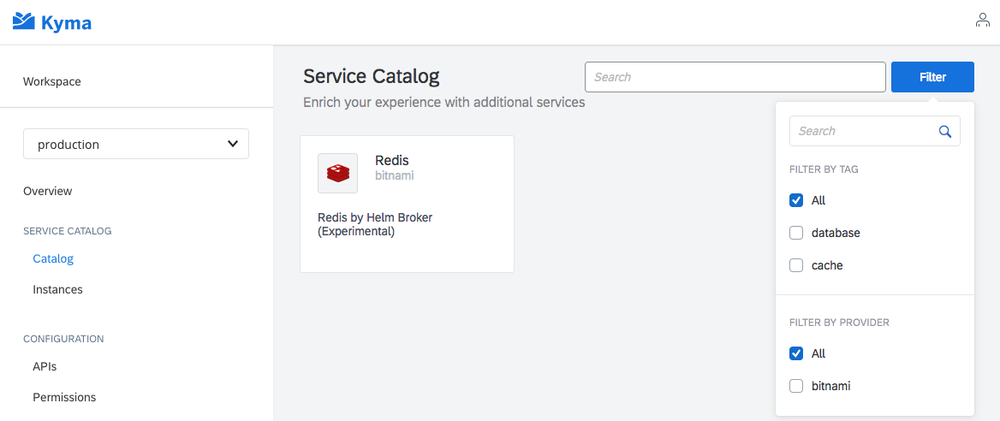
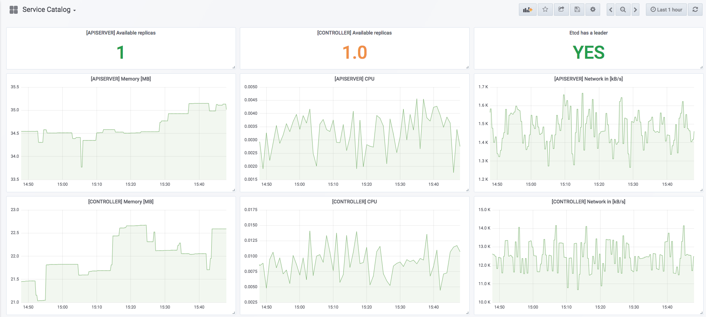
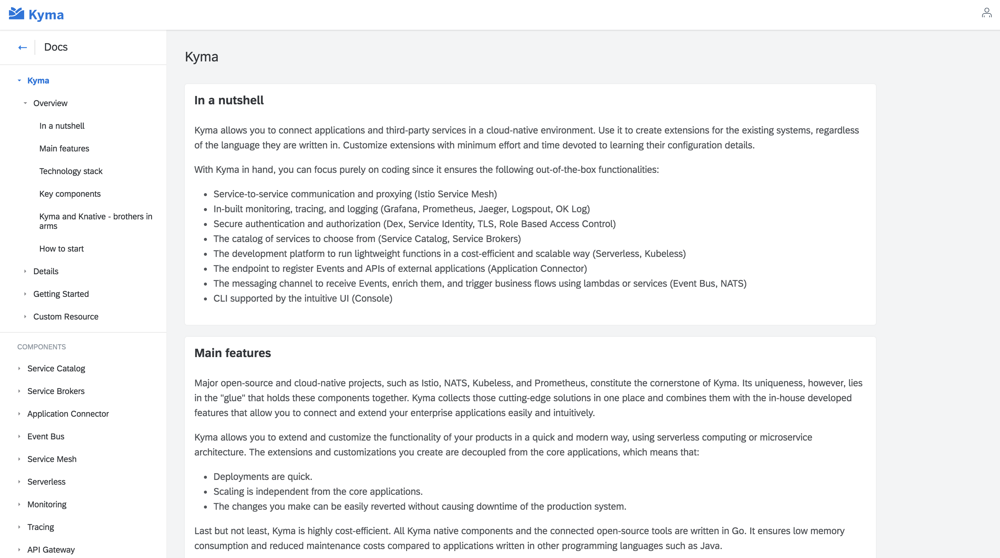

It has been a while since we introduced Kyma to the open-source community. Many things have changed in the project since its [announcement](/blog/introducing-project-kyma) in July.
Now that we have our first official release, it is time to sum up what we have recently worked on.

<!-- overview -->

## Security

In the area of security, we focused on our [API Gateway](/docs/components/api-gateway) that you can use to expose your API easily and in a secure way. We improved the following things:
* When you create the `Api` kind, `hostname` is validated to make sure you provided the correct domain and that there are no duplicates.
* The [architecture](/docs/components/api-gateway#architecture-architecture) of the API Gateway component has changed. The services are now exposed by the Istio Gateway and the Istio Virtual Service, instead of the Istio Ingress.
* You can create several APIs for a single service in the Console UI by creating the API for a specific service in the **Services** view, or several different APIs from the **APIs** view.

## Service Catalog

The Service Catalog, that is one of our key features, has undergone a lot of improvements over the last months, mainly thanks to your valuable feedback. To be more specific, the Console UI part of the Catalog was improved through the following changes:
- The multi-step service provisioning wizard was replaced with a one-step wizard.
- You can preview the Instance's parameters by clicking the Instance's Plan name both on the list of all Service Instances and in the given Service Instance's details.

- The Service Catalog's left navigation was removed and filtering is now available next to the search box. In its current form, it aims to support new filter options that will be introduced in the future. It also scales much better now when there are many values provided in the filters.

The Console UI is not everything, however. These are further changes:
- The Catalog was upgraded to v0.1.34 that supports the Environment-wide resources (ServiceBroker, ServiceClass, ServicePlan). The related Console views do not support it yet.
- A new dashboard was provided in Grafana to improve Service Catalog-related operations.

## Application Connector

The Application Connector, that allows you to connect external systems with Kyma, underwent these major improvements:
- Management of the Remote Environments (RE) is no longer done through the Helm chart. Instead, we have a controller that reacts to changes in the RE and sets up the whole Environment.
- The [RemoteEnvironments CRD](/docs/components/application-connector#custom-resource-remoteenvironment) was enhanced with an extra label field. Now, you can mark the purpose of the Remote Environment in a flexible way.
- The OAuth token caching functionality was added to the Application Connector.

## Logging

Kyma has a new component to enhance its logging capabilities. This component is based on [Logspout and OK Log](/docs/components/logging).

## Monitoring

Through the proper Grafana configuration, all dashboards created by you in the runtime are persistent, and Pods restarts do not remove them.

## Event Bus

Our Kyma would not be so great without the support for the asynchronous communication between services. This is what we improved in that scope:
- We enabled an Event lifecycle for storing Events in a cluster. By default, it is set to 24h, but you can configure the lifecycle in the NATS Streaming's StatefulSet by changing the `max_age` value.
- We added the documentation for the service programming model for the Event subscribers. Read more [here](/docs/components/event-bus#details-service-programming-model).

## Tracing

As you know, Kyma uses Jaeger as the tracing back-end. To improve its usage, we:
- Secured the Jaeger UI so that you could access it easily without port-forwarding. Read more about [Jaeger](/docs/components/tracing#overview-overview).
- Created an example on how to enable tracing for an application. Read more [here](https://github.com/kyma-project/examples/tree/master/tracing).

## Service Mesh

At the moment, Kyma is using Istio [1.0.1](https://istio.io/about/notes/1.0.1/).

## Installation

The following improvements were done in the installation area:
- The [Kyma installation on a Google Kubernetes Engine cluster](https://github.com/kyma-project/kyma/blob/0.5-rc/docs/kyma/docs/032-inst-gke-installation.md) is now possible mainly due to the implementation of the [API Server Proxy](https://github.com/kyma-project/kyma/tree/0.4.1/components/apiserver-proxy) component.
- You can [override values in Helm charts](https://github.com/kyma-project/kyma/blob/0.5-rc/docs/kyma/docs/044-gs-installation-overrides.md) using config maps annotated with the `installer: overrides` label.
- The extended [`Installation ` custom resource](/docs/root/kyma#custom-resource-installation) was enabled to allow you to provide a declarative list of modules that will be installed during the Kyma provisioning process.

## Documentation

A few weeks after the Kyma announcement, we published the official documentation on our `https://kyma-project.io/docs/` website. It is worth remembering, however, that this is not the only place where you can read the docs. Since the very beginning, the Kyma documentation has been an integral part of the Console UI, so whenever you provision a Kyma cluster, docs for a given Kyma version are always there for you. In the last few months we have improved the following features in that area:
- The [Kyma overview](/docs/root/kyma#overview-overview) documentation and many other sections, like consistency of the [Custom Resource reference](/docs/components/service-catalog#custom-resource-custom-resource) documents.
- The general feel and look of the documentation, its navigation, consistency, and the readability of the content.
