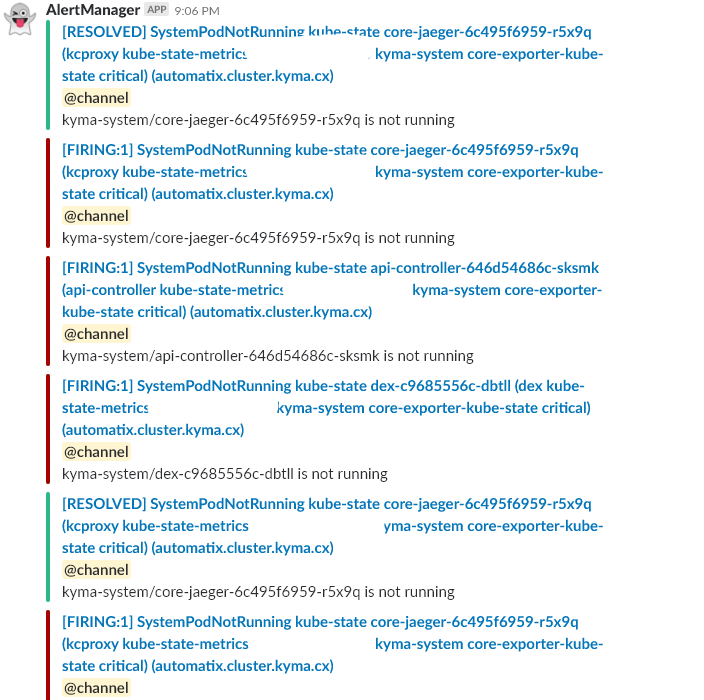

We constantly work improving Kyma and modularizing it further. Shortly after our last release, we now introduce the next update including many changes.

<!-- overview -->

## Application Connector

With the overall strategy to modularize Kyma as a whole, the Application Connector went through this change as well:

- The Application Connector has been modularized. All components have been moved to a separate Helm chart and are no longer a part of the Core. This also includes changes in the naming of the elements. The Gateway service has been renamed to the Proxy service.
- The Application Connector tests were extended with an additional flag for skipping SSL verification. It allows testing functionality against the Kyma cluster with a self-signed certificate.
- The Connector service now returns a client certificate as a full chain with a server-side certificate. The verification of a client certificate is now possible.

## Serverless

Making use of serverless concepts and technologies is what makes Kyma so great. Hence, we made a number of improvements in this area:

- The Lambda UI was extended with the option to set Environment Variable Prefixes for Service Bindings. This allows binding multiple services with the same set of environment variables.
- The Lambda UI was extended with the option to set JWK Authentication Properties. This allows defining specific Token Issuers.


Authentication is enabled by default, and you can change JWKs URI using the **Load Present** option.


- The Lambda UI was extended with an alert informing you if you are about to leave the Lambda UI with unsaved changes.


## Service Catalog

We did a lot of great enhancements to the Kyma Service Catalog:

- Support for &quot;namespaced&quot; service catalogs. This means a possibility to register brokers for specific Namespaces only. The Catalog has an additional Brokers view in the Environment context. The view lists Service Brokers registered only for a given Namespace.
  - [Here](/docs/components/service-catalog#getting-started-getting-started) you can view a new getting started guide about brokers registration.
  - [Here](/docs/components/service-catalog#architecture-architecture) you can find an architecture diagram for the Namespace catalog.
  
  - The instance list and details views now work on web-sockets. This significantly improves the user experience because all changes to the instance, and most important its status, are updated in real-time in the view without the need for a page refresh. If you are interested in how we managed to accomplish that on a GraphQL layer with Istio and token verification, feel free to contact us on [Slack](http://slack.kyma-project.io).

- A completely new binding flow has been implemented in the instance view. Based on your feedback, we made sure it is far less complex than before:
  - Names for resources are autogenerated.
  - When binding to the application, you do not have to decide if you want to bind to Deployment first or maybe to the Function, as all applications are listed in one component for your convenience.
  
  
  
  - You can set a proxy for instance environment variables that are injected to your application.
  
  
  
  - The status of credentials (ServiceBinding) and application binding (ServiceBindingUsage) is now visible. Even more, if you are viewing the bindings and in the meantime the credentials creation fails, the UI indicates the failure and adds a red marker on the tab. This way, you know something wrong happened and you need to check the tab.
  
  
  
  
  
  - The UI supports the ServiceBinding creation if the owner of the service class specified a custom schema for binding creation.
  - The cleanup of resources got improved. When you decide to delete some Credentials, the related application bindings are also deleted.
- [Helm Broker](/docs/components/service-brokers#configuration-configure-helm-broker) supports many bundle repositories.
- The new [**bundles**](https://github.com/kyma-project/bundles) repository enables Kyma to install addons such as brokers, showcases and local services.

  - It contains bundles which the Helm Broker uses. It allows you to choose a set of bundles and configure the Helm Broker. You can also define your own bundles.
  - Have a look at the [getting started document](https://github.com/kyma-project/bundles/blob/master/docs/getting-started.md) which explains how to create your own bundles repository.

## Eventing

As eventing is one of the core principles Kyma is built on, we enhanced the functionality further:

- It is now possible for developers to change their subscriptions and fix any typos or wrong configurations. It allows avoiding a situation where, for example, specifying a wrong URL causes wrong Event type to be updated. Click [here](/docs/components/event-bus#details-subscription-updates) to see how this can be done.

- A bug, which caused that it was impossible to create two subscriptions with same name in different Namespaces, has been fixed.
- Kyma now enables a developer to understand better how to leverage tracing for handling problems in the Event flow.

### Known issues

There is a known intermittent Event trigger issue that causes the Events to not be delivered to lambdas or microservices.

We are aware of this issue and we will provide a fix for it as part of the [issue](https://github.com/kyma-project/kyma/issues/1687).

#### Technical details

The issue lies in the subscription validator application. The application sometimes does not react when Kubernetes notifies it about creating new EventActivation instances.

#### Workaround

As a temporary fix for this issue, delete the sub-validator Pod by running the following command:

```bash

$ kubectl delete pod $(kubectl get pods -l app=sub-validator -n kyma-system --output=jsonpath={.items..metadata.name}) -n kyma-systemC
```

After deleting the sub-validator Pod, Kubernetes recreates it automatically, and the issue should be fixed.

## Security

We constantly work on improving the security of Kyma:

- Documentation is now available on how to [update TLS certificates](/docs/components/security#details-update-tls-certificate).
- The static user password for administrators is generated during installation and stored in the secret admin-user in the `kyma-system` Namespace. You can add further static users by providing your own Kubernetes secrets. Use this [link](/docs/components/security#details-manage-static-users-in-dex) to learn more.

## Service Mesh

Istio is now installed from official Istio charts. Istio customization was externalized into a separate component: [istio-patch](/docs/components/service-mesh#details-istio-patch). As a result, Kyma can be installed on top of an existing [Istio installation](/docs/root/kyma#installation-installation-with-custom-istio-deployment) (in the supported version).

## Installation

The installation documentation was reorganized and grouped under [Installation](/docs/root/kyma#installation-installation).

## Monitoring

To keep track of your Kyma systems, we enhanced the following:

- An Alert is defined if an Pod is not restarting in one of the system Namespaces. This enables basic monitoring of the `kyma-system`.

 

- Promehteus alerting webhooks are exposed in the configuration. This enables the integration of Prometheus alerting in custom dashboards.
- HTTP configuration now allows to define different ways of authentication in the face of the webhook. Basic auth, Tls and Baere token are some of them.

### Known Issues

The Istio-related dashboards are not showing any data. For details, see [issue](https://github.com/kyma-project/kyma/issues/1724).

#### Workaround 

None

## Logging

Kyma was extended with Persistence Layer for logging based on OK Log.

## Tracing

The Tracing UI is now linked from within the Kyma Console UI to make it easier to access the tracing information. Furthermore, it is now possible to compare two traces to track the process. You can get an answer to the question: &quot;Why did something unexpected happened?&quot; You can find more details [here](/docs/components/tracing#details-trace-comparison).

## Console

- You can extend the Console to add custom micro front-ends either for a single environment or for cluster-wide administration. More details can be found [here](/docs/components/console#details-ui-extensibility).

 

- It is now possible to view and edit **ConfigMaps**:

 
