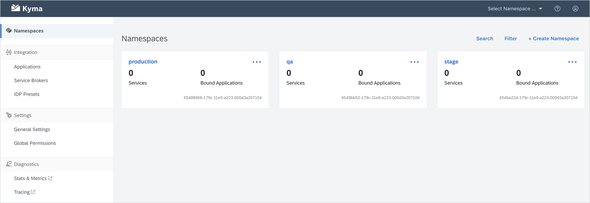
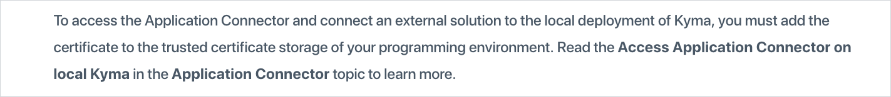

The 0.6 release brings a lot of significant changes to Kyma. The main focus of this release was to finalize the work on Prow and replace the existing CI pipeline with the new architecture. Thus, we are excited to announce that Kyma finally uses an open-source CI tool and that Kyma 0.6 Cairo was already built using the Prow architecture. Apart from Prow, we made efforts to drive the Kyma-Knative integration forward, took further steps to modularize Kyma components and unify their naming, and significantly improved the website-related user experience.

Explore the changes, try out the release, and get back to us with feedback and contribution!

<!-- overview -->

The highlights of Kyma 0.6 Cairo include:

- [Prow in Kyma](#prow-in-kyma) - We implemented the new open-source CI tool in Kyma.
- [Installation with Knative](#installation-with-knative) and [Knative eventing integration](#knative-adoption-first-steps) - We enabled Knative installation with Kyma and made first steps towards Knative eventing integration.
- [Remote Environment](#remote-environment-renaming) and [Environment Controller renaming](#environment-controller-renaming) - As part of the naming unification scheme, we renamed Remote Environments to Applications and the Environment Controller to Namespace Controller.
- [Console backend](#backend-modularization) and [Service Catalog modularization](#modularization) - We modularized the Console backend and the Service Catalog.
- [Google Cloud Platform Service Broker](#google-cloud-platform-service-broker) - We extended the Service Catalog with Google offerings.
- [kyma-project.io navigation improvements](#kyma-projectio) - We improved navigation and readability of Docs on `kyma-project.io`.

See the overview of all changes in this release:

- [Application Connector](#application-connector) - Remote Environment renaming
- [Console](#console) - Luigi framework on board, new navigation structure, backend modularization, AsyncApi rendering
- [Continuous Integration](#continuous-integration) - Prow in Kyma
- [Eventing](#eventing) - Knative adoption first steps
- [Installation](#installation) - Environment Controller renaming, wildcard DNS `xip.io` integration, installation with Knative
- [Serverless](#serverless) - Upgrade to Kubeless v1, function autoscaling
- [Service Catalog](#service-catalog) - Google Cloud Platform Service Broker, modularization, new tooling for the Service Catalog UI tests
- [kyma-project.io](#kyma-project-io) - Linking enabled, `master` branch available in Docs, blog landing page excerpts, improved styling of Docs, scrollspy in Docs.

---


## Application Connector

### Remote Environment renaming

As a step towards having a consistent naming scheme for all Kyma components, we renamed Remote Environments to **Applications**. This way, the Application Connector finally connects Applications instead of Remote Environments. This change was introduced consistently across the whole Kyma, including Application Connector components and the Console UI.

## Console

### Luigi framework on board

The Console UI was refactored and it now uses the [Luigi](https://github.com/kyma-project/luigi/blob/master/README.md) framework to orchestrate client-side micro frontends. With Luigi on board, the Console allows for secure and technology-agnostic UI extensibility in Kyma. 

### New navigation structure

The new navigation in the Console provides a more structured content. Immediately after you sign in, you can see all the Namespaces in the main content area. You also have all the cluster-wide information at hand in the left navigation panel. 



### Backend modularization

As you know, we want Kyma to be highly modular and allow you to skip the installation of components you don't need. For example, if you have your own Istio, you should be able to decide if you want to install the one Kyma provides. This requires some refactoring of the Console backend to ensure proper resiliency in the Console UI. In this release, we completed the modularization of the backend and hid it under the feature flag. The reason why it is not enabled by default is that the Console UI still requires resiliency improvements to ensure no errors occur when a certain Kyma component is not installed. The backend modularization was done based on [this](https://github.com/kyma-project/community/issues/165) decision and the referenced proposal.

To quickly switch the Console backend to work in the modular mode, run the following command in the terminal:

```
kubectl set env deployment/core-ui-api MODULE_PLUGGABILITY=true -n kyma-system
```

For more details about the introduced changes, read the related [documentation](/docs/components/console#details-ui-api-layer).

### AsyncApi rendering  

We created a new component for rendering the [AsyncApi specification](https://www.asyncapi.com/). It now fully supports the specification and improves its look and feel when compared to the very minimalistic table we had before.


The other great thing we did in this area was creating the component in a very generic way in a separate repository, and donating it to the [AsyncApi organization](https://github.com/asyncapi/asyncapi-react). This means we maintain it directly from the AsyncApi organization and you can use this component not only in Kyma.

Feel free to play with it and give us your feedback:

- Read the related [documentation](https://github.com/asyncapi/asyncapi-react#props).

- Test the component [playground](https://playground.asyncapi.io/).

- Customize the component quickly in the [sandbox project](https://codesandbox.io/s/5vz8l9zlmn).  


## Continuous Integration

### Prow in Kyma

After a few weeks of hard work, the Prow Working Group finalized our plan of having an open-source CI tool for Kyma. All Kyma repositories and components are now handled by Prow. We defined the release pipeline and already tested it when preparing this release.

The important change that Prow introduces is that external contributors are now able to see build statuses on their pull requests. They can also check logs of all executed jobs. However, to (re)run the jobs on the pull requests, external contributors need to contact a Kyma organization member as, for security reasons, this functionality is available only to internal contributors.

Visit our [`test-infra`](https://github.com/kyma-project/test-infra) repository and read more about Prow and its setup in Kyma.


## Eventing

### Knative adoption first steps

- Kyma eventing use cases

  To better align with the Knative eventing community, we created basic use cases of Kyma eventing. These use cases are meant to help us and the community to drive the Knative eventing evolution forward. Read more about the use cases [here](https://github.com/kyma-project/community/blob/master/collaboration/archive/wg-knative/kyma-eventing-use-case.md).

- Kyma-Knative eventing installation design

  As an initial step towards adopting Knative eventing, we need to have a design that allows us to install Kyma eventing on top of Knative eventing. This way, it will be possible to use Knative eventing as the underlying layer in Kyma, and achieve pluggability. Read more about our plan in [this](https://github.com/kyma-project/community/issues/166) proposal.


## Installation

### Environment Controller renaming

The Environment Controller that injects limit ranges, resource quotas, and default roles into each Namespace you create, was renamed to **Namespace Controller**. Its logic, however, is still the same and the `env=true` label remains untouched. It is also worth mentioning that the Environment-to-Namespace renaming process is ongoing. As part of it, we have already renamed Environments to **Namespaces** in the Console UI.

### Wildcard DNS xip.io integration

You can now test Kyma on a cluster with a wildcard DNS provided by `xip.io`. 

We introduced a new `xip-patch` job to Kyma as an optionally installed patch component. This patch issues a self-signed TLS certificate for the Kyma instance and configures the domain to `{LOADBALANCER_IP}.xip.io`, where `{LOADBALANCER_IP}` is the IP address of the assigned load balancer in the Kyma cluster. 

This feature allows you to install and use Kyma easier, without owning a domain or issuing the TLS certificate on your own. This solution is not suitable for a production environment. It is only a playground you can use to get to know the product better. Read more about this optional feature [here](/docs/root/kyma#installation-install-kyma-on-a-gke-cluster-with-wildcard-dns).

### Installation with Knative

You can now install Kyma together with Knative and expose APIs using the `knative-ingressgateway` service. Knative installation also enables future work on integrating Kyma eventing with Knative eventing.

Find out how to [install](/docs/root/kyma#installation-installation-with-knative) Kyma with Knative.


## Serverless

### Upgrade to Kubeless v1

Kyma now uses Kubeless v1, the first stable release of Kubeless. 

### Function autoscaling

Lambda functions use the Kubernetes Horizontal Pod Autoscaler to scale the number of Pods based on CPU usage. To prevent any unexpected scaling, autoscaling was limited to the function type. We also created a frequently scheduled load test to validate the scaling behavior on Azure. 

The Horizontal Pod Autoscaler is not enabled in your local Kyma installation by default, so you need to activate it manually. Read [this](/docs/root/kyma#installation-install-kyma-locally-from-the-release-enable-horizontal-pod-autoscaler-hpa-) document to learn how to do that.


## Service Catalog

### Google Cloud Platform Service Broker

Kyma provides the Google Cloud Platform (GCP) Service Broker. Apart from the GCP standard integration offering, you can configure the GCP Broker for a specific GCP project in a given Kyma Namespace. Install the GCP Service Broker by provisioning the **Google Cloud Platform Service Broker Provider** class exposed by the Helm Broker. Read more about this new feature [here](/docs/components/service-brokers#overview-google-cloud-platform-broker).


### Modularization

We split the Kyma Service Catalog module into `service-catalog` and `service-catalog-addons`. The `service-catalog` module contains the core functionality and can be excluded from the Kyma installation if the Service Catalog is already installed on the cluster. The `service-catalog-addons` module contains all features built around the core, such as automatic bindings and the UI.

Follow [these](/docs/root/kyma#installation-installation-with-custom-service-catalog-deployment) steps to install Kyma with a custom Service Catalog deployment.

### New tooling for the Service Catalog UI tests

The Helm Broker Bundles repository supports the OSB API contract implemented by the Service Catalog v0.1.38. We released the testing bundle that allows you to perform end-to-end UI testing for the Service Catalog.

Read more about the release details [here](https://github.com/kyma-project/bundles/releases).

## kyma-project.io

### Linking enabled

In the past, we kept postponing the implementation of linking between documents on the `kyma-project.io` website. As a result, you could see such a temporary solution in place:



In short, there was a simple but not very useful text reference to other documents. This was due to the fact that we couldn't support linking of documents on GitHub and `kyma-project.io` at the same time. We decided, however, to give the website documentation a priority and treat Markdown files on GitHub only as document sources. As for the documentation in the Console, linking between the documents allows you to stay in the Console without being redirected to the website's Docs.

As a follow-up to this new improvement, we also added:

- [Guidelines](https://github.com/kyma-project/community/blob/master/guidelines/content-guidelines/05-links.md) for all contributors on how to add links to documents under `kyma/docs`.

- The **chain link icon** on `kyma-project.io` that allows you to remember the link to a given document section easier. When you hover the cursor over any heading in the documentation, you can now see this icon. Once you click it, the address bar in the browser gets updated with the direct link to a given section.


### Master branch available in Docs

Since we introduced a website-centric approach to linking in the documentation, we wanted to make sure you don't fail at reading it on GitHub as a contributor, by being constantly redirected to the website's Docs. Before Kyma 0.6 Cairo, we only rendered the release-related documentation on `kyma-project.io/docs`. Now, as one of few open-source projects, we also render documentation for the [`master`](https://kyma-project.io/docs/master) branch. This documentation is updated on the website automatically, approx. 10 minutes after every merge of changes to the `master` branch.

The good news is that we also render the documentation for pre-releases on `kyma-project.io/docs`, whenever they are available.


### Blog landing page excerpts 

We started to render only condensed excerpts of the blog posts on the landing page. Thanks to this feature, the page isn't so overloaded with information and it's easier to scroll through the list of available posts.


We realize there are still some things to improve in this topic. We have already aggregated our plans for the blog section in [this](https://github.com/kyma-project/website/issues/142) issue. These improvements are on our roadmap but haven't been scheduled for any particular milestone yet. Feel free to contact us if you want to contribute and improve the overall user experience in this area.

### Improved styling of Docs

With a few new tweaks in the style of the Docs section, we improved its readability. The font size change, better spacing, and sections separation make the reading more pleasurable.

Another important change is the width of the content container. It is now consistent with the GitHub UI, which significantly improves the contributor experience. All images and diagrams that you see in the pull request are the same in terms of width and size with what we render on `kyma-project.io` or in the documentation in the Console.


### Scrollspy

As you have probably noticed from reading our documentation section on `kyma-project.io/docs`, we adhere to the rule of rendering the whole documentation for a given topic on one site. The downside of such an approach is that you get a lot of content on a single page and it is easy to get lost if you scroll too fast. This can be easily solved by the **Scrollspy** feature that we introduce in this release. This solution spies your location on the screen while scrolling. Thanks to this approach, the navigation panel is updated with the information on the document you are currently reading. When you scroll, we highlight the name of the document that you are reading at the moment.

Scrollspy is available on `kyma-project.io/docs`  and in the Console documentation.


