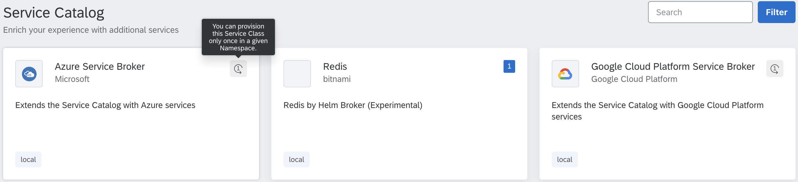
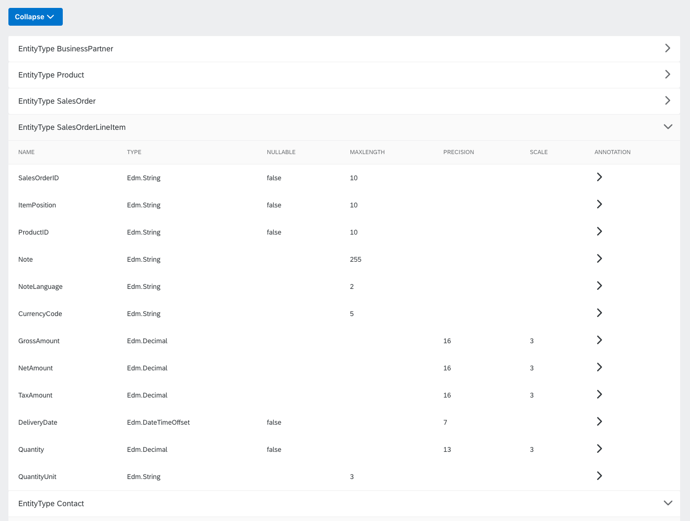
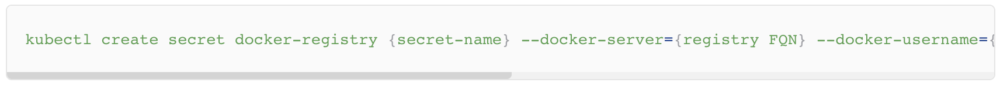
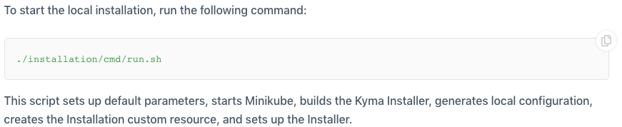
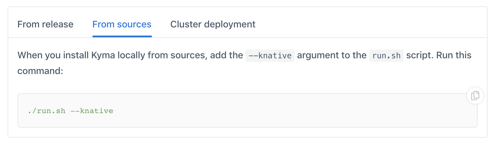
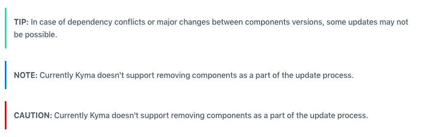
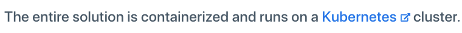
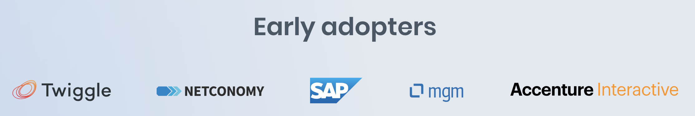

The 0.8 release is packed with new features and improvements that bring your experience to a new level. The Kyma-Knative integration continues, making it now possible to both publish and consume Events using Knative Eventing. You can now back up a Kyma cluster manually or schedule periodic backups. The Minikube version constraint is removed, allowing you to use any compatible Minikube version. The Application Connector got even more powerful with certificate signing, renewal, and revocation, as well as a brand new information endpoint. Other significant improvements include replacing OK Log with Grafana Loki, switching all Console views to SAP Fiori Fundamentals, and the introduction of the **kyma-developer** role.

<!-- overview -->

The highlights of Kyma 0.8 Edmonton include:

- [Consuming Events with Knative](#consuming-events-served-by-knative-eventing) - We enabled Event consumption using Knative Eventing.
- [Backup](#backup-and-restore-feature-added) - We introduced a backup and restore feature to Kyma.
- [Removing Minikube constraint](#removed-the-minikube-version-constraint) - We removed the Minikube version constraint that forced users to use the same version as Kyma sources.
- [Information endpoint](#information-endpoint) and [certificate management](#certificate-management) make the Application Connector even more powerful.
- [Replacing OK Log with Loki](#ok-log-replaced-with-loki) - We switched our old logging solution to Loki, which is lightweight, actively maintained, and integrated with Grafana.
- [Adding a new kyma-developer role](#kyma-developer-role) - We added a new **kyma-developer** role which is suited for developers working with Kyma clusters.
- [All Console views using SAP Fiori](#sap-fiori-fundamentals) - All views in the Console now use SAP Fiori Fundamentals or one of its component libraries, [`fundamental-ngx`](https://github.com/SAP/fundamental-ngx) or [`fundamental-react`](https://github.com/SAP/fundamental-react).

See the overview of all changes in this release:

- [Application Connector](#application-connector) - Information endpoint, certificate signing, certificate renewal, certificate revocation, Proxy Service renaming
- [Asset Store](#asset-store) - New cluster-wide resources added, package filtering, Minio monitoring
- [Backup and Restore](#backup-and-restore) - Backup and restore feature added, E2E tests for backup and restore
- [Console](#console) - All views use SAP Fiori Fundamentals, support for system Namespaces, creating bindings for users, OData spec rendering and "provision only once" classes in the Catalog view
- [Eventing](#eventing) - Consuming Events served by Knative Eventing
- [Installation](#installation) - Removed the Minikube version constraint, Kubernetes upgraded to 1.12
- [Logging](#logging) - Replaced OK Log with Loki
- [Security](#security) - New **kyma-developer** role, shorter ID token TTL, support for the kubectl `exec` command
- [Serverless](#serverless) - Logging of function's source code before execution
- [Service Catalog](#service-catalog) - Defining the URLs of the repositories that hold your bundles in the Helm Broker at runtime
- [kyma-project.io](#kyma-project-io) - Backend refactoring, bugfixes, new tab layout, information panels, new external link icon

---

## Application Connector

### Information endpoint

The new `GetInfo` endpoint returns information about the cluster. Use it to get information about important cluster endpoints, such as the Event Service URL. The new endpoint improves on the previous functionality which provided this information along with the certification requirements.

### Certificate management

We added new functionalities centered around certificate management, such as signing certificates for Applications and Kyma clusters, [renewing certificates](/docs/components/application-connector/#tutorials-renew-the-client-certificate), and [certificate revocation](/docs/components/application-connector/#tutorials-revoke-the-client-certificate).

### Proxy Service renaming

We renamed the Proxy Service to Application Gateway.

### Known issues

If you upgrade Kyma 0.7 to version 0.8, you must manually update the IP address of the Application Connector Ingress Controller, as well as selectors on all services that exist in your cluster. If you experience any issues or you need help upgrading to Kyma 0.8, reach out to the ["application-connector" Slack channel](https://kyma-community.slack.com/messages/CD0K2NSQZ) to get direct support from the community.

## Asset Store

### New cluster-wide resources added

We added two new cluster-wide resources, ClusterAsset and ClusterBucket. These resources allow you to fully use the Asset Store and build solutions using it. Read [this document](/docs/components/asset-store/#custom-resource-clusterasset) for more information.

### Package filtering

Assets now allow you to specify which folders should the Asset Store process using a regex expression. This feature adds a lot of flexibility and allows you to have packages that contain multiple files and directories, and use only the items that are relevant in a given scenario, without the need to create more packages.

### Upload service

The newly introduced upload service enables easy integration for components that dynamically create and publish packages. By default, the service is configured to be accessible only from within the cluster. You can use the Upload Service to temporarily publish files that need to be referenced in assets. For details, read [this](/docs/components/asset-store#details-asset-upload-service ) document.

### Minio monitoring

The Asset Store uses Minio as its backend, with a standalone setup on local deployment and a gateway mode as the recommended production setup. We enabled Minio monitoring and added a custom Grafana dashboard for this important component.

## Backup and restore

### Backup and restore feature added

We implemented an [Ark](https://github.com/heptio/velero/)-based backup functionality in Kyma, allowing you to create manual and scheduled backups. Read our [documentation](/docs/components/backup/) to learn how to configure backups, restore your cluster from backup, and set backup retention period.

### E2E tests for backup and restore

We added a new pipeline to Prow which allows testing the backup and restore feature. The test pipeline runs daily. It creates a Kyma cluster and installs resources in the cluster. After it completes the setup phase, it creates a backup and removes all resources. Next, the resources are restored using the created backup and the pipeline verifies if all recreated resources are working as expected.

### Known issues

Currently, the backup and restore feature doesn't cover all components. As a workaround, add the outstanding components to Ark configuration manually as described in the [documentation](/docs/components/backup/#details-back-up-a-kyma-cluster).

## Console

### SAP Fiori Fundamentals

All views of the Console now use Fiori Fundamentals or one of its component libraries, [`fundamental-ngx`](https://github.com/SAP/fundamental-ngx) or [`fundamental-react`](https://github.com/SAP/fundamental-react).

### Support for system Namespaces

The system Namespaces of your Kyma cluster are now displayed in the Console alongside the user-created ones. The system Namespaces have reduced functionality and don't allow the users to perform certain actions, such as creating lambdas.

### Create RoleBindings for users

We added the ability to create RoleBindings and ClusterRoleBindings for specific users through the Console.

### Catalog view enhancements

- "Provision only once" classes

Some Service Classes can be provisioned only once in a given Namespace. They are mostly brokers from different cloud providers. We made it clear in the UI that certain classes can be used only once or cannot be provisioned again if they are already in use. We also indicated how many instances of Service Classes that can be provisioned multiple times already exist in the cluster.

- OData specification rendering

Kyma allows you to register REST APIs as well as OData APIs. The Console now supports not only OpenAPI but also OData spec rendering. We developed a new component and integrated it in the Service Catalog views to support this use case. Currently, we support OData v2, v3, and v4. We support only `XML` as the input data format and we transform older OData versions to v4.

### Known issues

After you upgrade Kyma to the 0.8 version, you might be unable to log in to the Console. To counter this issue, clear your browser cache manually and try logging in again.

## Eventing

### Consuming Events served by Knative Eventing

Running Kyma with the `--knative` flag now allows you to consume Events served by Knative.

### Restricted Client access enabled for NATS Streaming

Only Event Bus applications can connect to NATS Streaming using client authentication.

## Installation

### Removed the Minikube version constraint

We removed the Minikube version constraint. You can now use any compatible version, not necessarily the exact one found in Kyma sources.

### Kubernetes version upgrade

Cluster deployments now use Kubernetes version 1.12.

## Logging

### OK Log replaced with Loki

In this release, we replaced OK Log with a new logging solution - Loki. Dubbed the "Prometheus for logs", Loki fits Kyma very well. It's lightweight, actively maintained, and integrated with Grafana, which lets you see metrics and logs for your Pods all in one place. For now, we replaced the main logging functionality, which means that the logs are collected by Loki but can be accessed only through an internal API. We will expose the API and activate Grafana integration in the upcoming release. Please remember that our logging solution is in alpha state. Your feedback is welcome!

## Security

### Kyma-developer role

We introduced a new cluster-wide role suited for developers working with Kyma. The **kyma-developer** role has fewer privileges than the existing **kyma-admin** role but allows for more access than the existing, Namespace-specific **kyma-reader** role. Assign the new role to any developer that develop solutions in your cluster. Read [this](/docs/components/security/#tutorials-manage-static-users-in-dex-bind-a-user-to-a-role-or-a-clusterrole) document for more information.

### Shorter ID token TTL

Starting with the 0.8 release, all ID tokens fetched from Dex have a TTL of 8 hours.

### Support for kubectl exec command

The API Server Proxy now supports the [SPDY](https://www.chromium.org/spdy/spdy-whitepaper) protocol, which is used for handling kubectl commands such as `exec`. Developers can now use all kubectl commands when they connect to a cluster with a generated `kubeconfig` file.

## Serverless

### Logging of function's source code before execution

Functions are logging their source code and `package.json` content before they are executed. This allows you to track what code is executed inside function Pods.

## Service Catalog

### Define the URLs of the repositories that hold your bundles in the Helm Broker

You can now instantly update the URLs of your bundles repositories in the Helm Broker, with no need to restart. For more information, read [this](/docs/components/helm-broker#configuration-configure-helm-broker-add-a-new-bundle-repository) document.

## kyma-project.io

### Backend refactoring

We refactored the backend of the website to improve the speed of future implementations.

### Bugfixes

We fixed multiple smaller bugs, including a particularly annoying one that caused the horizontal scroll bar to overlap the code in code snippet fields.

### New features

- Copy button for code snippets

- New tabs layout suitable for displaying instructions in different versions

- New panel types help differentiate between notes, caution indicators, and tips

- A special icon indicates that clicking a link takes you outside of the website and opens a new tab

- The new section on the main page introduces Kyma early adopters that agreed to be mentioned on the website

