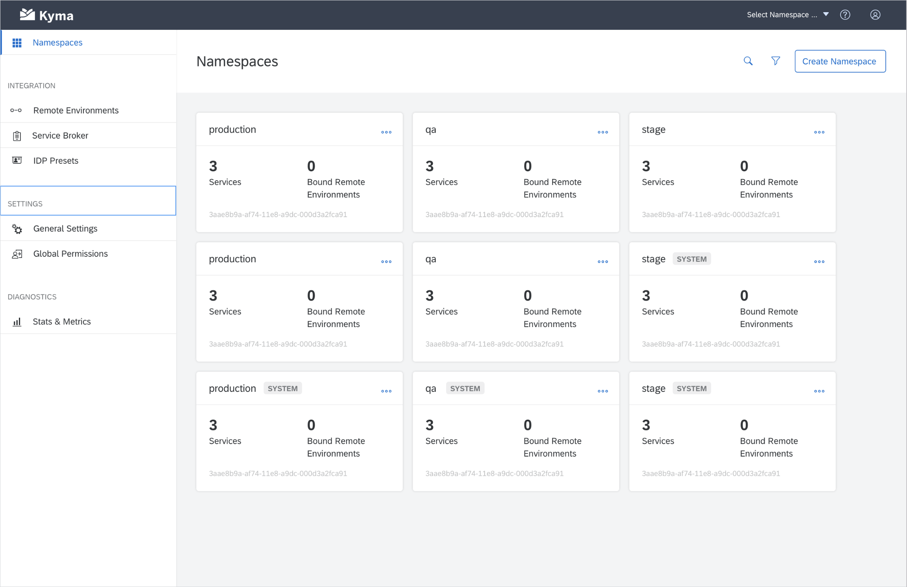

_Overview[#TODO]_

<!-- overview -->

The highlights of Kyma 1.1 Helsinki include:

_Highlights[#TODO]_

See the overview of all changes in this release:

- [Application Connector](#application-connector) - Application Operator optimization, OData support in documentation, Event Service
- [Console](#console) - Performance improvements, usability improvements
- [Core and Supporting](#core-and-supporting) - Minio Gateway mode
- [Eventing](#eventing) - Subscription CR status change, Improved upgradability, new dashboards in Grafana

---

## Application Connector

### Application Operator optimization

We optimized the memory consumption for the Application Operator. The component is now much more stable and reliable even under the high cluster load.

### OData support in documentation

You can now read the updated Application Connector documentation that includes information on the supported APIs, including the support for [OData API registration](/docs/1.1/components/application-connector/#overview-overview-supported-apis).

### Event Service

We enriched the Event Service with the new `/{application}/v1/events/subscribed` endpoint that only returns information on the subscribed Events. This endpoint is perfect for your system optimization as the connected application no longer needs to send Events that are not used by any lambda or service. [Read more](/docs/1.1/components/application-connector/#api-event-service) about the endpoint and learn how you can use it to fetch Events.

## Console

### Performance improvements  

As a result of aggregating several calls into one, we reduced the initial loading time of the Console UI. We also leveraged a new Luigi feature for improving caching behavior when reopening micro front-ends. Thanks to it, micro front-ends no longer need to reload each time you switch from one to another.

### Usability improvements

We added the `SYSTEM` badge to the system Namespaces thanks to which you can easily distinguish them from the user-created Namespaces on the Namespace overview page in the Console UI.

## Core and Supporting

### Minio Gateway mode

The [Asset Store](/docs/1.1/components/asset-store) that provides asset management in Kyma uses [Minio](https://min.io/) as a back-end solution. As stated in our documentation, we recommend that you use Minio in its Gateway mode for your production environment. This means you should use Minio as a gateway to Google Cloud Storage (GCS) and other file storage providers.

In this release we focused on preparing an easy switch from the standalone mode to the Gateway mode by:
- Making sure sure your data is seamlessly recreated after the switch
- Improving the stability of the Asset Store with Minio in the Gateway mode
- Providing clear documentation on [how to switch to GCS](/docs/1.1/components/asset-store/#tutorials-set-minio-to-the-google-cloud-storage-gateway-mode)

## Eventing

### Subscription CR status change

We moved the status of a given resource from the `.spec` section of the Subscription custom resource definition (CRD) to a sub-resource. This allows for direct status interactions and recreating it without modifying the specification.

### Improved upgradability

We added new tests for verifying the upgradability of Kyma Eventing. The tests ensure that a subscription created before an upgrade continues to work after the upgrade.

### New dashboards in Grafana

There are two new dashboards available in Grafana:
- **Ignored events** with Events for which there are no subscriptions
- **Subscription details** that allows you to check if there are any problems with a given subscription

_ScreenshotsOfDashboards[#TODO]_
