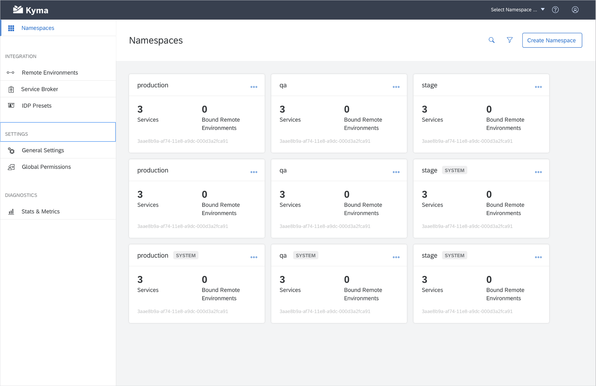

_Overview[#TODO]_

<!-- overview -->

The highlights of Kyma 1.1 Helsinki include:

_Highlights[#TODO]_

See the overview of all changes in this release:

- [Application Connector](#application-connector) - Application Operator optimization, OData support in documentation, Event Service
- [Console](#console) - Performance improvements, usability improvements
- [Core and Supporting](#core-and-supporting) - Minio Gateway mode
- [Documentation](#documentation) - Configuration and installation document improvements
- [Eventing](#eventing) - Subscription CR status change, improved upgradability, new dashboards in Grafana
- [Productivity](#productivity) - Octopus in Kyma
- [Service Management](#service-management) - Add-ons in the Catalog UI, AWS Service Broker add-on, documentation support for add-ons, "Provision only once" APIs and Events

---

## Application Connector

### Application Operator optimization

We optimized the memory consumption for the Application Operator. The component is now much more stable and reliable even under the high cluster load.

### OData support in documentation

You can now read the updated Application Connector documentation that includes information on the supported APIs, including the support for [OData API registration](/docs/1.1/components/application-connector/#overview-overview-supported-apis).

### Event Service

We enriched the Event Service with the new `/{application}/v1/events/subscribed` endpoint that only returns information on the subscribed Events. This endpoint is perfect for your system optimization as the connected application no longer needs to send Events that are not used by any lambda or service. [Read more](/docs/1.1/components/application-connector/#api-event-service) about the endpoint and learn how you can use it to fetch Events.

## Console

### Performance improvements  

As a result of aggregating several calls into one, we reduced the initial loading time of the Console UI. We also leveraged a new Luigi feature for improving caching behavior when reopening micro front-ends. Thanks to it, micro front-ends no longer need to reload each time you switch from one to another.

### Usability improvements

We added the `SYSTEM` badge to the system Namespaces thanks to which you can easily distinguish them from the user-created Namespaces on the Namespace overview page in the Console UI.

## Core and Supporting

### Minio Gateway mode

The [Asset Store](/docs/1.1/components/asset-store) that provides asset management in Kyma uses [Minio](https://min.io/) as a back-end solution. As stated in our documentation, we recommend that you use Minio in its Gateway mode for your production environment. This means you should use Minio as a gateway to Google Cloud Storage (GCS) and other file storage providers.

In this release we focused on preparing an easy switch from the standalone mode to the Gateway mode by:
- Making sure sure your data is seamlessly recreated after the switch
- Improving the stability of the Asset Store with Minio in the Gateway mode
- Providing clear documentation on how to [switch to GCS](/docs/1.1/components/asset-store/#tutorials-set-minio-to-the-google-cloud-storage-gateway-mode)

## Documentation

### Configuration and installation document improvements

In 1.1, we focused on creating configuration documents and simplifying the existing installation documents.

Configuration improvements:
- An [overview](/docs/1.1/root/kyma/#configuration-overview) document explaining what you can configure in Kyma and how you can do it before and after installation.
- Improved documents on selected [component installation](/docs/1.1/root/kyma/#configuration-custom-component-installation) and chart values [overrides](/docs/1.1/root/kyma/#configuration-helm-overrides-for-kyma-installation).
- A set of configuration documents for the [Asset Store](/docs/1.1/components/asset-store/#configuration-configuration) specifying the configurable parameters form the `values.yaml` charts and sub-charts that you can override. You can expect more of such documents for other Kyma components to come in the upcoming releases.

Installation improvements:
- Simplified [cluster installation](/docs/1.1/root/kyma/#installation-install-kyma-on-a-cluster) documents explaining how you can can quickly deploy Kyma on a cluster with a wildcard DNS provided by `xip.io`.
- A unified [local installation](/docs/1.1/root/kyma/#installation-install-kyma-locally) flow

## Eventing

### Subscription CR status change

We moved the status of a given resource from the `spec` section of the Subscription custom resource definition (CRD) to a sub-resource. This allows for direct status interactions and recreating it without modifying the specification.

### Improved upgradability

We added new tests for verifying the upgradability of Kyma Eventing. The tests ensure that a subscription created before an upgrade continues to work after the upgrade.

### New dashboards in Grafana

There are two new dashboards available in Grafana:
- **Ignored events** with Events for which there are no subscriptions
- **Subscription details** that allows you to check if there are any problems with a given subscription

_ScreenshotsOfDashboards[#TODO]_

## Service Management

### Add-ons in the Catalog UI

Aiming to improve your user experience, we split the Catalog UI view into **Services** and **Add-Ons** tabs. This way, we separated the third-party services from the add-on configuration and installation inside the cluster. What's more, the Kyma cluster-wide integration UI has a new `Add-ons Config` view where you can manage add-ons that are available in your Namespaced Add-ons Catalog view. In the near future, we are also planning to rename bundles to add-ons.

### AWS Service Broker add-on

As part of our constant work on unifying your experience with third-party Service Brokers in Kyma, we extended our Service Catalog with Amazon offerings. The new [AWS Service Broker](/docs/1.1/components/service-catalog/#service-brokers-aws-service-broker) is available for you as an add-on, extending the existing GCP and Azure Service brokers add-ons family.

### Documentation support for add-ons

The Helm Broker creates Service Class documentation from an add-on which appears in the `Add-Ons` Catalog UI tab. Read how to add documentation to your [add-on](https://kyma-project.io/docs/master/components/helm-broker/#details-create-a-bundle-docs-directory). If your add-on extends the Service Catalog UI, read how to provide documentation for those new [Service Classes](/docs/1.1/components/helm-broker#details-service-classes-documentation-provided-by-bundles).

### "Provision only once" APIs and Events

APIs and Events of the Application Broker Service Classes now have a new "provision only once" feature that shows they are already available in a given Namespace.

## Productivity

### Octopus in Kyma

As part of productivity improvements in Kyma, we replaced Helm tests with the Octopus test runner. Kyma components now use Octopus as a testing framework to run tests defined as Docker images on a running cluster.
Read more about [testing ](/docs/1.1/root/kyma/#details-testing-kyma) in Kyma, [Octopus](https://github.com/kyma-incubator/octopus/blob/master/README.md) itself, and the benefits it brings to the Kyma testing process.
