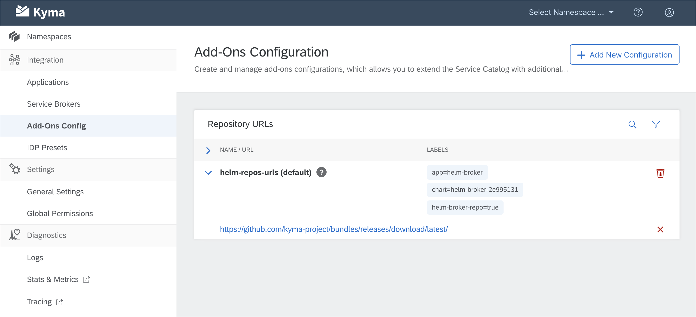

After the long-awaited 1.0 Gliwice release, we focused mainly on putting the polishing touches to the current setup, including improvements in the Console UI performance and usability, Asset Store and Service Catalog extensions, Application Operator optimization, and documentation-related tweaks. Still, we are proud to communicate a few new features we bring to you in 1.1 Helsinki. Read on to find out what has changed in Kyma since 1.0.

<!-- overview -->

The highlights of Kyma 1.1 Helsinki include:

- [Add-ons in the Catalog UI](#add-ons-in-the-catalog-ui) - We enabled a new way to share add-ons by combining the concepts of Service Catalog bundles with Helm charts.
- [AWS Service Broker](#aws-service-broker-add-on) - We extended our third-party services by adding the AWS service offerings.
- [Minio Gateway](#minio-gateway-mode) - We improved the Asset Store configuration to let you use Google Cloud Storage.
- [Octopus](#octopus-in-kyma) - We introduced a new testing tool that replaced Helm tests.

See the overview of all changes in this release:

- [Application Connector](#application-connector) - Application Operator optimization, OData support in documentation, new Event Service endpoint
- [Console](#console) - Performance improvements, usability improvements
- [Core and Supporting](#core-and-supporting) - Minio Gateway mode
- [Documentation](#documentation) - Configuration and installation document improvements
- [Eventing](#eventing) - Subscription CR status change, improved upgradability, new dashboards in Grafana
- [Productivity](#productivity) - Octopus in Kyma
- [Service Management](#service-management) - Add-ons in the Catalog UI, AWS Service Broker add-on, documentation support for add-ons, "provision only once" APIs and Events

Read about a known issue for [Tracing](#known-issues).

---

## Application Connector

### Application Operator optimization

In this release, we optimized the memory consumption for the Application Operator. The component is now much more stable and reliable, even under the high cluster load.

### OData support in documentation

You can now read the updated Application Connector documentation that includes information on the supported APIs, including the support for [OData API registration](/docs/components/application-connector/#overview-overview-supported-apis).

### New Event Service endpoint

We enriched the Event Service with the new `/{application}/v1/events/subscribed` endpoint that only returns information on the subscribed Events. This endpoint is perfect for your system optimization as the connected application no longer needs to send Events that are not used by any lambda or service. [Read more](/docs/components/application-connector/#api-event-service) about the endpoint and learn how you can use it to fetch Events.

## Console

### Performance improvements  

As a result of aggregating several calls into one, we reduced the initial loading time of the Console UI navigation.

### Usability improvements

We added the `SYSTEM` badge to the system Namespaces. Thanks to it, you can easily distinguish them from the user-created ones on the Namespace overview page in the Console UI.

## Core and Supporting

### Minio Gateway mode

The [Asset Store](/docs/components/asset-store) that ensures asset management in Kyma uses [Minio](https://min.io/) as a back-end solution. As stated in our documentation, we recommend that you use Minio in its Gateway mode for your production environment. This means you should use Minio as a gateway to Google Cloud Storage (GCS).

In this release, we focused on preparing an easy switch from the standalone mode to the Gateway mode by:
- Making sure your data is seamlessly recreated after the switch.
- Improving the stability of the Asset Store with Minio in the Gateway mode.
- Providing clear documentation on how to [switch to GCS](/docs/components/asset-store/#tutorials-set-minio-to-the-google-cloud-storage-gateway-mode).
- Integrating the Minio Gateway mode with our testing pipeline. This way, we can now test any new functionality against the Minio Gateway mode pointing to GCS.

## Documentation

### Configuration and installation document improvements

In 1.1, we focused on creating configuration documents and simplifying the existing installation documents.

Configuration improvements:
- An [overview](/docs/root/kyma/#configuration-overview) document explaining what you can configure in Kyma and how you can do it before and after installation
- Improved documents on selected [component installation](/docs/root/kyma/#configuration-custom-component-installation) and chart values [overrides](/docs/root/kyma/#configuration-helm-overrides-for-kyma-installation)
- A [template](https://github.com/kyma-project/community/blob/master/guidelines/templates/resources/configuration.md) for the **Configuration** document type that provides technical details about configuration of a Kyma component's chart or sub-chart
- A set of configuration documents for the [Asset Store](/docs/components/asset-store/#configuration-configuration) specifying the configurable parameters from the `values.yaml` charts and sub-charts that you can override. You can expect more of such documents for other Kyma components to come in the upcoming releases

Installation improvements:
- A simplified [cluster installation](/docs/root/kyma/#installation-install-kyma-on-a-cluster) document explaining how you can quickly deploy Kyma on a cluster with a wildcard DNS provided by `xip.io`
- A unified [local installation](/docs/root/kyma/#installation-install-kyma-locally) flow

## Eventing

### Subscription CR status change

We moved the status of a given resource from the `spec` section of the Subscription custom resource definition (CRD) to a sub-resource. This enables direct status interactions and recreating it without modifying the specification.

### Improved upgradability

We added new tests for verifying the upgradability of Kyma Eventing. The tests ensure that a subscription created before an upgrade continues to work after the upgrade.

### New dashboards in Grafana

There are two new dashboards available in Grafana:
- **Ignored events** with Events for which there are no subscriptions
- **Subscription details** to check if there are any issues with a given subscription

> **CAUTION:** Currently, if the subscription name contains a dot (`.`), the dashboard charts will display the `NOT READY` status even if the subscription is `READY`.

## Productivity

### Octopus in Kyma

As part of productivity improvements in Kyma, we replaced Helm tests with the Octopus test runner. Kyma components now use Octopus as a testing framework to run tests defined as Docker images on a running cluster.
Read more about [testing](/docs/root/kyma/#details-testing-kyma) in Kyma, [Octopus](https://github.com/kyma-incubator/octopus/blob/master/README.md) itself, and the benefits it brings to the Kyma testing process.

## Service Management

### Add-ons in the Catalog UI

Aiming to improve your user experience, we split the Catalog UI view into **Add-Ons** and **Services** tabs. This way, we separated the Helm Broker add-on configuration and installation inside the cluster from the third-party services. The Kyma cluster-wide integration UI also has a new **Add-ons Config** view where you can manage add-ons that are available in your Namespaced **Add-Ons** Catalog view. In the near future, we are also planning to rename bundles to add-ons.

### AWS Service Broker add-on

As part of our constant efforts to improve your experience on third-party Service Brokers in Kyma, we extended our Service Catalog with Amazon offerings. The new [AWS Service Broker](/docs/components/service-catalog/#service-brokers-aws-service-broker) is available for you as an add-on, extending the existing GCP and Azure Service Brokers add-on family.

### Documentation support for add-ons

The Helm Broker creates Service Class documentation from an add-on which appears in the **Add-Ons** Catalog UI view. [Read](/docs/components/helm-broker#details-create-a-bundle-docs-directory) how to add documentation to your add-on. If your add-on extends the Service Catalog UI, [read](/docs/components/helm-broker#details-service-classes-documentation-provided-by-bundles) how to provide documentation for those new Service Classes.

### "Provision only once" APIs and Events

APIs and Events of the Application Broker Service Classes now have a new "provision only once" feature that shows they are already available in a given Namespace.

## Tracing

### Known issues

By default, the trace sampling rate for Istio is configured to 1%. With that rate, only a small ratio of all requests will be available in Jaeger for the trace analysis. We are planning to optimize that setting in next releases, including recommendations for specific usage scenarios.
As a workaround, adjust the setting manually using the official [Istio documentation](https://istio.io/docs/tasks/telemetry/distributed-tracing/overview/) if you require a higher sampling rate.
