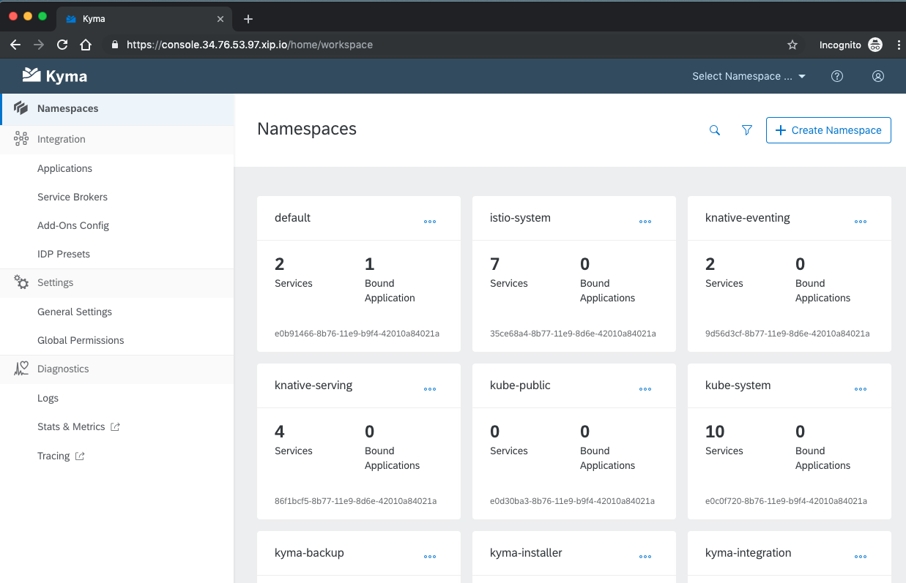
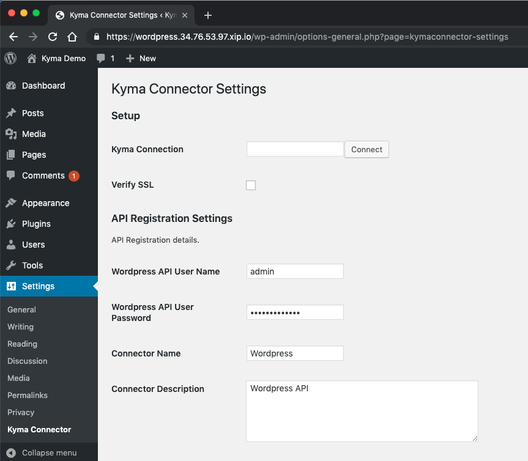
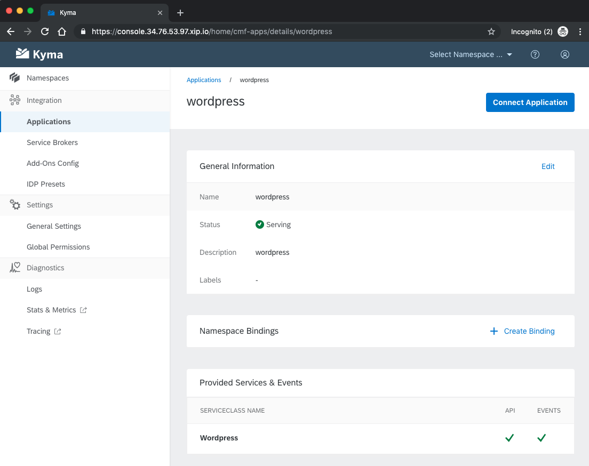
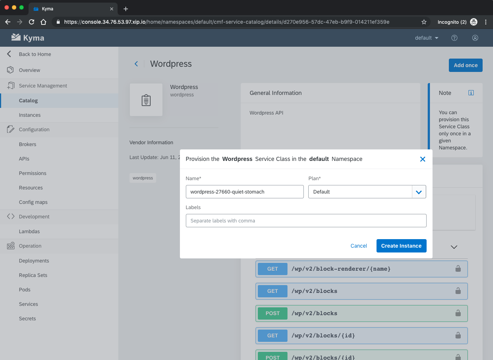
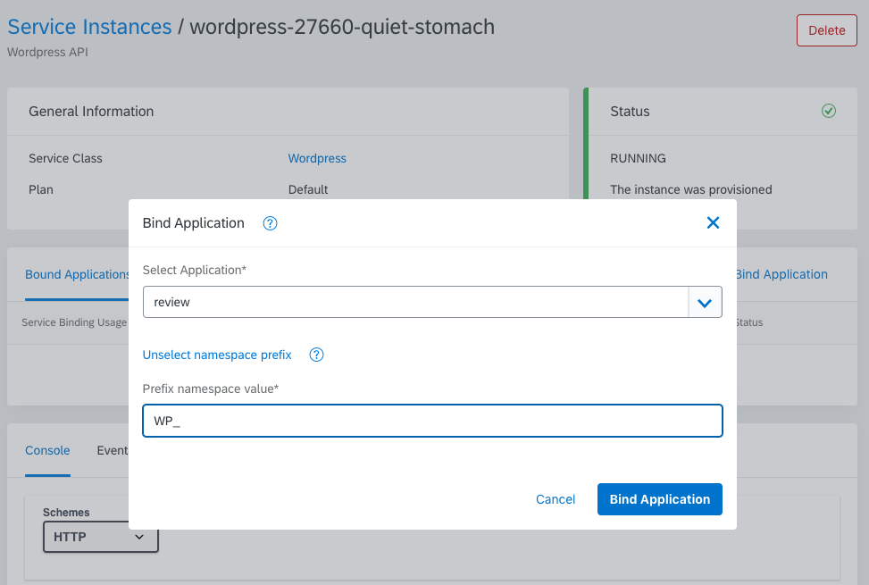
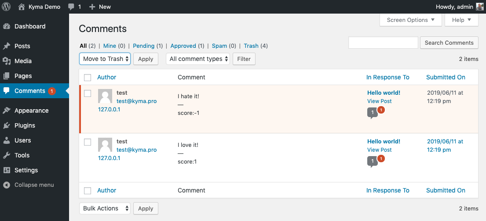

Cloud-native application development is now a hot topic in the industry. Developers want to use modern languages, write microservices or even serverless functions. They expect high scalability with modern monitoring tools like Prometheus and Grafana. Kubernetes and CNCF landscape projects are no longer perceived as hype for early adopters. This is the mainstream now.

If you start a new, green field project you are lucky - you can dive into the great variety of tools and frameworks and use them. But how to pick the right tools? At the moment of writing this post, there are 686 projects registered in the [CNCF landscape](https://landscape.cncf.io/).

We also have the less lucky developers who still have to deal with applications designed when monoliths were cool. What about them? Can they benefit from cloud-native patterns? Yes, they can!
<!-- overview -->

# Imagine your legacy application
You probably have some applications you have to extend or integrate with but you are not happy with that fact. There can be a few reasons for it:
- It requires writing code in the language you don't know and you want to use only Golang or JavaScript.
- It is possible to add a new feature to the application but it requires a complex redeployment process which is risky.
- You just don't want to touch it because it is fragile and adding anything can make it unstable.
- You want to write an extension which can be scaled independently of the application.

# WordPress as an example
I prepared some example to help your imagination. The simple scenario with WordPress as a legacy application. Imagine you are running some commerce site and you created a blog on WordPress showing product reviews and tests. Now you want to engage your customers and you enabled comments in your blog posts. Users should see their comments immediately published, but you don't have time to moderate the content. The idea is to publish only positive comments automatically, and put other comments on hold.

You could use WordPress hook `comment_post` and implement a plugin in PHP. But it won't work for me. I don't know PHP, and my team mates don't either. I would like to use external systems (text analytics, slack, maybe more in the future), and I don't want to deal with secrets and authorization flows in WordPress side. Additionally, I want to utilize all modern DevOps practices and patterns, like [12 Factor App](https://12factor.net). In other words: me and my team want to do cool, cloud native stuff on top of Kubernetes, instead of be WordPress maintainers.

Of course, in this simple scenario microservices, Kubernetes, Service Mesh, and other tools would be overkill but the real-world use cases are more complex, and you can imagine how this initial flow can grow in the future.

# Implementation plan

Let's implement and deploy our example. I will use:
- A Kubernetes cluster from Google Kubernetes Engine (GKE) to deploy both WordPress and my code
- Knative eventing and NATS as a messaging middleware to decouple WordPress from my extension
- Istio Service Mesh together with Prometheus, Grafana, and Jaeger to have monitoring and tracing
- Kubeless as a serverless engine for my code
- Grafana and Loki to manage logs
- Service Catalog, WordPress Connector for Kyma and Kyma Application Broker to bind WordPress API and Events to my code

# Installation
Based on the above list, you can expect a long installation process but I will use a Kyma operator that will do everything for me. All you need is a Google account and a Google Cloud Platform (GCP) project. If you don't have it yet, create one and Google will give a 12-month free trial with $300 credit to run your cluster.

## Prepare the GKE cluster with Kyma
Follow the [installation guide](https://github.com/kyma-project/kyma/blob/release-1.2/docs/kyma/04-03-cluster-installation.md) for GKE or just execute the following commands, replacing placeholders with proper values:

```bash
# Set ENV variables. See sample values in comments:
export KYMA_VERSION={KYMA_RELEASE_VERSION}      # 1.2.0
export CLUSTER_NAME={CLUSTER_NAME_YOU_WANT}     # kyma-cluster
export GCP_PROJECT={YOUR_GCP_PROJECT}           # myproject
export GCP_ZONE={GCP_ZONE_TO_DEPLOY_TO}         # europe-west1-b

# Create a cluster
gcloud container --project "$GCP_PROJECT" clusters \
create "$CLUSTER_NAME" --zone "$GCP_ZONE" \
--cluster-version "1.12" --machine-type "n1-standard-4" \
--addons HorizontalPodAutoscaling,HttpLoadBalancing

# Add the current user as an admin
gcloud container clusters get-credentials $CLUSTER_NAME --zone $GCP_ZONE --project $GCP_PROJECT
kubectl create clusterrolebinding cluster-admin-binding --clusterrole=cluster-admin --user=$(gcloud config get-value account)

# Install Tiller
kubectl apply -f https://raw.githubusercontent.com/kyma-project/kyma/$KYMA_VERSION/installation/resources/tiller.yaml

# Install Kyma
kubectl apply -f https://github.com/kyma-project/kyma/releases/download/$KYMA_VERSION/kyma-installer-cluster.yaml

# Show the Kyma installation progress. Stop the script with `Ctrl+C` when the installation finishes.
while true; do \
  kubectl -n default get installation/kyma-installation -o jsonpath="{'Status: '}{.status.state}{', description: '}{.status.description}"; echo; \
  sleep 5; \
done
```

## Access Kyma

> **NOTE:** Follow steps in this section only if you installed Kyma from the instructions in this blog post. If you followed the official Kyma documentation, skip this section as the installation steps cover adding a self-signed certificate and accessing the cluster.

The simple installation guide we followed uses a self-signed certificate and an `xip.io` domain. Such a certificate will be rejected by your browser so you have to set it as trusted.
```bash
# When the installation finishes, add a Kyma self-signed certificate to the trusted certificates (MacOS):
tmpfile=$(mktemp /tmp/temp-cert.XXXXXX) \
&& kubectl get configmap net-global-overrides -n kyma-installer -o jsonpath='{.data.global\.ingress\.tlsCrt}' | base64 --decode > $tmpfile \
&& sudo security add-trusted-cert -d -r trustRoot -k /Library/Keychains/System.keychain $tmpfile \
&& rm $tmpfile
```

Run these commands to display the Console URL, login, and password:
```bash
echo 'Kyma Console Url:'
echo `kubectl get virtualservice core-console -n kyma-system -o jsonpath='{ .spec.hosts[0] }'`

echo 'User admin@kyma.cx, password:'
echo `kubectl get secret admin-user -n kyma-system -o jsonpath="{.data.password}" | base64 --decode`
```
You should get a similar result:
```console
Kyma Console Url:
console.1.2.3.4.xip.io
User admin@kyma.cx, password:
Eca23NyShqwK
```
You can now open the Kyma Console URL in the browser and log in with the provided credentials.



## WordPress installation
If you already have WordPress installed, you can go to the next step. If not, you can easily deploy WordPress with a few commands:
```bash
# Create a Namespace
kubectl create namespace wordpress

# Deploy WordPress
kubectl -n wordpress apply -f https://raw.githubusercontent.com/kyma-project/website/master/content/blog-posts/2019-07-08-extend-wordpress/wordpress-deployment.yaml
```

Wait a few seconds for WordPress to start. You can check the status in the **Deployments** section.

When the status of all deployments is `RUNNING`, navigate to [https://wordpress.1.2.3.4.xip.io]() replacing the `1.2.3.4` IP with the one for your cluster. Then complete the installation wizard.

## Kyma plugin for WordPress

Before you install plugins, ensure that you have the proper configuration of Permalinks. Log into WordPress as an admin, go to **Settings** -> **Permalinks**, select the `Post name` option and save your changes.
Download the following plugins:
- [Basic Auth](https://github.com/WP-API/Basic-Auth/archive/master.zip) - for more details go to this [GitHub repository](https://github.com/WP-API/Basic-Auth)
- [Kyma Connector](https://github.com/kyma-incubator/wordpress-connector/archive/master.zip) - for more details go to this [GitHub repository](https://github.com/kyma-incubator/wordpress-connector)
In the left navigation, go to **Plugins** -> **Add New** -> **Upload Plugin**. Choose the Basic Auth and Kyma Connector plugins from your disk to install and activate them.
Go to **Settings** -> **Kyma Connector**, uncheck the **Verify SSL** option (you need it because the default Kyma installation uses self-signed certificates), provide the username and password you created during the installation, and save your changes.



# Connect WordPress to Kyma

In this step you establish a trusted connection between the WordPress instance and your Kyma cluster, both hosted on the same Kubernetes cluster. You also register WordPress API and WordPress Events in the Service Catalog and enable both in a selected Namespace.

In the Kyma Console navigate back to the home page, go to **Applications**, and create a new Application called `wordpress`.

Open it and press **Connect Application**. Copy the connection token URL to the clipboard. Go to the Kyma Connector Settings in WordPress, paste the token URL in the **Kyma Connection** field, and press **Connect**. You should see the success message in WordPress and a new entry inside the **Provided Services & Events** section of the `wordpress` Application in Kyma.



## Diasable SSL for Kyma->WordPress

WordPress installed in a cluster uses a self-signed SSL certificate. Kyma default settings don't allow for such a connection. You need to explicitly turn it on:

  1. Edit the `wordpress-application-gateway` Deployment in the `kyma-integration` Namespace. Run:
      ```
      kubectl -n kyma-integration edit deployment wordpress-application-gateway
      ```
  2. Edit the Deployment in Vim. Select `i` to start editing.
  3. Find the **skipVerify** parameter and change its value to `true`.
  4. Press **ESC**, type `:wq`, and click **ENTER** to write and quit.

One command to do it:
```bash
# Update kyma installer image to 1.1.0
kubectl -n kyma-integration \
  patch deployment wordpress-application-gateway --type=json \
  -p='[{"op": "replace", "path": "/spec/template/spec/containers/0/args/6", "value": "--skipVerify=true"}]'
```
>**CAUTION:** The command assumes that **skipVerify** is the argument with the index 6 (0-based).

# Enable WordPress Events and APIs in the default Namespace

The Kyma Application connectivity can expose APIs and Events (Async API) of Applications in the Service Catalog. To show WordPress in the Service Catalog, first, you need to bind the Application to a selected Namespace. Go to **Applications**, select the `wordpress` Application, press **Create Binding** and select the `default` Namespace. Now go to the `default` Namespace and open the Catalog - you should see WordPress API in the **Services** tab. Open it and have a look at API console and Events specification. We will react on `comment.post.v1` event and interact with `/wp/v2/comments/{id}` API. To make them available in the `default` Namespace click the **Add once** button and create an instance of the WordPress Service Class. Behind the scenes, the Application Connector creates the Application Gateway (a kind of proxy) that forwards requests from bounded services or functions to the WordPress instance.



# Write your code
You did the wiring, so let's write some code. In the `default` Namespace create a new lambda named `review` and paste the following code in the **Settings & Code** editor:
``` javascript
const Sentiment = require('sentiment');
const sentiment = new Sentiment();
const axios = require("axios");

module.exports = {
    main: async function (event, context) {
        let status = "hold";
        console.log("Event data: %s",JSON.stringify(event.data));
        let comment = await getComment(event.data.commentId);
        console.log("Comment: %s",comment.content.raw);
        let result = sentiment.analyze(comment.content.raw);
        console.log("Sentiment: %s",JSON.stringify(result));
        let score = result.comparative;
        if (score>0.2) {
            status = "approved"
        }
        updateComment(comment.id, status, comment.content.raw, score);
    }
};

async function getComment(id) {
    let commentUrl = `${process.env.WP_GATEWAY_URL}/wp/v2/comments/${id}?context=edit`
    let response = await axios.get(commentUrl);
    return response.data;
}

async function updateComment(id, status, comment, score) {
    let commentUrl = `${process.env.WP_GATEWAY_URL}/wp/v2/comments/${id}`;
    const update = await axios.post(commentUrl,{status:status, content:comment+"\n--\nscore:"+score});
    return update;
}
```

In the **Dependencies** section, add:
```json
{
  "dependencies": {
    "axios": "^0.19.0",
    "sentiment": "^5.0.1"
  }
}
```
Press **Select Function Trigger**, choose your function which is the `comment.post` Event, and save the function. The trigger is available because you have the WordPress service instance in the `default` Namespace.

# Binding

Go to **Instances** under the **Service Management**, open the WordPress instance in the **Services** tab. Click **Bind Application**, select `review` function, set the **Prefix namespace value** to `WP_`, and confirm.



You can now open the `review` lambda again and check if there is a new entry in **Service Bindings** section with `WP_GATEWAY_URL` environment variable.


# Test it

Go to WordPress main site and open the **Hello World!** blog post. Add the following 2 comments under the blog post:
- I love it!
- I hate it!
Go to the WordPress **Dashboard** and check the comments. You should see that both comments have a score footer with the following sentiment values:
- `1` for a positive comment
- `-1` for a negative comment
The negative comment is waiting for moderation.



# Explore the benefits

Your code runs using Istio Service Mesh with network secured by mutual TLS. You can see the metrics of your functions, such as latency, responses, errors and memory usage, with one click on Grafana Dashboard. You can trace your requests using Jaeger. And you can scale your functions independently from WordPress.

# Summary
Why should you try Kyma? If you start a new project on Kubernetes, you will get carefully selected and best tools from the Cloud Native Landscape, which are already configured and integrated. If you want to move only a part of your project to the cloud and you have to keep legacy applications around, Kyma will help you to build extensions for them using modern tools on top of Kubernetes.
Also when you start a new project with a goal that the final solution should be extendable and customizable, considering Kyma to address these challenges from day one would offer benefits.
Please remember that Kyma is an open-source project which is actively developed (~80 contributors and ~600 GitHub stars) with the support from such a big company as SAP.

# Next steps

In the next blog post, I will show you how to use services from cloud providers using the Open Service Broker API.
