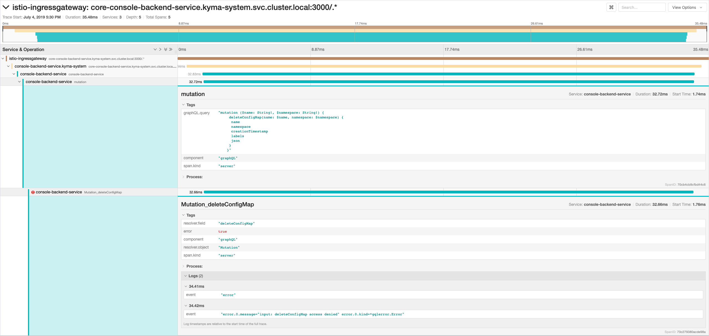
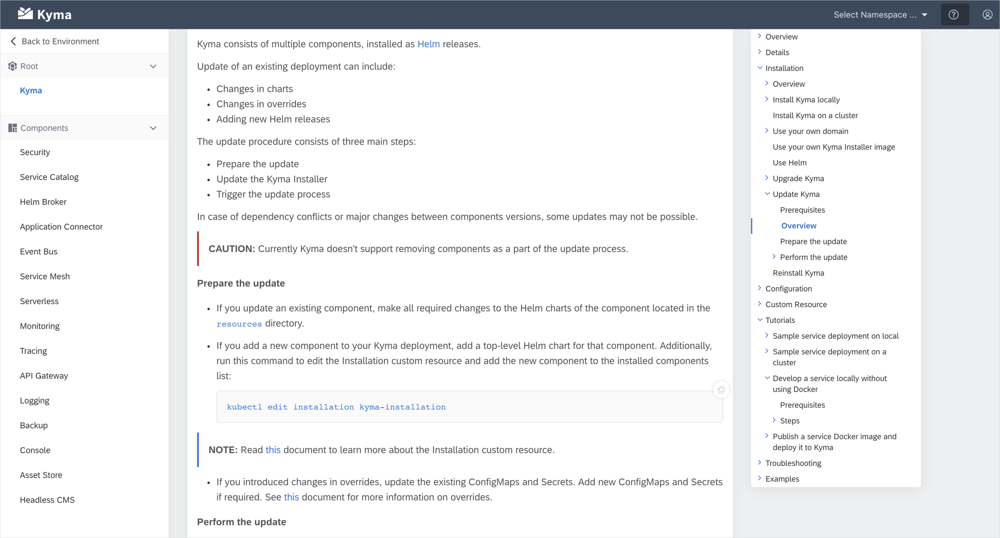

After a short stop in Istanbul, we move forward to Jakarta with the brand new Kyma 1.3 release, which brings you a set of significant improvements in many components, including the Console and Kyma CLI. It also introduces the CloudEvents specification 0.3 for Event delivery and comes with even more useful documents that will guide you through the project. Read on to find out what Kyma 1.3 has to offer.

<!-- overview -->

See the overview of all changes in this release:

- [Application Connector](#application-connector) - Fetching API specification secured with Basic Auth or OAuth, automatic generation of the root Certificate Authority, additional headers and query parameters stored in a secured way
- [Console](#console) - Less information noise in lambda logs, easy Namespace labeling and filtering, API list streamed using WebSockets, hide irrelevant navigation nodes, DevX improvements for the **Lambda** view, Console Backend observability improved
- [Core and Supporting](#core-and-supporting) - Documentation component
- [Service Management](#service-management) - Service Catalog migration from "API Server" to "CRD only"
- [Kyma CLI](#kyma-cli) - Kyma CLI documentation, installation and uninstallation commands improved, Kyma certificate as part of the installation command
- [Logging](#logging) - Loki updated to 0.1.0
- [Documentation](#documentation) - Configuration documents, troubleshooting document type template, upgrade process documentation
- [Eventing](#eventing) - Event delivery aligned with the CloudEvents specification 0.3, Kyma subscription cleanup
- [Service Mesh](#service-mesh) - Disable authentication on selected API paths

> **CAUTION:** Before you upgrade to Kyma 1.3, read the [Migration Guide](https://github.com/kyma-project/kyma/blob/release-1.3/docs/migration-guides/1.2-1.3.md) which describes necessary manual actions required by the Application Connector.

---

## Application Connector

### Fetching API specification secured with Basic Auth or OAuth

Application Connector supports a variety of authentication methods to allow users to register secured APIs. Now you can also register APIs with a specification URL that requires authentication as the Application Connector can use credentials to fetch the API specification. The supported authentication methods for fetching API specifications are Basic Auth and OAuth. Read [this](/docs/components/application-connector/#tutorials-register-a-service) document to learn more.   

### Automatic generation of the root Certificate Authority (CA)

Application Connector serves as a certificate authority that issues client certificates for external systems. Users can provide their own certificates and keys to be used as the root CA. In order to improve security and reduce configuration effort, we automated the certificate and key generation process. From now on, if the user doesn't provide a custom certificate-key pair, the certificate and key are generated automatically. Read [this](/docs/components/application-connector/#details-application-connector-certificates) document for more information. To learn how the automated certificate generation affects the upgrade process and how to preserve your certificate and key, read the [migration guide](https://github.com/kyma-project/kyma/blob/release-1.3/docs/migration-guides/1.2-1.3.md).

### Additional headers and query parameters stored in a secured way

Application Connector allows you to enrich each request to the registered API with additional headers and query parameters. Now you can specify a custom list of headers and query parameters that contain sensitive information. The data is stored in a secure manner.

## Console

### Less information noise in lambda logs

We have significantly reduced the noise you have seen so far when inspecting logs from your lambda. By default, we hide health check logs, logs that originate from previous versions of your lambda function, and Istio sidecar logs. Additionally, we added an auto refresh option which automatically pulls new log lines into the UI.

### Easy Namespace labeling and filtering

Now you can manage Namespace labels easily in the Namespace **Details** view in the Console. This will help you better organize your Namespaces using label filter on the **Overview** page. Whenever you apply label filtering in the main Namespace **Overview**, the state of the filter is preserved so that you can stay focused on the Namespaces you have labeled.

### API list streamed using WebSockets

The list of APIs contains up-to-date data with no need of refreshing the page. All changes in the APIs data are streamed live to the **API** view in the Console.  

### Hide irrelevant navigation nodes

In case you find some navigation nodes in the Console irrelevant, you can simply ignore them by defining a list of specific navigation nodes or even whole categories that should not show up in the Console UI navigation. Read [this](/docs/components/console/#configuration-console-chart) document to learn more.

### DevX improvements for the Lambda view

We have fixed some usability issues that lambda developers were struggling with. Now, after saving changes to your lambda function, you are not redirected to the list of lambdas, but stay on the lambda **Details** view instead.

What is more, the issue related to the [environment variables prefix](https://github.com/kyma-project/kyma/issues/3937) is fixed, which results in the same experience when you bind services to lambdas from the **Lambda** view and the **Service Instance** view.

### Console Backend observability improved by integration with OpenTracing and Jaeger

To make sure that operations and troubleshooting of the Kyma cluster and its Console is easier, in this release we integrated the GraphQL-based backend service with OpenTracing. We also made sure that Jaeger gets proper data about GraphQL requests in a readable way. Now it is easy to check each request's length, failed parts, and logs.

## Core and Supporting

### Documentation component

In this release, we've worked on a component for documentation that bundles a Markdown renderer and specification renderers, such as OpenAPI or AsyncAPI. The goal is to have a single reusable component that can be used in any context in the Kyma Console and on the `kyma-project.io` website. You can see the progress of this component in the [kyma-incubator](https://github.com/kyma-incubator/documentation-component) organization on GitHub. You can also see the preview of this component in action in the **Documentation** view of the Kyma Console. As you can see in the screenshot, with this component we introduce a right navigation bar for Markdown documentation. This new navigation contains not only a list of documents that you can see on the page, but also a scroll-spy that shows the reader's location on the website.

Our next step is to officially release this component and use it in other Kyma Console areas, such as Service Catalog related views where you can see documentation for different services.  

## Service Management

### Service Catalog migration from "API Server" to "CRD only"

Now you can configure Kyma to use the experimental "CRD only" mode of our Service Catalog. Read [this](/docs/components/service-catalog/#details-experimental-features) document to learn how to activate this feature. Moreover, the new mode contains a migration tool that migrates data for you. To learn more about the migration process, read [this](https://github.com/kyma-incubator/service-catalog/blob/crds-migration/docs/migration-apiserver-to-crds.md) document.

>**NOTE:** Before you start the migration, make sure that you performed a full [backup](/docs/components/backup/) of your cluster. You should also test the procedure on a testing environment first.

## Kyma CLI

### Kyma CLI documentation

We have started documenting Kyma CLI commands, covering the `version` and `install` commands so far. We will continue to document other commands with future releases.

### Installation and uninstallation commands improved

We improved the `kyma install` and `kyma uninstall` commands with better output in case of errors and timeouts.

### Kyma certificate as part of the installation command

As part of the `kyma install` command, the certificate used by the installed Kyma cluster is installed to your local certificate trust store. This applies for Windows, Linux and MacOS.

## Logging

### Loki updated to 0.1.0

Loki is now updated to the first beta version, which promises a much better stability and feature richness.

## Documentation

### Configuration documents

We have successfully finished writing configuration documents for all Kyma components. If you want to check which parameters from `values.yaml` files of each component’s charts and sub-charts you can configure with overrides, check the **Configuration** section under a particular Kyma component.

### Troubleshooting document type template

If you need to add troubleshooting documentation to your component, our content guidelines can help you with that. We have published a template for creating Troubleshooting documents. Find more details regarding the new document type [here](https://github.com/kyma-project/community/blob/master/guidelines/templates/resources/troubleshooting.md).

### Upgrade process documentation

Upgrading Kyma to a new version is quick and really simple, and release 1.3 comes with documentation to back this claim. Follow the procedure described in the [Upgrade Kyma](/docs/root/kyma/#installation-update-kyma) document to quickly migrate to a newer release.

## Eventing

### Event delivery aligned with the CloudEvents specification

Events delivered to the lambda or Serverless now have the context attributes propagated as HTTP headers. Those headers are aligned with the [CloudEvents specification 0.3](https://github.com/cloudevents/spec/blob/v0.3/http-transport-binding.md#31-binary-content-mode). You can use a Cloud SDK in a language of your choice to write the logic of handling Event delivery. For example, [here](https://github.com/cloudevents/sdk-go) you can find an SDK for Go.

### Kyma subscription cleanup

Certain properties which are no longer applicable after Knative migration have been removed.

## Service Mesh

### Disable authentication on selected API paths

With this release, it is possible to expose an API with authentication disabled on certain paths. It is useful for scenarios in which an API hosts public assets, such as schemas or login endpoints.

To allow disabling authentication on selected paths, there is a new **triggerRule** field in the Api CRD, which contains the `excludedPaths` object that represents the paths on which authentication should be disabled. The rest of the service's paths remain secured, meaning that the authentication is enabled. You can specify a matching method for paths using `exact`,`prefix`,`suffix` and `regex`. Read [this](/docs/components/api-gateway/#custom-resource-custom-resource) document for more details.

### Known issues

A known issue related to Istio sidecar handling on AKS causes Kubernetes jobs with Istio Proxy sidecar to run endlessly as the sidecar doesn't terminate. As a workaround, disable Istio sidecar injection for all jobs on AKS by adding the `sidecar.istio.io/inject: "false"` annotation. To get a better understanding of this problem, read [this](https://github.com/istio/istio/issues/15041) Istio issue and the related discussion. 
