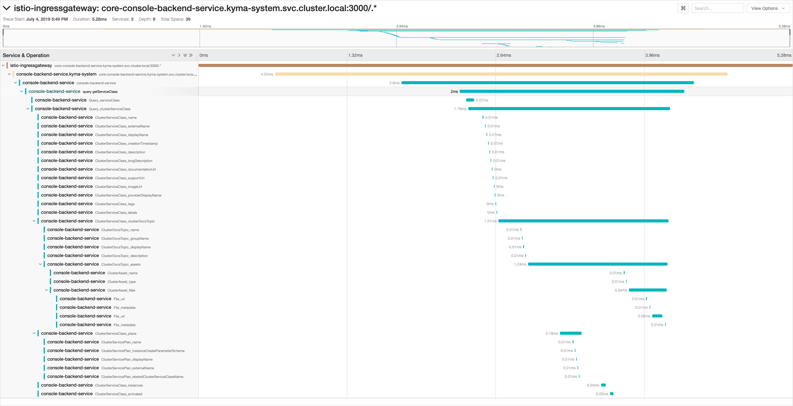

lorem ipsum

<!-- overview -->

The highlights of Kyma 1.3 Jakarta include:
- Align [Kyma eventing with cloud events specification](#event-delivery-aligned-with-cloud-events-specification) -

See the overview of all changes in this release:

- [Application Connector](#application-connector) - Fetching API specification secured with Basic Auth or OAuth, Generating CA root, Additional Headers and query parameters stored in a secured way
- [Console](#console) - Noisy logs hidden, easy Namespace labelling and filtering, API list streamed using web sockets, Hide irrelevant navigation nodes, DevX improvements for the **Lambda** view  
- [Core and Supporting](#core-and-supporting) - Documentation component
- [Service Management](#service-management) - Service Catalog migration from "API Server" to "CRD only"
- [Kyma CLI](#kyma-cli) - Initial Documentation, Improved installation and uninstallation, Kyma certificate
- [Logging](#logging) - Loki update to 0.1.0
- [Documentation](#documentation) - Configuration documents, troubleshooting document type template, upgrade process documentation
- [Eventing](#eventing) - Event delivery aligned with cloud events specification 0.3, Kyma subscription cleanup

> **CAUTION:** Before you upgrade to Kyma 1.3, read the [Migration Guide](https://github.com/kyma-project/kyma/blob/release-1.3/docs/migration-guides/1.2-1.3.md) which describes necessary manual actions required by the Application Connector.

---

## Application Connector

### Fetching API specification secured with Basic Auth or OAuth

Application Connector supports a variety of authentication methods to allow users to register secured APIs. Now you can also provide API specification endpoint that requires authentication. The Application Connector now uses credentials to fetch the API specification. The supported authentication methods for fetching API specifications are Basic Auth and OAuth. Read [this](https://github.com/Maladie/kyma/blob/fetching-specurl-docs/docs/application-connector/08-03-register-manage-services.md) document to learn how to register APIs which expose secured API specifications.   

### Generating CA root

Application Connector serves as a certificate authority that issues client certificates for external systems. Users can provide their own certificates and keys to be used as a CA root. In order to improve security and reduce configuration effort, we automated certificate and key generation process. From now on, both keys and certificates are generated if not specified by the user. Read [this](https://github.com/kyma-project/kyma/blob/master/docs/application-connector/03-07-application-connector-certificates.md) document for more information. To learn how the automated certificate generation affects the upgrade process and how to preserve your certificate and key, read the migration guide.

### Additional headers and query parameters stored in a secured way

Application Connector allows you to enrich each request to the registered API with additional headers and query parameters. Now you can specify a custom list of headers and query parameters that contain sensitive information. The data is stored in a secure manner.

## Console

### Noisy logs hidden

We have significantly reduced the noise you have seen so far when inspecting logs from your lambda. By default, we hide health check logs, logs that originate from previous versions of your lambda function, and Istio side-car logs. Additionally, we added an auto refresh option which automatically pulls new log lines into the UI.

### Easy Namespace labelling and filtering

Now you can manage Namespace labels easily on the Namespace **Details** view in the Console. This will help you better organize your Namespaces using label filter on the Namespace **Overview** page. Whenever you apply label filtering in the main Namespace **Overview**, the state of the filter is preserved so that you can stay focused on the Namespaces you have labelled.

### API list streamed using web sockets

The list of APIs contains up-to-date data without a need of refreshing the page. All changes in the APIs data are streamed live to the **API** view in the Console.  

### Hiding irrelevant navigation nodes  

In case you find some navigation nodes in the Console irrelevant, you can simply ignore them by defining a list of specific navigation nodes or even whole categories that should not show up in the Console UI navigation.

### DevX improvements for the Lambda view

We have fixed some usability issues which lambda developers were struggling with. Now, after saving changes to your lambda function, you are not redirected to lambda list, but stay on the lambda **Details** view instead.

What is more, the issue related to [environment variables prefix](https://github.com/kyma-project/kyma/issues/3937) is fixed, which results in the same experience when you bind services to lambdas from the **Lambda** view and the **Service Instance** view.

### Console Backend observability improved by integration with OpenTracing and Jaeger

To make sure that operations and troubleshooting of the Kyma cluster and its Console is easier, in this release we integrated the GraphQL-based backend service with OpenTracing. We also made sure that Jaeger gets proper data about GraphQL requests in a readable way. Now it is easy to check each request's length, failed parts, and logs.

## Core and Supporting

### Documentation component

In this release, we decided to work on a component for documentation that will bundle Markdown renderer and renderers for specifications such as OpenAPI or AsyncAPI. The goal is to have a single reusable component that can be used in any context in the Kyma Console and the `kyma-project.io` website. We started working on the component in our [kyma-incubator](https://github.com/kyma-incubator/documentation-component) organization on GitHub. The work is not yet completed and we continue working on it for the 1.4 release, but you can already see the preview of this component in action in the **Documentation** view of the Kyma Console. As you can see in the screenshot, with this component we introduce a right navigation bar for Markdown documentation. This new navigation contains not only a list of documents that you can see on the page but also all the headers from the page providing a table-of-content-like navigation powered by scroll-spy that indicates readers location on the website.

 Our next step is to officially release this component and use it in other Kyma Console areas, such as Service Catalog related views where you can see documentation for different services.  

## Service Management

### Service Catalog migration from "API Server" to "CRD only"

Now you can configure Kyma to use the experimental "CRD only" mode of our Service Catalog. Read [this](https://kyma-project.io/docs/components/service-catalog/#details-experimental-features) document to learn how to activate this feature. What is more, the new mode contains the migration tool that migrates data for you. Read [this](https://github.com/kyma-incubator/service-catalog/blob/crds-migration/docs/migration-apiserver-to-crds.md) document to see the migration details.

>**NOTE:** Before you start the migration, make sure that you performed a full backup of your cluster. You should also test the procedure on a testing environment first.

## Kyma CLI

### Initial Documentation

We started with the initial command documentation with dedicated Markdown documents, covering the documentation for the "version" and "install" as first candidates, next one will follow with every release.

### Improved Installation and Uninstallation

We improved the `kyma install` and `kyma uninstall` commands with revised outputs in case of error situations and better timeouts.

### Kyma Certificate

As part of the `kyma install` command, the certificate used by the installed Kyma cluster will be installed to your local certificate truststore, for the Windows, Linux and Mac systems.

## Logging

### Loki update to 0.1.0

Loki is now updated to the first beta version, which promises a much better stability and feature richness.

## Documentation

### Configuration documents

We have successfully finished writing configuration documents for all Kyma components. If you want to check which parameters from `values.yaml` files of each component’s charts and sub-charts you can configure with overrides, check the **Configuration** section under a particular Kyma component.

>**CAUTION:** Override only values for those parameters from `values.yaml` files that are exposed in configuration documents for a given component.  

### Troubleshooting document type template

If you need to add troubleshooting documentation to your component, our content guidelines can help you with that. We have published a template for creating Troubleshooting documents.  [Here](https://github.com/kyma-project/community/blob/master/guidelines/templates/resources/troubleshooting.md) you can find more details regarding the new document type.

### Upgrade process documentation

Upgrading Kyma to a new version is quick and really simple, and release 1.3 comes with documentation to back this claim. Follow the procedure described in the [Upgrade Kyma](https://kyma-project.io/docs/master/root/kyma/#installation-update-kyma) document to quickly migrate to a newer release.

## Eventing

### Event delivery aligned with cloud events specification

Events delivered to a lambda or a serverless now have the context attributes propagated as HTTP headers. Those headers are aligned with [cloud event specification 0.3](https://github.com/cloudevents/spec/blob/master/http-transport-binding.md#31-binary-content-mode). You can use a cloud-sdk in a language of your choice to write the logic of handling event delivery. For example, [here](https://github.com/cloudevents/sdk-go) you can find an SDK for Go.

### Kyma subscription cleanup

Certain properties which were not applicable after Knative migration have been removed.
