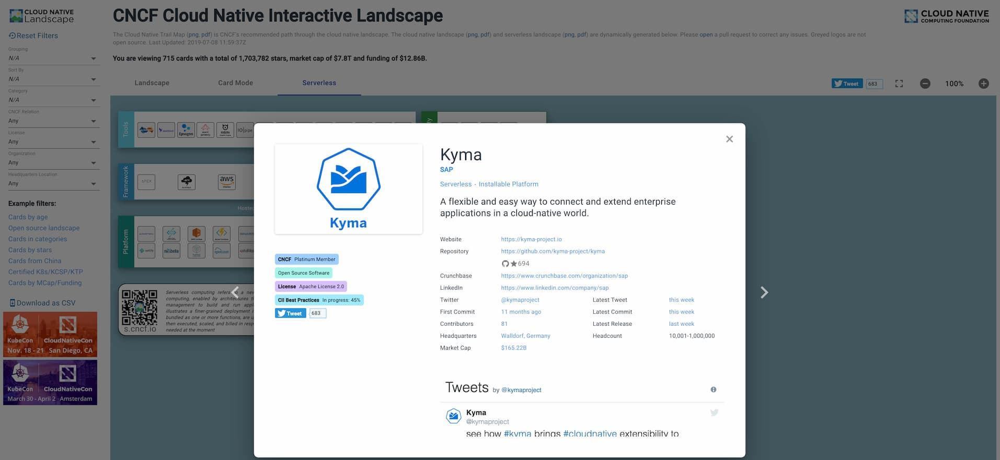
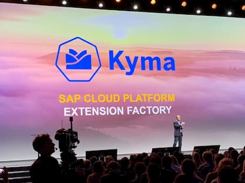
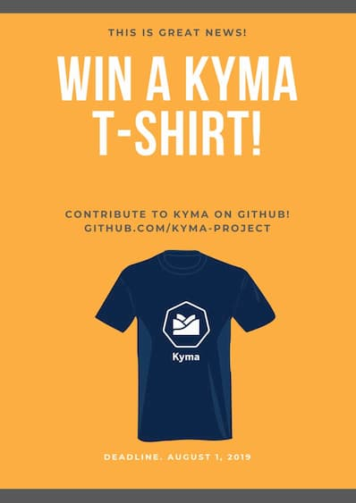

Kyma is already 1 year old and we have a feeling it has only recently been open-sourced. Let me take you on a journey to the past to bring back the most interesting moments. Once we look back, let us see what the future brings.

<!-- overview -->

- [We have had quite an interesting year](#we-have-had-quite-an-interesting-year)
  * [24.07.2018 Open source - day one](#24-07-2018-open-source---day-one)
  * [26.07.2018 Kyma together with Knative launched at Google Cloud Next](#26-07-2018-kyma-together-with-knative-launched-at-google-cloud-next)
  * [13.08.2018 Kyma made it to the CNCF Landscape](#13-08-2018-kyma-made-it-to-the-cncf-landscape)
  * [12.09.2018 First Core Special Interest Group meeting](#12-09-2018-first-core-special-interest-group-meeting)
  * [10.10.2018 Kyma announced to SAP customers and partners](#10-10-2018-kyma-announced-to-sap-customers-and-partners)
  * [10-13.12.2018 Kyma at KubeCon Seattle](#10-13-12-2018-kyma-at-kubecon-seattle)
  * [19.02.2019 First Kyma early adopters](#19-02-2019-first-kyma-early-adopters)
  * [25.04.2019 1.0 release](#25-04-2019-1-0-release)
  * [02.05.2019 Netconomy went to production](#02-05-2019-netconomy-went-to-production)
  * [07.05.2019 Kyma released with SAP C/4HANA Foundation to the production environment](#07-05-2019-kyma-released-with-sap-c-4hana-foundation-to-the-production-environment)
  * [21-23.05.2019 Kyma at KubeCon Barcelona](#21-23-05-2019-kyma-at-kubecon-barcelona)
  * [23.05.2019 We announced Kyma 1.0 on the Kubernetes blog](#23-05-2019-we-announced-kyma-1-0-on-the-kubernetes-blog)
  * [18.06.2019 Kyma devs became Kubernetes contributors and Service Catalog approvers](#18-06-2019-kyma-devs-became-kubernetes-contributors-and-service-catalog-approvers)
  * [02.07.2019 Kyma dev became a chair of the Service Catalog SIG](#02-07-2019-kyma-dev-became-a-chair-of-the-service-catalog-sig)
  * [03.07.2019 Setup of Knative dedicated team](#03-07-2019-setup-of-knative-dedicated-team)
- [We are making another big step](#we-are-making-another-big-step)
- [We make friends](#we-make-friends)
- [We contribute back](#we-contribute-back)
- [We want you to contribute - birthday gifts](#we-want-you-to-contribute---birthday-gifts)
- [Join us](#join-us)

# We have had quite an interesting year

## 24.07.2018 Open source - day one

We know what we did last summer and we are very proud of it. We opened our repositories to the outside world and published the first version of our website. We introduced our project in a [blog post](https://kyma-project.io/blog/2018/7/24/introduction-project-kyma) and took first steps on [Twitter](https://twitter.com/kymaproject), growing to over 700 followers.

<iframe border=0 frameborder=0 height=520 width=550 align="middle"
 src="https://twitframe.com/show?url=https://twitter.com/kymaproject/status/1021830148948193280"></iframe>

## 26.07.2018 Kyma together with Knative launched at Google Cloud Next

Open source was a new land for us. When you make a step into the world of unknowns, better make it with a friend. Luckily, we were not the only ones that were at the beginning of the journey. We made an official launch at the Google Cloud Next event to be there together with the [Knative](https://github.com/knative) project.

## 13.08.2018 Kyma made it to the CNCF Landscape

<iframe border=0 frameborder=0 height=430 width=550
 src="https://twitframe.com/show?url=https://twitter.com/kymaproject/status/1029029616684552192"></iframe>

Our [`kyma`](https://github.com/kyma-project/kyma/) repository quickly reached 500 stars on GitHub. We also showed up on the [CNCF Landscape](https://github.com/cncf/landscape).

We are definitely not planning to stop at 500 stars. This number was growing pretty slowly at first, but it has been increasing steadily since the 1.0 release. Remember that you can also star our project if you like it.

<iframe src="https://ghbtns.com/github-btn.html?user=kyma-project&repo=kyma&type=star&count=true&size=large" frameborder="0" scrolling="0" width="158px" height="30px"></iframe>

## 12.09.2018 First Core Special Interest Group meeting

After creating an open governance model, we hosted our first public Core Special Interest Group meeting. It was hosted by our stars, [Piotr Kopczynski](https://twitter.com/PiotrasPk) and [Mateusz Szostok](https://twitter.com/m_szostok).

`youtube: https://youtu.be/1DD5aCBnywQ`

So far, we have had 17 meetings and we are definitely not planning to stop organizing them. We meet regularly and you are welcome to join. Check more details at the [Core SIG landing page](https://github.com/kyma-project/community/tree/master/collaboration/sig-core), join our next meeting, and let us know what you think about Kyma.

## 10.10.2018 Kyma announced to SAP customers and partners

Kyma was announced to SAP customers and partners as the future of extensibility at the SAP CX Live event in Barcelona. [Alex Atzberger](https://twitter.com/aatzberger), president of SAP Customer Experience (SAP CX), talked about the important role Kyma plays for SAP.

[Moritz Zimmermann](https://twitter.com/moritzzimmerman), CTO of SAP CX, mentioned how Kyma shows SAP's commitment to openness.

<iframe border=0 frameborder=0 height=585 width=550
 src="https://twitframe.com/show?url=https://twitter.com/moritzzimmerman/status/1050427826221051905"></iframe>

## 10-13.12.2018 Kyma at KubeCon Seattle

Thanks to SAP sponsorship, we made it to KubeCon Seattle. Together with our brothers from the [Gardener](https://gardener.cloud) project, we could have a lot of valuable conversations at the SAP Open Source booth. We were represented by [Ahmed](https://twitter.com/Abd4llA), [Lukasz](https://twitter.com/derberq), and [Piotr](https://twitter.com/PiotrasPk).

We even made it to one of the presentations and were mentioned by friends from other departments.

## 19.02.2019 First Kyma early adopters

The new year brought an important update to our [`http://kyma-project.io`](https://kyma-project.io/) landing page. We created a section where we could show off the early adopters of our project:

## 25.04.2019 1.0 release

You can't even imagine how important this date was for us. We reached or first huge milestone and made it clear that Kyma is ready to be used on the production environment. So, what are you waiting for?

<iframe border=0 frameborder=0 height=720 width=550
 src="https://twitframe.com/show?url=https://twitter.com/kymaproject/status/1121426458243678209"></iframe>

## 02.05.2019 Netconomy went to production

We did not wait too long and a few days after the 1.0 release we got confirmation of the first production environment user. Our early adopter, [Netconomy](https://www.netconomy.net/), provided features to one of its clients and operates Kyma on its own. Netconomy will soon publish a guest blog post on the Kyma website describing their use cases.

## 07.05.2019 Kyma released with SAP C/4HANA Foundation to the production environment

SAP, another early adopter that started using the Kyma project, made a big announcement of the production-ready offering for all SAP CX customers. The product is called SAP C/4HANA Foundation and you can read more about it in the [blog post](https://www.linkedin.com/pulse/introducing-sap-c4hana-foundation-thomas-hertz/) by [Thomas Hertz](https://twitter.com/primtom), Head of Technology at SAP CX.

<iframe border=0 frameborder=0 height=800 width=550
 src="https://twitframe.com/show?url=https://twitter.com/Abd4llA/status/1125857596789993473"></iframe>

## 21-23.05.2019 Kyma at KubeCon Barcelona

<iframe border=0 frameborder=0 height=550 width=550
 src="https://twitframe.com/show?url=https://twitter.com/derberq/status/1130832598954061824"></iframe>

Yet another KubeCon event and we were there again. Thanks to the SAP support, we shared a booth with Gardener. This time the interest was much higher. Luckily, there were enough Kymians at the booth to answer all the questions asked.

 <iframe border=0 frameborder=0 height=500 width=550
 src="https://twitframe.com/show?url=https://twitter.com/m_szostok/status/1131130333242568705"></iframe>

## 23.05.2019 We announced Kyma 1.0 on the Kubernetes blog

We wanted to make it clear to Kubernetes and CNCF communities that Kyma is out there with the 1.0 release that is ready for use on the production environment. We published an article on the [Kubernetes blog](https://kubernetes.io/blog/2019/05/23/kyma-extend-and-build-on-kubernetes-with-ease/) and it brought a lot of additional attention to our Kyma communication channels, website, and Twitter. We noticed we were becoming more recognizable. Some popular authors, such as [Infoq](https://www.infoq.com/news/2019/06/kyma-enterprise-kubernetes/), started to write about Kyma.

## 18.06.2019 Kyma devs became Kubernetes contributors and Service Catalog approvers

Kyma core developers, [Mateusz Szostok](https://github.com/mszostok) and [Piotr Miskiewicz](https://github.com/piotrmiskiewicz), became official Kubernetes organization members and the approvers of changes in the Kubernetes Service Catalog. This way, we confirmed we do not only integrate and consume, but also contribute back. Currently, 2 out of 4 approvers of the Service Catalog come from the Kyma project - how cool is that?

## 02.07.2019 Kyma dev became a chair of the Service Catalog SIG

Kubernetes Service Catalog is one of our main dependencies. Kyma firmly states that [Service Catalog](https://github.com/kubernetes-sigs/service-catalog) and [Open Service Broker API](https://www.openservicebrokerapi.org/) are the only Service Management solutions for Kubernetes that bring the best developer experience. It is obvious that we are not only interested in contributing code, but we also want to help to run the project. As a result, [Mateusz Szostok](https://github.com/mszostok) became a chair of the [Kubernetes Service Catalog SIG](https://github.com/kubernetes/community/tree/master/sig-service-catalog).

## 03.07.2019 Setup of Knative dedicated team

Last year, we open-sourced with our brother in arms, the [Knative](https://github.com/knative) project. Now, once we are stable and production-ready, let us make this brotherhood much more dedicated. We reorganized our setup a bit and created a team that will be dedicated to Knative contributions. We are planning to rebase Kyma on top of these contributions to improve our Event Bus and remove the dependency to Kubeless.

# We are making another big step

We just keep walking, not planning to stop. Since day one, we have known that [CNCF Landscape](https://github.com/cncf/landscape) is not everything we want to achieve in CNCF. Our obvious next goal is [CNCF Sandbox](https://www.cncf.io/sandbox-projects/). This is not just our decision, though. The [CNCF Technical Oversight Committee (TOC)](https://github.com/cncf/toc) must sponsor the project's donation and this is our focus for the upcoming months. We need to identify what we must prepare on our side to become a part of CNCF. We also look forward to CNCF's feedback about Kyma.

# We make friends

We understand how important it is to make friends in the open-source community. Leaving in isolation brings loneliness and we definitely do not want that for our project. Fortunately, we have a lot of visitors to our main [Slack  channel](http://slack.kyma-project.io). Apart from making friends among users, we also want to make friends among the projects we depend on, especially those that play or will play an important role in Kyma.

A few of us regularly help the following communities:
- [Ahmed Abdalla](https://twitter.com/Abd4llA) in [Knative](https://github.com/knative)
- [Lukasz Gornicki](https://twitter.com/derberq) in [AsyncAPI](https://www.asyncapi.org/)
- [Piotr Kopczynski](https://twitter.com/PiotrasPk) and [Mateusz Szostok](https://twitter.com/m_szostok) in [Kubernetes Service Catalog](https://github.com/kubernetes-sigs/service-catalog)
- [Piotr Mscichowski](https://github.com/piotrmsc) in [Ory](https://github.com/ory), [Hydra](https://github.com/ory/hydra), and [Oathkeeper](https://github.com/ory/oathkeeper) projects.

# We contribute back

If you depend on someone and you need more than you can get, don't wait until you get it, but help out and contribute instead! This is a list of projects where we made noticeable contributions that we are very proud of:

- [AsyncAPI](https://github.com/asyncapi/asyncapi-react):	The entire component contribution and consultations regarding best practices for building an open-source community.
- [Knative](https://github.com/knative/eventing):	Features around NATS
- [Kubernetes Service Catalog](https://github.com/kubernetes-sigs/service-catalog):	Missing features and improvements; official approvers and chairs
- [Open Service Broker Azure](https://github.com/Azure/open-service-broker-azure):	Missing features and improvements
- [React JSON Schema](https://github.com/mozilla-services/react-jsonschema-form):	Missing features and improvements
- [Istio](https://github.com/istio/istio):	Missing features
- [Kubeless](https://github.com/kubeless/kubeless):	Minor improvements

That was a hell of a year, and we can't wait to see what the upcoming year holds for us!

# We want you to contribute - birthday gifts

Birthdays are always connected with presents. This time we plan to give away some Kyma T-shirts, not for free though. You get those only if you become an external contributor in the next 7 days. Our understanding of an external contributor is that you are not a member of the Kyma organization on GitHub, and in the next 7 days you:
- Contribute code or documentation to one of Kyma repositories. It must be a pull request but not necessarily merged. We can imagine that depending on the size of the contribution it might not be that easy to approve and merge your PR.
- Contribute an issue using one of our templates. We equally value a well-described bug that is easy to replicate and an enhancement request with a well-described use case.

All Kyma repositories are located [here](https://github.com/kyma-project/kyma/).
Once you contribute, let us know about it on [Twitter](https://twitter.com/kymaproject) or on the **#general** channel on [Slack](http://slack.kyma-project.io). We will evaluate all contributions on Thursday, August 1, and announce all accepted contributions and happy winners. Happy contributing!

If you don't know what to contribute, I'm sure we can help - just contact us through one of the above communication channels and we will point you in the right direction.

# Join us

If you did not have a chance to contribute to our history, you can still join us and become a part of Kyma's future. We have many channels that you can use to interact with us:

- Twitter: https://twitter.com/kymaproject
- Core SIG public meetings: https://docs.google.com/document/d/1vWleTon7sJIk0teee4SoVezS4mR3K8TlkvXkgLJwRD8/
- Slack: http://slack.kyma-project.io
- GitHub issues: https://github.com/kyma-project/kyma/issues
- LinkedIn: https://www.linkedin.com/company/kyma-project
- Stackoverflow: https://stackoverflow.com/questions/tagged/kyma
- YouTube: https://www.youtube.com/channel/UC8Q8bBtYe9gQN-dQ-_L8JvQ

Use one of these communication channels to let us know what you think about Kyma and how you can start your contribution to the project.
