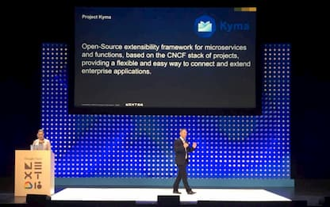
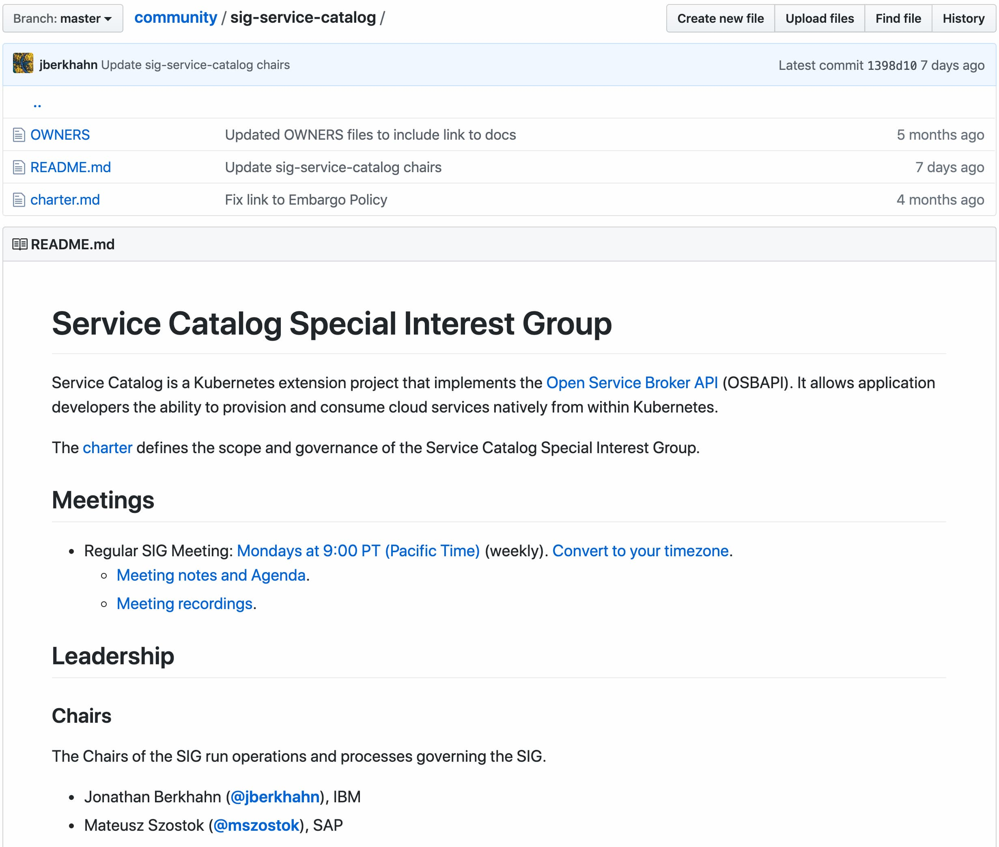

Kyma is already 1 year old and I have a feeling it was open sourced just recently. Let me take you for a journey in the past, let us do some flashbacks in to given time in the past to the most interesting moments. Once we know how it was in the past, let's see what future brings.

<!-- overview -->

- [Timeline of the most important events](#timeline-of-the-most-important-events)
  * [24.07.2018 Open source with Knative](#24072018-open-source-with-knative)
  * [26.07.2018 Kyma together with Knative launched at Google Next](#26072018-kyma-together-with-knative-launched-at-google-next)
  * [13.08.2018 Kyma made it to the CNCF landscape with 500 GitHub stars](#13082018-kyma-made-it-to-the-cncf-landscape-with-500-github-stars)
  * [12.09.2018 After modeling an open governance model we hosted our first public Core Special Interest Group meeting](#12092018-after-modeling-an-open-governance-model-we-hosted-our-first-public-core-special-interest-group-meeting)
  * [10.10.2018 Kyma announced to SAP customers and partners as a future of extensibility at SAP CX Live event in Barcelona](#10102018-kyma-announced-to-sap-customers-and-partners-as-a-future-of-extensibility-at-sap-cx-live-event-in-barcelona)
  * [10-13.12.2018 Kyma at KubeCon Seattle booth with brother Gardener project](#10-13122018-kyma-at-kubecon-seattle-booth-with-brother-gardener-project)
  * [19.02.2019 First Kyma early adopters officially published](#19022019-first-kyma-early-adopters-officially-published)
  * [25.04.2019 1.0 Gliwice release](#25042019-10-gliwice-release)
  * [02.05.2019 Netconomy went to production with solutions for one of their customers](#02052019-netconomy-went-to-production-with-solutions-for-one-of-their-customers)
  * [07.05.2019 Kyma released with SAP C4Core Foundation as a production ready offering](#07052019-kyma-released-with-sap-c4core-foundation-as-a-production-ready-offering)
  * [21-23.05.2019 Kyma at KubeCon Barcelona booth with brother Gardener project](#21-23052019-kyma-at-kubecon-barcelona-booth-with-brother-gardener-project)
  * [23.05.2019 We announced Kyma 1.0 release on Kubernetes blog](#23052019-we-announced-kyma-10-release-on-kubernetes-blog)
  * [18.06.2019 Mateusz and Piotr become Kubernetes contributors and Service Catalog approvers](#18062019-mateusz-and-piotr-become-kubernetes-contributors-and-service-catalog-approvers)
  * [03.07.2019 Setup of Knative dedicated team](#03072019-setup-of-knative-dedicated-team)
  * [14.07.2019 Mateusz becomes a Service Catalog chair - soon](#14072019-mateusz-becomes-a-service-catalog-chair---soon)
- [Next steps](#next-steps)
- [Making friends](#making-friends)
- [We give back](#we-give-back)

# We had quite an interesting year

## 24.07.2018 Open source day one

We know what we did last summer, and we are very proud of it. We opened our repositories to outside world and published alse a first version of our website. As much as we could we made a first introduction https://kyma-project.io/blog/2018/7/24/introduction-project-kyma/ and started our first steps on [Twitter](https://twitter.com/kymaproject) that we organicly grew up to over 700 (seven hundred) followers at the moment.

## 26.07.2018 Kyma together with Knative launched at Google Next 

Open source was a new land for us. When you make a step into the world of unknowns, better make it with a friend. Luckily we were not the only ones that was at the beginning of the journey. We made an official launch on Google Next event to be there together with [Knative](https://github.com/knative) project.

## 13.08.2018 Kyma made it to the CNCF Landscape

We quickly reached 500 stars on GitHub on our [Kyma](https://github.com/kyma-project/kyma/) repository and showed up on [CNCF Landscape](https://github.com/cncf/landscape)

We are definitely not planning to stop with 500 stars. Since last year the number was growing pretty slow, but since 1.0 release it is increasing regularly. Even you can give us a star.

<iframe src="https://ghbtns.com/github-btn.html?user=kyma-project&repo=kyma&type=star&count=true&size=large" frameborder="0" scrolling="0" width="158px" height="30px"></iframe>

## 12.09.2018 First Core Special Interest Group meeting

After modeling an open governance model we hosted our first public Core Special Interest Group meeting. It was hosted by our stars, [Piotr Kopczynski](https://twitter.com/PiotrasPk) and [Mateusz Szostok](https://twitter.com/m_szostok). 

`youtube: https://youtu.be/1DD5aCBnywQ`

So far we had 17 meetings and we are definitely not planning to stop doing them. We meet regurarly and you are welcome to join. Check more details at [Core SIG landing page](https://github.com/kyma-project/community/tree/master/sig-and-wg/sig-core) and join our next meeting and let us know what you think about Kyma.

## 10.10.2018 Kyma announced to SAP customers and partners

Kyma announced to SAP customers and partners as a future of extensibility at SAP CX Live event in Barcelona. President of SAP CX, [Alex Atzberger](https://twitter.com/aatzberger) talked about how important role plays Kyma for SAP.

CTO of SAP CX, [Moritz Zimmermann](https://twitter.com/moritzzimmerman) mentioned how Kyma shows SAP's commitment to openness. 

## 10-13.12.2018 Kyma at KubeCon Seattle

Thanks to SAP sponsorship we made it to KubeCon Seattle and together with our brothers from [Gardener](https://gardener.cloud) project we could have a lot of valuable conversations at SAP Open Source booth. We were represented by [Ahmed](https://twitter.com/Abd4llA), [Lukasz](https://twitter.com/derberq) and [Piotr](https://twitter.com/PiotrasPk).

We even made it to one of the presentations and were called out by friends from other departments.

## 19.02.2019 First Kyma early adopters

New year brough important update to our http://kyma-project.io landing page. We created a section where we could show off we already have early adopters of the project:

## 25.04.2019 1.0 release

You can't even imagine how important this date was for us. We reached or first huge milestone and made it clear that Kyma is ready to be used for production, so what are you waiting for?

## 02.05.2019 Netconomy went to production

We did not wait to long and few days after release 1.0 we got confirmation of first productive user. Our early adopter, Netconomy provided features for one of their clients, operating Kyma on their own. Read more about their experience in TODO: link to Netconomy blog post about use cases on Kyma.

## 07.05.2019 Kyma released with SAP C/4HANA Foundation to production

Another early adopter, SAP, that started Kyma project made a big announcement of production ready offering for all SAP CX customers. The product is called SAP C/4HANA Foundation and you can read more about it in [blog post](https://www.linkedin.com/pulse/introducing-sap-c4hana-foundation-thomas-hertz/) by [Thomas Hertz](https://twitter.com/primtom), Head of Technology at SAP CX.

## 21-23.05.2019 Kyma at KubeCon Barcelona

Yet another KubeCon event and we are here again. Again thanks to SAP support we share a booth with Gardener. This time the interest is much higher but luckily the number of Kymians is much higher.

## 23.05.2019 We announced Kyma 1.0 on Kubernetes blog

We wanted to make it clear to Kubernetes and CNCF community that Kyma is out there, with 1.0 release and is ready for production. We authored an article on [Kubernetes blog](https://kubernetes.io/blog/2019/05/23/kyma-extend-and-build-on-kubernetes-with-ease/) and it brought a lot of additional trafic to Kyma channels like the website or twitter. We noticed we were noticed and even some other authors mentioned Kyma like [Infoq](https://www.infoq.com/news/2019/06/kyma-enterprise-kubernetes/)

## 18.06.2019 Kyma devs become Kubernetes contributors and Service Catalog approvers

Kyma core developers, [Mateusz Szostok](https://github.com/mszostok) and [Piotr Miskiewicz](https://github.com/piotrmiskiewicz) are now official Kubernetes organization members and the approvers of changes in the Kubernetes Service Catalog. We confirm we do not only integrate and consume, but also contribute back. Now 2 out of 4 approvers of Service Catalog are from Kyma project, how cool is that?

## 02.07.2019 Kyma devs become a chair of the Service Catalog SIG

Kubernetes Service Catalog is one of our main dependencies. Kyma is opinionated and declares [Service Catalog](https://github.com/kubernetes-sigs/service-catalog) and [Open Service Broker API](https://www.openservicebrokerapi.org/) as the only Service Management solution for Kubernetes that brings best developer experience. This is obvious that we are not only interested with contributing the code. We want to help to run the project and as a result [Mateusz Szostok](https://github.com/mszostok) becomes chair of the [Kubernetes Service Catalog SIG](https://github.com/kubernetes/community/tree/master/sig-service-catalog).

## 03.07.2019 Setup of Knative dedicated team

Last year we went to open source with our brother in arms, [Knative](https://github.com/knative) project. Now, once we are stable and production ready, let us make this brotherhood much more dedicated. We reorganized a bit and created a team that will be dedicated to Knative contributions and then rebase Kyma on top of these contributions to improve our Event Bus and remove dependency to Kubeless.

# We make another big step

TODO

# We made friends

We understand how important it is to make friends in open source. Leaving in isolation brings loneliness and we definitelly do not want that. Of course don't get me wrong, we are not feeling lonely as we clearly see that we have a lot of visitors of our http://slack.kyma-project.io. We make friends among users, but we also want to make friends among the projects we depend on and we see there play or will play an important role in Kyma. 

We have few of us regularly helping the following communities:
- [Ahmed Abdalla](https://twitter.com/Abd4llA) in [Knative](https://github.com/knative) 
- [Lukasz Gornicki](https://twitter.com/derberq) in [AsyncAPI](https://www.asyncapi.org/)
- [Piotr Kopczynski](https://twitter.com/PiotrasPk) and [Mateusz Szostok](https://twitter.com/m_szostok) in [Kubernetes Service Catalog](https://github.com/kubernetes-sigs/service-catalog)
- [Piotr Mscichowski](https://github.com/piotrmsc) in [Ory](https://github.com/ory) and project Hydra and Authkeeper.

# We contribute back

If you depend on someone and you need more that you can get, don't wait until you get it, help out and contribute! This is a list of projects were we made noticable contributions and we are very proud of it:

- [AsyncAPI](https://github.com/asyncapi/asyncapi-react):	Entire component donation and consulting about building community,
- [Knative](https://github.com/knative/eventing):	Features around NATS,
- [Kubernetes Service Catalog](https://github.com/kubernetes-sigs/service-catalog):	Missing features and improvements. Official approvers and chairs,
- [Open Service Broker Azure](https://github.com/Azure/open-service-broker-azure):	Missing features and improvements,
- [React JSON Schema](https://github.com/mozilla-services/react-jsonschema-form):	Missing features and improvements,
- [Istio](https://github.com/istio/istio):	Missing features,
- [Kubeless](https://github.com/kubeless/kubeless):	Minor improvements

That was a hell of a year, and I can't wait to see what year 2 brings, please get me some popcorn.