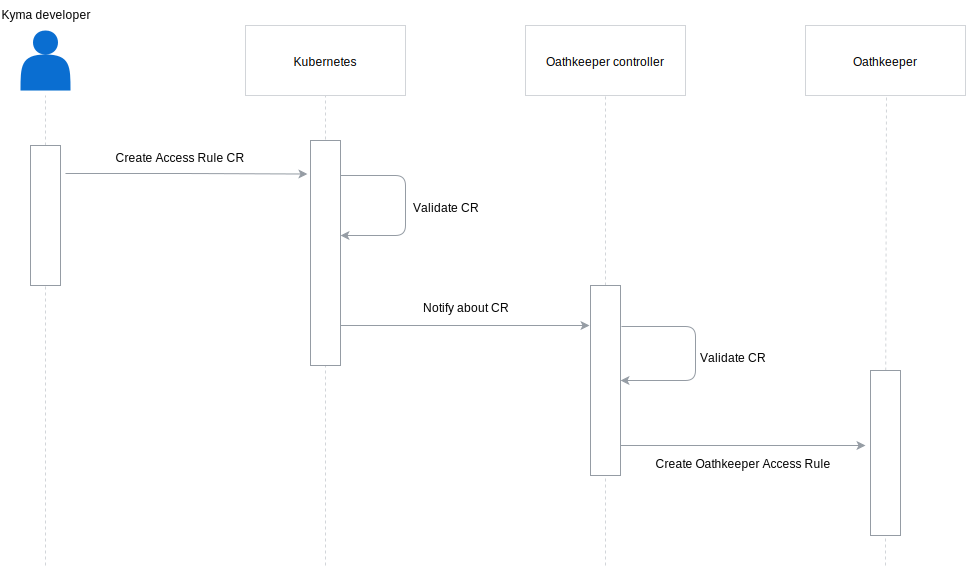

Working with others is always a great opportunity to learn and grow, so we simply couldn't say "no" to working with the team at [Ory](https://www.ory.sh/) when such opportunity arose. Making Kyma even more secure, gaining new experience, working with awesome people, and contributing to another project at the same time? Read on to find out how we're joining forces with Ory to bring an OAuth server to Kyma and contribute a completely new component to the lair of Hydra and its Oathkeeper. 

<!-- overview -->

The Kyma API Gateway enables exposing applications to the world outside of the cluster, at the same time allowing to secure access to the exposed application with JWT authentication. The implemented authentication mechanism allows to secure entire services or only selected resource paths within those services. You can read all about this in our [documentation](https://kyma-project.io/docs/components/api-gateway/). 

Enhancing security with authorization mechanisms has always been a part of the API Gateway vision in Kyma. Currently, basic authorization needs are fulfilled thanks to Istio and its implementation of [RBAC](https://istio.io/docs/reference/config/security/istio.rbac.v1alpha1/) which allows controlling access to services in the cluster. Although you can apply authorization to the requests that the exposed services receive, there's no way to authorize the requested operation based on, for example, scopes. 
This is a pretty significant gap in our security scheme, especially when you consider communication between 3rd party applications and the applications living in Kyma and exposed through the API Gateway. 

One of the authorization strategies we are going to implement is through an OAuth2 server. Among many ready-to-use solutions available on the market, the one created by [Ory](https://ory.sh) caught our attention specifically. This solution comes with a full-fledged resource access authorization ecosystem, including an OAuth2 server and an OAuth reverse proxy. Additionally, this solution is a very popular, respected project with a high adoption rate and many stargazers on GitHub.

To investigate how the adoption of the Ory ecosystem would work with and potentially extend the Kyma API Gateway, we worked on a POC that used the Ory OAuth2 server - Hydra and the reverse proxy - Oathkeeper and focused on two OAuth flows: implicit grant and client credentials. The results were satisfactory and are documented in the form of examples available to inspect [here](https://github.com/kyma-incubator/examples/tree/master/ory-hydra/scenarios).

Based on the positive results of the POC, we decided to focus our efforts on integrating Kyma with the Ory ecosystem. To facilitate this integration, we sat down with the developers from Ory during a workshop that helped to work out a plan of how to integrate our solutions and how the Kyma team will contribute to Ory's solution. 

So how's the solution of Ory going to be used in Kyma? In the target setup, Kyma deployments will come with 3 Ory components: the Hydra OAuth2 server, the Oathkeeper reverse proxy that secures the exposed service, and the Oathkeeper Controller, which manages access rules for Oathkeeper. Kyma users will register their own OAuth clients in the Console UI and define access rules for their APIs. Thanks to that, every application will be able to get its own OAuth token and communicate with the exposed API. 

The role of the Kyma team in this setup is very clear - we are to create the Oathkeeper controller component and contribute it to Ory's ecosystem. 
At the moment, the Oathkeeper is not designed to be used natively in Kubernetes as the configuration can be provided to this component only through an external server that provides the config, or directly through a file. Feeding the configuration to Oathkeeper in Kubernetes-native way using [Custom Resource Definitions (CRDs)](https://kubernetes.io/docs/concepts/extend-kubernetes/api-extension/custom-resources/#customresourcedefinitions) is not supported. The Oathkeeper Controller is going to address this gap. Kubernetes users will be able to create custom resources that represent access rules for their services. The Controller will then pass this data to Oathkeeper in a format which it can work with without any additional modification.

This collaboration is going to bring great value to Kyma and Ory (Kyma supports OAuth2, Ory supports Kubernetes CRDs), and we're extremely excited that we're sailing the seas with the guys from Ory. Be sure to check out their solutions and follow our blog and releases to see how this adventure ends. 
