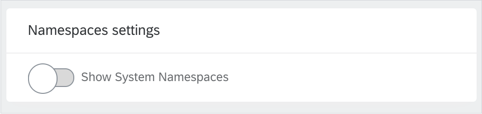
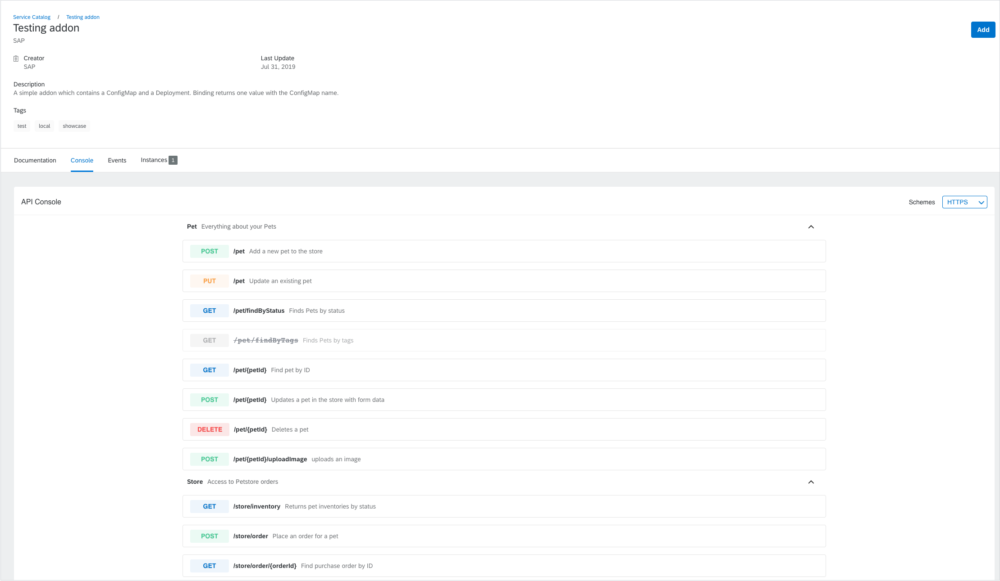
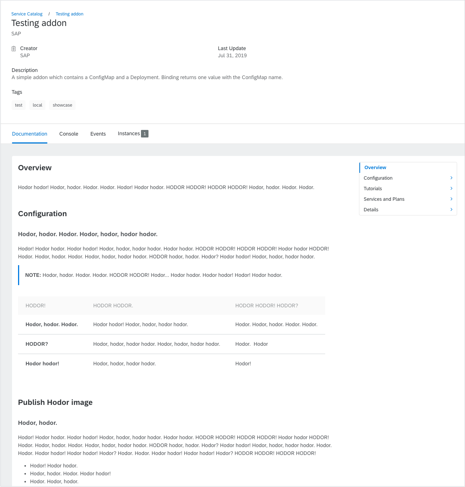
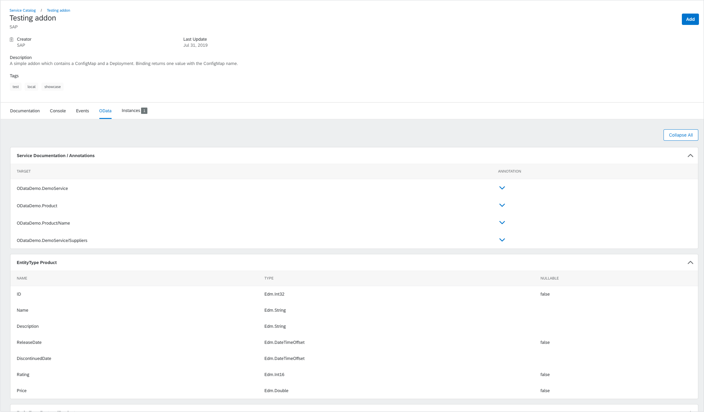

Straight from Indonesian Jakarta, we sail to Japan. Let's stop in one of its beautiful temples and ponder over what the 1.4 Kyoto Release has to offer. Being hard-working as the Japanese, Kyma busy bees introduced many improvements in their components, including the Application Connector, Console, Kiali, or Headless CMS. Read on to find out what has changed in Kyma since 1.3.

<!-- overview -->

The highlights of Kyma 1.4 Kyoto include:

- [API Gateway with an OAuth2 server](#api-gateway) - We integrated Kyma with an OAuth2 authorization server solution from ORY.
- [Application Connector](#application-connector) - We upgraded Istio to 1.2.2 version.
- [Console UI without system Namespaces](#system-namespaces-hidden-in-the-console-UI) - We hid all system Namespaces built in a Kyma cluster so that you could find your namespaces quicker.
- [Documentation component](#documentation-component) - We consolidated different documentation views into one Documentation component.
- [Conversion and validation in the Headless CMS](#conversion-and-validation-service-for-asyncapi-20-specs-in-the-headless-cms) - We introduced a conversion and validation service for the AsyncAPI 2.0 specifications.
- [Kiali](#kiali) - We upgraded Kiali to the latest stable version and enabled Single Sign-On.
- [Bundles renamed to addons](#bundles-renamed-to-addons) - We renamed bundles to addons.

See the overview of all changes in this release:

- [Backup](#backup) - Simplified Valero installation, a new implementation of the backup and restore functionalities, backup available on Azur, and backup tests fixed
- [Core and Supporting](#parameters-object-in-the-headless-cms-supported-in-the-console-ui) - Relative links disabled in Markdown specs
- [JSON schema](#json-schema) - Guidelines for creating JSON schemas for Kyma components
- [Knative](#knative) - Knative Eventing and Serving update
- [Kyma CLI](#kyma-cli) - Kyma CLI enriched with `test` command and inline documentation
- [Service Management](#service-management) - New GCP Service Broker addon and Helm Broker support for addons exposed by Git

Read about known issues for [Valero](#known-issues).

> **CAUTION:** Before you upgrade to Kyma 1.4, read the [Migration Guide](https://github.com/kyma-project/kyma/blob/release-1.4/docs/migration-guides/1.3-1.4.md) which describes necessary manual actions required by the Service Management.

---

## API Gateway

Making friends in the open-source world is natural. In the 1.4 release collaboration with our friend, ORY, bore fruit and Kyma got its very own OAuth2 server. Our new component consists of three elements from ORY: Hydra OAuth2 server, Oathkeeper proxy, and Oathkeeper Maester controller. By default, the solution is now installed by with every Kyma deployment. We worked closely with ORY developers  to make their solution Kubernetes-native, and we achieved that by creating the Maester controller and contributing it to the ORY stack. This controller allows for convenient management of Access Rules through custom resources. Check out and test the Kyma-ORY integration and follow its development closely as we're still in the development phase. Read [this](https://kyma-project.io/blog/2019/7/31/kyma-collaboration-with-ory/) blog post to see where we're heading. Also, read the [Security documentation](https://kyma-project.io/docs/components/security/#details-oauth2-and-openid-connect-server) to get more details on the current state of the integration.

## Application Connector

### Application Registry updated to Istio 1.2.2  

As you already know, the Application Connector uses Istio to ensure a high level of security. From now on, the Application Registry benefits from features introduced in Istio 1.2 to control access to the Application Gateway.

## Backup

### Valero upgraded to 1.0.0

The backup component, Velero, is now upgraded to its latest stable version 1.0.0.

### Installation and setup

We improved and simplified the installation and set-up process for Velero. Read the [documentation](https://kyma-project.io/docs/master/components/backup/#installation-install-velero) and see how easy it is now to set up Valero either before or after installing Kyma.

### Creating backups

We implemented the backup functionality from scratch to guarantee that all resources in a cluster are properly backed-up. The documentation was updated to reflect the changes we made.

### Restoring from a backup

Also, we have a brand-new restore funcionality. It guarantees that a backed-up cluster can be fully recovered. The documentation was updated to reflect the changes we made.

### Backup tests

All backup and restore integration tests are fixed and pass.

### Backups on Azure

The backup functionality was successfully introduced on Azure (AKS). Follow the steps from the [installation](https://kyma-project.io/docs/master/components/backup/#installation-install-velero) guide to set-up Valero on Azure.

### Plugins

We deleted all Velero plugins as they are not needed anymore.

### Known Issues

Valero returns an error during restoring CRDs. The temporary workaround is to divide the restore process in 2 steps.

1. Restore only CRDs.
2. Restore the remaining part of the cluster.

It may also happen that the restore process fails to complete. It is caused by a bug in Velero. In such case, retry to restore your cluster.

## Console

### System Namespaces hidden in the Console UI

So far, once you entered a Kubernetes cluster probably you could see quite a bunch of Namespaces. These were built-in Namespaces and also those that came with modules you installed. None of those were the ones a Kyma user wanted to work with. To have a better user experience, by default, the system Namespaces are now hidden. As a result, you can easily find the Namespaces that you work with. To see the system Namespaces, go to the **General Settings** view and under the **Namespace settings** toggle the **Show System Namespaces** option.



## Core and Supporting

### Documentation component

The Kyma project puts great effort into documentation and processes around it. It is not only about [kyma-project.io](https://kyma-project.io/docs). As you know, you can also access Kyma documentation from the Console UI. And in Kyma we offer features that you can use to document your own services. For us, documentation does not only mean static docs provided with Markdown specs but also others such as OpenAPI, AsyncAPI, and OData.

It basically means that at the moment we have 4 different views, and more to come, that render documentation. We decided that it was about time to consolidate our experience in this area into one component.  

- Documentation component project

As mentioned in the [previews release notes](https://kyma-project.io/blog/2019/7/12/release-notes-13/#documentation-component) we have one single project in which we maintain the Documentation component and just reuse it in different applications. We already introduced it in the Console UI Documentation view in the last release. In the 1.4 release, it was integrated into the Console UI Catalog and Instances views. In a few days, you will see the component being used on [kyma-project.io](https://kyma-project.io/).

- Improved look and feel

While working on the Documentation component we took a closer look at the styling of different specs and decided to improve and unify them. Now the style is unified in Markdown, OpenAPI, and OData. In the next release, we would like to do the same with AsyncAPI.  

This is the new Fiori 3-like design for the OpenAPI spec:



This is the new Fiori 3-like design for the Markdown spec with the new and much better approach to navigation with the right-hand side navigation:



This is the new Fiori 3-like design for the OData spec:



### Conversion and validation service for the AsyncAPI 2.0 specs in the Headless CMS

Since we introduced Kyma and its Application Connector component, from time to time we were getting reports that you could easily register an application with the AsyncAPI spec but the spec was not successfully rendered in the UI. The reason was always the same: the spec was not valid. It did not display because the validation was UI-side only.  

We decided to finally solve the problem and introduce a service that validates the AsyncAPI spec before it is accepted by the Headless CMS. Because integrating the service with Kyma will take some time, we decided to introduce the validation already for the latest version of the AsyncAPI specification. As a result, the service we introduced not only handles validation of the spec but it also automatically converts the spec into the latest AsyncAPI version. For example, if you register the spec in version 1.0, 1.1, or 1.2, the service converts it to version 2.0.0-rc1.

By default, the functionality is disabled and the service is not provisioned or configured because we do not have the UI support for AsyncAPI 2.0 yet. To enable the validation service and play with it, override the following value:

```yaml
apiVersion: v1
kind: ConfigMap
metadata:
  name: cms-asyncapi-overrides
  namespace: kyma-installer
  labels:
    installer: overrides
    component: cms
    kyma-project.io/installation: ""
data:
  global.cmsAsyncAPIService.enabled: "true"
```

After you override the value, you can create a DocsTopic resource using [this](https://kyma-project.io/docs/components/headless-cms/#custom-resource-docstopic-sample-custom-resource) example. The example contains a reference to the official Slack AsyncAPI spec provided in version 1.2. After you go through the steps for the happy path, create a new DocsTopic using an invalid spec. You can use the [invalid AsyncAPI spec](https://raw.githubusercontent.com/kyma-project/kyma/release-1.4/components/cms-services/pkg/endpoint/asyncapi/v1/testdata/invalid.json) we used for testing.

### Parameters object in the Headless CMS supported in the Console UI

In the previous release we introduced a new field in the DocsTopic CR that allows you to provide custom parameters that later on, supported by the presentation layer, can modify the rendering options. After getting your feedback we renamed the field from **metadata** to **parameters** and enabled its support in the Console UI.

From now on, once you provide the **spec.sources.parameters.disableRelativeLinks** parameter for a Markdown source, the UI disables relative links and informs about it in a tooltip. This applies to a use case in which you render Markdown documentation that you do not own and that has some broken relative links. This is the only use case we support so far, but if you see other applications, please let us know. You can contact us on Slack or submit a GitHub issue.

## JSON Schema

### Definition and guidelines

We encourage you to read brand-new [documentation](https://github.com/kyma-project/community/blob/master/guidelines/technical-guidelines/05-helm.md#defining-metadata-schema-for-kyma-charts) defining standards for creating JSON schemas for Kyma components.

### Governance

We also added a governance CI Job that checks if all components have a JSON schema file with the mandatory properties.

## Kiali

### Installation

By default, Kiali is now enabled together with monitoring.

### Upgrade

Kiali was upgraded to version 1.1.0.

### Console integration

From now on you can access Kiali from the Kyma Console using a link.

### Authentication

We added an integrated authentication strategy to the Kiali dashboard to enable Single-Sign-On based on the Dex configuration.

### Documentation

[Kiali](https://kyma-project.io/docs/components/kiali/) is now documented in the Kyma Docs.

## Knative

### Knative Eventing updated to 0.6

Knative Eventing chart, which is the foundational layer for Kyma Event Bus, was updated to version 0.6. Read more about the update [here](https://github.com/knative/eventing/releases/tag/v0.6.0).

### Knative Serving updated to 0.6.1

Knative Serving chart, which by default is installed with Kyma, was also updated but to version 0.6.1. Learn more about the update details [here](https://github.com/knative/serving/releases/tag/v0.6.1).  

## Kyma CLI

### Test command

From this release, the Octopus test suites can be managed fully via the Kyma CLI. The user can easily run, list, check, delete, and watch both test suites and test definitions on their cluster.

### Inline documentation

We improved the documentation output of the Kyma CLI. The usage, help and flag documentation, and error messages are more user-friendly now.

## Service Management

### Bundles renamed to addons

Starting from the 1.4 release, all bundles are renamed to addons to better reflect the functionality they provide. This applies to all occurrences, including the names of repositories. See [this](https://github.com/kyma-project/kyma/issues/4783) issue for more information.

### Preview of the new GCP Service Broker addon

As the Google Cloud Platform (GCP) Service Broker is being deprecated by Google, we have removed this addon from our offering. Instead, we added the preview mode of a new GCP Service Broker, which you can already integrate with Kyma. See [this](https://github.com/kyma-project/addons/issues/94) issue for more information. To learn how to switch to the new addon when upgrading Kyma, read the [migration guide](https://github.com/kyma-project/kyma/blob/master/docs/migration-guides/1.3-1.4.md).

### Helm Broker supports addons exposed by Git

From this release, you can expose your addons not only through HTTPS serves, by also using Git. To do so, simply place your addons directly in a Git directory and follow the necessary addon repository structure. Read [this](https://kyma-project.io/docs/master/components/helm-broker/#details-create-addons-repository) document to learn more.

## Service Mesh

With great power comes great... resource consumption? Not anymore! Starting with this release the components of the Service Mesh and Security areas, including the API Controller, the API Server Proxy, Dex, the IAM Kubeconfig Service, Istio sidecars and Istio Management Plane deployments, consume significantly fewer resources helping you to stay within the limits of your license's resource quotas. See [this](https://github.com/kyma-project/kyma/issues/4855) issue for more details.
