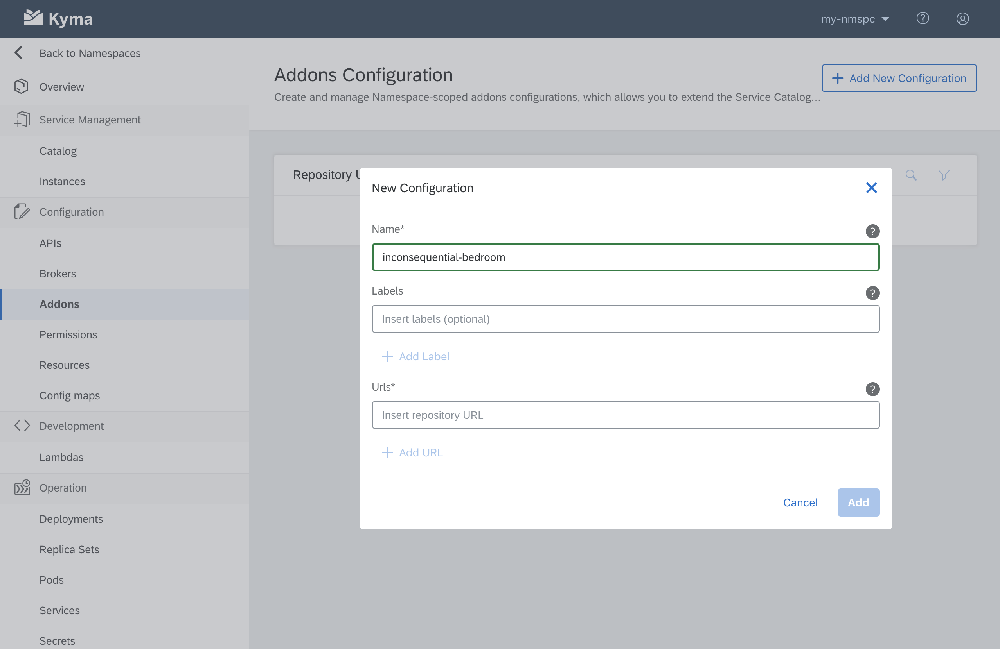

Our next, sunny stop - Lima may falsely suggest that the Kyma crew eased off a bit in the last couple of weeks and got carried away by the relaxing summer atmosphere. Nothing further from the truth. Kyma 1.5 Lima brings quite a few interesting changes. Above all, we ensured that all Kyma components are compatible with Kubernetes 1.15. We also provided Namespace-level addons configurations and added the experimental function controller module that is based on Knative. Read the full release notes for the complete list of improvements offered by the 1.5 release.

<!-- overview -->

See the overview of all changes in this release:
- [API Gateway](#api-gateway) - Kubernetes-native client registration with the Hydra Maester controller, new API Gateway controller in the Incubator
- [Application Connector](#application-connector) - Fix for invalid arguments order in the Connector Service header parser
- [Console](#console) - Namespace-level addons configurations
- [Documentation](#documentation) - Improved monitoring tutorials, Telepresence guide, troubleshooting guides for the Application Connector
- [Service Management](#service-management) - Separate repository for the Helm Broker, authentication methods support for addons configurations
- [Serverless](#serverless) - New experimental function controller module based on Knative
- [Service Mesh](#service-mesh) - Istio updated to 1.2.4

In the 1.5 release, we made sure that Kyma is compatible with Kubernetes 1.15. Nevertheless, it is not supported by automated testing pipelines. The reason is that our testing pipelines currently test Kyma on GKE and AKS, and these managed Kubernetes offerings do not support Kubernetes 1.14 and 1.15. That is why, we keep our automated testing consistent with Kubernetes 1.13 for now, including testing on Minikube. Still, we performed manual tests that confirmed Kyma also works on Kubernetes 1.15.

> **CAUTION:** When upgrading from 1.4 to 1.5, you will experience temporary unavailability of the Connector Service. It results from changing the API group of the Connector Service Deployment and adding to it the **selector** field that was not required in previous Kubernetes versions.

---

## API Gateway

### Kubernetes-native client registration with the Hydra Maester controller

Our collaboration with ORY that started in the previous release continues with new contribution and functionality. This time around, we created the Hydra Maester controller which makes registering OAuth2 clients a fully Kubernetes-native process. The controller listens for instances of the `oauth2clients.hydra.ory.sh` custom resource (CR) and registers clients through the Hydra API using the data contained in the CR. Credentials of the registered client are then saved in a Kubernetes Secret. Follow [this](https://github.com/ory/hydra-maester) link to visit the ORY Hydra Maester repository and read [this](/docs/components/security/#details-o-auth2-and-open-id-connect-server) document to learn more about the ORY stack implementation in Kyma.

### New API Gateway controller in the Incubator

Another fruit of the Kyma-ORY collaboration, the API Gateway controller (name subject to change!), is available in the Kyma Incubator. This controller listens for instances of the `gate.gateway.kyma-project.io` CR, manages Istio authentication policies and Oathkeeper rules, and allows you to expose services secured with JWT or OAuth access tokens. Even though this controller is still in the early stages of development and cannot replace the existing Kyma API Gateway, you can install it with your Kyma deployment by uncommenting the appropriate entry on the component list before installing Kyma 1.5. Go to [this](https://github.com/kyma-incubator/api-gateway) Incubator repository to learn more about the controller and read [this](/docs/root/kyma/#configuration-custom-component-installation) document to learn more about installing selected components.

## Application Connector

### Fix for invalid arguments order in the Connector Service header parser

Previous versions of the header parser incorrectly compared the certificate subject's `locality` to `province` defined in the component's configuration, and certificate subject's `province` to the `locality` environment variable from the configuration. This could cause issues. Thanks to the fix available with Kyma 1.5, the header parser now properly compares the subject's `locality` and `province` to their corresponding environment variables.

> **NOTE:** Due to the nature of this fix, you may have to generate new certificates for the connected Applications as a part of the upgrade process.

## Console

### Addons configurations on the Namespace level  

In previous Kyma versions, it was only possible to configure cluster-wide addons. It meant that if the cluster administrator enabled a new addon, it automatically became available for everyone with access to this Kyma runtime. Starting with the 1.5 version, you can apply addons configurations in the scope of a single Namespace. This gives cluster administrators more control over integration options and resource consumption.

## Documentation

### Improved monitoring tutorials

Based on the existing [`monitoring-custom-metrics`](https://github.com/kyma-project/examples/tree/master/monitoring-custom-metrics) Kyma example and its `cpu_temperature_celsius` custom metric, we have created unified monitoring tutorials. Thanks to them you can see how Kyma applies monitoring tools to manage application metrics. More specifically, these tutorials show how you can observe the custom metric's changing values, create a Grafana dashboard for the metric, and set up a corresponding alerting rule for it.

Follow these links to see the improved monitoring tutorials:
- [Observe application metrics](/docs/components/monitoring/#tutorials-observe-application-metrics)
- [Create a Grafana dashboard](/docs/components/monitoring/#tutorials-create-a-grafana-dashboard)
- [Define alerting rules](/docs/components/monitoring/#tutorials-define-alerting-rules)

### Telepresence guide

We know how difficult of a task developing and debugging locally can be. That is why we created a general guide for local development with Telepresence to make your work faster and your workflow smoother. Check this [link](https://kyma-project.io/community/guidelines/technicalities#using-telepresence-for-local-kyma-development-using-telepresence-for-local-kyma-development) for details.

### Troubleshooting guides for the Application Connector

We provided a set of [troubleshooting guides](/docs/components/application-connector/#troubleshooting-troubleshooting) that will help you to resolve the most common issues you may encounter when interacting with such components as the Application Gateway, Application Registry, and Connector Service.

## Service Management

### Separate repository for the Helm Broker

The Helm Broker now has its own [separate repository](https://github.com/kyma-project/helm-broker) in the `kyma-project` organization. We have not changed the location of the related documentation so you can still read about the Helm Broker [here](/docs/components/helm-broker/).

### Support authentication methods for addons configurations

Starting from the 1.5 release, we support fetching addons from repositories that require authentication. You can now pass credentials in a secure way using templates in your repository's URL. For more information, read [this](/docs/components/helm-broker/#details-create-addons-repository-authorization) document.  

## Serverless

### Experimental function controller module

As you know, Kyma runs serverless functions using Kubeless. We now added the Knative function controller to Kyma as an experimental feature to provide a Knative-based alternative for serverless functions. Read more about the controller [here](https://github.com/kyma-project/kyma/tree/master/components/function-controller).

## Service Mesh

### Istio updated to 1.2.4

The new release comes with Istio updated to 1.2.4 which fixes several security vulnerabilities identified by Istio. For more details, read [this](https://istio.io/about/notes/1.2.4/) document.
