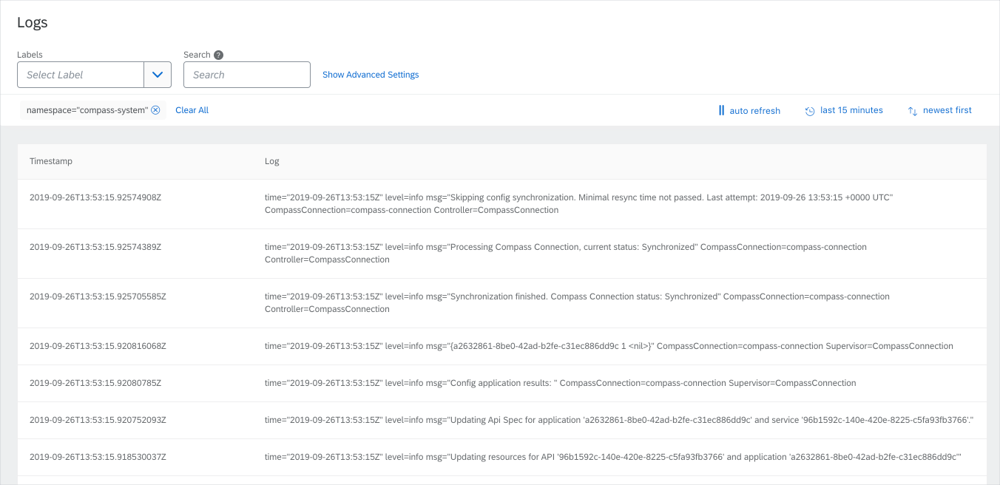
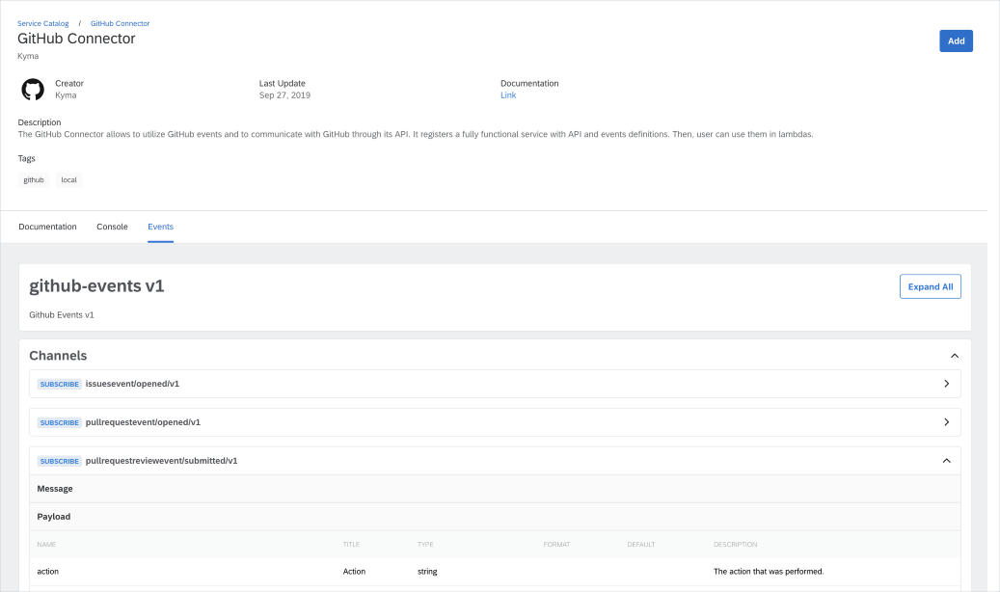
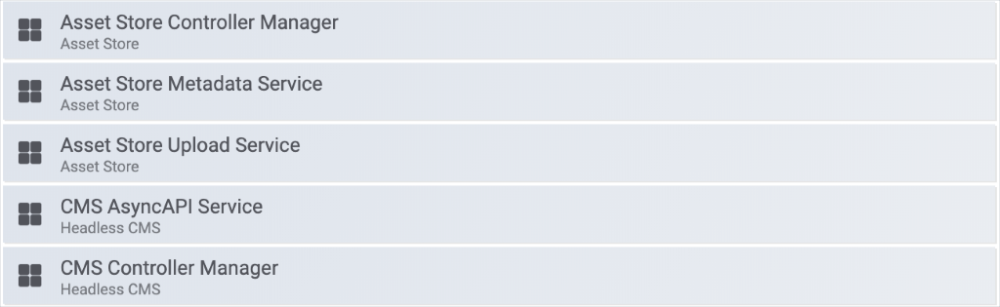

We can't even imagine a better time to head to Munich than October. While the capital of Bavaria enjoys Oktoberfest, Kyma raises a glass to 1.6 release, an event surely worth celebrating. To start with, we use automated pipelines to ensure that Kyma runs on Kubernetes 1.14 on GKE and AKS. The Kyma family grows, welcoming Compass and Hydroform. We are not slowing down in the improvements department, bringing you a brand new API Gateway, refurbished UI component, and simplified Logging UI. The Kyma-Knative cooperation evolves, resulting in function controller and Event Bus enhancements. Stay with us in this festive mood and go through the complete list of improvements offered by the 1.6 release.

<!-- overview -->

See the overview of all changes in this release:
- [API Gateway](#api-gateway) - Brand new API Gateway
- [Console](#console) - Simplified Logging UI,  Micro frontend preloading
- [Compass](#compass) - Introducing Compass, Compass authorization and authentication 
- [Core and Supporting](#core-and-supporting) -  AsyncAPI 2.0 specification supported, UI component restyled, Asset Store supports more Gateway modes,  metrics for Asset Store and Headless CMS
- [Documentation](#documentation) - Improved installation documentation
- [Eventing](#eventing) - Event Bus replaces Knative Eventing Channel provisioners with Channel CRD Controllers, Knative Eventing chart upgraded to 0.8 
- [Hydroform](#hydroform) - Introducing Hydroform - Kubernetes provisioning 
- [Serverless](#serverless) - Function Controller enhanced with new features, Knative Serving updated to 0.8.1 
- [Service Management](#service-management) - Service Catalog switched to new CRD implementation, GCP Service Broker a primary addon in Kyma 1.6
- [Logging](#serverless) - Fluent Bit supported

## API Gateway 

### Brand new API Gateway 

Among many new exciting features, this release brings you a brand new API Gateway to try out. For now, it runs side-by-side with the current API Gateway implementation until the latter is deprecated. Because the new API Gateway is still under development, you can find it in Kyma Incubator. 
A new [`apirules.gateway.kyma-project.io`](https://github.com/kyma-incubator/api-gateway#custom-resource) CustomResourceDefinition allows you to interact with the new API Gateway. You can also [expose your service and secure it either with OAuth2 scopes or JSON Web Tokens with additional scopes. Follow [this](https://kyma-project.io/docs/master/components/api-gateway-v2/#tutorials-expose-and-secure-a-service) tutorial to see how.

## Console 

### Simplified Logging UI 

Kyma 1.6 comes with a completely refurbished Logging UI. Its simplified view displays only one log stream with log lines matching selected filters. To keep you up to date, the log stream refreshes automatically until you choose to pause it. To ensure a user-friendly experience and intuitive design, the advanced options remain hidden. 

The compact version of the Logging UI allows you to display the logs in the lambda function details view. This way, you can track the logs when you develop and test serverless functions.

### Micro frontend preloading

The Console now uses the micro frontend preloading feature provided by the [Luigi framework](https://luigi-project.io). This way, micro frontends preload in the background, which increases the overall loading process and improves performance.

## Compass

### Introducing Compass

Compass is a multi-tenant system that consists of components that provide a way to manage your applications across multiple Kyma Runtimes. Read the [documentation](https://kyma-project.io/docs/master/components/compass/) to learn how to enable this experimental component and try it out.

### Compass authorization and authentication 

To ensure secure communication between Compass, Runtimes, and Application we provide several authentication and authorization options. Read [this](https://github.com/kyma-incubator/compass/blob/master/docs/architecture/authentication-and-authorization.md) document to learn more about these topics. 

## Core and Supporting

### AsyncAPI 2.0 specification supported

Only 3 weeks after the official release, [AsyncAPI 2.0](https://twitter.com/AsyncAPISpec/status/1171831790887211011) is already a standard in Kyma. How did we achieve this so fast? Simply because we have worked closely with the AsyncAPI community and actively contributed to their tooling. For details, have a look at the [AsyncAPI Converter](https://github.com/asyncapi/converter-go) and [AsyncAPI React](https://github.com/asyncapi/asyncapi-react) repositories maintained by Kyma developers.

>**NOTE**: Although you can register any AsyncAPI version in Kyma, 2.0 is the only specification supported in the Kyma cluster. To make sure you are using the right version, we automatically convert your specification to 2.0. 

Before conversion, specification files go through the validation stage. The specification won't be converted if:

* You are using 1.0 specification which is no longer valid.
* You are using the 2.0 specification already and the conversion is not required. 

To get even more insight into the topics, check our [demo](https://youtu.be/9tJOn6qRR2U?t=2283) presented during the Core Special Interest Group meeting and read the [documentation](https://kyma-project.io/docs/master/components/headless-cms/#details-cms-async-api-service).

>**NOTE:** Upgrading Kyma from 1.5 to 1.6 means that new Headless CMS configuration is applied alongside with the automatic conversion of the already registered specification.  

### UI component restyled

The UI component has also undergone some significant changes. We have restyled the existing UI component to match SAP Fiori 3 and updated the component to exclusively support AsyncAPI 2.0. The expandable sections improve the overall user experience by making it easier to navigate through documents. 

### Asset Store supports more Gateway modes 

One of the most important Asset Store's functionality is the support of the multi-cloud storage. Now you can easily save your assets to Azure Blob, AWS S3, or Alibaba Object Storage Service. Read the following tutorials to learn how to set Minio to the desired Gateway mode:

* [Set Minio to the Azure Blob Gateway mode](https://kyma-project.io/docs/master/components/asset-store#tutorials-set-minio-to-the-azure-blob-storage-gateway-mode)
* [Set Minio to the AWS S3 Gateway mode](https://kyma-project.io/docs/master/components/asset-store#tutorials-set-minio-to-the-aws-s-3-gateway-mode)
* [Set Minio to the Alibaba OSS Gateway mode](https://kyma-project.io/docs/master/components/asset-store#tutorials-set-minio-to-the-alibaba-oss-gateway-mode)

Additionally, the automated pipeline makes sure the cooperation between Asset Store and Azure Blob remains stable with each change introduced in the component. This means we regularly test the Azure Blob and Google Cloud Storage solutions.

### Metrics for Asset Store and Headless CMS

We have invested a lot of time and effort to expose metrics defined for controllers and services. You can now use the [Asset Store](https://kyma-project.io/docs/master/components/asset-store/#metrics-metrics) and [Headless CMS](https://kyma-project.io/docs/master/components/headless-cms/#metrics-metrics) metrics to [define dashboards](https://kyma-project.io/docs/master/components/monitoring/#tutorials-create-a-grafana-dashboard) and [configure alerting rules](https://kyma-project.io/docs/master/components/monitoring/#tutorials-define-alerting-rules).

You can also have a look at our pre-configured Grafana dashboards.

## Documentation 

### Improved installation documentation 

We want our documentation comprehensive, yet easy to follow and understand. That's why we constantly improve it, always with the community feedback in mind. Our [most recent discussions](https://kyma-community.slack.com/archives/CD2HJ0E78/p1568721087011100) quickly led to successful implementation. [Here](https://kyma-project.io/docs/master/root/kyma/#installation-install-kyma-on-a-cluster ) you can view the installation document introducing a new structure and use of tabs to accommodate instructions for a specific cloud provider.

## Eventing

### Event Bus replaces Knative Eventing Channel provisioners with Channel CRD Controllers 

In the past, Knative Eventing introduced the concept of Channel Provisioners, where all Channels were of the same Channel kind. This concept got deprecated and completely removed in Knative Eventing 0.8 and replaced with the typical controller for different Channel CRDs, such as NatssChannel. In Kyma 1.6 we updated our Event Bus implementation to replace the old Channel with new Channel CRDs. For the recent updates on Eventing architecture, read [this](https://kyma-project.io/docs/master/components/event-bus/#architecture-architecture).

### Knative Eventing chart updated to 0.8

In this release, we updated our bundled Knative Eventing chart to [Knative 0.8](https://github.com/knative/serving/releases/tag/v0.8.1) to benefit from its features and use the provided fixes. 

## Hydroform - Kubernetes provisioning

### Introducing Hydroform

Starting from this release, we want to introduce [Hydroform](https://github.com/kyma-incubator/hydroform/blob/master/README.md ), an infrastructure SDK you can use to create and manage Kubernetes clusters. Hydroform allows you to manage your clusters provisioned on the desired target provider and location. Currently, Hydroform supports Google Cloud Platform and Gardener. The [Terraform provider for Gardener](https://github.com/kyma-incubator/terraform-provider-gardener) ensures smooth provisioning on Gardener. 

## Serverless

### Function Controller enhanced with new features 

The recent enhancements and fixes introduced to the [function controller](https://github.com/kyma-project/kyma/tree/master/components/function-controller) bring it even closer to become production-ready. 

### Knative Serving updated to 0.8.1 

We updated our bundled Knative Serving to [v0.8.1 release](https://github.com/knative/serving/releases/tag/v0.8.1 ). This is the first release candidate for Serving v1 and comes with many exciting features, such as Target Burst Capacity.

## Service Management 

### Service Catalog switched to new CRD implementation

After a couple of months of hard development in the upstream Service Catalog project, we finally removed Service Catalog API-server and ectd components from Kyma. Additionally, we now provide a [managed Service Catalog data upgrade](https://svc-cat.io/docs/migration-apiserver-to-crds/) between 1.5 and 1.6 Kyma versions.

### GCP Service Broker a primary addon in Kyma 1.6 

The GCP Service Broker is now a primary addon. For details, see [this](https://kyma-project.io/docs/master/components/service-catalog#service-brokers-gcp-service-broker) document.

## Logging

### Fluent Bit supported 

By default, Loki comes with the [Promtail](https://github.com/grafana/loki) log collector configuration. Now, Kyma supports [Fluent Bit](https://fluentbit.io/) as yet another log collector.

