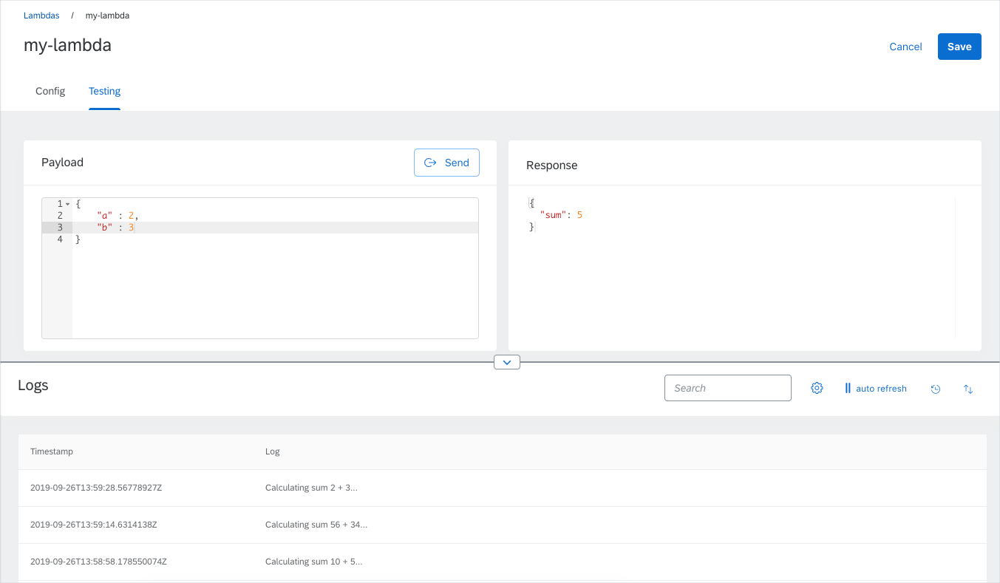
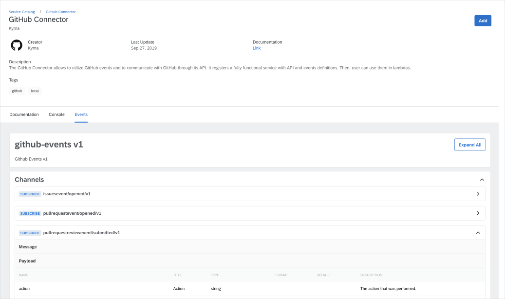
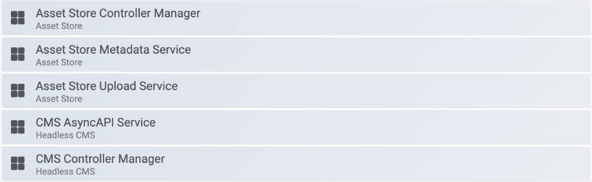

We can't even imagine a better time to visit Munich than October. While the capital of Bavaria enjoys Oktoberfest, Kyma raises a glass to the 1.6 release - an event surely worth celebrating. To start with, our automated pipelines make sure that Kyma runs on Kubernetes 1.14 on GKE and AKS. We are also happy to announce two recent additions to the Kyma family: Compass and Hydroform. The work in the improvements department does not slow down, bringing you a brand new API Gateway, refurbished UI component, and simplified Logging UI. The Kyma-Knative cooperation evolves, resulting in Function Controller and Event Bus enhancements. Read the full release notes for the complete list of improvements offered by the 1.6 release.

<!-- overview -->

See the overview of all changes in this release:
- [API Gateway](#api-gateway) - Brand new API Gateway
- [Console](#console) - Simplified Logging UI, Preloading micro frontends
- [Compass](#compass) - Introducing Compass
- [Core and Supporting](#core-and-supporting) -  Support for AsyncAPI 2.0 specification, AsyncAPI UI component restyled, support for more Gateway modes by Asset Store, metrics exposed for Asset Store and Headless CMS
- [Documentation](#documentation) - Improved installation documentation, added troubleshooting guide for Backup
- [Eventing](#eventing) - Knative Eventing Channel Provisioners replaced with Channel CRD Controllers, Knative Eventing chart updated to 0.8
- [Hydroform](#hydroform) - Introducing Hydroform - Kubernetes provisioning
- [Logging](#serverless) - Added support for Fluent Bit
- [Serverless](#serverless) - Function Controller enhanced with new features, Knative Serving updated to 0.8.1
- [Service Management](#service-management) - Service Catalog switched to the CRD implementation, GCP Service Broker no longer in the preview mode
- [Service Mesh](#service-mesh) - Istio updated to 1.2.7

>**CAUTION:** Before you upgrade to Kyma 1.6, read the [Migration Guide](https://github.com/kyma-project/kyma/blob/release-1.6/docs/migration-guides/1.5-1.6.md) which describes necessary actions required by the Service Catalog.

## API Gateway

### Brand new API Gateway

This release introduces a brand new [API Gateway](https://github.com/kyma-project/kyma/tree/release-1.6/docs/api-gateway-v2) for you to try out. It aims at replacing the old implementation, but before this happens, the two run side by side in Kyma. Since the API Gateway is still under development, you can find its source code in the Kyma Incubator. A new [`apirules.gateway.kyma-project.io`](https://github.com/kyma-project/kyma/blob/release-1.6/docs/api-gateway-v2/06-01-apirule.md) CRD supports interacting with the new API Gateway. You can also expose your services and secure them with either OAuth2 scopes or JSON Web Tokens. Follow [this](https://github.com/kyma-project/kyma/blob/release-1.6/docs/api-gateway-v2/08-01-exposesecure.md) tutorial to learn how.

## Console

### Simplified Logging UI

Kyma 1.6 comes with a completely refurbished Logging UI. Its simplified view displays only one log stream with log lines matching selected filters. To keep you up to date, the log stream refreshes automatically until you choose to pause it. To ensure a user-friendly experience and intuitive design, the advanced options remain hidden.

The compact version of the Logging UI allows you to split the details view for a lambda to display logs. This way, you can track logs when you develop and test serverless functions.

### Preloading micro frontends

We attach great importance to Kyma performance, constantly striving to speed things up. That's why the Kyma Console uses the micro frontend preloading feature provided by [Luigi](https://luigi-project.io). Preloading micro frontends in the background speeds up the overall loading process and improves the performance.

## Compass

### Introducing Compass

Compass is a central, multi-tenant system that allows you to connect Applications and manage them across multiple Kyma Runtimes. Read the [documentation](https://github.com/kyma-project/kyma/tree/release-1.6/docs/compass) to learn how to enable this experimental component and try it out.

### Authorization and authentication

To ensure secure communication between Compass, Runtimes, and Applications we provide you with several authentication and authorization options. To learn more, read [this](https://github.com/kyma-incubator/compass/blob/master/docs/compass/03-01-security.md) document.

## Core and Supporting

### Support for the AsyncAPI 2.0 specification

Only three weeks after its official release, [AsyncAPI 2.0](https://twitter.com/AsyncAPISpec/status/1171831790887211011) is already a standard in Kyma. How did we manage to achieve this so fast? We have worked closely with the AsyncAPI community and actively contributed to their tooling. For details, have a look at the [AsyncAPI Converter](https://github.com/asyncapi/converter-go) and [AsyncAPI React](https://github.com/asyncapi/asyncapi-react) repositories maintained by Kyma developers.

Although you can register any AsyncAPI version in Kyma, 2.0 is the only specification supported in the Kyma cluster. To make sure you are using the right version, we automatically validate your specification and convert it to 2.0.

Upgrading from Kyma 1.5 to 1.6 means the cluster has already the new configuration for the Headless CMS component. This means, the AsyncAPI specifications you registered before the upgrade will be automatically converted to the version 2.0.

>**NOTE:** Your specification won’t be converted if version 1.0 is corrupted.

To get even more insight into the topic, check our [demo](https://youtu.be/9tJOn6qRR2U?t=2283) presented during the Core Special Interest Group meeting and read the [documentation](https://github.com/kyma-project/kyma/blob/release-1.6/docs/headless-cms/03-02-cms-asyncapi-service.md).

### AsyncAPI UI component restyled

We restyled the existing UI component to match SAP Fiori 3 and updated the component to exclusively support AsyncAPI 2.0. The expandable sections improve the overall user experience, making it easier to navigate through documents.

### Support for more Gateway modes by Asset Store

One of the most important features of Asset Store is multi-cloud storage support. Now you can easily save your assets to Azure Blob, AWS S3, or Alibaba Object Storage Service. Read [this](https://kyma-project.io/docs/components/rafter/#tutorials-set-min-io-to-gateway-mode) tutorial to learn how to set Minio to the desired Gateway mode.

Additionally, the automated pipeline makes sure the cooperation between Asset Store and Azure Blob remains stable after each change introduced to the component. This means that from now on we regularly test Asset Store with not only Google Cloud Storage but also Azure Blob.

### Metrics for Asset Store and Headless CMS

In preparation for the 1.6 release, we invested a lot of time and effort to expose metrics defined for controllers and services. You can now use the Asset Store and Headless CMS metrics to [define dashboards](https://github.com/kyma-project/kyma/blob/release-1.6/docs/monitoring/08-03-create-and-configure-grafana-dashboard.md) and [configure alerting rules](https://github.com/kyma-project/kyma/blob/release-1.6/docs/monitoring/08-04-define-alerting-rules.md).

You can also start exploring metrics right away, using our pre-configured Grafana dashboards.

## Documentation

### Improved installation documentation

We want our documentation to be comprehensive, yet easy to follow and understand. That's why we constantly improve it, always with the community feedback in mind. Our [most recent discussions](https://kyma-community.slack.com/archives/CD2HJ0E78/p1568721087011100) turned out to be a great starting point for another successful implementation. Check out [this](https://github.com/kyma-project/kyma/blob/release-1.6/docs/kyma/04-04-cluster-installation.md#install-kyma) installation document to explore the new structure.

### Added troubleshooting guide for Backup

We are aware of potential issues that may occur from time to time. That's why our troubleshooting guides are there to help you. If you experience problems with Eventing after you completed the restore process, read [this](https://github.com/kyma-project/kyma/blob/release-1.6/docs/backup/10-01-restore-troubleshooting.md#eventing-not-working) guide.

## Eventing

### Knative Eventing replaced Channel Provisioners with Channel CRD controllers

In the past, Knative Eventing introduced the general concept of Channel Provisioners. This concept assumed no concrete types for different channel implementations, such as NATS Streaming vs Kafka. Along with Knative Eventing 0.8, Channel Provisioners were deprecated and replaced with [Channel CRD](https://knative.dev/v0.8-docs/eventing/channels/channels-crds/) controllers. In Kyma 1.6, we updated our Event Bus implementation to use the new Channel CRDs. For more details on the recent updates in the Eventing architecture, read [this](https://github.com/kyma-project/kyma/blob/release-1.6/docs/event-bus/02-01-event-bus.md) document.

### Knative Eventing chart updated to 0.8

In this release, we updated our bundled Knative Eventing chart to [Knative 0.8](https://github.com/knative/eventing/releases/tag/v0.8.0). This version brings us fixes as well as features such as the new Choice object.

## Hydroform - Kubernetes provisioning

### Introducing Hydroform

This release brings you [Hydroform](https://github.com/kyma-incubator/hydroform/blob/master/README.md), an infrastructure SDK you can use to create and manage Kubernetes clusters provisioned on the chosen cloud provider. The idea behind Hydroform is to provide an easy way of creating infrastructure. Having a common library used across products such as Kyma CLI or Compass significantly simplifies cluster provisioning and management. Currently, Hydroform supports Google Cloud Platform and Gardener, the latter using [Terraform provider for Gardener](https://github.com/kyma-incubator/terraform-provider-gardener) to ensure smooth cluster provisioning.

## Logging

### Added support for Fluent Bit

So far, Loki came with the default [Promtail](https://github.com/grafana/loki) log collector configuration. From this release, Kyma supports [Fluent Bit](https://fluentbit.io/) as a yet another log collector.

## Serverless

### Function Controller enhanced with new features

The recent enhancements and fixes introduced to the [Function Controller](https://github.com/kyma-project/kyma/tree/release-1.6/components/function-controller) bring it even closer to become production-ready.

### Knative Serving updated to 0.8.1

We updated our bundled Knative Serving to [v0.8.1 release](https://github.com/knative/serving/releases/tag/v0.8.1). This is the first release candidate for Serving v1 and comes with many exciting features, such as Target Burst Capacity.

## Service Management

### Service Catalog switched to new CRD implementation

After a couple of months of hard work with development and integrations in the upstream Service Catalog project, we have finally removed Service Catalog API Server and ectd components from Kyma. Now, the Service Catalog design is based on the CRDs approach, which enhances the Service Catalog with the following:
* The stability of the Service Catalog increased as now we use the native Kubernetes support instead of our own etcd cluster, which sometimes was unstable and caused downtimes.
* The installation time was reduced almost by 65% (in average from 85sec to 30sec).
* The memory consumption was reduced:
    - requested by 82% (from 232MB to 40MB)
    - limits by 96% (from 1596MB to 60MB)
* The CPU consumption was reduced:
    - requested by 43% (from 350m to 200m)
    - limits by 75% (from 800m to 200m)

See [this](https://svc-cat.io/docs/design/#service-catalog-design) document for more information about the new Service Catalog design. What is more, in this release we provided a migration job that handles managed Service Catalog data upgrade between 1.5 and 1.6 Kyma versions. For more information, read [this](https://svc-cat.io/docs/migration-apiserver-to-crds/) document as well as the [migration guide](https://github.com/kyma-project/kyma/blob/release-1.6/docs/migration-guides/1.5-1.6.md).

### GCP Service Broker no longer in the preview mode

After some time spent in the preview mode, the GCP Service Broker joins other production-ready addons that are provided in Kyma by default. For details, see [this](https://github.com/kyma-project/kyma/blob/release-1.6/docs/service-catalog/13-02-gcp-broker.md) document.

## Service Mesh

### Istio updated to 1.2.7

The new release comes with Istio updated to 1.2.7 which provides fixes for the https://istio.io/news/2019/istio-security-2019-005/ security vulnerability.
