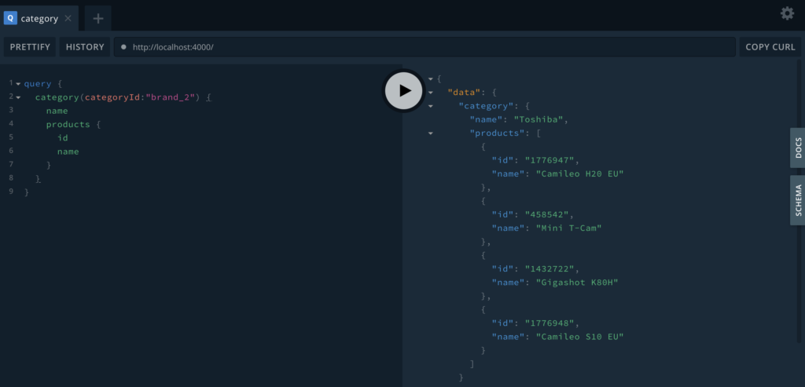
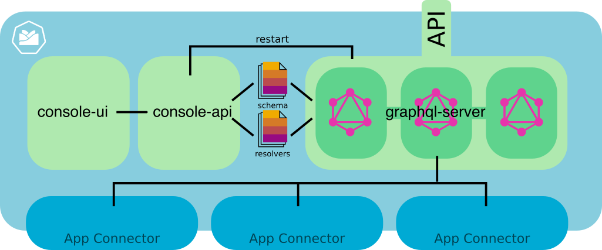

In 2012, GraphQL was released to the public by Facebook. While this was quite some time ago, the GraphQL community grew larger and stronger over the years. If you still have not heard about GraphQL, it is a query language and execution engine - and many who got in touch with GraphQL now question REST as the predominant API style. 

This guest post will give you a little introduction to GraphQL and then outline how we successfully prototyped a GraphQL integration with Kyma. 

<!-- overview -->

## GraphQL 101
For a decade or so, the lingua franca of accessing APIs was via RESTful APIs – “whatever this may mean”. REST is a tiny bit complicated, as basically everybody agrees on parts of how it should work but there’s a ton of deviations that make it also really hard to use. The first requests typically work easily, but in the end you have to chain a lot of requests and you hit the server quite a few times for getting what you need. You essentially jump from entity to entity to get what you need – sometimes way more and there’s no way to stop the server from sending all that extra data.

GraphQL is quite different. First of all, GraphQL tries to “order” the data you can request in the form of a graph. Think of a product category – naturally you want to resolve the category, then the products, and finally maybe the product images. GraphQL is a query language and execution engine, as the GraphQL specification tells us. In essence, all requests via clients are sent via POST requests, and these can either be queries, mutations or subscriptions. The requests sent must adhere to the schema that was previously defined. Interestingly, the clients send the requests (e.g. queries) to the server, and the data returned is just the data requested – no extra fields here and there. This makes a whole lot of sense, as we’ve seen an explosion of different clients over the past few years. Initially, a lot of RESTful APIs were built to interface with third party server systems. Then came mobile, and the same requests/responses were consumed via mobile devices and mobile connections. Finally, with IoT present in all our homes, a lot of these tiny devices still have to use the same RESTful APIs. And that makes REST look pretty old and crazily inflexible. It’s time for a change and GraphQL looks very promising.

So, is GraphQL for you? Are you tired of responses that hold way too much data? And sometimes not the data you need, so you need to make n+1 calls to get at it? Do you need to access many APIs from different systems? Do you do all this from tiny IoT or mobile clients? Then GraphQL is for you. GraphQL is for all modern clients out there – from single-page web apps on your smartphone to IoT devices. 

## Just a quick example
Too much text? Let's see a quick example. As I will later focus on how we integrated GraphQL with Kyma, I won't go into greater depth here. But please have a look at the [CX Labs Blog](https://cxlabs.sap.com/2019/05/15/graphql-on-kyma/) for more content and examples about GraphQL!

Most GraphQL servers will automatically render a graphical UI to help developers get started with writing and developing queries. This UI is called GraphiQL, and I’ll use it to show you the first sample query.

On the left, you see the issued query. The right side shows the response from the GraphQL server. Click the screenshot to enlarge it. Notice how the query structure is mirrored by the response structure – and we got exactly what we asked for. We wanted to dive into the product category ‘brand_2’, get that category’s name (‘Toshiba’) and the product’s id and name.

For these examples, I’ve used the node.js based [yoga](https://github.com/prisma/graphql-yoga/) project. It’s an excellent choice to get started and operates on the widely used Apollo GraphQL server underneath.

## Using GraphQL within Kyma
We decided to modularize our GraphQL project via three sub-projects, each yielding a seperate docker image. For your convenience, docker images have been uploaded to [docker hub](https://hub.docker.com/r/hansamann/graphql-server) and these images are referenced from the default k8s resources which are part of these projects.

Here's a quick overview with a description of each sub-project:
- [graphql-server](https://github.com/hansamann/synolo/blob/master/graphql-server/README.md) - this project includes a code for a Yoga-based GraphQL server. Yoga is a node.js based GraphQL server which is based on the popular Apollo GraphQL server. My specific implementation uses schema-stitching to combine individual GraphQL schema files (types directory) to one holistic GraphQL schema. For the resolvers, the same principle is used. For example, all resolvers of the resolvers directory are combined into the resolvers of the GraphQL server. The types and resolvers directories are intended to be overwritten by a Kubernetes ConfigMap volume mount later. This effectively makes the types and resolvers editable by an external process, in this case, the graphql-api via graphql-console.
- [graphql-console-ui](https://github.com/hansamann/synolo/blob/master/graphql-console-ui/README.md) - this project includes a minimal and basic Vue-based UI for the Kyma console. It includes the Kyma resources necessary to add an item to the Kyma console and includes the basic UI for editing the list of available types and resolvers via simple HTML text areas. This UI communicates with the graphql-api.
- [graphql-console-api](https://github.com/hansamann/synolo/blob/master/graphql-console-api/README.md) - the graphql-api uses the Kubernetes node.js API to load, edit and update the ConfigMaps for types and resolvers. It also enables the graphql-ui to restart the GraphqQL server, which essentially kills all pods of a graphql deployment to recreate them with the latest ConfigMaps.

If you follow the links above, you will get detailed instructions on how to run this on your own Kyma cluster and how to get started. 

## GraphQL, Quo Vadis?
Using GraphQL is a no-brainer for new systems but can be equally beneficial for systems with multiple data backends or used for accessing legacy systems. For frontend developers, GraphQL represents a powerful query tool that many would wish for (and many would ditch REST in the blink of an eye). The hard part is integrating GraphQL into a larger backend system, making it easy to install and maintain, and making sure it scales with many simultaneous requests. While our prototype showed how we can potentially integrate GraphQL, our main goal is still to have a discussion of the usefulness of GraphQL and how it could best be integrated into Kyma. 

I hope you enjoyed this quick intro to GraphQL on Kyma. As always, please, [let me know what you think](https://twitter.com/hansamann). 

