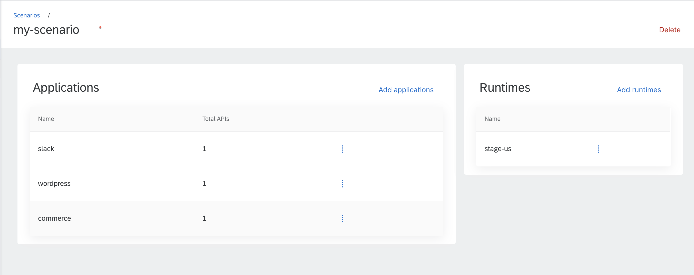

Not much time has passed since the last stop in Munich, and yet we're already landing in India with the brand new Kyma 1.7 New Delhi release. There's no wonder we're moving around the globe so fast as the main focus in this release was put on extending Compass functionalities. Apart from that, the Helm Broker becomes more independent as a separate component, and both CLI and Security get more improvements. Read on to learn more about the new features in Kyma 1.7.

<!-- overview -->

See the overview of all changes in this release:
- [Compass](#compass) - Runtime Agent enhancements, Runtime Provisioner first implementation, Tenant Mapping Handler for requests validation, **Scenarios** view in the Console
- [Service Management](#service-management) - Helm Broker v1.0.0 officially released
- [Security](#security) - Support for TLS certificate hot reload
- [CLI](#cli) - Commands for provisioning Kubernetes clusters on GCP and Gardener

>**CAUTION:** Read about known issues for [Console](#console) and [Backup](#backup).

## Compass

### Runtime Agent enhancements

Compass Runtime Agent now uses Application names as custom resource names. This affects the way Applications are listed in the Kyma Console. No more pesky IDs - entries are named exactly the same as in the Compass Console!

The second addition to the Runtime Agent involves labeling Runtimes. After a successful connection, the Runtime Agent updates the Director with information on exposed endpoints of the Runtime, such as Event Service URL or Console URL.

### Runtime Provisioner first implementation

The first implementation of the [Runtime Provisioner](https://kyma-project.io/docs/components/compass#architecture-components-runtime-provisioner) is here. We have unmocked the provisioning part of the API – it is now possible to provision clusters on GCP and Gardener projects using GCP credentials.

### Tenant Mapping Handler for requests validation

Starting with this release, the [Tenant Mapping Handler](https://github.com/kyma-incubator/compass/blob/master/docs/compass/03-01-security.md#tenant-mapping-handler) validates requests coming to the Director. It modifies those requests by assigning them to tenants and scopes. The authenticated users and systems can work only in the context of a given tenant and with given scopes.

### Scenarios view available in the Console

A new **Scenarios** view in the Compass Console shows Applications and Runtimes connected to a specific [scenario](https://kyma-project.io/docs/components/compass#architecture-basic-architecture-scenarios). It allows you to manage Applications and Runtimes in a given scenario.

## Service Management

### Helm Broker v1.0.0 officially released

Some time ago, the Helm Broker was moved to the [separate repository](https://github.com/kyma-project/helm-broker). As the next step, we created a whole new release process for it, based on the Kubernetes release process. From now on, the Helm Broker will be released after every important feature implementation.

## Security

### Support for TLS certificate hot reload

Starting with this release, you don't have to manually restart Applications to make them work with new TLS certificates. The IAM Kubeconfig Service now provides `kubeconfig` configurations for users who have updated their certificates, and the API Server Proxy accepts requests that are made using `kubectl` with the new `kubeconfig` file.

## CLI

### Commands for provisioning Kubernetes clusters on GCP and Gardener

We integrated the new [Hydroform](https://github.com/kyma-incubator/hydroform) library into the Kyma CLI. It allows for provisioning Kubernetes clusters on GCP and Gardener in a convenient way. Bear in mind that the command syntax is not stable yet due to the ongoing process of extending the provisioning logic to support more providers.

## Console

### Known issues

The default label preset for disabling Istio side-car injection is [broken](https://github.com/kyma-project/console/issues/1352). In order to disable Istio side-car injection in a new Namespace, label it manually with the `istio-injection=disabled` label.

## Backup

### Known issues

Backup restore for the Event Bus fails. See the details in [this](https://github.com/kyma-project/kyma/issues/5942) issue and read the [troubleshooting](https://kyma-project.io/docs/1.7/components/backup#troubleshooting-restore-troubleshooting-eventing-not-working) document for a workaround.