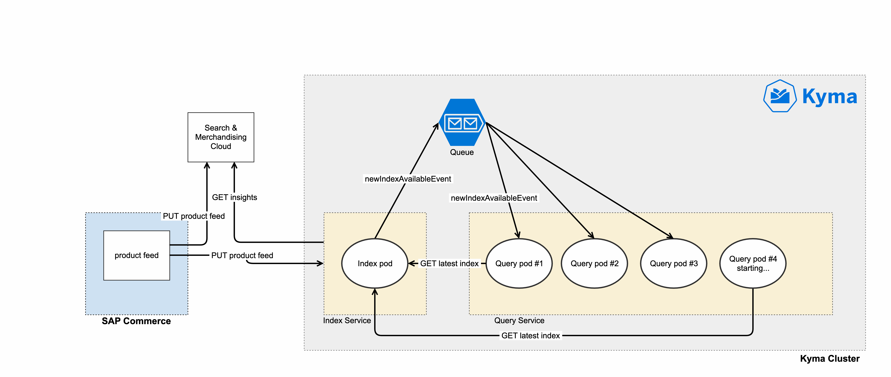

This blog post outlines how we are building a large e-commerce platform for one of our biggest clients leveraging Kyma. 

<!-- overview -->

With a team of more than 100 people, 70 of those developers, we are constantly working on improving the system to make our client more successful in the market. Our team is organized in several sub-teams that are distributed across several European countries. In addition, the client has their own teams, and some other, specialized service providers working on the platform.  
The platform is based on SAP Commerce, was originally built in 2012 and has been undergoing various expansions, improvements and re-architectures since then. Following the big success of the system, various additional features, channels and business models were added over time. We now have a huge and complex monolithic application which provides standardized APIs to a number of frontend applications.  

With an ever-growing codebase and team, at some point we started to encounter issues in development that slowed down progress significantly. The following post describes these issues and how we are using Kyma to address them successfully.

## When we hit the wall

Our client’s business has been growing enormously in the last five years. This also lead to more investments, scaling our team from about 10 developers five years ago to around 150 people today. As more and more colleagues joined, the fundamental architecture of the system did not change and stayed monolithic. This means that all developers are working on the same code base, integrate into the same development branch and we release one big binary every other week. To keep this under control we established a set of clear and strict guidelines/best practices to keep the architecture clean. For a long time this worked very well, but at some point we started to see problems pop up:

-   As everyone is working in the same code base, coordination efforts and communication overhead increased significantly.
-   We started seeing some regression bugs, especially when junior engineers did not yet fully understand the complete system.
-   Building the project (and executing all necessary test suites and quality analytics) took more and more time.
-   This lead to developers being blocked when trying to integrate their code into a release, especially at the end of an iteration.
-   Deployments, while being fully automated, still became more risky as for any change, no matter how small, the complete application was to be deployed.
-   Scaling the system with load-requirements became quite hard and expensive.
-   In general development progress grew significantly slower and features more costly to build.  
All these points are well-known downsides of large monolithic applications. In addition, we noticed that over time it became very tough and expensive to experiment. Even the smallest feature trials had to wait for a long time to be integrated, tested and deployed at the next deployment date. This is when we knew we needed to change something.

## The best of both worlds

When thinking about potential solutions as an obvious choice we identified that splitting up the monolith into smaller parts and eventually microservices could improve our situation. However, while researching and trying out potential microservice environments to run services on, we quickly realized that microservices come with their own set of difficulties. Security, scalability, stability, etc. are all non-functional requirements that must be built in from the start. As we wanted to focus on solving our client’s business problems, building this on our own was not an option, so we needed a platform and tooling. Our plan was not to replace the complete platform with microservices, but to split off functionality into services where it made sense. So we also needed a platform which made integration into the existing commerce platform as seamless as possible.  

At around this time, Kyma was initially announced and immediately seemed to be a really good platform for our undertaking, so we decided to take part in SAP’s beta program to get a better understanding. During the beta program and first experiments together with our client, our initial assumptions were validated and we decided together with all stakeholders to start a project to build production services on Kyma as a first real proof of concept.  

The first part of the project was to identify which components of the monolithic application should first be split out into self-contained services. Since SAP Commerce has a strong, connected and integrated core, it was clear that it would make no sense to split out any random business object and move it to a microservice. Going this route we would have lost a lot of out-of-the-box functionality - which is not what we wanted. Nevertheless, we found many features that had been built on top of the core that were a perfect fit for splitting them into microservices.

In the end we want to use the strengths of both worlds: a strong monolith core with stable commerce processes and extensions to the core with a set of self-contained microservices that are independently developed and scaled.

## First service in Kyma

We identified the type-ahead search as a first candidate to be moved to Kyma. Type-ahead search is a feature that, while the user is typing in the search box on the website, shows suggested search results in a popup box, according to some very specific/dynamic business rules. Our implementation of this feature in Kyma consists of two services:  

-   Index service  
    This service creates the search index that is used to create the type-ahead search suggestions.
-   Query service  
    This service uses the created index to serve search requests by API clients.  
    
For general search and navigation functionality the platform uses a third party search and merchandising cloud product. Every time the SAP Commerce platform creates a data feed exporting all product information to this third party cloud the same data feed is also pushed to our index service.This service analyzes the data feed, retrieves and aggregates all necessary other data from the search & merchandize cloud and then builds its own search index to be used by the query service.As soon as the index creation is finished the query service is informed using a Kyma event. The query service then downloads the new index and swaps the index it uses to serve API consumers without at runtime. The amount of pods that the query service uses is scaled automatically by number of requests hitting the system. The connection between SAP Commerce and the Kyma cluster is managed by the built-in Kyma Application Connector, which ensures secure and stable connectivity between the two systems.

**Figure 1: Type-ahead search in Kyma**  

## Learnings

Since mid-2019 we operate a Kyma cluster in production use - so far without any major issues. The platform is stable and straightforward to operate as any Kubernetes cluster. Due to the fact that Kyma comes with a set of monitoring tools included, we connected it to our existing central monitoring system. We decided to not change the tools and frameworks Kyma is using, instead we believe in forwarding metrics and logs. This pattern prevents manual adaptations in the Kyma source which makes updating Kyma to newer versions easy.  

What really impressed us is the possibility of doing fast iterations and feedback loops. As a deployment of services through our fully automated build and deployment pipelines is just taking minutes, it is very easy to do changes to the system.Development teams can work in a much more independent and autonomous way now.  

As the platform is serving a lot of users, load testing became a crucial task before bringing the services to production. After identifying and fixing some issues related to ISTIO service mesh together with the Kyma team, we had no problems sizing the services dynamically as resource-considerate as possible. Horizontal autoscaling gives the services the possibility to react to peaks within seconds.  

During development of these first services we created a proof of concept for a performance-critical part of the system with different programming languages/frameworks. We were surprised how much difference there was in the results between different languages, saving our client a lot of money in compute resources. A benefit of running on Kubernetes now is the possibility to do these comparisons every time we need to and use the language that best fits the problem.  

One difficulty that we saw in this first project was that initially not all developers had significant experience with Kubernetes. We had to invest in extensive training, as the learning curve for Kubernetes is quite steep.

## Taking the next steps

After successfully launching Kyma and the first services we now plan to onboard the complete development organization working for our client on Kyma. Besides training and getting to know the new technologies, we see it as crucial to help our teams adapt a new mindset of experimentation and trying out things. Having the possibility to deploy changes frequently also means that we have to work together with the business stakeholders in a different way and build up a mindset of rapid experimentation within the whole organization. 

Additionally, we already learned that in future we need to focus on the general architecture of the complete system in an even more detailed fashion than the teams are used to. We must establish clear rules, guidelines and the right mindset for teams to independently decide where to build new features - on Kyma or on the SAP Commerce platform. To support this we established regular additional inter-team coordination meetings so that all teams are aware of the big picture.  

Together with our client we created a roadmap of the next services we are splitting off to Kyma and we are already hard at work to build them. Some of the services will become mission critical, some will end up as failed experiments and not be in production for long. With Kyma we now have the power and flexibility to do this in an efficient and agile way. Keep experimenting!  

