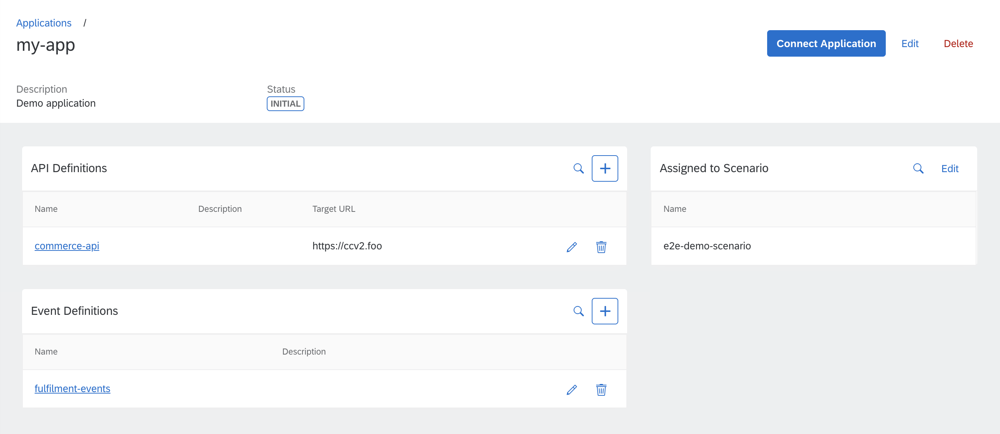
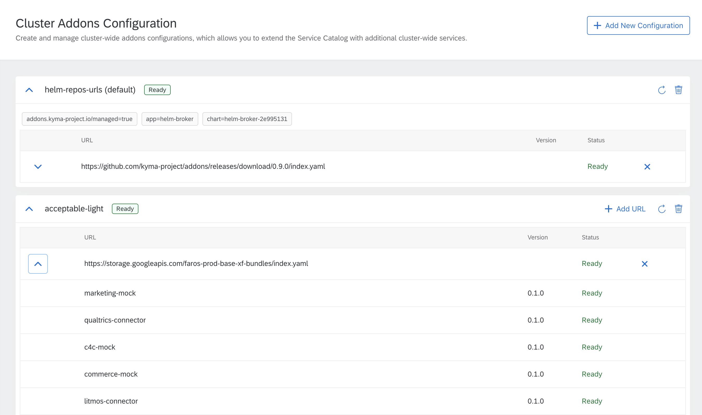

Bonjour à tous! Welcome to Paris where we land surrounded by breathtaking architecture and renowned galleries. Slightly intimidated by the beauty of the cultural capital of Europe, we stopped to proudly exhibit Kyma 1.9 with its new features. In this release we focused on Compass functionalities, monitoring updates, and new request headers and query parameters in the Application Connector. We also worked on creating Rafter - a standalone project for managing assets through custom resources - and integrated it in Kyma. Read the full release notes for the complete list of improvements offered by the 1.9 release. Voilà!

<!-- overview -->

See the overview of all changes in this release:

- [Application Connector](#application-connector) - New custom request headers and query parameters for APIs secured with OAuth
- [CLI](#cli) - Support for cluster provisioning on Microsoft Azure
- [Compass](#compass) - Provisioner enhanced, Application Templates added, redesigned list view in the Compass UI, and more
- [Console](#console) - Improved Addons Configuration view
- [Eventing](#eventing) - Knative Eventing Mesh available for testing purposes
- [Installation & Documentation](#installation-documentation) - Gardener provisioning based on Kyma CLI documented, finite number of revisions set in Tiller
- [Monitoring](#monitoring) - Adjustments and upgrade to the latest version
- [Rafter](#rafter) - Asset Store and Headless CMS refactored and merged to create Rafter
- [Service Management](#service-management) - Changes in the deletion process of the ServiceBroker custom resource
- [Known issues](#known-issues) - Workarounds for backup issues with Ratfer, issues with custom metrics for Rafter services, problems with logging components
- [Migrations and upgrades](#migrations-and-upgrades) - Rafter-related scripts and guidelines for the 1.8.0 - 1.9.0 upgrade, new Tiller resource to apply before the upgrade

## Application Connector

Starting from this release, we support additional headers and query parameters in OAuth token calls. Now you can customize the flow in an easy way. Check the Application Connector [documentation](https://github.com/kyma-project/kyma/blob/release-1.9/docs/application-connector/08-04-register-secured-api.md#register-an-oauth-secured-api) to find the tutorial and examples.

## CLI

### Azure support

Finally, you can provision a Kubernetes cluster on Azure basing on AKS. It follows the same command pattern as Google Cloud Platform basing on GKE. Give it a try and run `kyma provision azure`. See [this](https://github.com/kyma-project/cli/blob/master/docs/gen-docs/kyma_provision_gardener_az.md) document for more details.

## Compass

### Provisioner

You can now install Kyma on clusters provisioned through the Provisioner. After cluster creation is finished, the Provisioner installs a basic Kyma deployment. You can provision clusters in the Gardener environment using Azure or GCP credentials.

Also, the `cleanupRuntimeData` mutation does not only return a cryptic operation ID but also provides a status. You get information on whether your request input has errors or if the data was deleted successfully. You only need one call to get detailed knowledge of the clean-up result.

### Runtime eventing configuration available for Applications in the same scenario 

When you create a scenario and then assign Applications and Runtimes to it, the first registered Runtime is nominated as the default eventing system. That information is spread over all Applications and can be consumed by external Applications that start to send events.

However, the Compass scenario Administrator still can decide that another Runtime from a given scenario should play the role of the default eventing system. Changing the Runtime adjusts Applications automatically.

### Application Templates API

Now you can preconfigure Application input with Application Templates. It allows you to easily create similar Applications by defining placeholders and filling in the static configuration data.

### Harmonization of list views in the Compass UI

For this release, we redesigned our list component to improve and harmonize UX around list views in the Compass UI.



### Other Compass improvements

Kyma 1.9 also introduces improvements to the Compass Director API. Now the mutation and query names are more descriptive, the GraphQL input is properly validated for all mutations, and the Tenant Mapping Handler error handling is much more efficient.

## Console

### Redesigned Addons Configuration  

We redesigned the Addons Configuration view. Now you get a more detailed status of each addon that you configured through addon repositories.



## Eventing

### Knative Eventing Mesh (Alpha)

In this release, we introduced Knative Eventing Mesh as an alpha feature which you can use for testing purposes only. It leverages Knative Eventing components to build an eventing mesh that provides event routing and pub/sub capabilities. This mesh layer abstracts the underlying messaging system and allows you to configure different persistence for each Namespace. The new Eventing Mesh runs in parallel with the existing Event Bus. The Kyma Event Bus still supports sending Events to the regular eventing endpoint, while a separate Kyma endpoint handles sending Events to the new Knative Eventing Mesh. Read more about it [here](https://github.com/kyma-project/kyma/blob/release-1.9/docs/event-bus/03-04-knative-eventing-mesh.md#overview).

## Installation & documentation

### Gardener provisioning based on Kyma CLI documented

After introducing Gardener cluster provisioning through the Kyma CLI in the previous release, in this release, we added the official documentation for this feature. The instructions for provisioning a Gardener cluster on GCP or Azure are now based on Kyma CLI. Check it out in [this](https://github.com/kyma-project/kyma/blob/release-1.9/docs/kyma/04-04-cluster-installation.md#prepare-the-cluster) document under the **Gardener** tab.

### Finite number of revisions in Tiller

Until now, Tiller kept an infinite number of revisions. This resulted at times in Helm not being able to upgrade charts after many retries. Setting a limit to the number of revisions resolved these issues. Another advantage of keeping only a few revisions is lower memory consumption for controllers listening on ConfigMap resources and fewer resources for Kubernetes to manage.

## Monitoring

### Full revamp of the monitoring component

As the official Prometheus Operator has changed a lot structure-wise recently, we finally took the chance to update to the latest version. Along with the update, the following points were addressed:

- All customized elements of the original chart are marked for easier updates
- All ServiceMonitor and PrometheusRule custom resources are distributed among the monitoring components having a consistent naming convention
- The latest standard Grafana dashboards are available
- All custom Grafana dashboards are now deployed by dedicated ConfigMaps and moved to the Kyma components they belong to, being installed along with a particular component
- The Prometheus operator component got removed and was merged into the monitoring component
- The following default settings have adjusted values:
  - memory limit - `4GB`
  - data retention time - `2d`
  - data retention size - `7GB`

  Still, these settings can be changed during installation.

## Rafter

In the last two months, we focused on refactoring the Asset Store and Headless CMS components. Our goals were to:

- Optimize those components for resources consumption,
- Move those components to a separate repository as they do not depend on Kyma. As a result, we aimed to have an independent project with its own release cycles that is open for the wider community.

During the refactoring, we noticed that after a few months of developing and making changes in the Headless CMS, that had been built on top of the Asset Store, it was generic enough to become a part of the Asset Store. We renamed a DocsTopic custom resource (CR) to an AssetGroup CR which allowed us to have a single controller manager instead of two. The final result was that we merged those two components into one under a new name [Rafter](https://github.com/kyma-project/rafter/).

Due to the fact that we use [MinIO](https://min.io/) as a backend for Rafter, we get an S3-like files/assets store managed with [CRs](https://kubernetes.io/docs/concepts/extend-kubernetes/api-extension/custom-resources/).

This release introduces Rafter in Kyma. For more details, read the [documentation](https://github.com/kyma-project/kyma/tree/release-1.9/docs/rafter/). To make sure the switch is seamless, we prepared automated migration for your convenience. For more details, see the [Migrations and upgrades](#migrations-and-upgrades) section.

## Service Management 

### ApplicationBroker doesn't delete the ServiceBroker custom resource (CR) if the user still has ServiceInstances created using this broker  

If the ServiceBroker CR is deleted before the removal of the corresponding ServiceInstance, the ServiceInstance can not be deprovisioned from the Service Catalog. Since this release, the Application Broker does not remove the ServiceBroker CR if there are any ServiceInstances created using this broker. Only once no related ServiceInstances are remaining, the Application Broker removes the ServiceBroker CR and deactivates the Application.

## Known issues

### Backup & Rafter

Due to some issues with Velero, right after restoring Kyma you need to follow some additional manual steps related to Rafter:

1. Remove the cluster-wide default bucket:

   ```bash
   kubectl delete clusterbuckets.rafter.kyma-project.io --selector='rafter.kyma-project.io/access=public'
   ```

2. Remove buckets from the Namespaces where you use them:

   ```bash
   kubectl delete buckets.rafter.kyma-project.io --selector='rafter.kyma-project.io/access=public' --namespace=default
   ```
### Custom metrics for Rafter services

Following the migration from Asset Store and Headless CMS to Rafter, custom metrics for Rafter services do not show on Grafana dashboards due to renaming issues. We are planning to fix it in the next release.

### Logging

The Promtail Pod gets stuck in the CrashLoopBackoff phase. The reason is that the content of the `positions.yaml` file used by Promtail gets corrupted on the last line. You should see the following error message:

```text
caller=main.go:56 msg="error creating promtail" error="yaml: line 107: could not find expected ':'"
```

A temporary workaround for the issue is as follows:

1. Create a Pod which runs on the same Node as the problematic Promtail Pod and mounts the `/run/promtail` folder on hostPath.
2. Modify the Pod definition by deleting the last line of the `/run/promtail/positions.yaml` file.
3. Delete the crashing Pod.

## Migrations and upgrades

### Rafter clean-up

As mentioned in the [Rafter](#rafter) section, the Asset Store and Headless CMS components are replaced with a new one - Rafter. The most visible change is that DocsTopic and ClusterDocsTopic CRs are removed and replaced with AssetGroup and ClusterAssetGroup CRs. When migrating from Kyma 1.8.0 to 1.9.0 we automatically:

- Duplicate all files from system buckets (used by the Upload Service) in a new MinIO instance to assure the recovery of assets created by the Application Registry,
- Duplicate all old resources in the new component, under the new name and API groups,
- Remove the Asset Store and Headless CMS components after successful migration.

To guarantee the necessary data duplication and fulfil the need to run all components during the upgrade, make sure your cluster has enough resources. The migration scripts are available [here](https://github.com/kyma-project/kyma/tree/release-1.9/resources/rafter/templates).

>**NOTE:** Old CustomResourceDefinitions (CRDs) are not removed automatically during the upgrade process. Leaving the CRDs does not influence the upgrade. These CRDs will be removed with 1.10 release. However, you can remove them manually anytime using this command:
>
>```bash
>kubectl delete crd clusterdocstopics.cms.kyma-project.io && kubectl delete crd docstopics.cms.kyma-project.io && kubectl delete crd clusterbuckets.assetstore.kyma-project.io && kubectl delete crd buckets.assetstore.kyma-project.io && kubectl delete crd clusterassets.assetstore.kyma-project.io && kubectl delete crd assets.assetstore.kyma-project.io
>```

### Tiller

As we modified the Tiller Deployment by adding a new environment variable that sets the [Tiller revisions limit](#finite-number-of-revisions-in-tiller), apply the new Tiller resource before performing the upgrade:

```bash
kubectl apply -f https://raw.githubusercontent.com/kyma-project/kyma/1.9.0/installation/resources/tiller.yaml
```
