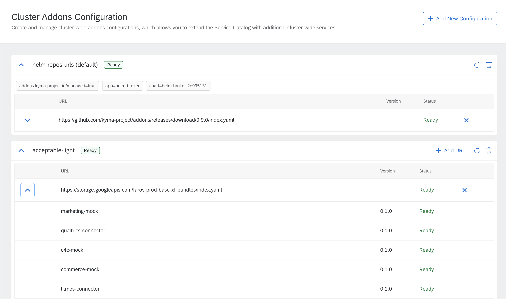

Bonjour à tous!

<!-- overview -->

See the overview of all changes in this release:

- [Application Connector](#application-connector) -
- [Asset Store aka Rafter](#asset-store-aka-rafter) -
- [CLI](#cli) -
- [Compass](#compass) -
- [Console](#console) -
- [Installation & Documentation](#installation-&-documentation) -
- [Monitoring](#monitoring) -
- [Service Management](#service-management)
- [Known issues](#known-issues) - Information about problems with Kyma instances installed on Gardener-provisioned clusters.
- [Migrations and upgrades](#migrations-and-upgrades) - Prometheus PVC increased to 10GB

## Application Connector

We've added support for additional headers and query parameters in OAuth token calls. The flow can now be customized in an easy, native way. You can find the guide and examples in Application Connector documentation. 

## Asset Store aka Rafter

Last 2 months we focused on refactoring Asset Store and Headless CMS components. Our goal was to:

- Optimize those component for resources consumption  
- Move those components to separate repository as they do not depend on Kyma. As a result we wanted to have an independent project with its own release cycles and opened for wider community.

During refactoring we noticed that after few months of development and changes in Headless CMS (that was built on top of Asset Store) it is generic enough so that it can become a part of Asset Store. We renamed DocsTopic CR to AssetGroup. As a result we got a single controller manager instead of two we had in the past. The final result is that we merged those 2 components in one under new name [Rafter](https://github.com/kyma-project/rafter/).

Thanks to the fact that we use [MinIO](https://min.io/) as a backend for Rafter, we get a S3-like files/assets store, all managed with [CRDs](https://kubernetes.io/docs/concepts/extend-kubernetes/api-extension/custom-resources/).

This release introduces Rafter in Kyma. For more details read [the docs](https://kyma-project.io/docs/components/rafter/). To make sure the switch is seamless we prepared an automated migration for your convinience. For more details see the [Migrations and upgrades](#migrations-and-upgrades) section.

## CLI

### Azure support

Finally you can provision a kubernetes cluster on Azure on base of AKS. It is following the same command style as with Google Cloud Platform on base of GKE. So please give it a try by calling "kyma provision azure" 

## Compass

### Provisioner

Installing Kyma on provisioned clusters is now available, after cluster creation is finished the Provisioner will attempt to install basic Kyma deployment. At this point the supported environment for installation is Gardener with Azure or GCP credentials. 

cleanupRuntimeData mutation is no longer returning only cryptic ID of the operation, now it also provides a clear status on whether there was any error regarding request input or the data was deleted successfully – now you only need one call to get proper knowledge on the result of the cleanup.

### Runtime eventing configuration available in applications in the same scenario  

Now when you create Scenario and then assign Applications and Runtimes, first registered Runtime will be nominated as a default Eventing System for all Applications. That information is propagated to all Application and could be consumed by External Applications that can start to send events.

On the other hand compass Ccenario administrator could decide that another Runtime from given Scenario will play a role of the default Eventing System, and of course that change will adjust Applications.

### Introducing Application Templates API

Now you can preconfigure Applications input with Application Templates. It allows you to easily create similar Applications by defining placeholders and filling in the static configuration data.

### Play around with Director API

Visit the Director API GraphQL playground and try out the Director API! We have prepared API documentation along with examples that you can access there.

### Harmonization of list views in compass UI

We have redesigned  our list component to improve and harmonise UX around list views in compass UI.

### Other Compass improvements

We have provided improvements to the Compass Director API. Now the mutation and query names are more descriptive, the GraphQL input is properly validated for all mutations, and the Tenant Mapping Handler error handling is much better.

## Console

### Redesigned Addon Configuration  

We have redesigned the Addon configuration view. Now, with the recent changes, you can see more status information of each addon that you configured via addon repositories.

## Installation & Documentation

### Gardener Provisioning now based on Kyma-CLI

After having the feature of provisioning a Gardener cluster via CLI introduced last release, we documented it officially now. The instructions for provisioning a Gardener cluster on GCP or Azure is now based on the Kyma-CLI.  

## Monitoring

### Full revamp of the monitoring component

As the official prometheus-operator changed a lot structure-wise in the past, we finally took the chance to update to the latest version. By doing that the following points are addressed:

- All customization of the original chart are clearly marked as customization for an easier update
- All custom ServiceMonitor and PrometheusRule resource are distributed into the components having a consistent naming
- The newest standard Grafana Dashboards are available
- All custom Grafana Dashboards are now deployed by dedicated ConfigMaps and moved into the Kyma component it belongs to, being installed together with the component
- The "prometheus-operator" kyma component got removed and merged into the "monitoring" component
- Default settings changed to a memory limit of 4GB, a data retention time of 2 days and a data retention size of 7GB. These settings can be adjusted as part of installation.

## Service Management  

### ApplicationBroker doesn't delete the ServiceBroker custom resource if the user still has ServiceInstances created using this broker  

If the ServiceBroker custom resource is deleted before the removal of the corresponding ServiceInstance, the ServiceInstance can not be deprovisioned from the Service Catalog. Since this release, the Application Broker does not remove the ServiceBroker custom resource if there are any ServiceInstances created using this broker. Only after there are no related ServiceInstances remaining, the Application Broker removes the ServiceBroker custom resource and deactivates the Application.

## Known issues

Due to some issues with Velero, when recovering Kyma from the backup there are additional manual steps related to Rafter(link to docs please) that you need to perform at the moment after the recovery 

Remove cluster-wide default bucket: 

kubectl delete clusterbuckets.rafter.kyma-project.io --selector='rafter.kyma-project.io/access=public' 

Remove buckets from namespaces where you use them 
kubectl delete buckets.rafter.kyma-project.io --selector='rafter.kyma-project.io/access=public' --namespace=default

## Migrations and upgrades 

As mentioned in section [Asset Store aka Rafter](#asset-store-aka-rafter), old components are replaced with new. The most visible change is that DocsTopic and ClusterDocsTopic [CRDs](https://kubernetes.io/docs/concepts/extend-kubernetes/api-extension/custom-resources/) are removed and replaced with AssetGroup and ClusterAssetGroup [CRDs](https://kubernetes.io/docs/concepts/extend-kubernetes/api-extension/custom-resources/). When migrating from Kyma 1.8.0 to 1.9.0 we will automatically:

- Duplicate all the files from system buckets (used by Upload service) in new Minio instance to assure any recovery of Assets created by Application Registry
- Duplicate all old resources in new component, under new name and apigroups
- After successful migration the Asset Store and Headless CMS components will be removed.

Because of necessary data duplication and also the need of runing all components during upgrade, make sure your cluster has needed resources. The migration scripts are available [here](TODO link to location of migration scripts once they are merged)
