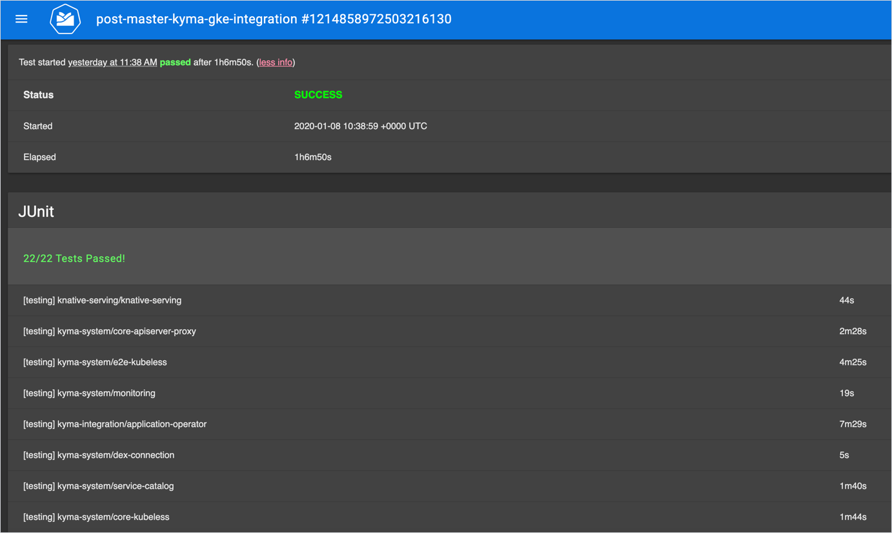

In Kubernetes, you often come across projects that are true mosaics of cloud-native applications. We don't meet too many stand-alone services in such a microservice architecture, as most of them have dependencies that aren't immediately obvious. Integrating such pieces and checking if they all work together may be a daunting challenge.

<!-- overview -->

Kubernetes projects usually consist of a number of Helm charts that you can roughly divide into these categories:

- Charts of well-known open-source products, such as Istio or Jaeger, that provide service communication, tracing, and many other features you use along with the "Don't reinvent the wheel" rule  
- Charts with in-house components, such as Kubernetes controllers and microservices exposing REST or GraphQL APIs, that you develop to fill in the gaps not addressed yet by the external projects but required for your application to work
- Charts with full-blown solutions that can perfectly work on their own

Such a mixture creates a web of dependencies. For example, imagine a situation in which all your components depend on the properly configured Istio. Upgrading it would be a nightmare without a set of automated integration tests. Such tests create a Kubernetes cluster, deploy your suite of services on it, and run integration tests. This allows you to check resource dependencies, provide consistent deployment order, and ensure all pieces of your puzzle fit together at all times.

When thinking about a proper integration testing tool for your project, you also want to have an all-purpose solution that meets the needs of both developers and users. You want to deploy integration tests on any Kubernetes cluster - locally to allow developers or system administrators to validate their work easily and immediately, and on clusters provisioned on cloud providers to assure users can use your application safely in their production environment.

## Helm tests & related issues

When we started to work on Kyma, we had all those things in mind. We decided to define integration tests as [**Helm tests**](https://helm.sh/docs/topics/chart_tests/). In this approach, a test is a [Kubernetes Job](https://kubernetes.io/docs/concepts/workloads/controllers/jobs-run-to-completion/) with the `helm.sh/hook: test` annotation. You place the test under the `templates` directory of the given Helm chart. Helm creates such a test in a Kubernetes cluster, just like it does with any other resource.

The reason why we took this testing path was quite simple - we used Helm extensively in our project, and the Helm's built-in tool for testing was a natural choice. Also, writing Helm tests turned out to be quite easy.

As our project grew, we came across a few obstacles that painfully hindered our work and couldn't be easily addressed with Helm tests at that time:

- Running the whole suite of integration tests took ages, so we needed an easy way of selecting tests we want to run.
- The number of flaky tests increased, and we wanted to ensure they are automatically rerun.
- We needed a way of verifying the tests' stability and detecting flaky tests.
- We wanted to run tests concurrently to reduce the overall testing time.

At that point, we decided we need a more powerful tool. Since we couldn't find a project that would serve all our needs, we developed one on our own.

## The rise of Octopus

This is how [Octopus](https://github.com/kyma-incubator/octopus/blob/master/README.md) was born. In short, Octopus is a Kubernetes controller which operates on two custom resources called [TestDefinition](https://github.com/kyma-incubator/octopus/blob/master/docs/crd-test-definition.md) and [ClusterTestSuite](https://github.com/kyma-incubator/octopus/blob/master/docs/crd-cluster-test-suite.md).

TestDefinition, as its very name indicates, defines a test for a single component or a cross-component scenario. In the simplest scenario, you have to provide a Pod template that specifies the image with the test:

```
apiVersion: testing.kyma-project.io/v1alpha1
kind: TestDefinition
metadata:
  labels:
    component: service-catalog
  name: test-example
spec:
  template:
    spec:
      containers:
        - name: test
          image: alpine:latest
          command:
            - "pwd"
```

ClusterTestSuite, on the other hand, defines which tests to run on a cluster and how to do that. In the example, we define that we want to run all tests with the `component=service-catalog` label, and we specify that every test should be executed once (`count=1`). If a test from the suite fails, we will retry it once (`maxRetries=1`). Tests can be executed concurrently, in the maximum number of two at a time (`concurrency=2`).

```
apiVersion: testing.kyma-project.io/v1alpha1
kind: ClusterTestSuite
metadata:
  labels:
    controller-tools.k8s.io: "1.0"
  name: testsuite-selected-by-labels
spec:
  count: 1
  maxRetries: 1
  concurrency: 2
  selectors:
    matchLabelExpressions:
      - component=service-catalog
```

When Octopus notices a new ClusterTestSuite, it first calculates which tests should be executed and then schedules them according to the test suite specification. All information about the status of test execution is stored in the **status** field. This status informs you which tests will be executed, which of them have already been executed, which succeeded or failed, which were retried, and how much time all tests and every single one took. See this example:

```
apiVersion: testing.kyma-project.io/v1alpha1
kind: ClusterTestSuite
metadata:
  name: testsuite-all
status:
  completionTime: 2019-03-06T12:37:20Z
  conditions:
  - status: "True"
    type: Succeeded
  results:
  - executions:
    - completionTime: 2019-03-06T12:37:20Z
      id: octopus-testing-pod-jz9qq
      podPhase: Succeeded
      startTime: 2019-03-06T12:37:15Z
    name: test-example
    namespace: default
    status: Succeeded
  startTime: 2019-03-06T12:37:15Z
  ```

With Octopus, all test preparation steps come down to creating:

1. Test in the language of your choice (yes, Octopus is language-agnostic).
2. TestDefinition that specifies the image to use and commands to run.
3. ClusterTestSuite that defines which tests to run on a cluster, and how you want to run them.

In Kyma, we created integration jobs in the continuous integration tool called [Prow](https://github.com/kyma-project/test-infra/blob/master/prow/README.md). These Prow jobs are run before and after merging any changes to the `master` branch. Upon triggering, a Prow job runs the [`testing.sh`](https://github.com/kyma-project/kyma/blob/master/installation/scripts/testing.sh) script that creates a ClusterTestSuite, builds a cluster, and runs all integration tests on it.

## Features & benefits

Migration from Helm tests to Octopus went smoothly and came down to minor modifications in Job definitions, such as changing them to the `TestDefinition` kind and removing the Helm annotation from them. However, the benefits that Octopus gave us were massive and just the ones we expected:

1. **Selective testing**

   In the ClusterTestSuite, you can define which tests you want to execute. You can select them by providing the **labels** expression or listing TestDefinition names. If you don't list any, Octopus will run all tests by default. Selective testing is particularly helpful in a situation when you have 50 TestDefinitions on your cluster, but you want to check only the tests for the component you are working on. Thanks to selective testing, you can get feedback on your changes almost immediately.

2. **Automatic retries of failed tests**

   At one point, we had huge problems with flaky tests in Kyma. To merge a pull request, all 22 tests had to pass on a given Kubernetes cluster. If every test fails in only 2% of executions, the probability that all 22 tests pass is only 64%. Executing tests takes no longer than 20 minutes, but when you add the time required for creating a cluster and provisioning Kyma, the overall time doubles. You can imagine the frustration of developers who had to retrigger the whole Prow job because of a failure of one test that was totally not connected with the changes included in their pull requests. By introducing retries through the **maxRetries** parameter, we didn't solve the issues with flaky tests completely, but we managed to reduce the number of situations in which retriggering a Prow job was required.

3. **Running tests multiple times**

   You can add the **count** field to the ClusterTestSuite to specify how many times every test should be executed. That can be particularly useful to detect flaky tests or ensure that a newly created test is stable.

4. **Full support for concurrent testing**

   You can add the **concurrency** field to the ClusterTestSuite to define how many tests can be executed. In our integration Prow jobs, we define the ClusterTestSuite with **concurrency** set to `5`. All tests are executed in around 20 minutes, but if they were executed one after another, they would take twice as long. Thanks to concurrency, we are saving time and money, developers have immediate feedback, and clusters created for executing tests are removed faster.

   You can also specify on the TestDefinition level if you want to exclude the given test from running concurrently as part of the ClusterTestSuite (**disableConcurrency**). That feature might be useful in cases when you don't want to run a test with dependencies on other tests from the suite.

   In general, the concurrency level which you define depends on the size of your cluster. Every Pod consumes some amount of CPU and memory, and you need to take those two parameters into account when defining the concurrency level.

5. **Visibility**

   Octopus gave us much more insight into test definitions and results than we had with Helm tests. After executing the ClusterTestSuite, you can easily analyze how much time each test takes and identify the problematic ones.

   - **CLI** - We integrated Octopus with Kyma Command Line Interface (CLI). This means that you can use simple commands to get test definitions (`kyma test definitions`), run tests with selected flags (`kyma test run --concurrency=5 --max-retries=1`), or watch the tests execution status (`watch kyma test status`).

    [Here](https://asciinema.org/a/287696) you can take a look at Kyma CLI in action.

   - **Dashboards** - We used the information available in the **status** field of the ClusterTestSuite to visualize test details on Prow dashboards. In the below example, you can clearly see all details of the `post-master-kyma-gke-integration` Prow job that builds our artifacts on a GKE cluster after every merge to the `master` branch.

   

## Room for improvement

As much as we love Octopus and appreciate how it did the trick for us, we realize it's not perfect (yet). We already have a few ideas in mind that would improve it even more. For example, we would like to introduce validation for both ClusterTestSuite and TestDefinition custom resources and add new fields that:

- Define the maximum duration for a ClusterTestSuite, after which test executions are interrupted and marked as failed (**suiteTimeout**).
- Indicate that a test shouldn't be executed (**skip**).
- Specify the maximum duration for a test, after which it is terminated and marked as failed (**timeout**).

We track all our ideas for enhancement as [GitHub issues](https://github.com/kyma-incubator/octopus/issues), so you can easily refer to them for details.

As an open-source project, we always welcome external contributions. If you only wish, you can help us in many ways:

- [Pick](https://github.com/kyma-incubator/octopus/issues) one of the existing issues, and try to propose a solution for it in a pull request.
- [Add](https://github.com/kyma-incubator/octopus/issues/new/choose) your own issue with ideas for improving Octopus.
- [Star](https://github.com/kyma-incubator/octopus) Octopus to support us in the attempt to join the [awesome Kubernetes](https://github.com/ramitsurana/awesome-kubernetes#testing) family of testing projects, where we believe Octopus could take pride of place.

If you have any questions or want to find out more about us, contact us on the [`#octopus`](http://slack.kyma-project.io/) Slack channel or visit our [website](https://kyma-project.io/).

But first of all, give [Octopus](https://github.com/kyma-incubator/octopus) a try to see if it does the trick for you as well.
