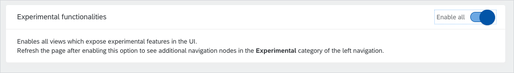
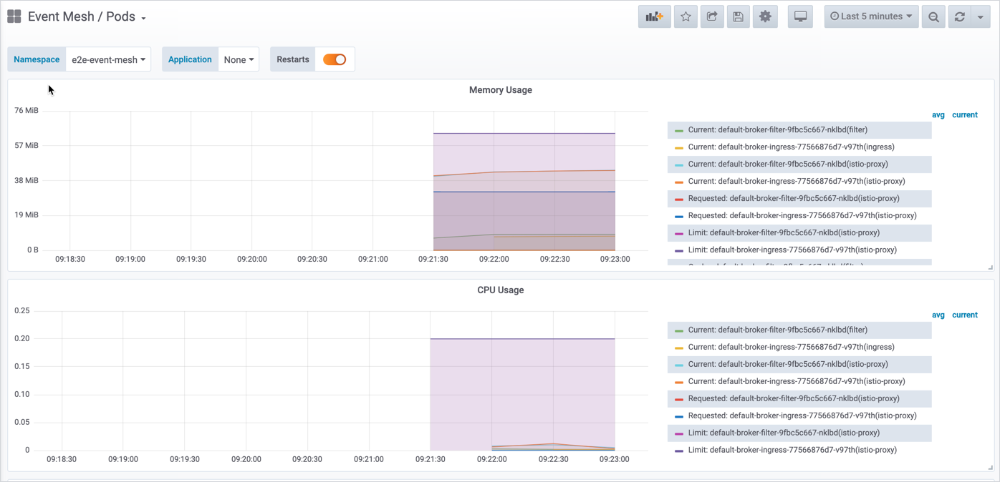

The journey all the way from Paris 1.9 to Quebec 1.10 turned out to be quite extensive but rewarding for the Kyma crew. We reached Quebec with renewed batteries, leveling them up to Kubernetes 1.16, Istio 1.4.3, Minikube 1.6, and Velero 1.2. We created production profiles for Istio and Ory, made a few tweaks in Compass, and introduced native DNS support for Kyma provisioned on Gardener clusters. Finally, we managed to add such optional features as the API Rules view in the Console UI or the new Knative Kafka channel for event forwarding. For this news and many more, read the full story behind Kyma 1.10 Quebec.

<!-- overview -->

>**CAUTION:** Before upgrading your Kyma deployment to 1.10, you must upgrade Tiller. Read the [**Migrations and upgrades**](#migrations-and-upgrades) section carefully for more details. If you upgrade to a newer release without performing the steps described in that section, you can compromise the functionality of your cluster or make it unusable altogether.

See the overview of all changes in this release:

- [Migrations and upgrades](#migrations-and-upgrades) - Tiller upgrade required before upgrading Kyma to 1.10
- [Known issues](#known-issues) - Monitoring-related issues with AKS metrics
- [Backup](#backup) - Updated Velero and improved Azure support
- [CLI](#cli) - Support for Minikube 1.6, removal of the `uninstall` command
- [Compass](#compass) - Automatic Runtime registration in the Director, custom configuration of Runtimes, automatic Runtime-Director connection, new templates for application registration
- [Console](#console) - Possibility to create access rules for APIs from the Console UI
- [Eventing](#eventing) - Knative Kafka Channel integration, new Grafana dashboards for the Knative Eventing Mesh
- [Installation](#installation) - Native Gardener DNS support, installation of components from remote locations, Kubernetes 1.16 compatibility
- [Logging](#logging) - Support for Fluent Bit as the new log collector
- [Service Management](#service-management) - ServiceInstance creation successful but not visible, Helm Broker now blocks the deletion of (Cluster)ServiceBrokers with dependencies
- [Service Mesh](#service-mesh) - Istio upgraded to 1.4.3, production profile for Istio, production profile for Ory

## Migrations and upgrades

As mentioned in the [Service Mesh section](#service-mesh), Istio has been upgraded to 1.4.3 which requires a new version of Tiller. Before upgrading to Kyma 1.10, you must upgrade Tiller using the `tiller.yaml` file from the Kyma GitHub release artifacts. Once you have Tiller upgraded, you can proceed with the Kyma upgrade.

## Known issues 

### AKS metrics

Current Monitoring deployment does not allow Prometheus to scrape metrics, such as CPU, memory, and Network, from kubelet on AKS. As a consequence, metrics are not displayed in Grafana. To solve this problem, you need to apply the patch for the `monitoring-kubelet` ServiceMonitor. For detailed instructions, see [this](https://github.com/kyma-project/kyma/issues/6846) issue.

## Backup

### Updated Velero and improved Azure support

In order to overcome issues related to AKS-based environments, we updated the Velero version to 1.2. The purpose of the upgrade was to ensure that the backup and restore procedure works smoothly on AKS clusters.

## CLI

### Support for Minikube 1.6

CLI and Kyma got tested with the latest Minikube version 1.6 that has now become the officially supported version. Try it out on your own. 

### Uninstall command removed

The `uninstall` command was one of the first commands available in Kyma CLI. It was based on a very simple implementation that turned out to work unreliably. Since we want to redesign it but there are other priorities at the moment, we decided to remove the command for now and restore it only when this feature is stabilized.

## Compass

### Runtime Provisioner registers Runtimes in the Director

With the 1.10 release, the default flow no longer requires manual registration of Runtimes in the Director – it is now done automatically by the Runtime Provisioner when the request for Runtime provisioning is received. Minor API changes are present here – the mutation now requires input parameters for the Runtime registration.

### Custom configuration of Runtimes

The new functionality was introduced in the Runtime Provisioner's API. Starting from this release, you can specify which components you would like to install on your Runtime. The Runtime Provisioner's API now accepts a list of components (with override values) that are passed onto the Kyma Installer. This is used to create the Installation CR and should contain only components that are already available in Kyma.

### Automatic Runtime-Director connection

With the new set of features for the Runtime Provisioner comes the automatic connection establishment – newly Provisioned Runtimes will have their Agents supplied with all necessary information to create and maintain a connection with the Director.

### Register applications from templates

It is now possible to register new applications using predefined templates. In this case, all you need to do is select a template and fill in values for all placeholders that a given template requires.

## Console

###  Create Access Rules for your APIs from the Console UI

Kyma comes with a built-in API Gateway Controller that allows you to define API Rules for your services. With this release, it is now possible to define those API Rules from the Console UI.

This view is still considered experimental. You can use it only after enabling **Experimental functionalities** under **General Settings**.  

With the new API Rules view, you can define three types of access strategies:
- `noop` that stands for "no operation" and means access without any token
- `OAuth2` for app-to-app access management
- `JWT` for authenticated users only

## Eventing

### Knative Kafka Channel integration

Thanks to Knative Eventing that allows you to provide implementations of various channels for event forwarding, Kyma now comes with an optional [Knative Kafka channel](https://github.com/kyma-incubator/knative-kafka) that was tested against Azure Event Hubs. You can read how to use it in the Knative Eventing Mesh [here](https://kyma-project.io/docs/components/event-bus/#details-knative-eventing-mesh-alpha-kafka).

### Grafana dashboards for Knative Eventing Mesh

The fact that Knative Eventing Mesh has many moving parts creates the need for increased observability over the mesh components. We've started introducing multiple Grafana dashboards that are dedicated to Knative Eventing Mesh. For a start, Kyma 1.10 comes shipped with a dashboard for Pods health monitoring in the Knative Eventing Mesh.

## Installation

### Native Gardener DNS support

The `xip-patch` component that is installed with the default Kyma setup now offers full Gardener DNS support. This refers to use cases when you have a Gardener cluster and install Kyma with its default configuration on it, without any custom overrides. The `xip-patch` component automatically recognizes your Gardener environment, creates custom resources that Gardener first reads and then in response:
- Assigns a domain to your cluster.
- Generates a corresponding wildcard certificate for the generated domain.
- Configures the Gardener-based DNS entry for your domain.

All of those steps are now done in an automated fashion, without any manual configuration required on your end.

### Install components from remote locations

The Kyma Installer has a new feature allowing you to install your components from remote locations that are either GitHub repositories or HTTP servers. Previously, in order to install a new component using Installer, you had to build the Installer on your own. Currently, the Installation CR contains the `source.url` field that allows you to specify the remote location of your Helm chart. The Installer tries to fetch sources from this location three times before the installation or upgrade fails. To learn more, see our [docs](https://kyma-project.io/docs/root/kyma/#configuration-install-components-from-user-defined-ur-ls).

### Kubernetes 1.16 compatibility

Kubernetes 1.16 provides new functionalities but also drops support for old API versions. During this release, we migrated the Kubernetes API versions used by Kyma to the latest ones to meet the compatibility requirements. Thanks to this, it is now possible to install Kyma on Kubernetes 1.16.

## Logging

### Support for Fluent Bit as the new log collector

To enable more integrations with external logging systems, the log collector Promtail that came together with Loki got replaced with [Fluent Bit](https://fluentbit.io/). Fluent Bit is a well-known component in the Kubernetes ecosystem and provides many integrations with other systems out of the box. The integration with the bundled Loki is still assured as part of the Kyma's Logging component.

## Service Management

### ServiceInstance creation successful but not visible

If your ServiceInstance creation was successful and yet the release is marked as `FAILED` on the releases list when running the `helm list` command, it means that there is an error on the Helm's side that was not passed onto the Helm Broker. To get the error details, check Tiller's logs.

### Helm Broker blocks the deletion of (Cluster)ServiceBrokers with dependencies

If a ServiceBroker or ClusterServiceBroker custom resource is deleted before the removal of the corresponding ServiceInstance, the ServiceInstance cannot be deprovisioned from the Service Catalog. As of this release, Helm Broker doesn't remove the (Cluster)ServiceBroker custom resource if there are any ServiceInstances created using this broker. The Helm Broker will remove the (Cluster)ServiceBroker custom resource only when there are no related ServiceInstances remaining.

## Service Mesh

### Istio upgraded to 1.4.3

The latest release comes with a new version of Istio 1.4.3. This change has impacted our Istio installation as now it is installed using [istioctl](https://istio.io/docs/reference/commands/istioctl/). The reason behind upgrading Kyma to the latest Istio version was that the support for 1.3 will end [soon](https://istio.io/news/support/announcing-1.3-eol/). To read more about all changes introduced in 1.4.3, read the official [Istio release notes](https://istio.io/news/releases/1.4.x/announcing-1.4.3/).

### Production profile for Istio

The default cluster configuration provides Istio that is good enough for playground purposes but not sufficient for a production-grade workload. This release comes with the production profile for Istio which increases application scalability (updated HPA), and provides higher CPU and memory limits/requests for the Istio control plane components. These changes improve the overall Istio components' performance and stability. The production profile configuration is optional, not enabled by default. To learn more about the profile, read our [docs](https://kyma-project.io/docs/components/service-mesh/#configuration-service-mesh-production-profile).

### Production profile for Ory

The latest release also ships with the production profile for Ory. This involves increased CPU requests for the Oathkeeper and an automatically deployed PostgreSQL database in which Hydra stores data. This profile isn't enabled by default. Currently, if you enable the production profile during the Kyma upgrade, you will need to manually synchronize clients in Hydra. We will be working on this synchronization mode in the upcoming release.  
