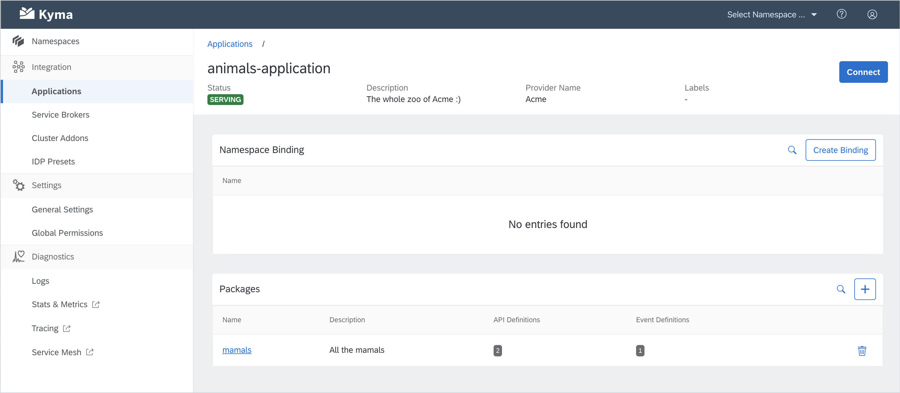
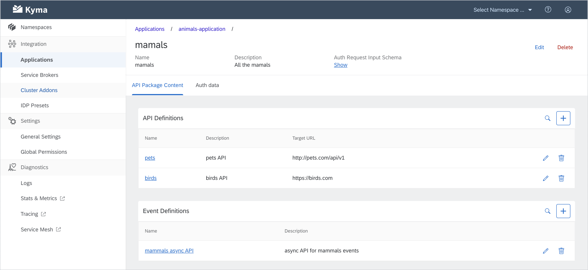
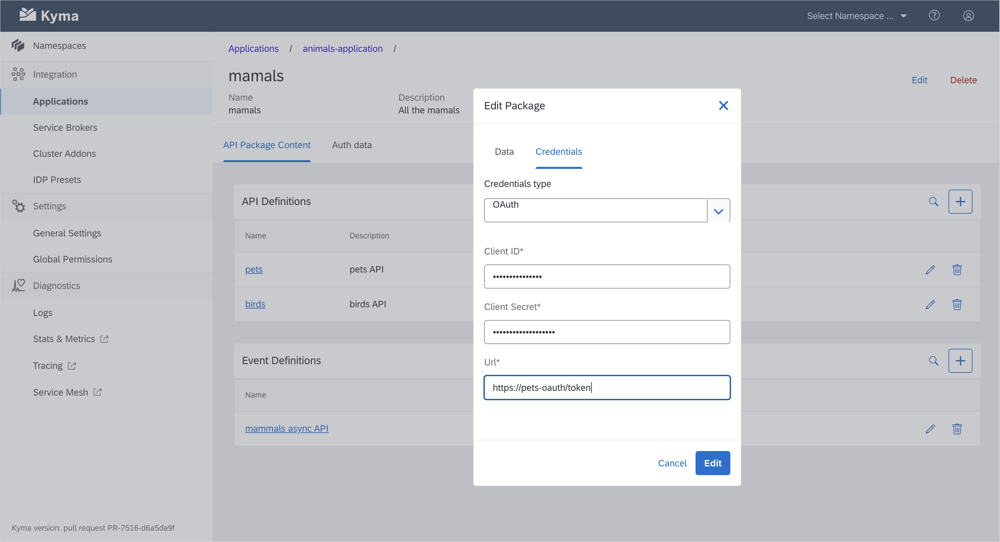
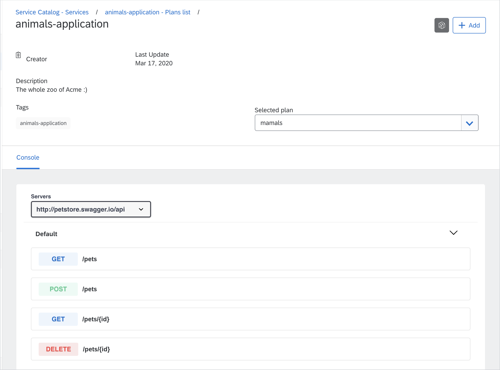

There's a saying that all roads lead to Rome. We don't know about all, but ours certainly does with the release of Kyma 1.11. And just like this beautiful city, this release has lots to offer. The Roman emperor Augustus said: “I found Rome a city of bricks and left it a city of marble.” We, too, strive to make Kyma even better with each release. We introduced many security improvements, stabilized logging and monitoring, added a new retry mechanism in the Kyma installer and an experimental Function Controller - and these are just some of the changes. Read on to learn more about new functionalities, improvements, and changes that we introduce in Kyma 1.11.

<!-- overview -->

> **CAUTION:** Before upgrading your Kyma deployment to 1.11, you must perform the migration steps described in the [Migration Guide](https://github.com/kyma-project/kyma/blob/release-1.11/docs/migration-guides/1.10-1.11.md). If you upgrade to the new release without performing these steps, you can compromise the functionality of your cluster or make it unusable.

See the overview of all changes in this release:

- [Known issues](#known-issues) - Certificates for cluster provisioning handled by Gardener, Event processing fails after Kyma upgrade
- [Security](#security) - Support for Gardener TLS certificate renewal, API Server Proxy and IAM kubeconfig service removed from the Helm core release, support for OAuth2 ORY/Hydra server GCP Proxy, automatic migration of OAuth2 clients to PostgreSQL database, API Server Proxy authorization check removed, Namespace-admin group renamed, Helm Secret-generating jobs replaced by init containers, custom resources access restrictions
- [Service Mesh](#service-mesh) - Istio upgrade, distroless images, and installation refactor
- [CLI](#cli) - Upgrade required, externalization of AKS Terraform template into a module, Gardener provisioning support
- [Logging](#logging) - Stable Loki version
- [Monitoring](#monitoring) - Stable memory footprint, improved configuration profiles
- [Installation](#installation) - New retry mechanism in Kyma installer, integration pipelines running on Kubernetes 1.15 and 1.16
- [Serverless](#serverless) - Experimental Function Controller (Serverless v2) with a few options to play with lambdas
- [Application Connector](#application-connector) - NGINX controller removed
- [Compass](#compass) - Runtime Agent fetching cluster metrics, Hyperscaler Account Pool as a new functionality in Kyma Environment Broker, Connectivity Adapter returning wrong URLs fixed
- [Console](#console) - Storage for currently authenticated user changed to sessionStorage, security vulnerabilities fixed
- [Eventing](#eventing) - Migration to new Knative Eventing Mesh, Knative Eventing foundation layer upgrade
- [API Packages (beta)](#api-packages-beta) - API packages introduced

## Known Issues

### Certificates for cluster provisioning handled by Gardener

We have unified the way Gardener handles certificates required for cluster provisioning. Before 1.11, `apiserver-proxy` still had certificates issued under the xip.io domain with a self-signed certificate, whereas Gardener already managed other certificates. To simplify certificate management, we unified this approach to allow Gardener to manage all certificates. We have also modified TLS certificate handling to ensure Kyma components react to the TLS rotation Gardener provides. 
Bear in mind that the domain for which you request the certificate is subject to character restrictions. This means that if the domain name in the cluster override exceeds 54 characters, installation will fail with an error.
To avoid any potential issues with the upgrade, make sure your existing cluster domain name does not exceed 54 characters. If it does, you need to create a new cluster with a shorter domain name. 
For details, read the [Migration Guide](https://github.com/kyma-project/kyma/blob/release-1.11/docs/migration-guides/1.10-1.11.md).

### Event processing fails after Kyma upgrade

After the Kyma upgrade, there can be issues with event processing that are caused by Subscriptions not being removed and recreated properly. To resolve this issue, follow the steps in the [Migration Guide](https://github.com/kyma-project/kyma/blob/release-1.11/docs/migration-guides/1.10-1.11.md).

## Security 

### Support for Gardener TLS certificate renewal 

Gardener supports TLS certificate renewal, and from now on this feature is enabled in Kyma by default. When running on Gardener, the Dex certificate is no longer provided to the `iam-kubeconfig`, `apiserver-proxy`, and `console-backend-service` components. A separate certificate is requested for the `apiserver-proxy` service. Additionally, the certificate storage logic is simplified. The `application-connector-certs` Secret is removed. The CA certificate for the Application Connector is now stored in the `kyma-gateway-certs-cacert` Secret, while the TLS key and certificate are still located in the `kyma-gateway-certs` Secret. Other modes - with the `xip.io` domain or the domain of your choice - work as before. 

### API Server Proxy and IAM kubeconfig service removed from Helm core release 

Helm core release is an umbrella release for multiple components. This leads to problems with Helm maintenance when, for example, installation or upgrade fails. To simplify the Helm core release installation and avoid potential operational issues, we removed the API Server and IAM Kubeconfig service Helm charts from the release core. They are now separate charts on the installation CR list, and they are installed after the `core` chart.

### OAuth2 ORY/Hydra server GCP Proxy support 

Cloud SQL is a provider-supplied and maintained database which requires a special proxy deployment in order to provide a secured connection. In Kyma, we provide a pre-installed [deployment](https://github.com/rimusz/charts/tree/master/stable/gcloud-sqlproxy) of the proxy which is ready to use. It requires only a set of input parameters in order to connect to the chosen database. Find all configuration options [here](https://kyma-project.io/docs/1.11/components/security/#configuration-o-auth2-server-profiles). 

> **NOTE:** When using any kind of custom database (gcloud or self-maintained), it is important to provide the **hydra.hydra.config.secrets** variables. Otherwise, a random Secret will be generated. This Secret needs to be common for all Hydra instances using the same instance of the chosen database. 

### Automatic migration of OAuth2 clients to PostgreSQL database 

Kyma features a [preconfigured PostgreSQL](https://github.com/helm/charts/tree/master/stable/postgresql) database used to store Oauth2 client data. The database is installed by default and does not require manual configuration. All the client data registered by the Hydra Maester is migrated to the database as part of the update process. If you notice missing or inconsistent data, delete the Hydra Maester Pod to force reconciliation. 

### API Server Proxy authorization check removed

SubjectAccessReview (SAR) is a mechanism in Kubernetes designed to verify user permissions. It is done by calling the API Server and verifying if a user has the desired access to the called resources. Until now, the API Server Proxy made such a check for each call to the Kubernetes API Server, which increased the duration of those calls. This has been removed to increase the response times of the API Server Proxy. Note that the Kubernetes API Server still verifies user permissions. 

### Namespace-admin group renaming 

In this release, the Permission Controller creates role bindings to a new group called `runtimeNamespaceAdmin` instead of `namespace-admins`. If you used the `namespace-admins` group prior to this release, you must update the group naming in your identity provider. 

### Helm Secret-generating jobs replaced by init containers 

The one-time jobs which used to generate `tiller-secret` and `helm-secret` during Kyma installation are replaced by init containers in Tiller and Installer Pods. These Secrets are necessary for Helm clients to securely connect to Tiller. This change allows for upgrade scenarios in which the base Docker images are updated. The jobs-based solution did not allow for that. In addition, the Alpine images used by the init containers are upgraded to the latest version to fix the existing security issues. 

### Custom resources restrictions 

For security reasons, we restricted the default RBAC configuration responsible for access to Rafter, Knative Serving, and Tekton custom resources (CRs). Since these components serve only as internal dependencies in Kyma, both Kyma administrators and regular users will now have only read-only access to Rafter CRs and no access to Knative Serving and Tekton CRs. 

## Service Mesh 

### Istio upgrade 

Istio has been upgraded to 1.4.6 to provide the newest set of features and security patches. To learn more, read the Istio 1.4.6 [release notes](https://istio.io/news/releases/1.4.x/announcing-1.4.6/). 

### Istio distroless images 

In order to address security concerns and reduce the potential attack surface, all images used by Istio have been changed from Debian-based to [distroless](https://istio.io/docs/ops/configuration/security/harden-docker-images/). The smaller image size also positively affects the overall performance of the Service Mesh.

### Istio installation refactor 

* **Istio installation customization**

Istio installation can be customized with an installation override. This allows you to easily change the Istio configuration used in Kyma installation. The user-provided configurations are merged with the defaults. See the [documentation](https://kyma-project.io/docs/1.11/components/service-mesh/#configuration-service-mesh-production-profile-system-requirements) for the details and usage example. 

> **NOTE:** This feature deprecates the old way of configuring Istio with Helm overrides. 

* **Istio init removal**

The `istio-init` and `istio` charts have been merged to make the installation faster and less error-prone.

## CLI 

### Upgrade required 

In 1.11, we introduced changes to the Kyma installation process to avoid issues during Kyma upgrade. We ensured compliance with the most recent Kyma CLI version, but older CLI versions do not support this change.  

Make sure you upgrade CLI to the most recent version before installing Kyma. For more information, read the [Migration Guide](https://github.com/kyma-project/kyma/blob/release-1.11/docs/migration-guides/1.10-1.11.md#cli). 

### Externalization of AKS Terraform template into a module 

Starting with this release, the provisioning library located in Hydroform supports Terraform modules. As the first candidate, the full AKS Terraform manifest got externalized into a [Terraform module](https://github.com/kyma-incubator/terraform-modules) so that it can be maintained without touching the code. 

### Gardener provisioning support 

Just recently, Gardener removed support for the older versions of the **spec** field value in the Shoot custom resource, which meant you could not use the Kyma CLI to provision Gardener clusters. We introduced support for the newest **spec** version to ensure you can still use the CLI to provision clusters on Azure, GCP, and AWS. 

## Logging 

### Stable Loki version 

We upgraded Loki, our logging solution, from the beta version to the stable version 1.3.0. 

## Monitoring 
 
### Stable memory footprint 

In order to ensure a stable memory footprint, we used Grafana Dashboards and Alert Rules to check the actual use of metrics collected by ServiceMonitors deployed in Kyma. All metrics in use were whitelisted as part of the ServiceMonitor definitions. A lower number of metrics and Prometheus data time series brought in a reduced, stable, and predictable memory footprint. 

### Improved configuration profiles 

To ensure stable performance, we introduced the following changes to Monitoring: 

- Reduced memory limit for the default configuration
- Production profile with a retention time of 30 days
- Local profile allowing you to deploy Kyma with Monitoring locally on Minikube. This configuration includes a very low retention time and a very low memory limit.

For more information, refer to the [documentation](https://kyma-project.io/docs/1.11/components/monitoring/#configuration-monitoring-profiles). 

## Installation 

### New retry mechanism in Kyma installer 

The new retry mechanism ensures that a single component is retried instead of the whole installation. If the retries are not successful, the installation is stopped. Previously, it would be retried until successful. By default, there are 5 retries with increasing time between them. For more information, refer to the [documentation](https://kyma-project.io/docs/1.11/root/kyma/#installation-details-retry-policy). 

### Integration pipelines now run on Kubernetess 1.15 and 1.16 

In the previous release, we updated the Kubernetes API versions used by Kyma resources to the latest ones. We now moved a step further by updating the reference platforms for our testing pipelines. Starting from this release, all our integration pipelines automatically test Kyma on Kubernetes in either version 1.15 or 1.16, depending on the cloud provider. These are also the recommended Kubernetes versions for Kyma installation. 

## Serverless 

### Experimental Function Controller 

We introduced the experimental Function Controller that will soon replace the existing Kubeless-based serverless functionality in Kyma. The Function Controller (also known as Serverless v2) relies on [Knative Serving](https://knative.dev/docs/serving/) for deploying and managing lambdas, and [Tekton Pipelines](https://github.com/tektoncd/pipeline) for creating Docker images. The Function Controller allows you to create lambdas in all Namespaces, on clusters with both trusted and self-signed certificates.

To test it out, enable these charts before installing Kyma: 

- `tekton-pipelines` 
- `function-controller-init` 
- `function-controller` 

Refer to the documentation to learn more about [Serverless v2](https://kyma-project.io/docs/1.11/components/serverless-v2/) and [create a test lambda](https://kyma-project.io/docs/1.11/components/serverless-v2/#tutorials-create-a-lambda) on your own. 

### Play with lambdas 

Once you have enabled the Serverless v2 charts and have a sample lambda in place, you can play with it a bit: 

- [Expose](https://kyma-project.io/docs/1.11/components/serverless-v2/#tutorials-expose-the-lambda-with-an-api-rule) it to an external endpoint through an API Rule. 
- [Bind](https://kyma-project.io/docs/1.11/components/serverless-v2/#tutorials-bind-a-service-instance-to-a-lambda) it to a Service Instance. 

Use the reference tutorials to test these scenarios. 

## Application Connector 

### NGINX controller removed 

Since the whole NGINX-related functionality was migrated to the Istio-related services, we were able to remove unused NGINX deployments from the Application Connector. We also updated our documentation to reflect these changes.

## Compass 

### Runtime Agent fetches cluster metrics 

Runtime Agent now fetches cluster metrics. This addition also enables FluentBit to react to the fetched metrics as well as logs. The values are logged for available and used resources, such as memory, CPU, and storage. 

### Hyperscaler Account Pool (HAP)

Kyma Environment Broker has a new functionality. With the use of the Gardener API, it is now able to use a pool of credentials (HAP) that are available in the Gardener environment. For every new tenant making a provisioning request, one of the labeled subscriptions is chosen and assigned. There is no obligatory use of in-cluster Secrets for storing credentials anymore. 

### Connectivity Adapter returning wrong URLs fixed 

We fixed the issue that caused the Connectivity Adapter to return wrong URLs for certain fields. It now returns proper values for the **eventsInfoUrl**, **eventsUrl**, and **metadataUrl** fields. The issues with wrong formatting and missing values were both resolved. 

## Console 

### Storage for currently authenticated user changed to sessionStorage 

Storage which used to persist user information for the currently authenticated user was changed from local to sessionStorage. This improves security as your authentication data is stored only until you log out or close the browser window or tab. 

### Security vulnerabilities fixed 

We applied HTTP security headers for the Log UI, which solves the CVSS:3.0/AV:N/AC:L/PR:N/UI:N/S:U/C:L/I:L/A:N 6.5 (Medium) security issue. For reference, see [#1609](https://github.com/kyma-project/console/pull/1609).

## Eventing 

### Migration to new Knative Eventing Mesh 

With Kyma 1.11, we migrated the underlying eventing solution to the new [Knative Eventing Mesh](https://kyma-project.io/docs/1.11/components/knative-eventing-mesh/). As a result, all your Kyma Subscriptions were converted to Knative Triggers to ensure a seamless eventing experience.  

This migration has no negative impact on any existing connectors. You can still use the old eventing endpoints to publish the events your Application sends. The old eventing endpoints convert your request to a valid CloudEvent in version 1.0 and redirect this request to the new Eventing Mesh. 

### Foundation layer upgrade  

We upgraded the underlying Knative Eventing foundation layer to version 0.12 to allow you to use the new features Knative Eventing 0.12 provides. For details, read the Knative Eventing 0.12 [release notes](https://github.com/knative/eventing/releases/tag/v0.12.0).

## API Packages (beta)

### API Packages introduced

Kyma 1.11 comes with a new beta feature called **API Packages**. This feature can be enabled with a dedicated override `global.enableAPIPackages: "true"` and makes sense only if you have Compass installed in your Kyma Runtime. 

With this setup, you see a completely new UI for Applications. This view fetches data from the Compass module that is installed in your Runtime. 

With the new UI, you can define Applications through Compass. You can define APIs and organize them in packages.

API packages allow you to bundle APIs together. Build groups of APIs (also Async APIs) if you think they make sense together. For example, consumers could build a scenario using APIs belonging to a single package.

You can also define an authentication method per package.

API packages introduce a change also from the API consumers' standpoint. When browsing through Applications in Service Catalog, they will see additional navigation controls allowing them to select a specific package for an Application. 

