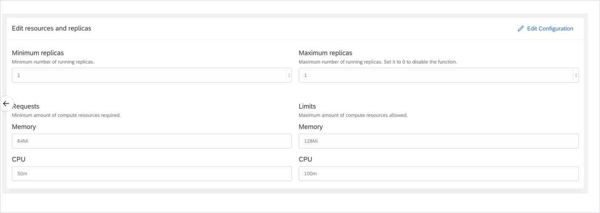

Even though the current situation calls for some stay-at-home time, we don't lose our sense of adventure. The Kyma ship leaves Rome and embarks on a long but satisfying journey all the way to Santiago de Chile, using the time well to provide you with some brand new features. Join us in this adventure, and once you get a glimpse of the majestic Andes surrounding the city learn what 1.12 offers you: exposing your services through API Gateway v2, refurbished Serverless with shiny new functionality and UI enhancements, a fresh set of features brought in by Compass, brand new Kiali and Tracing. For more details, read the full story behind Kyma 1.12 Santiago.

<!-- overview -->

> **CAUTION:** Before upgrading your Kyma deployment to 1.12, you must perform the migration steps described in the [Migration Guide](https://github.com/kyma-project/kyma/blob/release-1.12/docs/migration-guides/1.11-1.12.md). If you upgrade to the new release without performing these steps, you can compromise the functionality of your cluster or make it unusable.

See the overview of all changes in this release:

- [Service Mesh](#service-mesh) - Migration from API Gateway v1 to API Gateway v2, Istio upgrade, removed DestinationRule for Istio Ingress Gateway 
- [Installation](#installation) - Tiller upgrade to version 2.16.6
- [Eventing](#eventing) - Event Bus removed, documentation updates
- [Compass](#compass) - Provisioning of custom components, on-demand revision of Kyma installed on provisioned clusters, upgrades in Compass Provisioner, automatic status update for Applications and runtimes in Compass Director, automatic Scenario assignment in Compass Director 
- [Console](#console) -  Improved browsing of APIs within packages 
- [Observability](#observability) - Brand new Kiali, Jaeger is now Tracing
- [Monitoring](#monitoring) - Monitoring upgrade
- [Serverless](#serverless) - Serverless based on Function CR, changes in Console UI, documentation updates

## Service Mesh 

### Migration from API Gateway v1 to API Gateway v2

With this release, we removed API Gateway v1 and made API Gateway v2 the only way to expose your services. To simplify the transition process, we introduced the [API Gateway migrator](https://github.com/kyma-project/kyma/blob/master/components/api-gateway-migrator/README.md#api-gateway-migrator) job that automatically migrates Api custom resources to new APIRules. Although the migration process is fully automatic, some Api CRs may be too complex for it to handle. To make sure all your services are exposed using APIRules, follow the [migration guide](https://github.com/kyma-project/kyma/blob/master/docs/migration-guides/1.11-1.12.md#service-mesh).

### Istio upgrade

We have upgraded Istio from release 1.4.6 to 1.4.7 to ensure fixed security vulnerablities. To learn more, read [this](https://istio.io/news/releases/1.4.x/announcing-1.4.7/) document.

### Removed Destination Rule for Istio ingress gateway 

In this release we removed the DestinationRule for the `istio-ingressgateway` service located in the `istio-system` Namespace. The DestinationRule allowed sidecars to use **PERMISSIVE** mode when making internal requests to `istio-ingressgateway` using FQDN. You can still use DestinanationRule in your local (Minikube) installations. 

## Installation

### Tiller upgrade to version 2.16.6

We upgraded Tiller to version 2.16.6 that contains a fix for issue with fetching `metrics.k8s.io` resources. In most cases, [this error](https://github.com/helm/helm/issues/6361 ) caused the installation or upgrade of a given component to fail. With new, more stable version, no such error was yet observed.

## Eventing

### Event Bus removed

With 1.12, we removed Event Bus component, allowing Knative Eventing Mesh to handle event processing and delivery.

### Documentation updates

With Event Bus removed, we focused on improving Knative Eventing Mesh. This means providing you with additional documentation on [event processing and delivery](https://kyma-project.io/docs/master/components/knative-eventing-mesh/#details-event-processing-and-delivery). If you are interested in setting Kafka as your default Channel implementation, read this [tutorial](https://kyma-project.io/docs/master/components/knative-eventing-mesh/#tutorials-configure-the-kafka-channel).

## Compass

###  Provisioning of custom components 

With the recent addition to the Kyma Installer you can define the source URL of a component that you want to install. The Runtime Provisioner now fully supports this feature allowing you to include external components that should be deployed to provisioned clusters. 

### On-demand revision of Kyma installed on provisioned clusters 

From now on, you can specify a version of the Kyma Installer to be deployed on the provisioned cluster. This can help you to debug, track, or fix issues both during development and in an production-ready environment.

### Upgrades in Compass Provisioner 

We implemented the first version of [upgrade API](https://github.com/kyma-incubator/compass/blob/master/docs/internal/runtime-upgrade.md) in the Runtime Provisioner. Though simple, the API allows you to upgrade an existing runtime to the new Kyma version and replace the existing configuration with the one passed with the upgrade mutation. We also included a rollback option, but it may still require additional actions on the cluster. 

>**NOTE:** If the migration guide includes any additional instructions, make sure to apply them manually. 

### Automatic status update for Applications and runtimes in Compass Director 

When a paired Application or Runtime communicates with the Director API for the first time, the Director automatically sets their status to **CONNECTED**. This operation does not prevent you and Integration System from managing Application and Runtime status if they wish to do so. 

### Automatic Scenario Assignment in Compass Director 

The [Automatic Scenario Assignment (ASA)](https://github.com/kyma-incubator/compass/blob/master/docs/compass/03-03-automatic-scenario-assignment.md) feature allows you to define a condition that specifies when a Scenario is automatically assigned to a Runtime. For example you can specify a label that adds a given Scenario to each Runtime created by the given user, company, or any other entity. 

## Console 

### Improved browsing of APIs within packages 

In 1.11 release we introduced API packages to allow the Applications to register of APIs grouped in packages. This way, customers could instantiate entire packages and access multiple APIs at once. Now, with 1.12, browsing APIs within package in Service Catalog UI is even simpler. In case a package holds multiple APIs, you can find them quickly using a dedicated drop-down component with a search feature. 

## Observability

### Brand new Kiali 

For 1.12, we took the chance and upgraded the Kiali component to leverage the newest Kiali-Operator, making it possible for you to configure all options in a convenient way using the Installer overrides. Although we needed to rewrite the component implementation, these changes do not affect you in any way.

### Jaeger renamed to Tracing 

The Jaeger component also received new name and a full makeover. The new,  **Tracing** component features the most recent Jaeger-Operator and brings in features and fixes. As the BadgerDB persistence was causing more problems then satisfaction due to issues with data retention and memory consumption higher than expected, we switched back to the in-memory-based deployment model. Additionally, we ensured that you can use the Installer overrides to configure deployment strategies available in Jaeger-Operator. This all allows you to switch back to a BadgerDB based deployment or even switch to a production scenario based on Elastic Search. 

## Monitoring

### Monitoring upgrade

We updated the monitoring stack to the latest versions of Prometheus and Grafana. By doing that we ensured that all configured monitoring targets are healthy and working and all Grafana dashboards are finally tagged and named consistently. 

## Serverless

As mentioned in the last release notes, we switched to a new version of Serverless that relies on [Knative Serving](https://knative.dev/docs/serving/) for deploying and managing Functions and [Kubernetes Jobs](https://kubernetes.io/docs/concepts/workloads/controllers/jobs-run-to-completion/) for creating Docker images. For this reason, backend, frontend, and documentation of Serverless have received full makeovers. 

### Serverless based on Function CR 

Serverless is now based on a new [Function custom resource (CR)](https://kyma-project.io/docs/1.12/components/serverless/#custom-resource-function) that provides you with full control over resource management (including scale-to-zero), replacing the previous Function sizes management. We also switched to the Node.js 12 runtime and improved the [resource processing flow](https://kyma-project.io/docs/1.12/components/serverless/#details-function-processing) in which the Function's image is built in a separate phase, helping the Functions to run more smoothly. 

### Changes in Console UI 

Changes in the Console UI include: 

- New **Functions** view that allows you to easily manage Triggers, ServiceBindings, and environment variables for Functions. 

 

- New **Diff** option with the preview of changes in the Function's code. 

 

- New **Resources and replicas** section in which you can manage requests and limits for the Function's resources and scale the Function to zero. 

 

### Documentation 

There is a brand-new set of docs for the new solution with detailed architecture, Function CR description and configuration options, and step-by-step tutorials for both CLI and UI: 

- [Create a Function](https://kyma-project.io/docs/1.12/components/serverless/#tutorials-create-a-function) 
- [Expose a Function with an API Rule](https://kyma-project.io/docs/1.12/components/serverless/#tutorials-expose-a-function-with-an-api-rule) 
- [Bind a Service Instance to a Function](https://kyma-project.io/docs/1.12/components/serverless/#tutorials-bind-a-service-instance-to-a-function) 
- [Trigger a Function with an event](https://kyma-project.io/docs/1.12/components/serverless/#tutorials-trigger-a-function-with-an-event) 

> **CAUTION:** If you already use Kubeless Functions, you must migrate them manually. Read the [migration guide](https://github.com/kyma-project/kyma/blob/release-1.12/docs/migration-guides/1.11-1.12.md#serverless) for details. 