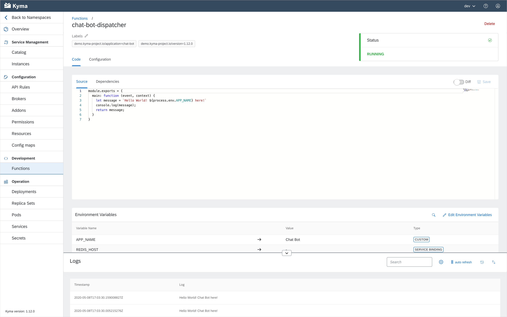

Even though the current situation calls for some stay-at-home time, we don't lose our sense of adventure. The Kyma ship leaves Rome and embarks on a long, exciting journey all the way to Santiago de Chile, using the time well to deliver a set of new features. Join us in celebration, and once you get a glimpse of the majestic Andes surrounding the city, explore what Kyma 1.12 has to offer. This release brings API Gateway v2 as the sole mechanism for exposing services, introduces refurbished Serverless and a fresh set of features brought in by Compass - all that topped off with brand new Kiali and Tracing. For more details, read the full story behind Kyma 1.12 Santiago.
<!-- overview -->

> **CAUTION:** Before upgrading your Kyma deployment to 1.12, you must perform the migration steps described in the [Migration Guide](https://github.com/kyma-project/kyma/blob/release-1.12/docs/migration-guides/1.11-1.12.md). If you upgrade to the new release without performing these steps, you can compromise the functionality of your cluster or make it unusable. However, this Migration Guide also contains steps you must complete to migrate your Kubeless Functions to the new solution - complete them after you upgrade to the new release.

See the overview of all changes in this release:

- [Service Mesh](#service-mesh) - Migration from API Gateway v1 to API Gateway v2, Istio upgrade, DestinationRule CR for Istio Ingress Gateway removed
- [Installation](#installation) - Tiller upgraded to version 2.16.6
- [Eventing](#eventing) - Event Bus removed, documentation updates
- [Compass](#compass) - Provisioning of custom components, on-demand revision of the Kyma version on provisioned clusters, upgrades in the Runtime Provisioner, automatic status update for Applications and Runtimes in the Director, Automatic Scenario Assignment in the Director 
- [Console](#console) - Improved browsing of APIs within packages 
- [Observability](#observability) - Brand new Kiali, Jaeger is now Tracing
- [Monitoring](#monitoring) - Monitoring upgrade
- [Serverless](#serverless) - Backend and frontend improvements, documentation updates

## Service Mesh 

### Migration from API Gateway v1 to API Gateway v2

With this release, we removed API Gateway v1 and made API Gateway v2 the only way to expose your services. To simplify the transition process, we introduced the [API Gateway migrator](https://github.com/kyma-project/kyma/blob/release-1.12/components/api-gateway-migrator/README.md) job that automatically migrates Api CRs to APIRule CRs. Although we automated the migration process, some Api CRs may be too complex to handle them automatically. To make sure all your services are exposed using API Rules, follow the instructions in the [migration guide](https://github.com/kyma-project/kyma/blob/release-1.12/docs/migration-guides/1.11-1.12.md#service-mesh).

### Istio upgrade

We upgraded Istio from version 1.4.6 to 1.4.7 to introduce fixes for security vulnerablities. To learn more, read [this](https://istio.io/news/releases/1.4.x/announcing-1.4.7/) document.

### DestinationRule for Istio Ingress Gateway removed

In this release, we removed the DestinationRule CR for the `istio-ingressgateway` service located in the `istio-system` Namespace. Destination Rules allowed sidecars to use the **PERMISSIVE** mode when making internal requests to `istio-ingressgateway` using a fully qualified domain name (FQDN). You can still use Destination Rules in your local (Minikube) installations. 

## Installation

### Tiller upgraded to version 2.16.6

We upgraded Tiller to version 2.16.6 that contains a fix for the issue with fetching the `metrics.k8s.io` resources. In most cases, [this error](https://github.com/helm/helm/issues/6361) caused the installation or upgrade of a given component to fail. With the new, more stable version, no such error has been observed.

## Eventing

### Event Bus removed

With 1.12, we removed the Event Bus component, allowing Knative Eventing Mesh to handle event processing and delivery.

### Documentation updates

With Event Bus removed, we focused on Knative Eventing Mesh. For 1.12, this also meant providing you with additional documentation on [event processing and delivery](https://kyma-project.io/docs/1.12/components/knative-eventing-mesh/#details-event-processing-and-delivery). If you are interested in setting Kafka as your default Channel implementation, read this [tutorial](https://kyma-project.io/docs/1.12/components/knative-eventing-mesh/#tutorials-configure-the-kafka-channel).

## Compass

### Provisioning of custom components 

With the recent addition to the Kyma Installer, you can define the source URL of a component that you want to install. The Runtime Provisioner now fully supports this feature, allowing you to include external components that you want to deploy on provisioned clusters. 

### On-demand revision of the Kyma version on provisioned clusters 

From now on, you can specify a version of the Kyma Installer to be deployed on a provisioned cluster. This can help you to debug, track, or fix issues both during development and in the production-ready environment.

### Upgrades in the Runtime Provisioner 

Starting with this release, the Runtime Provisioner allows you to upgrade your Kyma Runtime to the newer version using the [GraphQL API](https://github.com/kyma-incubator/compass/blob/master/docs/internal/runtime-upgrade.md). The new configuration passed with the upgrade mutation replaces the existing one. We also included a rollback option. Bear in mind that the rollback operation may still require additional actions performed on the cluster. 

### Automatic status update for Applications and Runtimes in the Director 

When a paired Application or Runtime communicates with the Director API for the first time, the Director automatically sets its status to **CONNECTED**. This operation does not prevent you or the Integration System from managing Application and Runtime statuses on your own.

### Automatic Scenario Assignment in the Director 

The [Automatic Scenario Assignment (ASA)](https://github.com/kyma-incubator/compass/blob/master/docs/compass/03-03-automatic-scenario-assignment.md) feature allows you to define a condition that specifies when a Scenario is automatically assigned to a Runtime. For example, you can specify a label that adds a given Scenario to each Runtime created by a given user, company, or any other entity. 

## Console 

### Improved browsing of APIs within packages 

In the 1.11 release, we introduced API packages to allow the Applications to register APIs grouped in packages. This way, you could instantiate entire packages and access multiple APIs at once. We now simplified browsing APIs within a package even further in the Service Catalog UI. If a package holds multiple APIs, you can find them quickly using a dedicated drop-down list with a search feature. 

## Observability

### Brand new Kiali 

For 1.12, we took the chance and upgraded the Kiali component to leverage the newest Kiali Operator, making it possible for you to configure all options in a convenient way using the Installer overrides. Although we had to rewrite the component implementation, these changes do not affect you as the user in any way.

### Jaeger renamed to Tracing 

The Jaeger component also received a full makeover and a new name. The new **Tracing** component is based on the most recent Jaeger Operator and brings in new features and fixes. As the BadgerDB persistence caused more problems then satisfaction due to issues with data retention and memory consumption higher than expected, we switched back to the in-memory-based deployment model. Additionally, we ensured that you can use the Installer overrides to configure deployment strategies available in the Jaeger Operator. All this allows you to switch back to a BadgerDB-based deployment or even introduce a production scenario based on Elastic Search. 

## Monitoring

### Monitoring upgrade

We updated the monitoring stack to the latest versions of Prometheus and Grafana. By doing that we ensured that all configured monitoring targets are healthy and working, and all Grafana dashboards are consistently tagged and named. 

## Serverless

As mentioned in the previous release notes, we switched to a new version of Serverless that relies on [Knative Serving](https://knative.dev/docs/serving/) for deploying and managing Functions, and [Kubernetes Jobs](https://kubernetes.io/docs/concepts/workloads/controllers/jobs-run-to-completion/) for creating Docker images. For this reason, backend, frontend, and documentation of Serverless have received full makeovers. 

### Backend

Serverless is now based on the new [Function CR](https://kyma-project.io/docs/1.12/components/serverless/#custom-resource-function) that provides you with full control over resource management, replacing at the same time the previous Function sizes management. We also switched to the Node.js 12 Runtime and improved the [resource processing flow](https://kyma-project.io/docs/1.12/components/serverless/#details-function-processing) in which the Function's image is built in a separate phase, helping the Functions to run more smoothly. 

### Frontend

Changes in the Console UI include: 

- New **Functions** view that allows you to easily manage Triggers, ServiceBindings, and environment variables for Functions. 

 

- New **Diff** option with the preview of changes in the Function's code. 

 

- New **Resources and replicas** section in which you can manage requests and limits for the Function's resources. 

 

### Documentation 

There is a brand-new set of docs for the new solution with detailed architecture, Function CR description and configuration options, and step-by-step tutorials for both CLI and UI: 

- [Create a Function](https://kyma-project.io/docs/1.12/components/serverless/#tutorials-create-a-function) 
- [Expose a Function with an API Rule](https://kyma-project.io/docs/1.12/components/serverless/#tutorials-expose-a-function-with-an-api-rule) 
- [Bind a Service Instance to a Function](https://kyma-project.io/docs/1.12/components/serverless/#tutorials-bind-a-service-instance-to-a-function) 
- [Trigger a Function with an event](https://kyma-project.io/docs/1.12/components/serverless/#tutorials-trigger-a-function-with-an-event) 

> **CAUTION:** If you already use Kubeless Functions, you must migrate them manually after you upgrade to the new release. Read the [migration guide](https://github.com/kyma-project/kyma/blob/release-1.12/docs/migration-guides/1.11-1.12.md#serverless) for details.