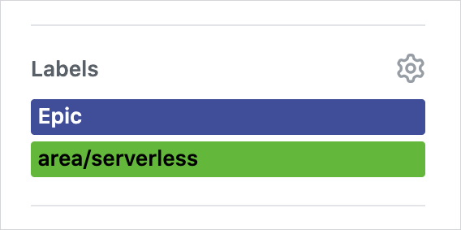
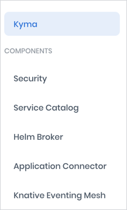

Our website has many "fathers" who have maintained it ever since it was born out of the burning need for a homepage for our soon-to-be-open-sourced Kyma. It has evolved in time, in an agile spirit, extended with new views and features that were added whenever the need arose or an idea for improvement popped into our heads. As much as we love it, we realize it might seem a bit complex, especially for those who contribute to it for the first time. That's why we use this post to explain which tools we decided to use, how the website is built, and where all the sources sit — all this aiming to "tame the beast" and bring it a bit closer to you.

<!-- overview -->

## Building tool

When it comes to the tool we wanted to build our website with, we decided to choose a static site generator (SSG) over a single-page application (SPA) to:
- Make the development process easier by providing a set of ready-to-use plugins and templates.
- Provide support for search engine optimization (SEO), increasing our website's visibility in search results.
- Ensure a quick load time.

Our choice fell on [Gatsby](https://www.gatsbyjs.org/), partly because it is based on React that our frontend developers were used to and particularly fond of. Gatsby also uses GraphQL to query and pull source data, and we already used it for our [Console Backend Service](https://kyma-project.io/docs/components/console/#details-console-backend-service) in Kyma to allow communication between Console UI views and k8s resources.

In its initial version, the website was quite simple and almost solely based on the logic provided by Gatsby. Basically, we defined React components for particular views following Gatsby's tutorials and templates and used the available plugins to extend the data and content. This allowed Gatsby to pull all the data from specified Markdown sources, build, and render the content on GitHub Pages.

## Deployment tool

Although initially we used GitHub pages to deploy and host our website, we turned to [Netlify](https://www.netlify.com/) that offers a favorable [policy plan](https://www.netlify.com/legal/open-source-policy/) for open-source projects.

As the website expanded, we simply needed a platform that would help us to tackle the challenges ahead of us. Netlify managed to do so by offering:

- [Continuous deployment](https://www.netlify.com/blog/2015/09/17/continuous-deployment/) thanks to which the website is built automatically every time you commit changes to the `master` branch. With GitHub Pages, we used Prow CI that we had to maintain ourselves, so we gladly moved to the one offered by Netlify.

- [Deploy Previews](https://www.netlify.com/blog/2016/07/20/introducing-deploy-previews-in-netlify/) built on pull requests (PRs), allowing you to detect any rendering issues before PRs are merged to the `master` branch.

- [AWS functions](https://docs.netlify.com/functions/overview/) for running on-demand code triggered by events coming from the GitHub API. In Kyma, we use them as a trigger for running the build and deployment of specific website views. Such a function is triggered whenever you:

  - Merge content to the `docs` folder in the `kyma` repository and to the `community` repository.

  - Create a release in the `kyma` repository. This triggers the full website rebuild and adds a new release switcher in the **Docs** view.

  

  - Modify issues with the `Epic` label. For example, when you add or remove capability labels or the release for which the epic is planned.

  

  - Change the `.yaml` files that provide the structure for the left-side topic navigation in **Docs** and **Community**.

  > **TIP:** Read more about these files in the [ClusterAssetGroups](#cluster-asset-groups) section.

  

## Custom rendering

To customize content rendering in some of the views, we put our own twists on the standard logic provided by Gatsby.

### Documentation component

In Kyma, we render the documentation sources both on the website under the **Docs** view and as built-in documentation in the UI on every Kyma cluster. To unify the way in which it is displayed in both places, we created our own React [documentation component](https://github.com/kyma-incubator/documentation-component) to render Markdown formats and specifications such as OpenAPI, AsyncAPI, and OData. We use this component on the website to render Markdown formats and OpenAPI specifications with [custom styles](https://github.com/kyma-project/website/tree/master/src/components/generic-documentation/render-engines) applied in chosen views. The documentation component also provides tabs, copy buttons next to code snippets, and scrollspy in **Docs** and **Community** views:

### React-markdown library

We also wanted to customize the way we render some Markdown elements. Since Gatsby couldn't cater for all our needs, and we couldn't find any other suitable tool, we created one on our own. We needed a unified library that we could use for both the website and the cluster documentation. We came up with the [react-markdown library](https://github.com/kyma-incubator/documentation-component/tree/master/packages/markdown-render-engine) as a wrapper for the [`react-markdown`](https://github.com/rexxars/react-markdown). We used it in the **Docs**, **Blog**, and **Community** views to customize such Markdown elements as panels, or icons next to external links.

### ClusterAssetGroups

We even found a place for a chunk of Kubernetes implementation in our frontend. In Kyma, we use our in-house k8s-based component [Rafter](https://kyma-project.io/docs/components/rafter/#overview-rafter-in-kyma) as a backend mechanism for uploading data for documentation topics. Rafter is based on AssetGroup and ClusterAssetGroup custom resources (CRs) — we decided to use their structure on the website to configure the left-side navigation for [documentation topics](https://kyma-project.io/community/guidelines/content#add-new-documentation-to-the-website-add-new-documentation-to-the-website) in the **Docs** and **Community** views, simply by fetching content from these `.yaml` files. Each [ClusterAssetGroup](https://github.com/kyma-project/kyma/tree/master/resources/core/charts/docs/charts/content-ui/templates) is a separate node in the navigation. The content loader uploads the source documentation for a given topic from the path specified in the ClusterAssetGroup CR under the **filter** path. It then renders the sources in the order and under the name specified in the CRs (`rafter.kyma-project.io/order: "2"` and `displayName: "Service Catalog"` respectively). Similarly to the documentation component and the react-markdown library, we use ClusterAssetGroup CRs both on the website and for the documentation on Kyma clusters.

## Views and their sources

Each view on the website takes its sources from a different repository.

- **Docs** — the `docs` folder in the `kyma` repository
- **Blog** — the `content/blog-post` folder in the `website` repository
- **Community** — the `community` repository
- **Roadmap** — the `capabilities` folder in the `community` repository for descriptions of our project areas, and GitHub issues with `Epic` and a given capability labels for the roadmap details
- **Landing page** — `content` folder in the `website` repository, including the banner, and the **Used by** section with Kyma adopters

Before the website build, all this content is copied to the `website` repository by the [content loader](https://github.com/kyma-project/website/tree/master/tools/content-loader) — our own TypeScript tool we use for fetching:
- Content from various repositories
- Issue details from ZenHub and GitHub APIs

## Building and deployment process

Now that you know all the pieces of the puzzle, let's have a look at how they fit together. The diagram and description below show the whole website building process triggered after merging a PR.

1. Merge your PR to either the `kyma/docs` or `community` repository.

2. The GitHub API sends an event to the Netlify function that triggers the master build.

> **NOTE:** The Netlify function is not triggered for the `website` repository since any changes you introduce there automatically trigger the master build.

3. The build triggers the content loader to fetch the given repository content, along with related ClusterAssetGroups, and perform initial data serialization and filtering.

4. The content loader copies the fetched content to the `content` folder in the `website` repository.

5. Gatsby reads this content through the connected plugins and retrieves selected data, such as metadata in docs. It later transforms the data into a GraphQL schema which can be pulled by React components.

6. Gatsby uses the [Node API](https://www.gatsbyjs.org/docs/node-apis/) to build particular static HTML sites from React components that use the generated GraphQL schema. It then [optimizes](https://www.gatsbyjs.org/docs/performance/) these static sites to increase their performance.

7. Finally, Netlify deploys the static sites.

## Preview

Before your merge a PR and the content gets published on the Kyma website, you can preview your changes. This way you can see if the formatting of the text is correct, images fit well, and links work as expected. That is possible thanks to the [preview feature](https://kyma-project.io/community/guidelines/content#documentation-preview-documentation-preview) provided by Netlify. It attaches links to autogenerated previews of all website views to your PRs.

We enabled this feature for these Kyma repositories:

- `kyma` for changes in the `docs` folder that contains sources of the official Kyma documentation rendered in the **Docs** view.

- `community` for changes rendered in the **Community** view.

- `website` for changes rendered on the landing page and in the **Blog** view.

Previews are built for PRs containing changes made to any file within these repositories, for both successful and failed builds. The only exception is the `kyma` repository where Netlify only builds previews for changes in the `docs` folder and publishes notifications only for successful builds on such PRs.

As for the building process, it looks very similar to the general flow. The only difference is that the Netlify function is not involved. Every commit on a PR triggers the content loader straightaway, generating only the preview of the view you are currently modifying.

## How and where to contribute

When it comes to our future plans concerning the website, we have some ideas on how to improve its overall performance, simplify contribution, and introduce easy feedback options. We are also currently moving from ZenHub to GitHub projects for issue tracking and that change will require modifying the website's logic in the nearest future.

We log all our ideas as [GitHub issues](https://github.com/kyma-project/website/issues) in the `website` repository — feel encouraged to do the same if an idea for improvement crosses your mind.

You can also jump straight to action and add your two cents to the look and feel of `https://kyma-project.io/`.

The contribution flow is quite simple:

1. [Fork](https://kyma-project.io/community/contributing/#git-workflow-git-workflow) a repo.
2. Create a PR.
3. Add content and wait for our review and approval.

The fun may begin when you try to figure out where we keep the sources for all the views. However, don't get discouraged. The table below clarifies it all. We hope it will help you to find your way through our repositories and the website structure:

| Website view | Where | What | How |
|---|---|---|---|
| **Landing page** | [`website/content/adopters/adopters.yaml`](https://github.com/kyma-project/website/blob/master/content/adopters/adopters.yaml) | Kyma adopter | Follow the [instruction](https://github.com/kyma-project/website/blob/master/docs/add-user.md) or [log and issue](https://github.com/kyma-project/website/issues/new?template=new-user-request.md) and we will add it for you. |
| **Landing page** | [`website/content/banner/slides.yml`](https://github.com/kyma-project/website/blob/master/content/banner/slides.yml) | Banner | Follow the [instruction](https://github.com/kyma-project/website/blob/master/docs/banner-modification.md). |
| **Docs** | [`kyma/docs`](https://github.com/kyma-project/kyma/tree/master/docs) | Document or topic | Add a document that follows one of the [templates](https://kyma-project.io/community/guidelines/templates/#document-types-templates-document-types-templates-document-types-for-kyma-components) or follow the instructions to [add a new topic](https://kyma-project.io/community/guidelines/content/#add-new-documentation-to-the-website-add-new-documentation-to-the-website). |
| **Blogs** | [`website/content/blog-post`](https://github.com/kyma-project/website/tree/master/content/blog-posts) | Blog post | Follow the [instruction](https://github.com/kyma-project/website/blob/master/docs/write-blog-posts.md). |
| **Community** | [`community`](https://github.com/kyma-project/community) | Document | Create a PR. |
| **Roadmap** | All repositories | Epic | Log and issue, assign it to the proper release on GitHub, and add your [capability](https://github.com/kyma-project/community/tree/master/capabilities) and `Epic` labels. |
| **Roadmap** | [`community/capabilities`](https://github.com/kyma-project/community/tree/master/capabilities) | Capability | Create a PR. |

Apart from contribution, we are also open to feedback. If you have any thoughts to share or questions to ask, contact us directly on the [`#kyma-project-io`](http://slack.kyma-project.io/) Slack channel.
