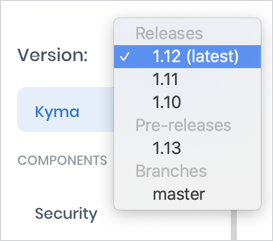
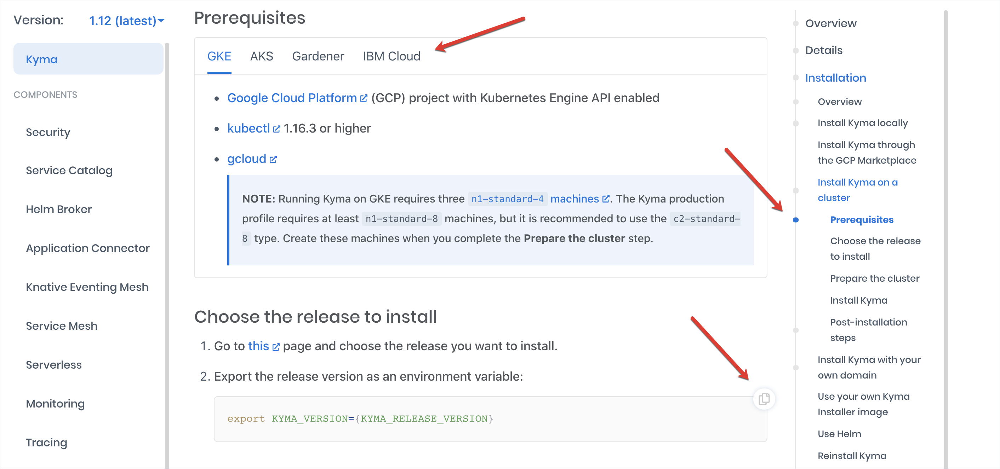
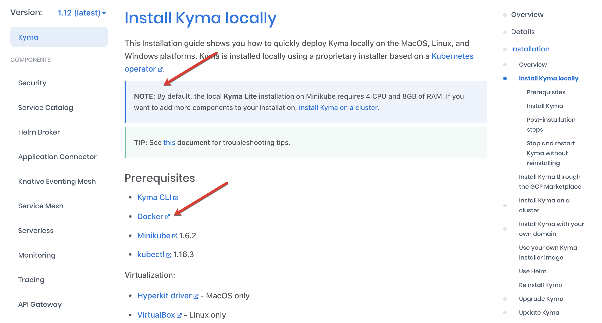
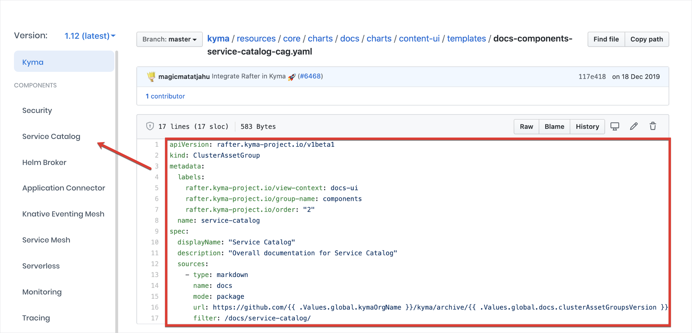
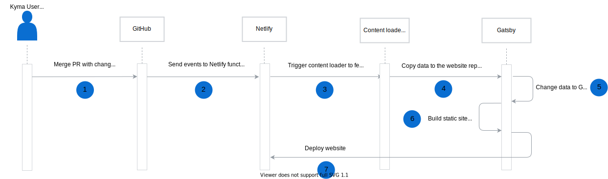
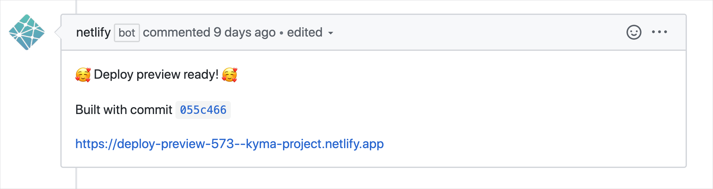

Our website, has many "fathers" who have maintained it from the very first day it was born out of the burning need for a homepage for our soon-to-be-open-sourced Kyma. It has evolved in time, in an agile spirit, extended with new views and features that were added whenever the need arose or an idea for improvement popped into our heads. As much as we love it, we realize it might seem a bit complex, especially for those who contribute to it for the first time. In this post we explain which tools we decided to use, how the website is built, and where all the sources sit - all this aiming to "tame the beast" and bring it a bit closer to you.

<!-- overview -->

## Building tool

When it comes to the tool we wanted to build our website with, we decided to choose a static site generator over a single-page application (SPA) to:
- Make the development process easier by providing a set of ready-to-use plugins and templates.
- Provide support for search engine optimization (SEO), increasing our website's visibility in search results.
- Ensure quick load time.

Our choice fell on [Gatsby](https://www.gatsbyjs.org/), partially because it is based on React that our frontend developers were used to and particularly fond of. Gatsby also uses GraphQL to query and pull source data, and we already used it for our [Console Backend Service](https://kyma-project.io/docs/components/console/#details-console-backend-service) in Kyma for the communication between Console UI views and k8s resources.

In its initial version, the website was quite simple and almost solely based on the logic provided by Gatsby. Basically, we wrote React components for particular views following Gatsby's tutorials and templates, used the available plugins to extend the data and content. Gatsby then pulled all the data from specified Markdown sources, built, and rendered the content on GitHub pages.

## Deployment tool

Although we used GitHub pages initially to deploy and host our website, we turned to [Netlify](https://www.netlify.com/) that offers a favorable [policy plan](https://www.netlify.com/legal/open-source-policy/) for the open-source projects.

As the website expanded, we simply needed a platform that would meet all the needs ahead of us. Netlify managed to do so by offering:

- [Continuous deployment](https://www.netlify.com/blog/2015/09/17/continuous-deployment/) enabling automatic website built triggered by GitHub commits to the `master` branch. With GitHub pages, we used CI from Prow that we had to maintain ourselves, so we gladly moved to the one offered by Netlify.

- [Deploy previews](https://www.netlify.com/blog/2016/07/20/introducing-deploy-previews-in-netlify/) built on pull requests (PRs), allowing you to detect any rendering issues before they are merged to the `master` branch.

- [AWS functions](https://docs.netlify.com/functions/overview/) for running on-demand code triggered by events coming from the GitHub API. In Kyma, we use it as a trigger for running the build and deployment of specific website views. This function is triggered whenever you:

  - Merge content to the `docs` folder in the `kyma` repository and to the `community` repository.

  - Create a release in the `kyma` repository. This triggers the full website rebuild and triggers a new release switcher in the **Docs** view.

  

  - Modify issues with the `Epic` label, for example by adding or removing capability labels, or the release for which the epic is planned.

  

  - Change the `.yaml` files that provide the structure for the left topic navigation in **Docs** and **Community**.

  > **TIP:** Read more about these files in the [ClusterAssetGroups](#cluster-asset-groups) section.

  

## Custom rendering

To customize content rendering in some of the views, we put our own twists on the standard logic provided by Gatsby.

### Documentation component

In Kyma, we render the documentation sources both on the website under the **Docs** view and as built-in documentation in the UI on every Kyma cluster. To unify the way in which it is shown in both places, we created our own React [documentation component](https://github.com/kyma-incubator/documentation-component) for rendering such specification formats as Markdown, OpenAPI, AsyncAPI, and OData. We use this component on the website to render Markdown and OpenAPI specifications with [custom styles](https://github.com/kyma-project/website/tree/master/src/components/generic-documentation/render-engines) applied in chosen views. The documentation component also provides the tabs, copy buttons next to code snippets, and the scrollspy in **Docs** and **Community** views:

### React-markdown library

We also wanted to customize the way we render some Markdown elements. Since Gatsby couldn't cater for all our needs, and we couldn't find any other suitable tool, we created one on our own. We needed a unified library that could be used both on the website and for the cluster documentation. We came up with the [react-markdown library](https://github.com/kyma-incubator/documentation-component/tree/master/packages/markdown-render-engine) as a wrapper for the [`react-markdown`](https://github.com/rexxars/react-markdown). We used it in **Docs**, **Blog**, and **Community** views to customize such Markdown elements as panels, or icons next to external links.

### ClusterAssetGroups

We even found a place for a chunk of Kubernetes implementation in our frontend. In Kyma, we use our in-house, k8s-based component [Rafter](https://kyma-project.io/docs/components/rafter/#overview-rafter-in-kyma) as a backend mechanism for uploading data for documentation topics and storing them in external buckets located in MinIO storage. Rafter is based on AssetGroup and ClusterAssetGroup custom resources (CRs) - we decided to use their structure on the website to configure the left navigation for [documentation topics](https://kyma-project.io/community/guidelines/content#add-new-documentation-to-the-website-add-new-documentation-to-the-website) in the **Docs** and **Community** views, simply by fetching content from these `.yaml` files. Each [ClusterAssetGroup](https://github.com/kyma-project/kyma/tree/master/resources/core/charts/docs/charts/content-ui/templates) is a separate node in the navigation. The content loader uploads the source documentation for a given topic from the path specified in the ClusterAssetGroup CR under the **filter** path. It then renders the sources in the order (`rafter.kyma-project.io/order: "2"`) and under the name (`displayName: "Service Catalog"`) specified in the CRs. Similarly to the documentation component and the react-markdown library, we use ClusterAssetGroup CRs in this way both on the website and for the documentation on Kyma clusters.

## Views and their sources

Each view on the website takes its sources from a different repository.

- **Docs** - `docs` folder in the `kyma` repository
- **Blog** - `content/blog-post` folder in the `website` repository
- **Community** - `community` repository
- **Roadmap** - `capabilities` folder in the community repository for descriptions of our project areas, and GitHub issues with `Epic` and a given capability's labels for the roadmap details.
- **Landing page** - `content` folder in the `website` repository, including the banner, and the **Used by** section with Kyma users

Before the website build, all this content is copied to the `website` repository by the [content loader](https://github.com/kyma-project/website/tree/master/tools/content-loader) - our own TypeScript tool we use for fetching:
- Content from various repository sources
- Details of issues from ZenHub and GitHub APIs

## Building and deployment process

Now that you know all pieces of the puzzle, let's have a look at how they fit together. The diagram and description beneath show the whole website building process triggered after merging a PR.

1. When you merge your PR to the `kyma/docs`or `community` repositories, the GitHub API sends an event to the Netlify function that triggers the master build.

> **NOTE:** The Netlify function is not triggered for the `website` repository since any changes there automatically trigger the master build.

2. The build triggers the content loader to fetch the given repository content, along with related ClusterAssetGroups, and perform initial data serialization and filtering. The content loader then moves the fetched content under the `content` folder in the `website` repository.

3. Gatsby reads this content through the connected plugins and retrieves selected data, such as metadata in docs. It later transforms it into a GraphQL schema that could be pulled by React components.

4. Gatsby uses the [Node API](https://www.gatsbyjs.org/docs/node-apis/) to build particular static HTML sites from React components, using data from GraphQL.

5. Gatsby [optimizes](https://www.gatsbyjs.org/docs/performance/) the static sites to increase their performance.

6. Finally, Netlify deploys the static sites.

## Preview

Before your merge a PR and it gets published on the Kyma website, you can preview your changes. This way you can see if the formatting of the text is correct, images fit well, and links work as expected. That is possible thanks to the [preview feature](https://kyma-project.io/community/guidelines/content#documentation-preview-documentation-preview) supported by Netlify. It attaches links to autogenerated previews of all website views to your PRs.

We enabled this feature on these Kyma repositories:

- `kyma` for changes in the `docs` folder that contains sources of the official Kyma documentation rendered in the **Docs** view.

- `community` for changes rendered in the **Community** view.

- `website` for changes rendered on the landing page and in the **Blog** view.

Previews are built for PRs containing changes made to any file within these repositories, for both successful and failed builds. The only exception is the `kyma` repository where Netlify only builds previews for changes in the `docs` folder and publishes notifications only for successful builds on such PRs.

When it comes to the building process, it looks very similar to the general flow. The only difference is that the Netlify function is not involved. Every commit on a PR triggers the content loader straightaway, generating only the preview of the view you actually modify.

## How and where to contribute

When it comes to our future plans concerning the website, we have some ideas on how to improve its overall performance, simplify contribution and introduce easy feedback options. We log all those ideas as [GitHub issues](https://github.com/kyma-project/website/issues) in the `website` repository - feel encouraged to do the same if an idea for improvement crosses your mind.

You can also move straightaway to action and contribute on your own to the look and feel of https://kyma-project.io/.

The contribution flow is quite simple:

1. Fork a repo.
2. Create a PR.
3. Add content and wait for our review and approval.

The fun may begin when you try to figure out where the sources of all views are. However, we hope this table clarifies it a bit and will help you to find your way through our repositories and the website structure:

| Website view | Where? | What? | How? |
|---|---|---|---|
| **Landing page** | [`website/content/adopters/adopters.yaml`](https://github.com/kyma-project/website/blob/master/content/adopters/adopters.yaml) | Kyma User | Follow the [instruction](https://github.com/kyma-project/website/blob/master/docs/add-user.md) or [log and issue](https://github.com/kyma-project/website/issues/new?template=new-user-request.md) and we will add it for you. |
| **Landing page** | [`website/content/banner/slides.yml`](https://github.com/kyma-project/website/blob/master/content/banner/slides.yml) | Banner | Follow this [instruction](https://github.com/kyma-project/website/blob/master/docs/banner-modification.md). |
| **Docs** | [`kyma/docs`](https://github.com/kyma-project/kyma/tree/master/docs) | Document or topic | Add a document that follows one of the [templates](https://kyma-project.io/community/guidelines/templates/#document-types-templates-document-types-templates-document-types-for-kyma-components) or follow instructions to [add a new topic](https://kyma-project.io/community/guidelines/content/#add-new-documentation-to-the-website-add-new-documentation-to-the-website). |
| **Blogs** | [`website/content/blog-post`](https://github.com/kyma-project/website/tree/master/content/blog-posts) | Blog post | Follow the [instruction](https://github.com/kyma-project/website/blob/master/docs/write-blog-posts.md). |
| **Community** | [`community`](https://github.com/kyma-project/community) | Document | Create a PR. |
| **Roadmap** | All repos | Epic | Log and issue, assign it to the proper milestone on Zenhub, and add your capability's and `Epic` labels. |
| **Roadmap** | [`community/capabilities`](https://github.com/kyma-project/community/tree/master/capabilities) | Capability | Create a PR. |

Apart from contribution, we are also open to feedback. If you have any thoughts to share or questions to ask, contact us directly on the [`#kyma-project-io`](http://slack.kyma-project.io/) Slack channel.
