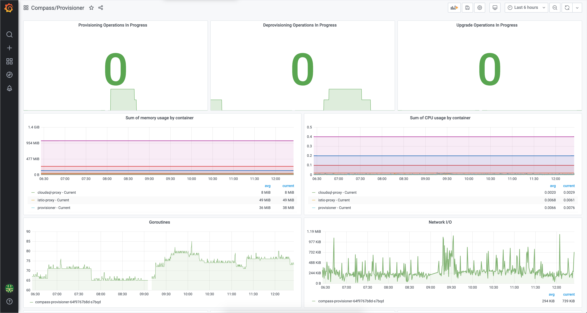

After a stop in the Land of Cherry Blossoms, we set a course for the Old Continent and the German city of Ulm. Such sudden changes of directions followed by long and challenging journeys are not entirely metaphorical when you think of Kyma, let alone this release. Ulm 1.14 was dominated by the leitmotif of Helm 3. We made our best efforts to ensure all our components are compatible with Helm 3, removing Tiller and related security vulnerabilities. As for the "twists and turns" part, Serverless underwent yet another transformation, this time switching from Knative Serving to pure Kubernetes resources. In addition to that, we bet once again on improving UX by enriching the Namespace details view in the Console UI, and introducing the new Runtime Provisioner dashboard, followed by the upgrade of the monitoring tool itself. Although extensive, this overview is not exhaustive at all. Keep on reading for a complete list of features brought to you by Ulm 1.14.

<!-- overview -->

> **CAUTION:** Read the [Migration Guide](https://github.com/kyma-project/kyma/blob/release-1.14/docs/migration-guides/1.13-1.14.md) before upgrading your Kyma deployment to 1.14.

See the overview of all changes in this release:

- [Known issues](#known-issues) - The `knative-eventing` Namespace must be manually deleted
- [Fixed security vulnerabilities](#fixed-security-vulnerabilities) - GraphQL subscriptions don't support the authorization annotation
- [Application Connector](#application-connector) - Application Operator now uses Helm 3
- [CLI](#cli) - Windows installation with Chocolatey
- [Compass](#compass) - Runtime Provisioner integrated with Helm 3, monitoring for the Runtime Provisioner, error handling in the Director
- [Console](#console) - Improved view with Namespace details, Console is no longer a core module
- [Eventing](#eventing) - Eventing charts compatible with Helm 3
- [Installation](#installation) - Kyma Operator uses Helm 3
- [Monitoring](#monitoring) - Grafana upgraded
- [Serverless](#serverless) - Serverless migrated to bare-metal Kubernetes resources, new Function CRD validation, `functions.kubeless.io` CRD removed

## Known issues

The `knative-eventing` Namespace is not automatically deleted after you uninstall the Eventing component. For now, you have to manually delete this Namespace as part of the post-uninstallation cleanup.

## Fixed security vulnerabilities

- GraphQL subscriptions don't support the authorization annotation - [Issue #3412](https://github.com/kyma-project/kyma/issues/3412) - **Medium** - [PR #8676](https://github.com/kyma-project/kyma/pull/8676)

## Application Connector

### Application Operator now uses Helm 3

Application Operator now uses Helm 3 to deploy its underlying components, Event Service and Application Gateway. The migration is automated and does not require manual actions. For more details on Helm 3, see the [Installation](#installation) section.

## CLI

### Windows installation with Chocolatey

CLI can now be installed on Windows easily using [Chocolatey](https://chocolatey.org/). All you need to do is run `choco install kyma-cli`.

## Compass

### Runtime Provisioner integrated with Helm 3

Runtime Provisioner is now compliant with all Helm 3-based installations of Runtimes. This means there will be no Tiller on new clusters. If you prefer to have an older version of Kyma on your cluster, specify your version of choice in the [provisioning mutation](https://kyma-project.io/docs/1.14/components/compass/#tutorials-provision-clusters-through-gardener). This way, Kyma deployment will be installed on a cluster from the chosen release that contains the Tiller deployment.

### Monitoring for the Runtime Provisioner

We enabled a new Grafana dashboard for the Runtime Provisioner. It includes basic Kubernetes information and resources. It also shows a new metric with the number of currently running provisioning operations. Still, treat it only as a foretaste of what is to come, as we will be including more and more Runtime Provisioner-relevant information in this dashboard.

### Error handling in the Director

From now on, the Director's GraphQL API handles errors gracefully, with more descriptive error messages. Using error extensions, we provide machine-readable error codes every time something goes wrong. For specific error types, read about [error handling in the Director](https://github.com/kyma-incubator/compass/blob/master/docs/director/03-error-handling.md).

## Console

### Improved view with Namespace details

With 1.14, we made the first steps toward changing the rather empty view with Namespace details into a dashboard. It shows you nice pie charts indicating the health status of Pods and Deployments in a given Namespace. We are planning more features for this view in the future, so stay tuned.

### Console is no longer a core module

Console UI was moved together with its backend API out of the `core` chart to its own `console` chart. It means it is no longer considered a core module. It is still installed by default, but you can (un)install the Console UI according to your preferences.  

## Eventing

### Eventing charts compatible with Helm 3

The Eventing component and all of its charts (`knative-eventing`, `event-sources`, `knative-eventing-kafka`, `nats-streaming`, and `knative-provisioner-nats`) are now Helm 3-compatible and can be installed independently as a standalone `kyma-eventing` cluster. We also made sure that all Eventing charts are uninstalled smoothly and all related custom resources are cleaned up. To uninstall the Eventing component, simply run `helm delete {EVENTING_CHART_NAME}`.

## Installation

### Kyma Operator now uses Helm 3

Kyma Operator now uses Helm 3 under the hood, making the upgrade from 1.13 to 1.14 smooth and automatic. For more details on the migration process, see the [Migration Guide](https://github.com/kyma-project/kyma/blob/release-1.14/docs/migration-guides/1.13-1.14.md). If you want to learn more about Helm 3 itself, read the official [Helm documentation](https://helm.sh/docs/topics/v2_v3_migration/).

## Monitoring

### Grafana upgraded

We upgraded Grafana to v7.0 which brings a lot of improvements like a new panel editor and unified data model. For an overview of all new features, see the official [Grafana release notes](https://grafana.com/docs/grafana/latest/guides/whats-new-in-v7-0/). Our main motivation for the update was to remove the PhantomJS dependency that had a lot of known security vulnerabilities.

## Serverless  

### Serverless migrated to bare-metal Kubernetes resources

We continue our work on the Serverless Runtime for Kyma. In this release, we migrated from Knative Serving to pure Kubernetes resources. In its new shape and form, Serverless is more lightweight, doesn't require any additional components, and provides more control over underlying resources. With this change, Serverless uses only Jobs, Deployments, Services, and Horizontal Pod Autoscalers. To see how all these pieces fit together, take a look at [Serverless architecture](https://kyma-project.io/docs/1.14/components/serverless/#architecture-architecture). Importantly, the whole migration from the previous solution to the current one is fully automated and executed during Kyma update.

### Function CRD validation

We introduced the validation of Function CustomResourceDefinitions (CRDs). Every new version of the Function CRD is verified by the [defaulting and validation webhooks](https://kyma-project.io/docs/1.14/components/serverless/#details-supported-webhooks) before you apply it on your cluster. Validation works not only in the UI but also in the terminal when you apply resources using kubectl.

### functions.kubeless.io CRD removed

As mentioned in the previous release notes, the `functions.kubeless.io` CRD was removed as it is no longer used by the Serverless Runtime.
