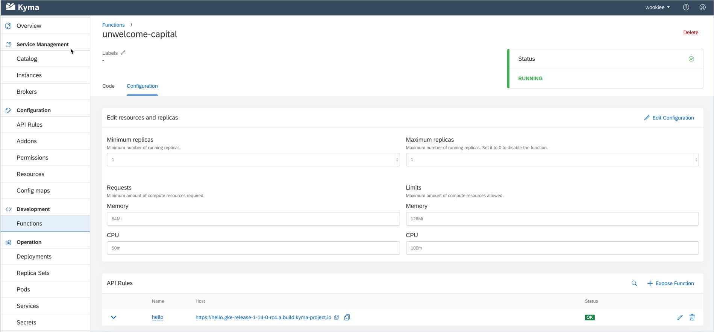

After a stop in the Land of Cherry Blossoms, we set a course for the Old Continent and the German city of Ulm. Such sudden changes of directions followed by long and challenging journeys are not entirely metaphorical when you think of Kyma, let alone this release. Ulm 1.14 was dominated by the leitmotif of Helm 3. We made our best efforts to ensure all our components are compatible with Helm 3, removing Tiller and related security vulnerabilities. As for the "twists and turns" part, Serverless underwent yet another transformation, this time switching from Knative Serving to pure Kubernetes resources. In addition to that, we bet once again on improving UX by enriching the Namespace details view and introducing more discrete pop-ups in the Console UI. Although extensive, this overview is not exhaustive at all. Keep on reading for a complete list of features brought to you by Ulm 1.14.

<!-- overview -->

> **CAUTION:** Read the [Migration Guide](https://github.com/kyma-project/kyma/blob/release-1.14/docs/migration-guides/1.13-1.14.md) before upgrading your Kyma deployment to 1.14.

See the overview of all changes in this release:

- [Known issues](#known-issues) - The `knative-eventing` Namespace must be manually deleted, Kyma installation through GCP Marketplace disabled
- [Fixed security vulnerabilities](#fixed-security-vulnerabilities) - GraphQL subscriptions don't support the authorization annotation
- [Application Connector](#application-connector) - Application Operator now uses Helm 3
- [CLI](#cli) - Windows installation with Chocolatey, Helm setup removed, improved usability of the `install` command, `install` command supports the component list, `install` command supports Git revisions, CLI usage in Kyma documentation
- [Compass](#compass) - Compass separated from the Kyma installation
- [Console](#console) - Improved view with Namespace details, API Rules available from **Functions** and **Services** views, message toast, Console is no longer a core module
- [Eventing](#eventing) - Eventing installation tweaks
- [Installation](#installation) - Kyma Operator uses Helm 3
- [Monitoring](#monitoring) - Grafana upgraded
- [Serverless](#serverless) - Serverless migrated to bare metal Kubernetes resources, new Function CustomResourceDefinitions (CRDs) validation, external Docker registry, `functions.kubeless.io` CRD removed

## Known issues

### knative-eventing Namespace must be manually deleted

The `knative-eventing` Namespace is not automatically deleted after you uninstall the Eventing component. For now, you have to manually delete this Namespace as part of the post-uninstallation cleanup.

### Kyma installation through GCP Marketplace disabled

As a result of [Kubernetes API deprecation](https://kubernetes.io/blog/2019/07/18/api-deprecations-in-1-16/), Kyma can no longer be installed through the Google Cloud Platform (GCP) Marketplace. That is why, we decided to temporary disable Kyma on GCP Marketplace until we make changes necessary to fix the installation issues.

## Fixed security vulnerabilities

- GraphQL subscriptions don't support the authorization annotation - [Issue #3412](https://github.com/kyma-project/kyma/issues/3412) - **Medium** - [PR #8676](https://github.com/kyma-project/kyma/pull/8676)

## Application Connector

### Application Operator now uses Helm 3

Application Operator now uses Helm 3 to deploy its underlying components, Event Service and Application Gateway. The migration is automated and does not require manual actions. For more details on Helm 3, see the [Installation](#installation) section.

## CLI

### Windows installation with Chocolatey

CLI can now be installed on Windows easily using [Chocolatey](https://chocolatey.org/). All you need to do is run `choco install kyma-cli`.

### Helm setup removed

[Kyma Operator](#installation) is now based on Helm 3. This means that Helm no longer uses specific certificates to communicate with the cluster. As a result, this configuration step was removed from the CLI `install` command.

### Improved usability of the install command

We redesigned the `install` command to make the Kyma installation process run smoothly, even if you encounter any interruptions on the way. When you run the `install` command, the system first detects if there already is an installation process running. If there is one, the system does not override it but resumes watching the installation progress instead and prints out its status.

### install command supports the component list

The `install` command has the new `--components` flag which you can use to define the list of components you want to install. You must provide a path to the YAML file that contains either the full [Installation custom resource](https://github.com/kyma-project/kyma/blob/release-1.14/docs/kyma/06-01-installation.md) configuration or just the components list.

### install command supports Git revisions

You can now specify the Kyma installation source by passing a Git revision number. To do so, run `kyma install --source={COMMIT-ID}`. For example, use `kyma install --source=34edf09a`.

### CLI usage in Kyma documentation

We unified Kyma documentation and made sure all installation instructions include only CLI commands for cluster provisioning, Kyma installation, and testing.

## Compass

### Compass separated from the Kyma installation

From this release, Compass is no longer an integral part of the Kyma installation. However, Kyma still connects to Compass through the [Runtime Agent](https://github.com/kyma-project/kyma/tree/release-1.14/docs/runtime-agent). From now on, if you want to use Compass, [install Kyma with the Runtime Agent](https://github.com/kyma-project/kyma/blob/release-1.14/docs/runtime-agent/04-01-installation-modes.md) first and then [install Compass](https://github.com/kyma-incubator/compass/blob/master/docs/compass/04-01-installation.md) separately.  

## Console

### Improved view with Namespace details

With 1.14, we made the first steps toward changing the rather empty view with Namespace details into a dashboard. It shows you nice pie charts indicating the health status of Pods and Deployments in a given Namespace. We are planning more features for this view in the future, so stay tuned.

### API Rules available from Functions and Services views

With simplicity and user experience in mind, we made one small step for the Console UI that is a giant leap for its users. When wanting to expose your Function or Service in the Console UI, you no longer need to go to the **API Rules** view. As of release 1.14, you can create an API Rule directly from both the **Functions** and **Services** views. The advantages of this solution are that you don't need to constantly switch between views, the API Rule you create gets automatically assigned to the Function or Service you are exposing, and all related API Rules are always listed under the given Function or Service.

### Message toast

We took one more step towards UI harmonization by introducing a non-disruptive pop-up for success messages. This new component confirms your actions in the Console UI in the form of a small message toast that appears at the bottom of the page. Thanks to this feature, you are discretely informed if what you just did succeeded, without being interrupted by large and distracting messages.

### Console is no longer a core module

Console UI was moved together with its backend API out of the `core` chart to its own `console` chart. It means it is no longer considered a core module. It is still installed by default, but you can (un)install the Console UI according to your preferences.  

## Eventing

### Eventing installation tweaks

Apart from being compatible with Helm 3, we now also support uninstallation and parallel installation of Eventing charts with Helm. When uninstalling the charts, Helm brings your cluster back to its original state by cleaning up all Eventing-related CRDs and components, like Eventing Controllers and Knative Eventing. To uninstall the whole Eventing component, simply run `helm delete {EVENTING_CHART_NAME}`. When it comes to parallel installation, all Eventing charts (`knative-eventing`, `event-sources`, `knative-eventing-kafka`, `nats-streaming`, and `knative-provisioner-nats`) can now be installed concurrently. This change introduces out-of-the-box resiliency to the installation process - by installing all bits and pieces alongside their dependencies, you significantly raise the chances of having a healthy Eventing system on your cluster.

## Installation

### Kyma Operator now uses Helm 3

Kyma Operator now uses Helm 3 under the hood. Upgrade from 1.13 to 1.14 is smooth and automatic. For more details on the migration process, see the [Migration Guide](https://github.com/kyma-project/kyma/blob/release-1.14/docs/migration-guides/1.13-1.14.md). If you want to learn more about Helm 3 itself, read the official [Helm documentation](https://helm.sh/docs/topics/v2_v3_migration/).

## Monitoring

### Grafana upgraded

We upgraded Grafana to v7.0 which brings a lot of improvements like a new panel editor and unified data model. For an overview of all new features, see the official [Grafana release notes](https://grafana.com/docs/grafana/latest/guides/whats-new-in-v7-0/). Our main motivation for the update was to remove the PhantomJS dependency that had a lot of known security vulnerabilities.

## Serverless  

### Serverless migrated to bare metal Kubernetes resources

We continue our work on the Serverless Runtime for Kyma. In this release, we migrated from Knative Serving to pure Kubernetes resources. In its new shape and form, Serverless is more lightweight, doesn't require any additional components, and provides more control over underlying resources. With this change, Serverless uses only Jobs, Deployments, Services, and Horizontal Pod Autoscalers. To see how all these pieces fit together, take a look at the [Serverless architecture](https://github.com/kyma-project/kyma/blob/release-1.14/docs/serverless/02-01-serverless.md). Importantly, the whole migration from the previous solution to the current one is fully automated and executed during Kyma update.

### Function CRD validation

We introduced the validation of Function CRDs. Every new version of the Function CRD is verified by the [defaulting and validation webhooks](https://github.com/kyma-project/kyma/blob/release-1.14/docs/serverless/03-01-supported-webhooks.md) before you apply it on your cluster. Validation works not only in the UI but also in the terminal when you apply resources using kubectl.

### External Docker registry

1.14 Ulm brings an option to use an external Docker registry for your Function images. In general, Serverless in Kyma comes with a built-in internal Docker registry in which you can store images when developing Functions. We now allow you to switch from the default registry to one of these hosted repository services:

- Docker Hub
- Google Container Registry
- Azure Container Registry

We strongly recommend them for your production set-up. They are fully managed and pre-configured, making your Function images secure and backed up. Read how to [switch to an external Docker registry using overrides](https://github.com/kyma-project/kyma/blob/release-1.14/docs/serverless/08-05-set-external-docker-registry.md).

### functions.kubeless.io CRD removed

As mentioned in the previous release notes, the `functions.kubeless.io` CRD was removed as it is no longer used by the Serverless Runtime.
