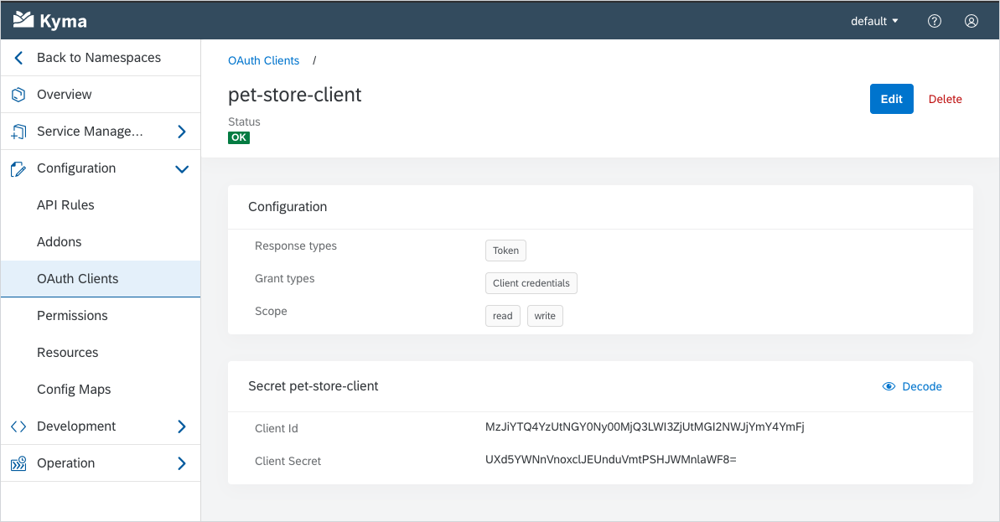
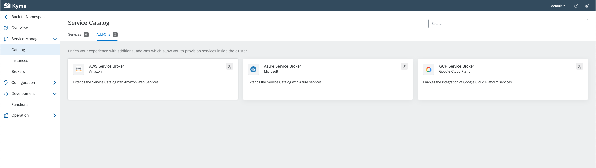
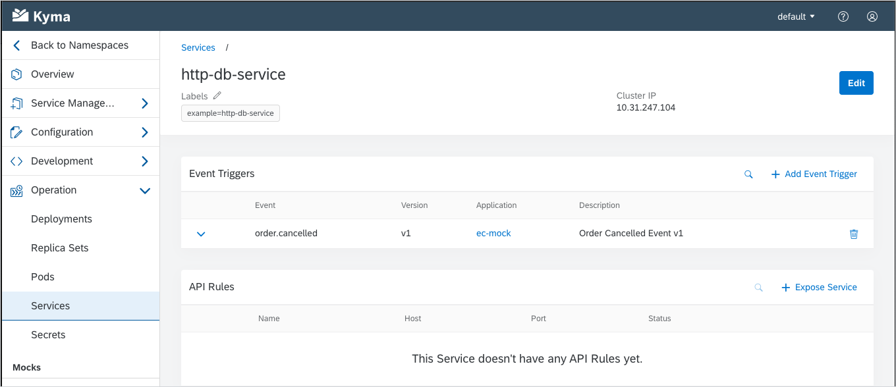
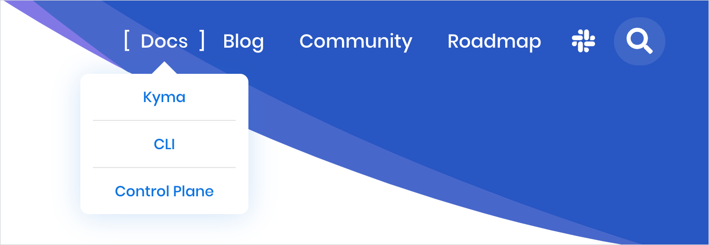

Same language, different city! 
After leaving Ulm, we take a short trip to the City of Music, Vienna. 
We all know Vienna for the famous musicians that were either born there or went there to work. 
But did you know that Vienna was the largest German-speaking city in the world up to the 20th century, and to date remains the second-largest one, after Berlin? 
Not to mention the beautiful architecture of the city! 
Inspired by the views, we worked on improving our Console UI. 
We also added more documentation sources to the website. 
Lastly, we worked on tweaks and improvements for Monitoring, the Kyma CLI, and the ORY stack. 
Read the notes to find out more.

<!-- overview -->

See the overview of all changes in this release:

- [Monitoring](#monitoring) - `Jaeger` datasource in Grafana
- [CLI](#cli) - Installation from a local checkout to a remote cluster, improved resilience of the `install` command
- [ORY stack](#ory-stack) - Reduced time of Hydra installation, increased availability of Hydra during updates, improved stability of Oathkeeper
- [Console](#console) - Managing OAuth2 clients from the Console UI, collapsible navigation categories, configuration of event triggers for services
- [Website](#website) - Documentation from various repository sources displayed on the website

## Monitoring

### Jaeger datasource in Grafana

We took the chance and preconfigured the new `Jaeger` datasource type in Grafana. Now you can explore all traces available in the Jaeger UI also in the **Explore** section of Grafana by selecting this new datasource. 

## CLI

### Installation from a local checkout to a remote cluster

The Kyma installation on a remote cluster from a local Kyma GitHub checkout requires building and pushing the `kyma-installer` image to a remote Docker registry. This is now taken care of by the CLI. When the `install` command detects such a setup, it will require you to pass the **--custom-image** parameter specifying the full image name to be used. The CLI will then build and push the image automatically, leveraging the authentication details retrieved from the local Docker client. 

###  Improved resilience of the `install` command

The resilience of the `install` command has been improved. Now, even if you encounter connection problems during installation, the process triggered by the `install` command will be resumed and continue until it's completed. 

## ORY stack

### Reduced time of Hydra installation

We worked on the Hydra installation process and bringing those numbers down, and we succeeded. We significantly reduced the time required to install the component.

### Increased availability of Hydra during updates

Another thing we worked on was Hydra availability. As a result, the availability of the component during updates is now increased.

### Improved stability of Oathkeeper

The Oathkeeper stability has been improved. We also fixed the issues with periodic restarts.

## Console

### Managing OAuth2 clients from the Console UI

To interact with the Kyma OAuth2 server and secure your microservices and Functions, you must first [register an OAuth2 client](https://kyma-project.io/docs/components/security#details-o-auth2-and-open-id-connect-server-register-an-o-auth2-client). 
So far, you could do it only through `kubectl`. 
With Kyma 1.15, you can also register OAuth2 clients from the new view in the Console UI: 

### Collapsible navigation categories

Starting with this release, you can collapse categories which you don't use that often to focus on the views that you use frequently. 
For your convenience, the state of collapsed nodes is preserved in the browser cache.  

### Configuration of event triggers for services

As of now, you can finally subscribe Kubernetes services to events in your Namespace from the Console UI. 
This feature allows you to easily manage event subscriptions not only for Functions but also for any custom microservice you deployed in your Namespace.  

## Website

### Documentation from various repository sources displayed on the website

In response to numerous requests, we extended the **Docs** view and now display various documentation sources on the website.
From now on, when you click on **Docs** in the main navigation panel, you select the repository from which you want to read the documentation.
You can choose from the main [Kyma documentation](https://kyma-project.io/docs/), Kyma [CLI](https://kyma-project.io/docs/cli/), and Kyma [Control Plane](https://kyma-project.io/docs/control-plane/).
<!-- I BELIEVE THIS PART IS OF NO INTEREST TO THE CLIENTS/USERS AND SHOULD NOT BE INCLUDED IN THE NOTES; THIS WILL BE REMOVED
It is possible to add documentation from any other repository within the `kyma-project` and `kyma-incubator` GitHub organizations, as long as these documents meet certain requirements and you perform some additional configuration steps.
To learn the details, see the [instruction on adding a new repository documentation](https://kyma-project.io/community/guidelines/content#add-new-documentation-to-the-website-add-new-documentation-to-the-website-add-a-new-repository-documentation). 
-->

 