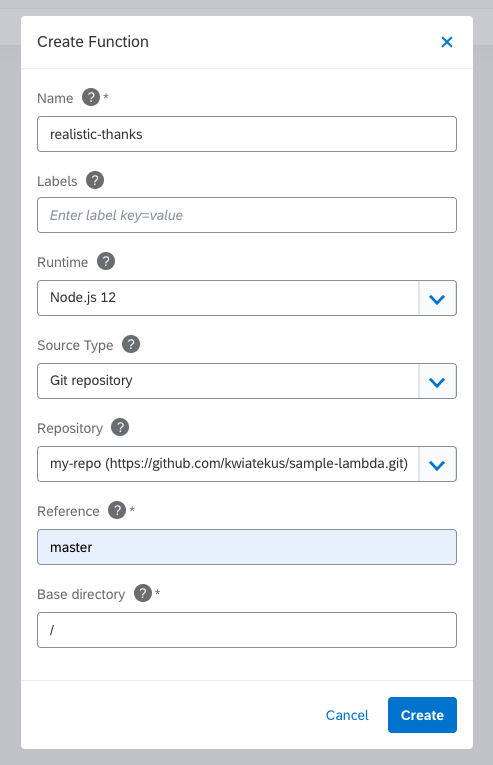

After a stop in beautiful Vienna, we disembark on a new journey to Wellington, New Zealand. The southernmost capital in the world is well-known for its cafes and restaurants (there are more of them per capita than in New York) and the filming locations of the Lord of the Rings and Hobbit movies. While we are starting to feel the cooler weather, spring in Wellington is just beginning, so don't put on your jackets just yet. Almost all of Wellington's residents live within three kilometers of the sea coast, so this is the perfect spot to ride the Kyma wave with us. The new Getting Started guides on our website will help you navigate the sea of  Serverless, CLI, Monitoring and Tracing features that are part of this release. Read the notes to find out more.

<!-- overview -->

See the overview of all changes in this release:

- [Serverless](#serverless) - Git repository as a source for your Function, Support Python as a serverless runtime
- [Website](#website) - New Getting Started Guides
- [CLI](#cli) - Upgrade command, Command to create a system
- [Monitoring](#monitoring) - AuthProxy support for Grafana
- [Tracing](#tracing) - Disable sending traces

## Serverless

### Git repository as a source for your Function

We introduced a new way of developing Functions. Instead of editing your Function in an inline editor, you can now configure a Git repository as the source of your Function's code and dependencies. It is more convenient for developers who can use their favorite IDE to develop Functions.

Read more about the [Git source type](https://kyma-project.io/docs/1.16/components/serverless/#details-git-source-type) and see the [tutorial](https://kyma-project.io/docs/1.16/components/serverless/#tutorials-create-a-function-from-git-repository-sources) which shows how you can use it in action.

You can fix the Function source to a specific commit, or you can reference a branch. The function will rebuild on every change pushed to the repository.

### Support Python as a serverless runtime

With 1.16, you can choose Python (3.8) as a runtime for your Function:

See all [available runtimes](https://kyma-project.io/docs/1.16/components/serverless/#details-runtimes) with sample Functions.

## Website

### New Getting Started Guides

Have you ever wondered how to start with Kyma? How to connect all the dots (components) in a meaningful scenario? We tried to addressed such questions with a set of [Getting Started Guides](https://kyma-project.io/docs/1.16/root/getting-started/) we are happy to share with you. These guides lead you through an end-to-end scenario that shows a sample Kyma use case. After completing it, you will get a Function and a microservice that react to events sent from an external application and use the external Redis service to store the events data. These guides show all Kyma’s major features, introduce you to our components, and give you a chance to get to know Kyma either through the kubectl commands or the Console UI steps.

## CLI

### Upgrade command

 We introduced a new command as a first step to offer a smooth Kyma upgrade. To use it, download the CLI in the same version as the target Kyma version and call [kyma upgrade](/cli/commands/#kyma-upgrade-kyma-upgrade). The command will perform all the steps for you. Additionally, it offers a way for customizing the component and overrides.

### Command to create a system

We added a new command - [kyma create system](/cli/commands/#kyma-create-system-kyma-create-system).  In just one step, it allows you to create a system (a.k.a. Application), bind it to a Namespace, and get a token to pair the system with the external application.

## Monitoring

### AuthProxy support for Grafana

The Grafana chart now offers an option to deploy Grafana along with an instance of a Keycloak Gatekeeper (`louketo-proxy`) in front of it. Enabling the proxy and switching to Grafana in AuthProxy allows you to control the access by the `group` claim of your IDToken.

## Tracing

### Disable sending traces

A new override `global.tracing.enabled` is available in the event-sources-controller-manager sub-chart configuration. By setting it to `false`, you can disable sending traces from Kyma components to the service deployed by the Tracing component.
