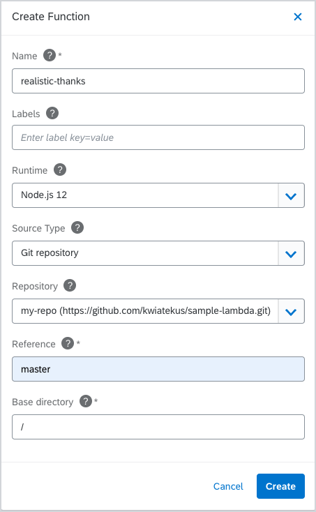

After a stop in the beautiful Vienna, we disembark on a new journey to Wellington, New Zealand. The southernmost capital in the world is well-known for its cafes and restaurants (there are more of them per capita than in New York), and the filming locations of the Lord of the Rings and Hobbit movies. While we are starting to feel the cooler weather, spring in Wellington is just beginning, so don't put on your jackets just yet. Almost all of Wellington's residents live within three kilometers of the sea coast, so this is a perfect spot to ride the Kyma wave with us. The new Getting Started guides on our website will help you navigate the sea of Serverless, CLI, Monitoring, and Tracing features that are part of this release. Read the notes to find out more.

<!-- overview -->

> **NOTE:** Kyma 1.16 is a release candidate, which means it is not a stable release. If possible, you should wait until Kyma 1.17 to upgrade to the newest version.

> **CAUTION:** Read the [Migration Guide](https://github.com/kyma-project/kyma/blob/release-1.16/docs/migration-guides/1.15-1.16.md) before upgrading your Kyma deployment to 1.16.

See the overview of all changes in this release:

- [Serverless](#serverless) - Git repository as a source for your Function, support for Python as a serverless runtime
- [Website](#website) - New Getting Started guides
- [CLI](#cli) - New commands for upgrade and creating a system
- [Monitoring](#monitoring) - AuthProxy support for Grafana, removed dashboards for CoreDNS/KubeDNS and Kube-Proxy
- [Tracing](#tracing) - Option to disable sending traces, improved integration of Loki to Grafana
- [Kiali](#kiali) - General update and Jaeger integration
- [Eventing](#eventing) - Removed Knative-Serving chart
- [Installation](#installation) - Istio upgrade to 1.5.10

## Serverless

### Git repository as a source for your Function

We introduced a new way of developing Functions. Instead of editing your Function in an inline editor, you can now configure a Git repository as the source of your Function's code and dependencies. It is a great convenience for developers who can now use their favorite IDE to develop Functions.

Read more about the [Git source type](https://kyma-project.io/docs/1.16/components/serverless/#details-git-source-type) and see the [tutorial on how to create a Function from Git repository sources](https://kyma-project.io/docs/1.16/components/serverless/#tutorials-create-a-function-from-git-repository-sources).

You can set the Function source to a specific commit, or you can reference a branch. The function will rebuild on every change pushed to the repository.

### Support for Python as a serverless runtime

With 1.16, you can choose Python (3.8) as a runtime for your Function:

See all [available runtimes with sample Functions](https://kyma-project.io/docs/1.16/components/serverless/#details-runtimes).

## Website

### New Getting Started guides

Have you ever wondered how to start with Kyma? How to connect all the dots (components) into a meaningful scenario? We tried to address such questions with a set of [Getting Started guides](https://kyma-project.io/docs/1.16/root/getting-started/) we are happy to share with you. These guides lead you through an end-to-end scenario that shows a sample Kyma use case. After completing it, you will get a Function and a microservice that react to events sent from an external application and use the external Redis service to store the events data. These guides show all Kyma’s major features, introduce you to our components, and give you a chance to get to know Kyma either through the kubectl commands or the Console UI steps.

## CLI

### Upgrade command

We introduced the new command as a first step to offer a smooth Kyma upgrade. To use it, download the CLI in the same version as the target Kyma version and run [`kyma upgrade`](/cli/commands/#kyma-upgrade-kyma-upgrade). The command will perform all the steps for you. Additionally, it offers a way to customize the component and overrides.

### Command to create a system

Another new command that we added is [`kyma create system`](/cli/commands/#kyma-create-system-kyma-create-system). In just one step, it allows you to create a system (an Application), bind it to a Namespace, and get a token to pair the system with an external application.

## Monitoring

### AuthProxy support for Grafana

The Grafana chart now offers an option to deploy Grafana along with an instance of a Keycloak Gatekeeper (`louketo-proxy`) in front of it. Enabling the proxy and switching to Grafana in AuthProxy allows you to control the access by the `group` claim of your IDToken.

### Removed dashboards for CoreDNS/KubeDNS and Kube-Proxy

The Grafana bundle in Kyma brings a lot of ready-to-use dashboards together with service monitors definitions for the related components. Here, the focus is on having an observable Kyma ecosystem. Among those dashboards are CoreDNS/KubeDNS and Kube-Proxy. The related components are provided by Kubernetes on which Kyma is installed, so they are not shipped with Kyma. Different Kubernetes providers are changing settings in the setup of the components, and as we do not offer support for the mentioned components, they will not be activated by default. You can still easily enable them via the configuration options of the Grafana sub-chart, but that might require further configuration dependent on your Kubernetes provider.

## Tracing

### Option to disable sending traces

The new `global.tracing.enabled` override is available in the Event Sources Controller Manager sub-chart configuration. By setting it to `false`, you can disable sending traces from Kyma components to the service deployed by the Tracing component.

### Improved integration of Loki to Grafana

If log lines are in a JSON format, the root elements of the document will now be treated as their own log record attributes in Fluent Bit. With that, the root elements will be shown as fields in Grafana.

To be consistent with the Prometheus labeling, the `instance` label got renamed to `pod`, as it contains the Pod name.

## Kiali

### General update and Jaeger integration

Kiali got upgraded to the latest version 1.24. With that, proper configuration of the component status was possible and there is no red light shown in the top bar. Furthermore, the metric dashboards work more reliably.
Additionally, we now configured Jaeger so that you can see traces inline in Kiali with deep-linking into the Jaeger UI.

## Eventing

### Removed Knative-Serving chart

In release 1.16, we remove the support for Knative-Serving from Kyma. After the upgrade, Knative-Serving will still be fully functional in the cluster, but it can be removed easily in order to free resources. Removing Knative-Serving will not affect supported Kyma functionality. To learn more, read the [migration guide](https://github.com/kyma-project/kyma/blob/release-1.16/docs/migration-guides/1.15-1.16.md).

## Installation

### Istio upgrade to 1.5.10

With this release, we upgraded Istio from 1.4.7 to 1.5.10. Find more details in the [migration guide](https://github.com/kyma-project/kyma/blob/release-1.16/docs/migration-guides/1.15-1.16.md). To learn more, read the [Istio 1.5.10 release notes](https://istio.io/latest/news/releases/1.5.x/announcing-1.5.10/).
