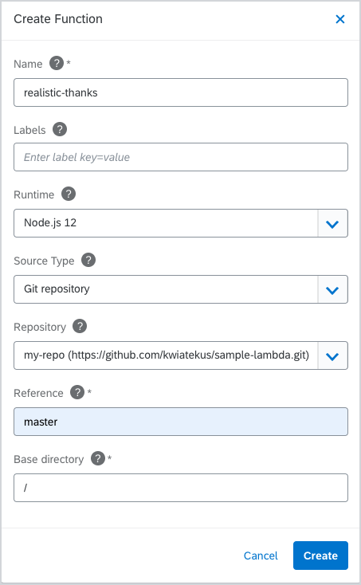
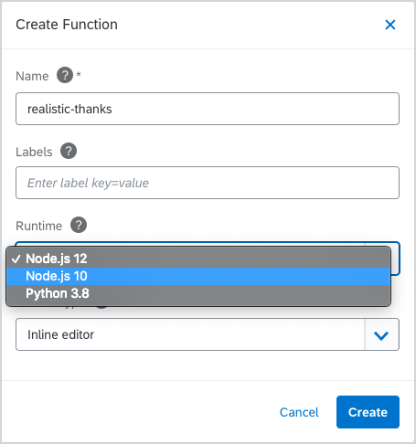
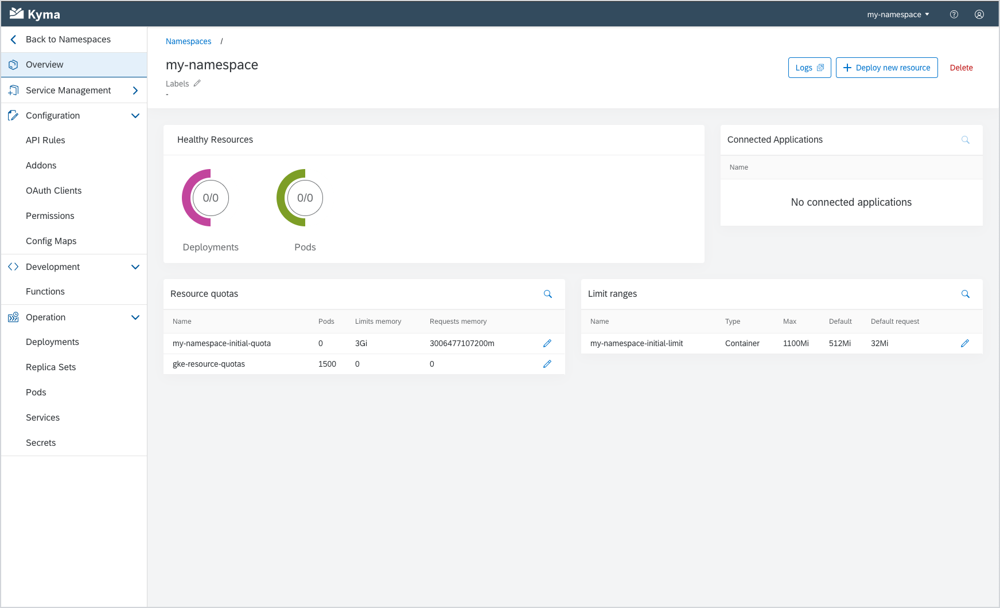
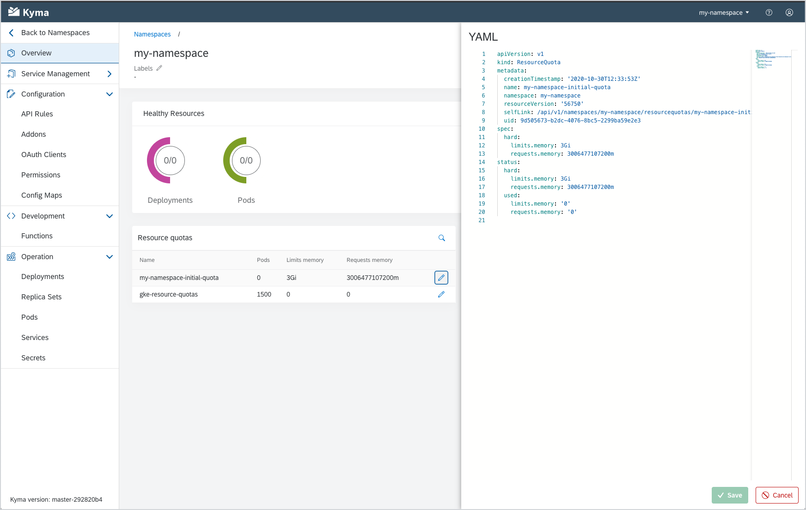

Good things take time to build. This is true for both the new Kyma release and the city it is named after - Xinzhou - located near the notorious Great Wall of China. This release includes updates to many Kyma features, including Serverless, Monitoring, Tracing, Kiali, Eventing, and others. Read the release notes to find out more.

<!-- overview -->

> **CAUTION:** Read the [Migration Guide](https://github.com/kyma-project/kyma/blob/release-1.17/docs/migration-guides/1.15-1.17.md) before upgrading your Kyma deployment to 1.17. Note that you will first need to update to the 1.16 release candidate instead of upgrading to 1.17 directly.

See the overview of all changes in this release:

- [Serverless](#serverless) - Git repository as a source for your Function, support for Python as a serverless runtime
- [Website](#website) - New Getting Started guides
- [CLI](#cli) - New commands for upgrade and creating a system, manage Functions, PR number support for the `install` command, Minikube support when using a DNS-Proxy on MacOS
- [Monitoring](#monitoring) - AuthProxy support for Grafana, removed dashboards for CoreDNS, KubeDNS, and Kube-Proxy
- [Tracing](#tracing) - Option to disable sending traces, improved integration of Loki to Grafana
- [Kiali](#kiali) - General update and Jaeger integration
- [Eventing](#eventing) - Removed the Knative-Serving chart
- [Installation](#installation) - Istio upgrade to 1.7.4
- [Console](#console) - New features on the Namespace details page
- [Known issues](#known-issues) - Known issues related to the Istio 1.7.4 upgrade

## Serverless

### Git repository as a source for your Function

We introduced a new way of developing Functions. Instead of editing your Function in an inline editor, you can now configure a Git repository as the source of your Function's code and dependencies. It offers great convenience for developers who can now use their favorite IDE to develop Functions.

Read more about the [Git source type](https://github.com/kyma-project/kyma/blob/release-1.17/docs/serverless/03-02-git-source-type.md) and see the [tutorial on how to create a Function from Git repository sources](https://github.com/kyma-project/kyma/blob/release-1.17/docs/serverless/08-02-create-git-function.md).

You can set the Function source to a specific commit, or you can reference a branch. The function will rebuild on every change pushed to the repository.

### Support for Python as a serverless runtime

With Kyma 1.17, you can choose Python (3.8) as a runtime for your Function:

See all [available runtimes with sample Functions](https://github.com/kyma-project/kyma/blob/release-1.17/docs/serverless/03-01-available-runtimes.md).

## Website

### New Getting Started guides

Have you ever wondered how to start with Kyma? How to connect all the dots (components) into a meaningful scenario? We tried to address such questions with a set of [Getting Started guides](https://github.com/kyma-project/kyma/tree/release-1.17/docs/getting-started) we are happy to share with you. These guides lead you through an end-to-end scenario that shows a sample Kyma use case. After completing it, you will get a Function and a microservice that react to events sent from an external application and use the external Redis service to store the events data. These guides show all Kyma’s major features, introduce you to our components, and give you a chance to get to know Kyma either through the kubectl commands or the Console UI steps.

## CLI

### Upgrade command

We introduced the new command as a first step to offer a smooth Kyma upgrade. To use it, download the CLI in the same version as the target Kyma version and run [`kyma upgrade`](/cli/commands/#kyma-upgrade-kyma-upgrade). The command will perform all the steps for you. Additionally, it offers a way to customize the component and overrides.

### Command to create a system

Another new command that we added is [`kyma create system`](/cli/commands/#kyma-create-system-kyma-create-system). In just one step, it allows you to create a system (an application), bind it to a Namespace, and get a token to pair the system with an external application.

### Manage Functions

We released a set of new commands for Function developers. These commands are very useful when creating a Function from scratch or whenever you want to apply code or configuration changes to a Function.

Find more details in the dedicated [tutorial](https://github.com/kyma-project/cli/blob/release-1.17/docs/08-02-cli-in-serverless.md).

### PR number support for the install command

The `install` command now supports installing Kyma based on a specific pull request (PR) submitted to the Kyma repository. So `kyma install --source=PR-XXXX` will install Kyma on your Kubernetes cluster using the revision identified by the latest commit to the specific PR.

### Minikube support when using a DNS-Proxy on MacOS

We added a new flag to the Minikube command to support a setup which is typical for corporate environments. The new flag is `kyma provision minikube --use-hyperkit-vpnkit-sock`.

## Monitoring

### AuthProxy support for Grafana

The Grafana chart now offers an option to deploy Grafana along with an instance of a Keycloak Gatekeeper (`louketo-proxy`) in front of it. Enabling the proxy and switching to Grafana in AuthProxy allows you to control the access by the `group` claim of your IDToken.

### Removed dashboards for CoreDNS, KubeDNS, and Kube-Proxy

The Grafana bundle in Kyma brings a lot of ready-to-use dashboards together with service monitor definitions for the related components. Here, the focus is on having an observable Kyma ecosystem. Among those dashboards are CoreDNS, KubeDNS, and Kube-Proxy. Components related to them are provided by Kubernetes and are not in Kyma's control. Different Kubernetes providers are changing settings in the setup of the components and, as we do not offer support for the mentioned components, they will not be activated by default. You can still easily enable them using the configuration options of the Grafana sub-chart, but that might require further configuration dependent on your Kubernetes provider.

## Tracing

### Option to disable sending traces

The new `global.tracing.enabled` override is available in the Event Sources Controller Manager sub-chart configuration. By setting it to `false`, you can disable sending traces from Kyma components to the service deployed by the Tracing component.

### Improved integration of Loki to Grafana

If log lines are in a JSON format, the root elements of the document will now be treated as their own log record attributes in Fluent Bit. With that, the root elements will be shown as fields in Grafana.

To be consistent with the Prometheus labeling, the `instance` label got renamed to `pod` as it contains the Pod name.

## Kiali

### General update and Jaeger integration

Kiali got upgraded to the latest 1.24 version. With that, proper configuration of the component status was possible and there is no red light shown in the top bar. Furthermore, the metric dashboards operate more smoothly.
Additionally, we now configured Jaeger so that you can see inline traces in Kiali with deep-linking into the Jaeger UI.

## Eventing

### Removed the Knative-Serving chart

In release 1.17, we removed the support for Knative-Serving from Kyma. After the upgrade, Knative-Serving will still be fully functional in the cluster, but it can be removed easily in order to free resources. Removing Knative-Serving will not affect the supported Kyma functionality. To learn more, read the [Migration Guide](https://github.com/kyma-project/kyma/blob/release-1.17/docs/migration-guides/1.15-1.17.md).

## Installation

### Istio upgrade to 1.7.4

With this release, we have upgraded Istio from 1.5.10 to 1.7.4. This version of Istio requires Kubernetes 1.16 or higher. Find more details in the [Migration Guide](https://github.com/kyma-project/kyma/blob/release-1.17/docs/migration-guides/1.15-1.17.md) and the [Istio 1.7.4 release notes](https://istio.io/latest/news/releases/1.7.x/announcing-1.7/). This upgrade resulted in two [known issues](#known-issues).

## Console

### New features on the Namespace details page

We have added new features to the Namespace overview page. They allow you to easily jump from the Namespace overview to the Grafana dashboard and inspect logs from that Namespace. You can also see all resource quotas and limit ranges that apply to the Namespace:

Additionally, you can edit those limits using a handy YAML editor that slides out as a drawer:

## Known issues

Two known issues exist in this release as a result of the upgrade to Istion 1.7.4.

### Prometheus-Istio crashes

With the switch to Istio telemetry v2 (required for Istio 1.7), an important feature about metric retention is still missing in the Istio-proxy. Due to that, under heavy service topology changes, there might be proxy instances such as ORY Oathkeeper that keep orphaned metrics scraped by the prometheus-istio instance. That can cause an OOM crash. See [issue 9867](https://github.com/kyma-project/kyma/issues/9867) to learn more.

### Kiali Graph and App Metrics missing

In order to mitigate the Prometheus-Istio crashes problem, labels for Istio metrics were reduced to a bare minimum. With that, Kiali is no longer showing the full graph. See [issue 9886](https://github.com/kyma-project/kyma/issues/9886) for information on how to enable all labels on the Istio metrics in order to see the graph again.
