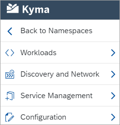

Sretna Nova Godina!

Maybe after these wishes you already know that our journey in 2021 begins in Croatia, specifically in its capital city, Zagreb. Apart from its famous café culture, beautiful historical buildings, and amazing views, Zagreb offers you delicious snacks such as licitar. We also prepared some tasty improvements for you. Read the notes to find out what they are.

<!-- overview -->

> **CAUTION:** Read the [Migration Guide](https://github.com/kyma-project/kyma/blob/release-1.19/docs/migration-guides/1.18-1.19.md) before upgrading your Kyma deployment to 1.19.

See the overview of all changes in this release:

- [Console](#console) - Improved left navigation structure
- [Installation](#installation) - Istio upgrade to 1.8.2
- [Serverless](#serverless) - Manage Function's Secrets and configs, limited parallel Function builds

## Console

### Improved left navigation structure

We reviewed the categories displayed in the left navigation and adjusted the structure to better match the Kubernetes naming. With that in mind, it is now more intuitive to find the workloads, their configuration, and the networking setup.  

## Installation 

### Istio upgrade to 1.8.2 

With this release, we upgraded Istio from 1.7.4 to 1.8.2. Find more details in the [Migration Guide](https://github.com/kyma-project/kyma/blob/release-1.19/docs/migration-guides/1.18-1.19.md) and the [Istio 1.8.2 release notes](https://istio.io/latest/news/releases/1.8.x/announcing-1.8/). 

## Serverless

### Manage Function's Secrets and configs  

You can define Secrets and ConfigMaps used by Functions in the Function descriptor (`config.yaml`) and apply them using Kyma CLI. 

### Limited parallel Function builds

We have changed the Function's build process so that it doesn't allow for unlimited simultaneous builds. There is a pool of 5 simultaneous builds available by default. This will protect you against draining the computational resources on small runtimes, in a scenario where bulk Function reconciliation is triggered. 
