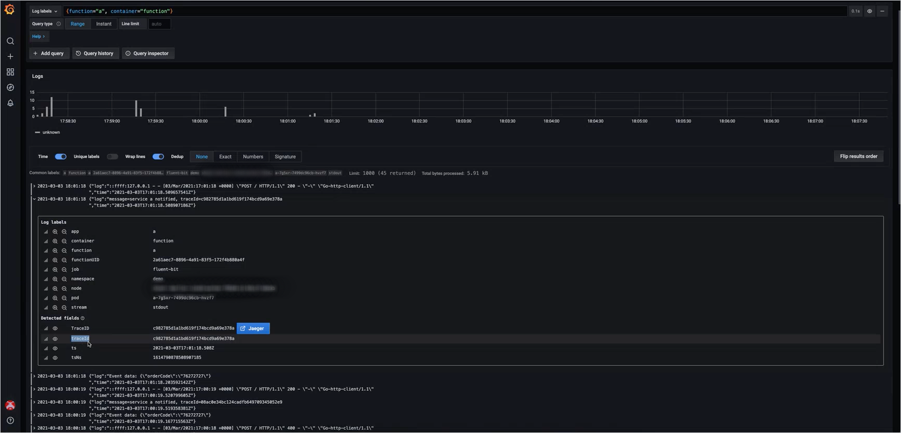

Herzlich Wilkommen! 
We left the windy Amsterdam, but we're staying within the area of the West Germanic group of languages, this time stopping at Berlin, the capital of Germany and a world city of culture, politics, media, and science. 
But don't be fooled by the great historical buildings, universities, and museums. 
Berlin does a great job at combining this rich heritage with the new and avant-garde, and it does all that ahead of the rest, too. 
Contemporary art, numerous festivals, artisanal coffee shops, craft beer, and the famous nightlife are just part of it. 
Just like Berlin, Kyma also combines a solid foundation with innovation, providing high quality that will not cost you an arm and a leg. 
This time, we focused on CLI, Monitoring, Eventing, and Serverless, so grab a cup of (artisanal) coffee, and read on.

<!-- overview -->

> **CAUTION:** In this release, the Eventing component was switched completely from Knative to NATS. Before upgrading to 1.21, read the [Migration Guide](https://github.com/kyma-project/kyma/blob/release-1.21/docs/migration-guides/1.20-1.21.md) for details on Troubleshooting and Upgrade.

See the overview of all changes in this release:

- [CLI](#cli) - Alpha commands stabilized, `run` command available locally
- [Monitoring](#monitoring) - Dynamic data source configuration, deriving traces from Loki logs
- [Eventing](#eventing) - Knative-based eventing replaced by NATS 
- [Serverless](#serverless) - Node.js 10 deprecation
- [Known issues](#known-issues) - Tracing not working with the new eventing

## CLI

### New alpha commands stabilized 

We've recently added new alpha commands: `alpha provision k3s`, `alpha deploy`, `alpha delete`, and  `alpha version`.
In this release, we stabilized these commands, and they are now ready for beta testing.
For more information, read the [alpha command usage examples](https://github.com/kyma-project/cli/blob/release-1.21/docs/03-03-examples-alpha.md) and the command help.

### Run Functions locally

Kyma CLI provides a set of helpful commands for Function developers.
They support developers in starting development, pushing local code to the Runtime, and syncing Functions.
In this release, we have added one more command to facilitate your developer experience even more.
The `run` command allows you to run the Function's code locally, before applying it to the Kyma runtime.

For more information, read the [Kyma CLI documentation](https://github.com/kyma-project/cli/tree/release-1.21/docs/gen-docs/kyma_run_function.md).

## Monitoring

### Dynamic data source configuration 

We enabled the Grafana feature to collect and load data source definitions from Kubernetes ConfigMaps at startup. 
By doing that, we were able to move the individual pre-configured data sources into the related components. For example, the data source for Loki moved into the Logging component. This way, we improved the resource organization. 

### Deriving traces from Loki logs 

The Loki data source for Grafana now contains a new derived field for `traceId`. 
By default, Grafana checks every log in the Grafana View for the `traceId=(\w+)` pattern. 
If it finds this `traceId`, it displays the link to the corresponding Jaeger trace.

For more information about derived fields, read the [Grafana documentation](https://grafana.com/docs/grafana/latest/datasources/loki/#derived-fields).

## Eventing

### Knative-based eventing replaced by NATS 

In this release, we removed Knative-based eventing. 
The new Eventing component is based on [NATS](https://github.com/nats-io/nats-server) with a Kyma-specific Subscription custom resource (CR). 
For upgrade scenarios, refer to the [Migration Guide](https://github.com/kyma-project/kyma/blob/release-1.21/docs/migration-guides/1.20-1.21.md).

For more information on the new eventing, read the [documentation](https://github.com/kyma-project/kyma/tree/release-1.21/docs/eventing).

## Serverless

### Node.js 10 deprecation

Node.js 10 release reaches end-of-life on Apr 30, 2021, and its base image will be deprecated.
Following the recommendations from Node.js, we are planning to remove Node.js 10 from the list of supported runtimes **in the next release**. 
 That's why we recommend that you configure all your Node.js 10 Functions to run on the Node.js 12 runtime. 
See the [list of notable changes since Node.js 10 LTS](https://nodejs.org/tr/blog/uncategorized/10-lts-to-12-lts/).

For more information on Node.js 10 deprecation, read about [Node.js releases](https://nodejs.org/en/about/releases/).

## Known issues

### Tracing not working with the new eventing

Due to the [change from Knative to NATS eventing](#knative-based-eventing-replaced-by-nats), tracing is not working as expected for events sent to Kyma.
All traces stop at the [Event Publisher Proxy](https://github.com/kyma-project/kyma/tree/release-1.21/resources/eventing/charts/event-publisher-proxy).
To learn more, see [issue #10957](https://github.com/kyma-project/kyma/issues/10957).