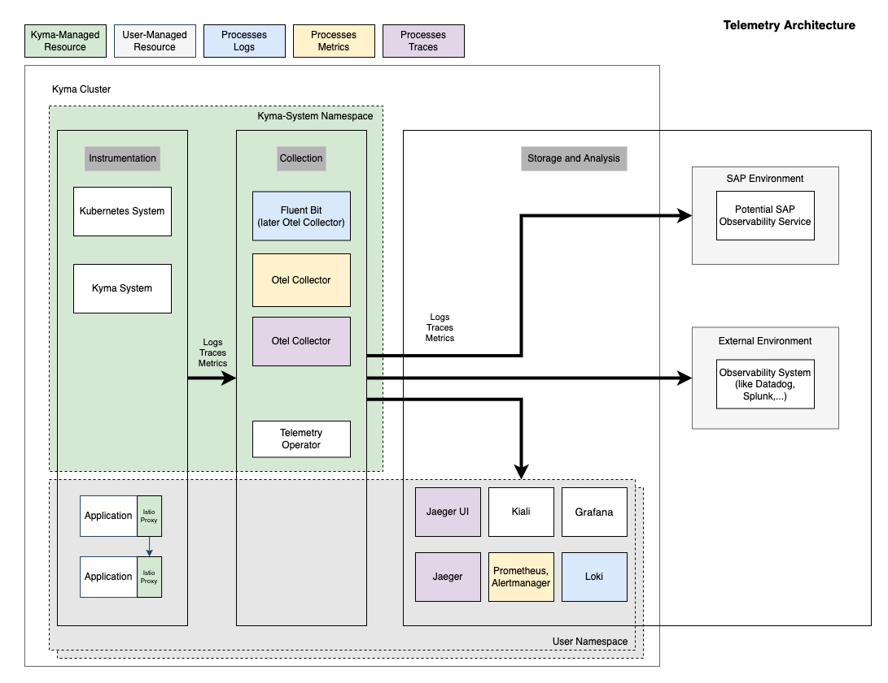
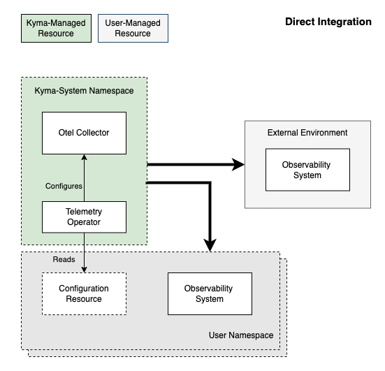
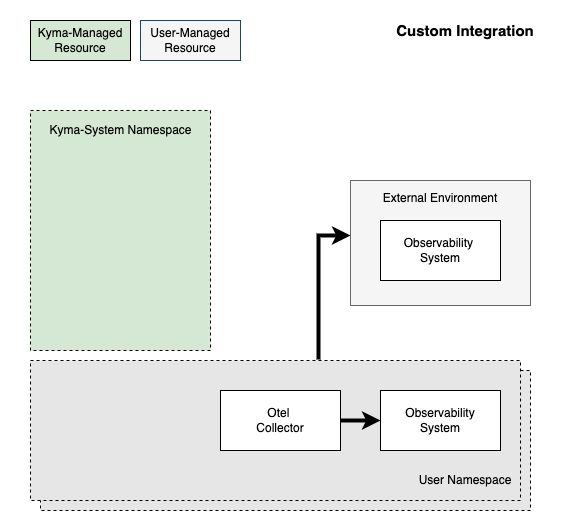

I’m part of the Kyma team working on the Observability feature, and I’ve seen the Kyma project evolving over time into a runtime that provides Kubernetes building blocks with enterprise-grade quality. In this blog post, I want to show you how this evolution is going to apply to Kyma’s observability features.

Up until now, we have been providing an out-of-the box in-cluster Observability stack that gets you started really quickly. It’s quite feature-rich, but if you look a little bit closer, it doesn’t qualify for enterprise-grade qualities.

The next evolutionary step would be to leverage the OpenTelemetry standards, which allow integration with existing observability backends. When you connect a backend that fulfils enterprise-grade criteria, not only do you get improved value, but also openness: You can choose the observability system that fits best to your needs.

Let me tell you more about the changes that we’re planning for the Kyma project, presenting a simple way of instrumenting, collecting, and integration of the telemetry data.

## New Observability Architecture

With our strategy shift towards more flexibility, we plan to introduce a layer of **collectors** that aren’t bound to any backend. With one collector for each signal type (logs, traces, and metrics), they automatically collect and enrich all telemetry data. Simply follow the best practices for instrumentation and everything works like a charm.

After you defined different signal pipelines (at runtime!) by filtering the signals and configuring outputs, the collectors immediately start shipping the signals through the pipelines to the backends. To guarantee enterprise-grade qualities, we will limit the configuration options for the collectors using the Kubernetes API. However, you can run your own collector setup for advanced customization options at any time.

The dynamic configuration and management of each collector will be handled by a new **telemetry operator**, which is configured using Kubernetes API.

The collectors and the new operator will be bundled in a new Kyma core component called **“Telemetry”**.

In the future, the classic Kyma observability backends and user interfaces will be just one possible solution. If you want to keep using them, you can install them with blueprints we’ll provide.

For more details, have a look at the [strategy document](https://github.com/kyma-project/community/blob/main/concepts/observability-strategy/strategy.md).

## Integration Options

With the new Observability architecture, the in-cluster backends will not be provided out of the Kyma box. Instead, users can to start their journey with three different paths: Direct integration, indirect integration, and custom integration.

### Direct Integration

Kyma will provide a vendor-neutral integration point for traces, metrics, and logs, mainly using the [OpenTelemetry Protocol](https://opentelemetry.io/docs/reference/specification/protocol/) (OTLP). For this option, the system you want to connect must support OTLP natively.

With a custom configuration (a Kubernetes resource for a Kyma CRD), you can set up a new destination and select the data to be sent (for example, from specific Namespaces only). You’re free to connect either an external managed offering from a different vendor, or a custom system operated externally or even in-cluster.

To get you started quickly, Kyma will provide a blueprint to get the classic in-cluster setup deployed.

### Indirect Integration

If the system you want to connect does not support the vendor-neutral protocol natively, just use a converter for indirect integration:

You run a collector that supports OTLP and configure it as target for Kyma’s Telemetry component. Your collector then takes care of the conversion into your target system’s custom protocol and integration with the target system. Typically, you would use a custom [Otel Collector](https://opentelemetry.io/docs/collector/) instance for this task.

### Custom Integration

If the configuration options of the collector layer are still too limiting for your purposes, you can bring your own collector setup. You should disable the Kyma component for the respective signal type (logs, traces, metrics) so that it won’t consume resources.

With such custom setup, you get full flexibility but also full responsibility.

### Conclusion

Kyma’s new focus in the Observability area supports you in getting your telemetry data into an external system in a reliable, effortless, and vendor-neutral way. You will get the flexibility to pick your ideal solution, so you can balance your individual needs for enterprise-grade quality and custom integration. You will be able to use the backend of your choice and set up exactly the observability solution you need.

For now, there is nothing to do on your side, just stay tuned for upcoming Kyma blog posts. We will provide more details about upcoming changes, explain potential migrations, and discuss our plans for the individual signal types.
