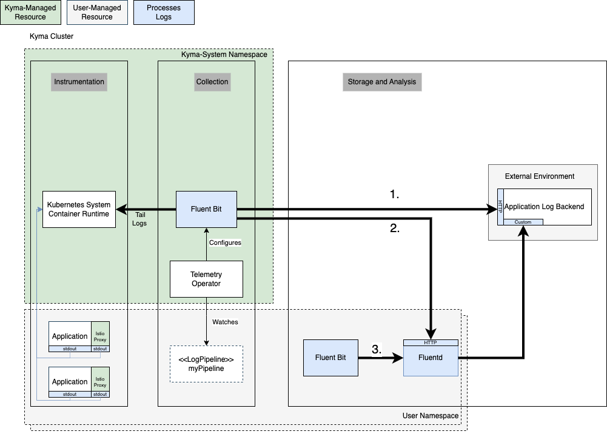

I'm part of the Kyma team working on the Observability feature, and in my previous [blog post](https://kyma-project.io/blog/2022/9/21/observability-strategy/) I talked a bit about the general shift we are planning to do in the Kyma project in regards to Observability. As a first but important step, we are going to deprecate the logging functionality in Kyma based on Loki, that is, the capability to query application logs for up to 5 days using the integrated Grafana view. In this blog post, I'm going to give you more details why we made that decision, and present the alternatives.

## The Background

Kyma shifted the focus towards providing enterprise-grade components as building blocks that you can use to connect your productive workloads with the SAP ecosystem. Kyma's classic in-cluster Logging component does not qualify for enterprise-grade criteria because it does not scale with your application log load. Furthermore, you cannot configure it in any way, like for data retention times. Lastly, running a logging backend in-cluster (in the same cluster where your workload is running) has several flaws:

- Ecosystem: It does not support a multi-environment scenario, where you want to store and analyze logs from multiple environments in one solution.
- Security: Your historic application logs are exposed to a potential attacker of the cluster, and with that, cannot be used for forensic analysis.
- Operations: If the cluster is not accessible for any reason, you also cannot access the historical application logs for troubleshooting.
Another factor that influenced our decision is that Grafana Labs changed the licensing for Loki and Grafana to AGPLv3. This made us rethink the observability capabilities of Kyma overall, reinforcing our strategy shift towards integration into existing observability systems over managing such systems in-cluster. For the same reason, we accelerated the execution of the strategy, and with that, the deprecation of the Loki-based Logging component.

Overall, we no longer believe that a managed in-cluster solution meets the typical requirements for productive workloads; so we won't invest further into that. Instead, Kyma is going to support you with the integration into central systems, ideally also providing solutions that are part of the SAP BTP offering.

## Consequences
For now, nothing changes as it is a deprecation only. However, in half a year or later:
- You will lose the ability to browse your application logs for up to 5 days in the integrated Grafana explore view.
Still, the following options will not be affected:
- You can continue to retrieve logs for currently running workloads using the Kubernetes-native `kubectl logs` command.
- You can continue to view current container logs in the Kyma Dashboard.
- Also, you can continue to bring your custom solution for collection and long-term storage of application logs within or outside the cluster.

## New API
To unburden you from the details of how to reliably fetch and ship all relevant logs for your application to a managed logging backend, we introduced a first version of a new Kubernetes API extension: the LogPipeline API. With this API, you can select the application logs you are interested in by namespaces and containers, and define an output based on a plain HTTP/JSON integration. If you want to find out more, hop over to the product documentation for [Kyma's Telemetry component](https://kyma-project.io/docs/kyma/main/01-overview/main-areas/observability/obsv-04-telemetry-in-kyma).

A remark: After you read my previous [blog post](https://kyma-project.io/blog/2022/9/21/observability-strategy/), you might wonder why Kyma uses a protocol that's very specific to the Fluent Bit ecosystem and not as vendor-neutral as expected. The reason is that in the OpenTelemetry ecosystem, the parts related to logs are just about to become stable (while for the other data types, they are already stable). Because the Fluent Bit ecosystem is very mature and widely adopted, we decided to go with that in a first version but will evolve it to support the OTLP specification later.

## Integration Options
With the new API, you get the following integration options:

1. The LogPipeline API enables the integration into systems that natively support HTTP/JSON as input. Typically, such systems use Fluentd as ingestor.
1. If direct integration is not possible, you can run Fluntd in your custom namespace and leverage the full ecosystem of output plugins to connect with nearly any vendor available.
1. If your scenario is more advanced, or you anyway want to run your own log collector, you still can do that as well.
If you prefer the classic in-cluster Loki solution, read [Installing a custom Loki stack in Kyma](https://github.com/kyma-project/examples/tree/main/loki).

## Conclusion
Kyma's feature for retrieving application logs based on Loki will be marked as deprecated with an upcoming Kyma release. About six months or later, the feature will be removed. We'll announce the deprecation and removal in the release notes.

So, if you have no external logging system integrated yet, you might want to start evaluating that option or follow the provided instructions on installing Loki on your own.

Stay tuned for my upcoming blog posts!