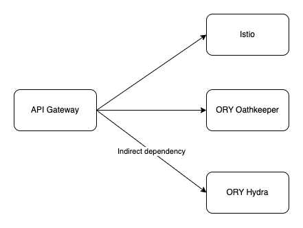
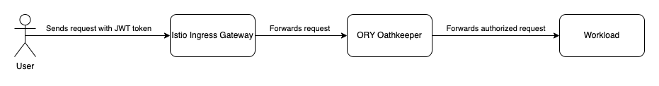
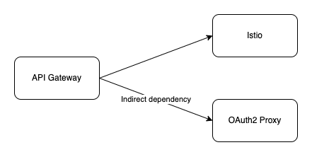
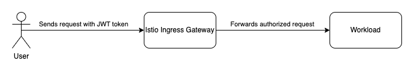

I'm part of the Kyma team responsible for API Exposure topics. My team and I work on providing a convenient, reliable, and secure way to expose workloads. In this blog post, I would like to share our plan for redesigning APIRule CR and explain how the new version affects the components backing up API Gateway. 

## Background

The API Gateway component is a Kubernetes controller responsible for watching the APIRule CR and creating the subresources needed to expose and secure a workload. The API Gateway controller utilizes Istio VirtualService and ORY Oathkeeper Rule under the hood. As of Kyma 2.2 ORY stack, Hydra and Oathkeeper are deprecated, and Istio CRs will provide the equivalent functionalities. The new solution based on Istio will improve the stability and reliability of an exposed workload as well as simplify the API Gateway architecture. 

## Current architecture

The current architecture uses VirtualService and Rule CRs. Therefore, the API Gateway component has dependencies to both the Istio component and the ORY Oathkeeper component. If a workload owner decides to secure their workload using the OAuth2 client, the ORY Hydra OAuth2 server dependency must also be created. 

  

Let's see how each dependency is used in the exposing and securing flow. When the user deploys their workload and wants to expose and secure it, they create Istio Gateway CR and proceed to create APIRule CR, which is processed by the API Gateway controller. The API Gateway controller creates Istio VirtualService to expose a workload and ORY Oathkeeper Rule to secure the workload. Depending on the requirements, the user willing to access the workload might need to issue a token. They can utilize an ORY Hydra opaque token or a JWT OIDC-compliant provider, for example, SAP Cloud Identity Services - Identity Authentication. ORY Hydra OAuth2Client CR and credentials used to issue a token from ORY Hydra need to be created. Finally, the workload can be accessed using the token. To learn about JWT's best practices, read [this blog post](https://kyma-project.io/blog/2023/1/12/jwt-best-practices).
   
  

When the user sends a request with the token to the workload, the request reaches Istio Ingress Gateway first. Istio Ingress Gateway forwards this request to the ORY Oathkeeper component - a reverse proxy responsible for authorizing incoming requests. ORY Oathkeeper checks the existing rules. When it finds a matching rule, it validates and authorizes the request. The successfully authorized request is forwarded to the workload.  
    
  

## Where are we heading?

Our goal is to provide a component that will enable our users to expose their workloads in a reliable and secure way. Conducted research on available solutions convinced us that it is time to part ways with ORY stack and start using Istio - the component which Kyma already provides. The APIRule JWT handler's implementation based on ORY Oauthkeeper Rule will be replaced with the implementation based on Istio AuthorizationPolicy and RequestAuthentication CRs. APIRule OAuth2 handler's implementation will be replaced with Istio's external authorization functionality utilising the oauth2-proxy component. 

  

The following diagram showcases the API Gateway controller, which creates the resources related to Istio. The user creates an application using the OICD-compliant provider of their choice, configured by the administrator in the oauth2-proxy component being part of the Istio external authorizer. 

  

In the future, Istio Ingress Gateway will be a component responsible for authorization in the JWT flow. It will validate the token against the configuration defined in RequestAuthentication CR and authorize the request as described in AuthorizationPolicy CR. If allowed, the request will be forwarded to the workload.

  

Leveraging Istio saves us one hop to the additional component and makes the processing of requests faster. By removing ORY Oathkeeper, we simplify complexity and improve the stability of the API Gateway component. Adding oauth2-proxy managed by the Kyma Istio component will facilitate exposing and securing Kiali, Grafana, and Jaeger and enable using them in the OAuth2 scenario with API Gateway.

## How do we get there?

Improving the architecture of the API Exposure functionalities necessitates a few profound changes. We plan to introduce the changes in phases in order to reduce the risk they might entail. We will support and guide our customers at every step of the process. We are actively working on the alternative implementation of the APIRule JWT handler based on Istio AuthorizationPolicy and RequestAuthentication CRs. We consider JWT best practices on the token verifier side and identify the breaking changes. Our goal is to release this implementation as early as possible so that users can start testing it as soon as possible and we can collect feedback and features requests. The changes will be released as a feature available for users who want to participate in early adoption. In parallel, we are working on alternatives for the ORY Hydra component, which will be followed by the changes to the APIRule OAuth2 handlers. All the improvements will be backed up with migration procedures and scripts.

## Sum-up

The API Exposure domain is subject to some significant and consequential architectural changes which will be released alongside functionality and stability updates. This blog post is the first one of a series in which I explain the future of the API Gateway component and APIRule CR. Visit [our blog](https://kyma-project.io/blog/) to stay up to date with Kyma news.