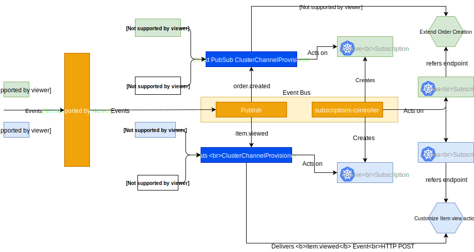
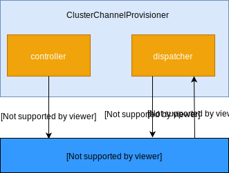
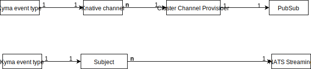
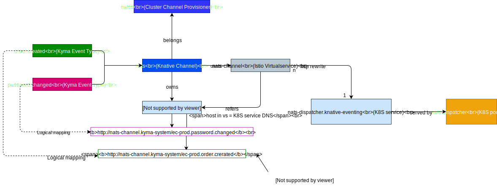
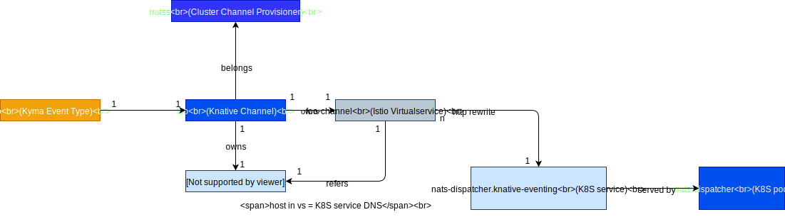
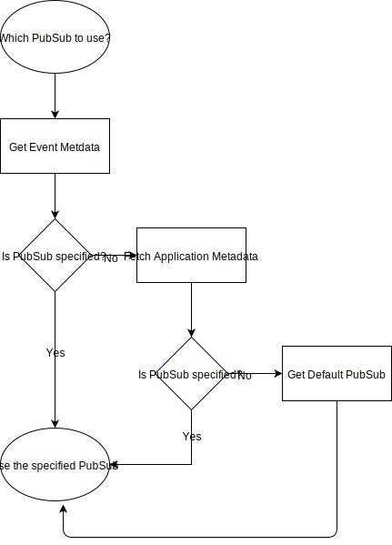
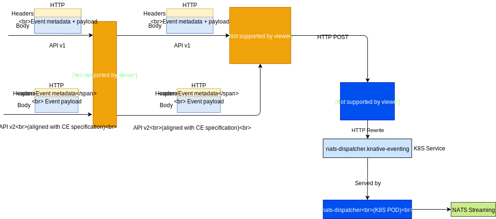
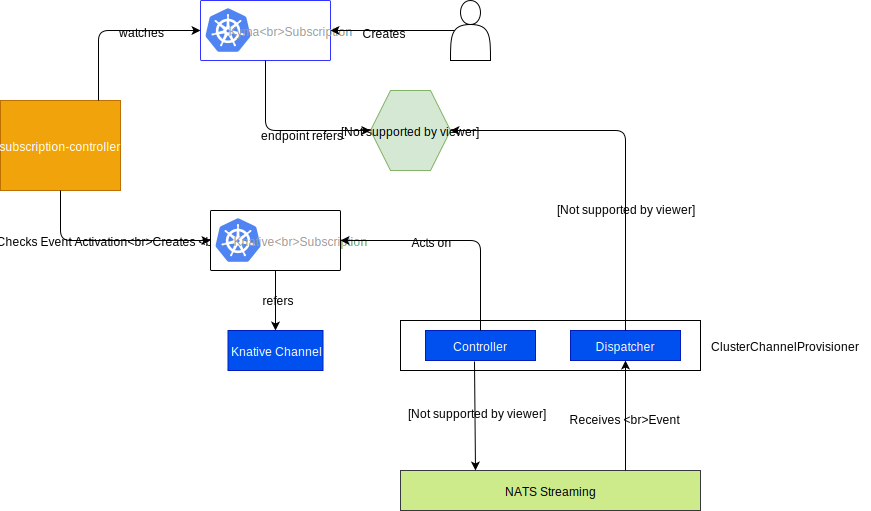

# Overview

This document aims to capture details about how Kyma eventing can adopt Knative eventing. 

It attempts to answer:

1. How can a typical Kyma installation with multiple messaging solutions look like?
2. How can Knative eventing objects be mapped to the Kyma eventing model?
3. What will be the flow of publishing and consuming events?

A typical setup with Kyma eventing post-Knative adoption is as follows:

The above setup demonstrates the following aspects:

* Kyma running with 2 cluster channel provisioners backed by 2 implementations (NATS Streaming and a Cloud PubSub chosen by the customer).
* Some events such as `order.created` and `payment.received` are configured to use Cloud PubSUb.
* Other events, such as `item.viewed` and `item.compared` are configured to use NATS Streaming.
* Each event type has a channel linked in the Knative eventing which is backed by the PubSub implementation.
* The flow of the `order.created` and `payment.received` events an external solution sends, and their delivery to a respective serverless compute.

## Provisioning a messaging solution
The provisioning of various messaging solutions such as NATS Streaming, Google PubSub, Kafka etc. is abstracted from the production and consumption of events in Kyma.

You can provision the messaging solutions during installation or while Kyma is running.

You can provision messaging system using:

* Helm Charts
* Service Catalog
* Plain K8S deployments

In the long run, we can build utils that automate the provisioning process. For now, we can start with a simple solution.

A typical provisioner looks as follows:

> **TBD** The deprovisioning flow. The impact on the existing event types needs to be understood first.

## Kyma event types
Before Knative adoption, there was no need to create any metadata such as topics or channels in the Kyma Event-Bus as the event types were mapped to NATS Streaming subjects while publishing an event.

With Knative adoption, this model can no longer be applied due to the following:

* Knative eventing requires to create channels as a pre-step to publish. The channels are heavy objects with cascading resources. 
* Kyma eventing needs to be generic and in-sync with Knative eventing to enable plugging in various messaging solutions.

>Note: A Kyma Event type is just a logical concept. The actual Event type is a Fully Qualified Event Type composed of `application(source id) + event type + event type version`.

## Knative channel naming convention
 The Knative channel naming follows this pattern: `{event-source-id}--{event-type}--{event-type-version}`. In order to avoid naming conflicts, the following rules are considered when creating the channel name: 
 1. If the event component's name already contains a hyphen, the hyphen is replaced with `-d`. For example, `external-application` becomes `external-dapplication`.
 2. If the event component's name already contains a period, the period is replaced with `-p`. For example, `order.created` becomes `order-pcreated`.
 3. Finally, a hashing function is applied to the Knative channel name and the output hash is a 32-character alphanumeric lower case string.
 
The table includes sample channel names created according to the naming pattern:
 
| Source ID                  | Event Type    | Event Type Version | Encoded channel Name                      | Hashed channel Name |
| :---                       | :---          | :---               | :---                                      | :---                |
| external.application       | order.created | v1                 | external-papplication--order-pcreated--v1 | COMPUTED_HASH       |
| external.application.order | created       | v1                 | external-papplication-porder--created--v1 | COMPUTED_HASH       |
| external-application       | order-created | v1                 | external-dapplication--order-dcreated--v1 | COMPUTED_HASH       |
| external-application-order | created       | v1                 | external-dapplication-dorder--created--v1 | COMPUTED_HASH       |

### Option 1
`1 Kyma event-type` is mapped to a `1 Knative channel`.

**Pros**

* Simple approach.
* Aligned with Knative eventing concepts and underlying bus implementations.
  
* Some reference implementations such as Kafka are mapping one `Topic` to a `Knative Channel`.
* **This enables us to build a thin abstraction layer on top of Knative**.
  * Kyma does not want to run heavy workloads on the cluster when the customer is using `Cloud PubSub`.
* The Knative subscription object is mapped to channel where a single channel can have many subscriptions.
  * Following this approach we can keep the subscription model simple.

**Cons**

* A Knative channel is a heavy object with many cascading resources. Having many channels can increase the load on Istio Service Mesh. 

### Option 2

Map multiple `Kyma event-types` to a `single channel` or do some kind of grouping.

**Pros**

* Create a minimal number of Knative channels thus creating less cascading resources.

**Cons**

* Extra complexity of maintaining the mapping.
* **Kyma eventing will be a thick layer with potential heavy workloads** running on cluster despite customer using the `Cloud PubSub`.
* The subscription management will become complex.
  * A single Knative channel will have subscriptions for multiple event types, which will generate unnecessary network traffic and workload.

  * The `dispatcher` will receive events for all event types belonging to a channel. Then it has to discard and only deliver those for which the Kyma Subscription has been created, which leads to issues with the underlying PubSub.
  

### Option 3 (Future alternative)

There have been some discussions in the Knative community about the challenges and how to map business event types to a channel.
One idea is to create **one channel per PubSub**. This will create one `K8S Service` and `Istio Virtual Service`. 
To make the dispatcher aware of the multiple diverse event types, use the **URI** part of the K8S service mapped to a channel.

* Knative eventing should ensure that a unified approach is used across dispatchers.
* The `Knative subscription <--> Knative Channel` model needs to evolve to support such semantics. Currently all subscriptions belong to a channel.
* There might be impact on the `Knative source` model.

### Decision

The event types in Kyma will map to Channels in Knative eventing (Option 1).

A detailed mapping would be as follows:

**Known challenges**

* K8S and Istio Service overload. For example, having 1000 event types creating 1000 services will put the load on the service discovery.
  >**Note**: This has been discussed with Knative community and they are aware of this issue.

## Choosing a PubSub for an event type

With Knative, it will be possible to enable multiple PubSub services in a single Kyma instance, for example local (NATS Streaming) and Google Cloud PubSub. 
There should be a provision for the operator to decide which PubSub to use for a particular event type. The decision can be based on various factors such as costs or the desired Quality of Service.

To enable ease of use and better UX, it should be possible to have:

* A default PubSub.   `Lowest Priority`
* A PubSub per application
* A PubSub specified for an Event type during registration. `Highest Priority`

**Requirements:**

* API to expose available PubSub in Kyma.

**Flow**
The diagram presents the process of deciding which PubSub to use.

**Open questions**

* How to handle the updates? Changing from one PubSub to another for an event type.
* How to handle the cleanup? When an application is deprovisioned, all channels should also be deleted.

## When to create a channel (PubSub resources)

### Extensibility use case

The Event sent from the application triggers serverless.

* Get a channel when a subscription is created. If channel does not exist, create the channel.
* Create the channel only when someone actually wants to consume events.
* This can be extended to allow discarding of the events at an early stage when there is no consumer configured.
* This will be the default behavior.

### Integration with external messaging systems

The events sent from an application are published to a cloud PubSub. This could trigger an action (compute) in the cloud ecosystem.

* In such a case, while registering an event type, it can be specified if the backing resources(e.g. Knative Channel) should be created or not.
* This way the user can make a conscious choice to create PubSub resources while registering events.

**Requirements**

* Kyma eventing needs to listen for the event registration.
* Using the metatadata specified while registering the events, decide if the backing resources should be created or not.
* Create the backing resources (e.g. Knative Channels).

## Publishing and consumption

Knative eventing interfaces need to be abstracted to:

* Accommodate the flux in the Knative eventing APIs.
* Provide an event publishing and subscribe model that is consistent with Kyma concepts.
  * Publishing
  
   | Kyma                                                             | Knative                                                                                                                              |
   |------------------------------------------------------------------|--------------------------------------------------------------------------------------------------------------------------------------|
   | A well defined API with a consistent URL                         | No defined API and URL is dynamic and based on channel                                                                               |
   | `http://core-publish.kyma-system:8080/v1/events`                 | `http://order.created.ec-prod-channel.kyma-system`. This is an evolving concept and might change in the future.                      |
   | Errors are handled and translated to simplified user infomation. | Errors such as `No channel` will need to be inferred.                                                                                |
   | User always deals with the `event types` in Kyma.                | This puts the burden on the user to understand the channel aspect and translate from the event type.                                 |
   | A consistent experience for external and internal events.        | Even if we do the tranlation at the gateway for events from external, the internal events would still need to deal with Knative APIs |
   | API ensures that the event paylaod is a valid json               | No validation of event payload being a json. This can lead to difficult to troubleshoot errors especially during consumption.        |

   * Eventually, publishing should evolve into a merge proxy that is only mapping some headers or performing an `http` rewrite. The first step in this direction is to evolve the API to align with CE specification. 

  * Consumption

	* There is not much difference for consumption apart from the extra knowledge of channels and translating them to Kyma concepts of `Event types` and `application identifier`.
	* Consumption needs to implement `Event Activation` as Knative eventing has no such or a similar concept. The Knative community is against introducing such constraints and expect applications to build them.
For details, see [examples](./kyma-knative-eventing-examples.md)

### Publishing

**Evolving the API**

As per the current API, the event metadata and payload are part of the HTTP body. This was in sync with the initial cloud event specification.
The CE specification has expanded and now supports HTTP transport binding with event metadata being passed in headers. See [example](https://github.com/cloudevents/spec/blob/v0.2/http-transport-binding.md#314-examples).

The publish API will be evolved to support cloud events specification.
This could enable us in future to remove the translation being done and directly call the Knative API to publish an event.

**Consumption**

A serverless deployed and running in Kyma should be configure events as triggers. 
For example, a Lambda configured with the trigger for the `order.created` event.

> **TBD** How can Knative sources be applied to Kyma eventing model?
