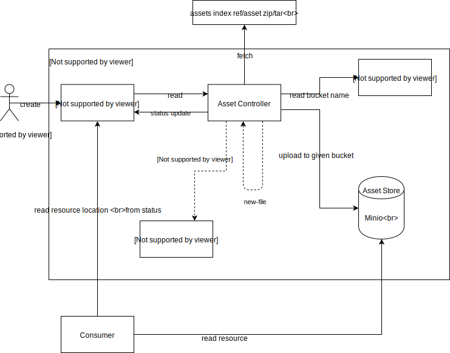
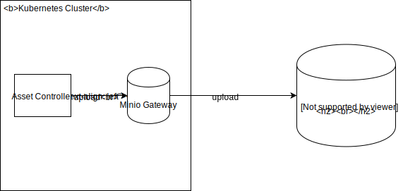

# Asset Store

Created on 2019-01-03 by Lukasz Gornicki (@derberg).

## Status

Proposed on 2019-01-04.

## Motivation

1. Have a generic solution for storing any kind of assets, including markdown documents, zip, PNG, or JavaScript (JS) files, in an Amazon AWS S3 storage service.
2. Have a storage solution that is not locked into one vendor, like AWS S3 or on-premise Minio.
3. Have a storage solution that not only stores the file but also exposes it directly to the Internet.

## Use cases

1. The storage for documentation and related images.
2. The storage for API specifications.
3. The storage for static client-side applications.

## Solution

A new custom solution called the Asset Store.



1. The location of the asset is specified in the Asset custom resource (CR).
2. The controller checks the status of the referenced bucket to make sure it is ready and it makes sense to fetch the asset. If defined separately, the controller creates a new bucket with a generated name for a given asset.
3. The Asset Controller fetches the asset based on the information provided in the CR.
4. The controller performs validation of the asset by communicating with the validation webhook specified in the CR.
5. The controller performs mutation of the asset by communicating with the mutation webhook specified in the CR.
6. The controller performs the new file creation if such a file was referenced in the resource definition as a ConfigMap.
7. The controller uploads the asset to Minio to a bucket with the name specified in the CR. You need a bucket to upload assets. Create it separately as a Bucket CR. It is also possible to define in the Asset CR that you want to have a new autogenerated bucket.
8. The controller updates the status of the Asset CR with the information on the location of the file.

>**NOTE**
> The naming for the validation and mutation functionalities was inspired by Kubernetes [admission webhooks](https://kubernetes.io/docs/reference/access-authn-authz/extensible-admission-controllers).

### Bucket custom resource

You might want to use different buckets per solution. That is why you need to be able to specify multiple buckets for different assets. For example, one bucket for documentation and another bucket for a web application.

Other use cases for having multiple buckets configuration include:
- Future extensibility by allowing the bucket policy specification per solution.
- Minio doesn't support setting a bucket to behave as a static website host. A future controller of the Bucket custom resource will have to handle this additional functionality.
- Minio doesn't support setting a CDN for your asset. The future controller of the Bucket CR will have to handle this additional functionality. For example, the controller will be responsible for configuring a CloudFront for your bucket on S3.

See an example resource for the first version of the Assets Store:
```
apiVersion: assetstore.kyma-project.io/v1alpha1
kind: Bucket
metadata:
  name: my-bucket
  namespace: default
spec:
  policy: public #or other policies
status:
  phase: Ready # Failed/Pending
  reason: BucketCreationFailure
  message: "service unavailable"
  lastHeartbeatTime: "2018-01-03T07:38:24Z"
```

The lifecycle of the Bucket CR is done with the Bucket Controller:
- Once CR is created, the bucket with the CR name is created in the storage under `ns-{NAMESPACE_NAME}-{CR_NAME}`. The status of the CR contains a reference URL to the created bucket.
- Once CR is deleted, the bucket and its content is removed.

#### Bucket reference

You reference the Bucket in your Asset CR with the following information in the spec:
```
  bucketRef:
    name: my-bucket
```
You can also request the creation of a new bucket with the autogenerated name, without the need to create a Bucket CR separately:
```
  createBucket: true
```

It must be provided and the Asset Controller checks the Bucket CR status to make sure the bucket exists:

- The deletion of the Bucket CR requires from the Asset Controller to actively monitor the status of the referenced bucket. If the bucket is deleted, the status of the Asset CR is updated to `ready: False` and asset references are removed.
- Update of the reference causes recreation of the assets in a new location, removal from the old location, and update of the status and the references.

## Asset custom resource

Asset resource mandatory information include:
- Reference information on the source file/object/asset location that must be fetched by the Asset Controller with 3 different modes:
  - `single` - the link points directly to the asset that needs to be fetched.
  - `index` - the link to the `index.yaml` file that contains a reference to files that need to be separately fetched from a given relative location.
  - `package` - the link to the zip/tar file that must be unzipped before it is uploaded.
```
#sample of index file with markdown and assets files
apiVersion: v1
files:
  - name: 01-overview.md
    metadata:
      title: MyOverview
      type: Overview
  - name: 02-details.md
    metadata:
      title: MyDetails
      type: Details
  - name: 03-installation.md
    metadata:
      title: MyInstallation
      type: Tutorial
  - name: assets/diagram.svg
```
- Reference to the bucket where the asset should be stored:
```
apiVersion: assetstore.kyma-project.io/v1alpha1
kind: Asset
metadata:
  name: my-package-assets
  namespace: default
spec:
  source:
    mode: single # or index or package
    url: https://some.domain.com/main.js
  bucketRef:
    name: my-bucket
```

The optional information is:
- A ConfigMap reference that points to the ConfigMap that introduces [a new file](https://github.com/kyma-project/kyma/blob/master/resources/service-catalog-addons/charts/instances-ui/templates/configmap.yaml) which is also sent to the bucket along with other files.
- An Asset validation webhook reference to a service that performs the validation of fetched assets before they are uploaded to the bucket. It can be a list of several different validation webhooks and all of them should be processed even if one is failing. The use cases are:
  - Validation of a specific file against some specification.
  - Security validation
```
apiVersion: assetstore.kyma-project.io/v1alpha1
kind: Asset
metadata:
  name: my-direct-assets
  namespace: default
spec:
  source:
    direct: https://some.domain.com/my.json
    validationWebhookService:
        - name: swagger-operations-svc
          namespace: default
          endpoint: "/validate"
  bucketRef:
    name: my-bucket
status:
  phase: Ready # Failed/Pending
  reason: ValidationFailure
  message: "file is not valid against provided json schema"
  lastHeartbeatTime: "2018-01-03T07:38:24Z"
```
- An asset mutation webhook reference to a service that acts similarly to the validation service mentioned above. The difference is that it mutates the asset instead of just validating it. The use case is, for example, the asset rewriting through the `regex` operation or `keyvalue`, or modification in the json specification.


## Asset validation webhook details

The Asset Store must provide a flexible way of validating the assets before they are uploaded to the bucket. Different use cases bring different validation requirements. The best way is to do it by introducing a webhook that will receive an asset for validation and reply to the controller with a defined status schema.

1. The controller calls the `/validate` endpoint of the given service in a given Namespace.
```
validationWebhookService:
  name: swagger-operations-svc
  namespace: default
  metadata:
    pattern: \json|yaml
  endpoint: "/validate"
```
2. The service gets the following payload and, by default, it must reply within 1 second:
```
{
    name: my-direct-assets
    namespace: default
    metadata:
      pattern: \json|yaml
    assets: {
      name1: "content",
      name2: "content"
    }
}
```
3. The controller:
   - Times out after 1 second because of no response, and updates the status of the asset to `False`.
   - Gets the response with the successful or failing validation in the following form:
```
{
   status: {
     name1: {
       status: Failure,
       message: "much more details of the failure"
     },
     name2: {
       status: Success,
       message: "much more details"
     }
   }
}
```
4. If at least one asset failed the validation, the status of the asset is set to `False` and the proper message about a given asset is added to the status. Otherwise, the status is set to `True` and the asset is uploaded to the bucket.


## Asset mutation webhook details

The Asset Store must provide a flexible way of mutating the assets before they are uploaded to the bucket. Different use cases bring different mutation requirements. Similarly to the validation case, it can be solved by a webhook solution.

1. The controller calls the `/mutate` endpoint of the given service in a given Namespace.
```
mutationWebhookService:
  name: swagger-operations-svc
  namespace: default
  metadata:
    rewrite: keyvalue
    pattern: \json|yaml
    data:
      basePath: /test/v2
  endpoint: "/mutate"
```
2. The service gets the following payload and, by default, must reply within 1 second:
```
{
    name: my-direct-assets
    namespace: default
    metadata:
      rewrite: keyvalue
      pattern: \json|yaml
      data:
        basePath: /test/v2
    assets: {
      name1: "content",
      name2: "content"
    }
}
```
3. The controller:
   - Times out after 1 second because of no response, and updates the status of the asset to `False`.
   - Gets the response with the mutated content:
```
{
   assets: {
     name1: "content",
     name2: "content"
   }
}
```
4. The controller updates the status that mutation is completed, and uploads assets to the bucket.

### Optional mutation service

The Asset Store comes with one out-of-the-box mutating service that enables an easy way of asset modification before it is uploaded to the bucket, through the `regex` operation or `keyvalue`:
```
  name: assetstore-rewrite-svc
  namespace: kyma-system
  endpoint: /mutate
  metadata:
    #keyvalue example for use case of swagger file rewriting
    - rewrites:
        pattern: \json|yaml
        keyvalue:
          basePath: /test/v2
    #regex example for documentation modification in the markdown       
    - rewrites:
        - regex:
            find: \stitle="(.*)?"\s*(/>*)
            replace: $2<title>$1</title>          
```


## Minio local vs cluster modes

Minio as a storage service supports Kyma's manifesto and the "batteries included" rule. It makes the development process easier. Apart from the production usage, Minio should be used in a [Gateway mode](https://github.com/minio/minio/tree/master/docs/gateway). The Gateway mode gives you the flexibility to use asset storage from any major cloud provider, such as Google, Amazon, and Microsoft. It does not require modifications in the Asset Controller as it talks to the Minio/Minio Gateway with the same S3 API.


