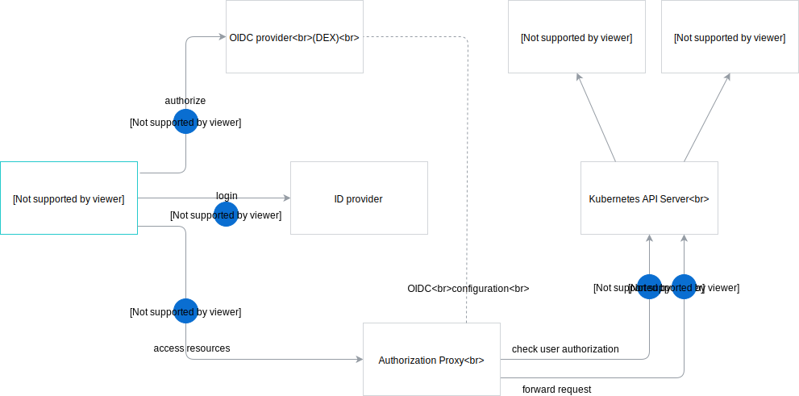

# Installation on managed cluster

Created on 2018-08-02 by Piotr Bochyński (@pbochynski).

## Status

Proposed on 2018-08-02.

## Abstract

It is not possible to install the Kyma project on the managed clusters such as Google Kubernetes Engine (GKE) or Azure Kubernetes Service (AKS). To enable the Kyma project adoption, it must run on any infrastructure supporting Kubernetes. Kyma requires access to the kube-apiserver configuration and uses some Kubernetes alpha features, which is **not allowed** in many managed clusters. Even if some providers allow such configuration, it must happen during the cluster provisioning, which makes Kyma installation process more complex.

## Problems to solve

1. The kube-apiserver component must be configured to verify tokens coming from an external OIDC provider (coming with Kyma). Usually, it is done during the installation by providing additional parameters such as **oidc-issuer-url**, **oidc-client-id**, **oidc-username-claim**, to name a few. These parameters **cannot** be set in GKE or AKS.
2. Kyma depends on some alpha features of Kubernetes that are not supported by the managed clusters, for example PodPreset from `settings.k8s.io/v1alpha1`. Other apiserver configuration entries required by kyma, that might be missing in managed clusters:
    - admission plugins: Initializers, NamespaceLifecycle, LimitRanger, ServiceAccount, MutatingAdmissionWebhook, ValidatingAdmissionWebhook, DefaultStorageClass, ResourceQuota, PodPreset
    - alfa APIs : batch/v2alpha1, settings.k8s.io/v1alpha1, admissionregistration.k8s.io/v1alpha1

## Proposal

### OIDC configuration

>**NOTE:** Read [this](https://kyma-project.io/docs/components/security/#architecture-architecture) document first to understand the current authorization concept.

The idea is to move the responsibility for authorization from the kube-apiserver to the Authorization Proxy. If the Authorization Proxy verifies user permissions, it is not required to configure OpenID Connect tokens in the kube-apiserver. The proxy can use a service account to communicate with the apiserver. The request flow would be as follows:
- The proxy validates JWT passed in the Authorization Bearer header.
- The proxy extracts user and groups from JWT and the target resource from request path and method to construct attributes record. That record is send to kubernetes authorization API .
- If the authorization fails, the request is finished with the `403` response.
- If the authorization succeeds, the request is forwarded to the kube-apiserver.

The proxy implementation can be based on [this](https://github.com/brancz/kube-rbac-proxy) project.

### Alpha features

The list of alpha APIs must be verified and replaced by beta, or any other stable versions, if applicable. If there is no replacement, the usage of alpha API should be reconsidered.
