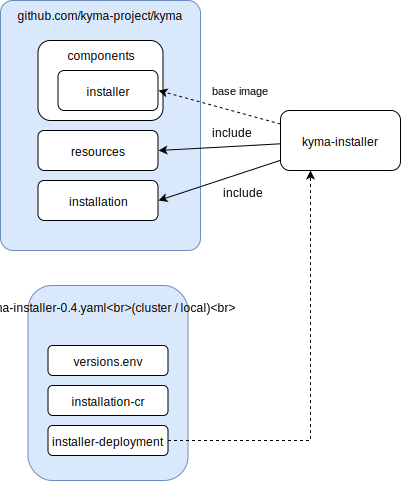

# Kyma Installer with embedded Kyma charts

Created on 2018-09-19 by Piotr Bochyński (@pbochynski).

## Status

Proposed on 2018-09-19.

## Context

The current installation process involves downloading Kyma charts from the cloud storage. Such solution allows to release Kyma installer and Kyma charts independently. As a consequence, there is a possibility to install different versions (or flavors) of Kyma components using a single installer binary. It seems to be a convenient feature but in reality, it introduces the following problems:
- Build and release processes are more complex since they require publishing Kyma charts in the cloud storage.
- It is possible to run the installer with the Kyma charts version which is not supported and not tested with the installer.
- The upgrade process is more complex. Usually, the installer upgrade must precede the Kyma release URL update.

## Proposal

The installer will contain Kyma charts and scripts in the Docker image. The build process must be adapted to produce the installer image for every Kyma snapshot or release.

The solution should also support kyma modifications and local development. The minimal requirement is to provide a manual on how to build your own Kyma installer image based on modified charts.

These are the benefits of the solution:
- A simpler installation and update processes which will require only deploying a given version of the installer.
- The installer will always work with Kyma charts tested with a given installer version.

As a result of this proposal, the Kyma release artifact should contain only a yaml file to deploy and configure a given version of the installer :

