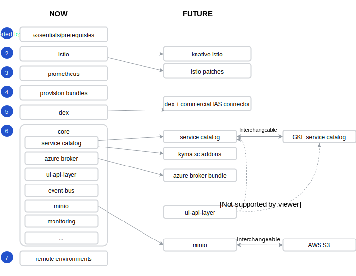
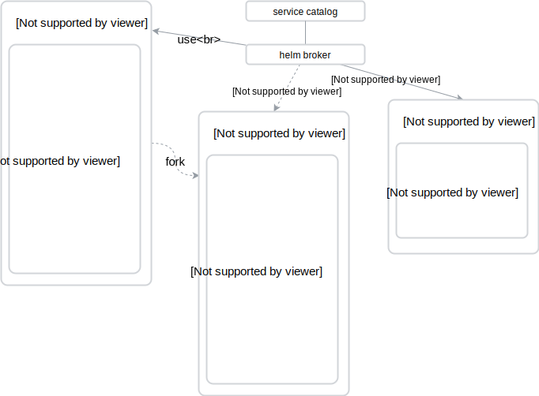

# Kyma modularization - install components as add-ons

Created on 2018-08-16 by Piotr Kopczynski (@PK85) and Piotr Bochyński (@pbochynski).

## Status

Proposed on 2018-08-16.

## Motivation

Kyma provides components as a one big pack to enable developers building something on cloud native stack. They work together and they expose the unified developer and business experience. Now, we need to step back and enable users to decide what they want to use Kyma for.

The landscape around Kyma has changed. Kubernetes managed clusters get popular. Each big cloud infrastructure provider has own managed Kubernetes service (Google GKE, Amazon EKS, Microsoft AKS). This offering is evolving and customers can use more services included in the managed Kubernetes (like Istio - Service Mesh, Service Catalog, Logging). Developers work on bringing more features to transform Kubernetes from container scheduling system into complete platform solution. Kyma is not the only solution in this area. Knative is the new open source project started by Google that also aims to provide components to deliver cloud native software on top of Kubernetes. There is a strategic decision to run Kyma on top of Knative. All this development in the Kubernetes landscape shows the need of having flexible, loosely-coupled components to enable customers using best available solutions from infrastructure providers, open source projects and commercial solutions. In principle, Kyma offers a complete solution (batteries included), but it doesn't mean Kyma can't benefit from running on top of managed cluster, by integration with the already provided services.

This proposal is also a prerequisite to a number of [additional proposals](#proposal).

## Goal

The goal is to allow users to add, remove, and replace Kyma components in more flexible way during the installation and in runtime. The following processes should be possible:

- Install Kyma lite on Minikube (without Monitoring, console and ui-api-layer, Tracing, Service Catalog, and Remote Environments).
- Install Kyma without the Service Catalog and brokers installed on GKE with already provided Service Catalog and GCP broker included.
- Install Kyma as Gardener add-on with dependencies to Istio and Knative add-ons.
- Add a Service Broker to existing Kyma installation in runtime, for example Azure Broker.
- Add a new Remote Environment (also new type of application) in runtime.
- Add completely new Kyma component that integrates with UI in runtime (register micro front-end and custom resources).
- Use user provided S3 bucket instead of Minio.
- Install private modules (from private Docker registry or private Git repository).
- Install components from Kyma examples and showcases catalog easily (UI).

## Current solution

Current installation process is a mix of:

- Custom shell scripts
- Kubectl commands
- Helm charts including one big, fat core chart
- Complex parametrization

Installer is a Kubernetes operator with hard-coded logic executing all the components above. Problems with this solution are as follows:

- The default Minikube installation is slow and requires a lot of resources.
- Shell scripts are difficult to manage (some of them have to support Mac, Linux, Windows).
- New installation parameters or dependencies require code changes.

## Proposal

The proposed solution is to provide a flexible and modular installation of fine grained components with limited dependencies. The components installation and update should be more generic and declarative. This is the first set of ideas on how to improve the current solution:

- Parameters should not be hard-coded - there should be a convention on how to pass the parameters through the installation process to the Kyma components.
- Default values everywhere - the list of mandatory parameters should be as short as possible. The goal is to have only the cluster domain as a mandatory parameter.
- Optional dependencies, for example: Kyma ui-api-layer can work without custom resources introduced by the Service Catalog or Remote Environment and still can support other areas.
- Dynamic UI (micro front-ends) + back-end - adding new components extends views and also the backed functionalities, such as the supported GraphQL queries.
- No custom logic in the installation process (shell scripts) - it should be replaced by the operator pattern.
- The minimal set of mandatory components that form the real Kyma "core". The dependency for the core can be mandatory, other dependencies should be optional.
- Kyma core as Gardener add-on. For reference, see [Knative with Gardener](https://github.com/knative/docs/blob/master/docs/install/Knative-with-Gardener.md) and [Gardener Bouquet](https://github.com/gardener/bouquet) documentation.
- Split Kyma core chart into more fine grained components, and provide a tooling to install all of them in the same convenient way as before (convention).
- Kyma add-ons, brokers, and showcases as Kyma bundles. For reference, see the [Kyma bundles](#kyma-bundles-for-the-service-catalog).
- Check dependency tree of components. Flag components as mandatory or optional.
- Advanced Level: acceptance testing, especially ui-api-layer and cross components tests. Make sure it is possible to configure what tests are run when, depending on dependency tree.

### Modularity - refactoring

### Kyma bundles for the Service Catalog

This [project](https://github.com/PK85/kyma-bundles):

- Allows you to add your expanded Helm Broker bundle.
- Will take care of updating bundle repository (http server) with generated `.tgz` files and updated `index.yaml`.
- Gives you a one-step Helm Broker repository configuration update in your Kubernetes cluster.

