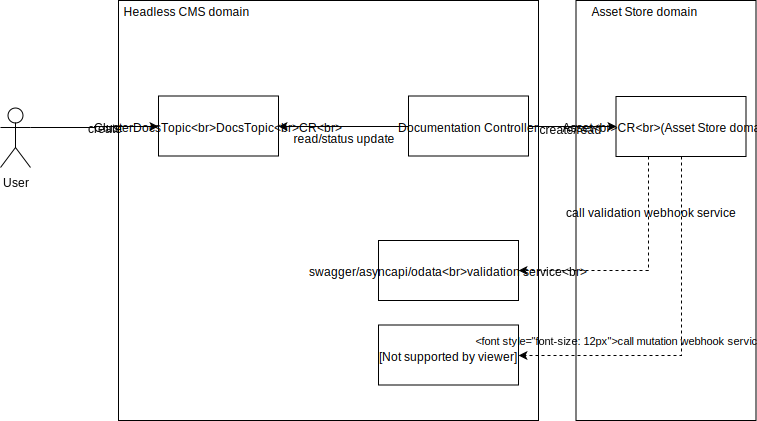
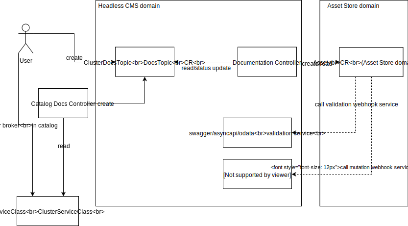

# New Architecture for documentation and specifications management

Created on 2018-10-13 by Lukasz Gornicki (@derberg).

## Status

Proposed on 2018-10-16.

## Motivation

1. To solve these technological dependencies:
   - The current approach is based on 2 different ways of loading content sources into Minio:
     - Through a Docker image to Minio
     - Application Connector through the Metadata Service directly to Minio
   - No single validation component
   - To get content in the UI we have 2 different places to define details:
     - Config located in docs sources
     - Navigation manifesto where you define the topic name and ID
2. To enable a single solution for any type of docs and make it possible for users to easily reuse our solution to their needs.
3. Enable modularization for Minio so it can be easily replaced by S3, and not to maintain a special cache for docs in the UI API Layer.
4. Enable modularization of documentation so you can load documentation only for modules that are installed in Kyma.

## Solution

Implement the below proposal on top of the new [Asset Store](https://github.com/kyma-project/community/blob/master/sig-and-wg/sig-core/proposals/asset-store-proposal.md).



### DocsTopic and ClusterDocsTopic
- All details of a given documentation topic, including doc sources, are specified with a custom resource (DocsTopic or ClusterDocsTopic).
- Supported formats: markdown and assets, swagger, asyncapi, odata
- Documentation can be provided in different formats:
  - zip/tar.gz
  - different location of docs or specs can be provided, in the case of docs and assets you point to an index with names of the files available under a given link
  - a mixture of the above options is possible

```
---
apiVersion: documentation.kyma-project.io/v1alpha1
kind: ClusterDocsTopic
metadata:
  name: service-catalog #example based on current documentation topic https://github.com/kyma-project/kyma/tree/master/docs/service-catalog
  labels:
    viewContext: docs-view
spec:
  description: Overal documentation for Service Catalog
  displayName: Service Catalog
  source:
    access: private #can be also public, you not always want to have publicly accessible files
    docs:
       index: https://some.domain.com/index.yaml
       package: https://some.domain.com/kyma.zip
       path: "/only/this/dir"
    specs:
      swagger:
        url: https://some.domain.com/swagger.yaml
        rewrites:
          basePath: /test/v2
      asyncapi:
        url: https://some.domain.com/asyncapi.yaml
      odata:
        url: https://some.domain.com/odata.xml
status:
  ready: False
  reason: ValidationFailed # or UploadFailed or SourceFetchFailure
  message: "swagger file is not a valid json"
#status:
#  ready: True
#  resource:
#    docsUrl:
#      index: $LINK-TO-INDEX
#       apiVersion: v1
#         files:
#         - name: 01-overview.md
#           metadata:
#             title: MyOverview
#             type: Overview
#         - name: 02-details.md
#           metadata:
#             title: MyDetails
#             type: Details
#         - name: 03-installation.md
#           metadata:
#             title: MyInstallation
#             type: Tutorial
#         - name: assets/diagram.svg
#    spec:
#      swagger: $LINK-TO-FILE
```

### Documentation Controller

This controller is responsible for creating the Asset custom resource (CR) from the AssetStore. If the DocsTopic CR contains information about different formats, like docs in zip, and a direct link to some spec, the Documentation Controller is then responsible for creating 2 different Asset CRs.

The Documentation Controller monitors the status of the Asset CR and updates the status of the DocsTopic CR.
Asset CRs created by the Documentation Controller should not be removable while related DocsTopic CR exists. They can only be removed by the Documentation Controller if the DocsTopic CR is deleted.

## Possible extensions - the Service Catalog case

When you register a ServiceBroker, the Catalog Docs Controller listens for all newly added ServiceClasses to the Catalog and creates the DocsTopic or ClusterDocsTopic CR for them.



A ServiceClass to which the controller reacts must contain the `external.metadata.content` object as shown below:

```
package: https://some.domain.com/kyma.zip
    docs: https://some.domain.com/index.yaml
    specs:
      swagger:
        url: https://some.domain.com/swagger.yaml
        rewrites:
          basePath: /test/v2
      asyncapi:
        url: https://some.domain.com/asyncapi.yaml
      odata:
        url: https://some.domain.com/odata.xml
```

For docs cleanup reasons (the unregister broker case), the controller specifies `ownerReference` pointing to the ServiceClass during the CR creation. The controller will make sure that for such a use case it will add a finalizer to the DocsTopic CR, and not allow its deletion until storage is really cleaned up.
