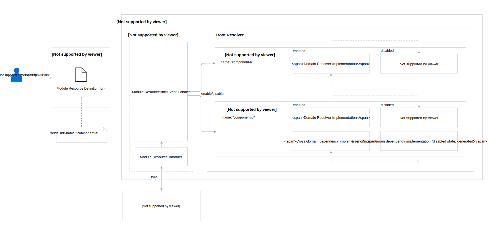

# UI API Layer Modularization

Created on 2018-29-11 by Paweł Kosiec (@pkosiec).

## Status

Proposed on 2018-11-29.

## Motivation

UI API Layer exposes GraphQL API for the Kyma Console. It consists of resolver logic for different domains, like Kubernetes, Service Catalog, Remote Environments, Kubeless, etc. As Kyma needs to be modularized, users should be able to install only the components they need.

The current approach we use in UI API Layer makes it impossible. During the GraphQL server start, we try to synchronize Stores of all Informers. As a result, if a resource of a specific type doesn't exist, UI API Layer won't start properly because its Informer will return an error.

## Goal

1. There should be an ability to turn on and off specific UI API Layer modules, even on server runtime.
1. If a user tries to access queries/mutations/subscriptions of a specific domain, which is related to the not installed Kyma component, UI API Layer should return an error about the uninstalled domain.

## Suggested solution

The solution is based on a Custom Resource, which is defined for all Kyma components which have equivalents in UI API Layer as different domains (`domain` package). In this proposal it is called as `ConsoleBackendModule`.

Every domain resolver object has to implement the `PluggableModule` interface. By default, during start, UI API Layer has all domain resolvers disabled, which means there are no informers synced for all resources related to GraphQL queries/mutations/subscriptions.

Using generated Informer API for the `ConsoleBackendModule` resource, an event handler is created for every domain resolver. On creating/updating/deleting events, the handler is triggered and it enables/disables the respective domain resolver.

Enabling a domain resolver means everything that it is currently done in the domain resolver constructor (services, informers setup, etc), as well as starting informers and waiting for cache synchronization.

Disabling a specific domain resolver stops the informer synchronization, unregisters subscription listeners and replaces resolver logic to the generated one, which always returns an error (e.g. `Module {MODULE_NAME} is not installed`). For all `Container` objects which contain domain resolvers and exported cross-domain dependencies, all exported fields need to be replaced with generated implementation.

The Generator could be based on [Impl](https://github.com/josharian/impl) but it will need a modification: instead of panicking, it should return an error gracefully for every method.

### Architectural Diagram



### Custom Resource Definition

The proposed Custom Resource Definition is as follows:

```yaml
apiVersion: apiextensions.k8s.io/v1beta1
kind: CustomResourceDefinition
metadata:
  name: consolebackedmodules.kyma-project.io
spec:
  group: kyma-project.io
  version: v1alpha1
  scope: Cluster
  names:
    plural: consolebackedmodules
    singular: consolebackedmodule
    kind: ConsoleBackendModule
    shortNames:
    - cbm
```

The only required field is the unique name of the resource.

Extending the existing custom resources, `Microfrontend` and `ClusterMicrofrontend`, has been considered. If the `(Cluster)Microfrontend` resource had references to the required UI API Layer modules, then we cannot make sure that the Kyma component is actually installed. There could be microfrontends that depend on two components. If just one of them is not installed, it would result in an error/crash.

On the other hand, combining two ideas together, `ConsoleBackendModule` and relation in `(Cluster)Microfrontend` to `ConsoleBackendModule`, would be too complicated.

### How to make a module pluggable

1. Prepare the Module resource YAML in a chart of the particular Kyma component with a unique name:
    ```yaml
    apiVersion: uiapi.kyma-project.io/v1alpha1
    kind: Module
    metadata:
    name: k8s
    ```
1. Create an interface for the domain resolver/container with all exported methods.
1. Generate disabled state implementation for the created interface.
1. Implement the `PluggableModule` interface for the domain resolver/container:
    ```go
    type PluggableModule interface {
        Enable() error
        Disable() error
        IsEnabled() bool
        Name() string
    }
    ```

### Proof of Concept

The PoC has been created in [PR #1849](https://github.com/kyma-project/kyma/pull/1849/files) for the Kyma repository. It contains a pluggable `k8s` domain as an example. The PoC uses `Module`, an outdated name of the Custom Resource. 
